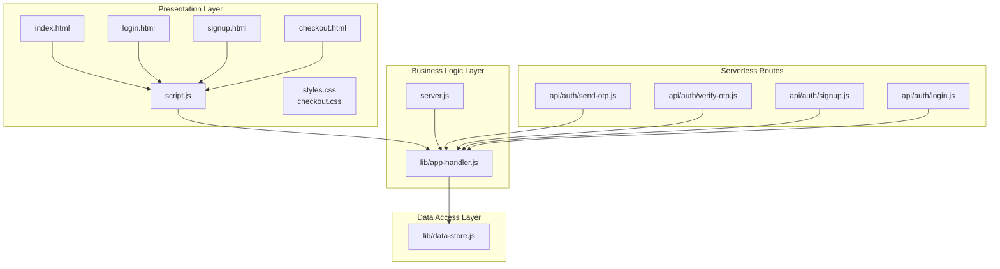
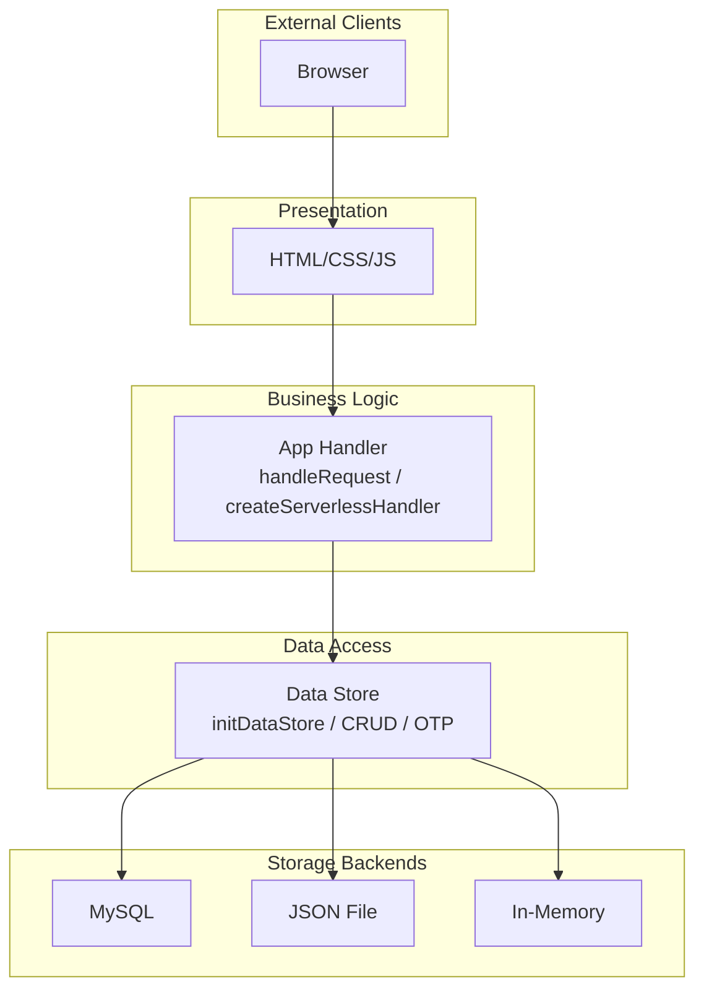
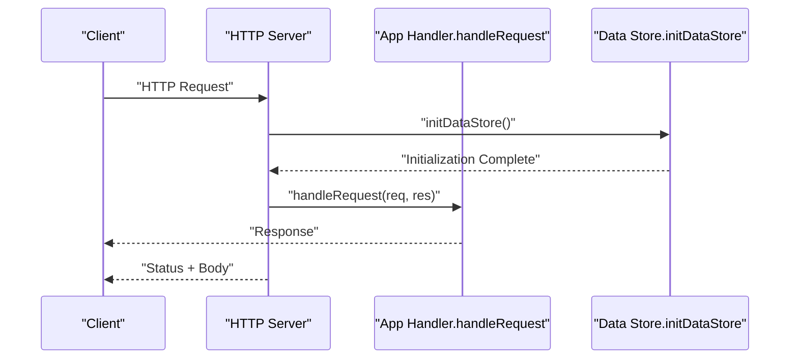
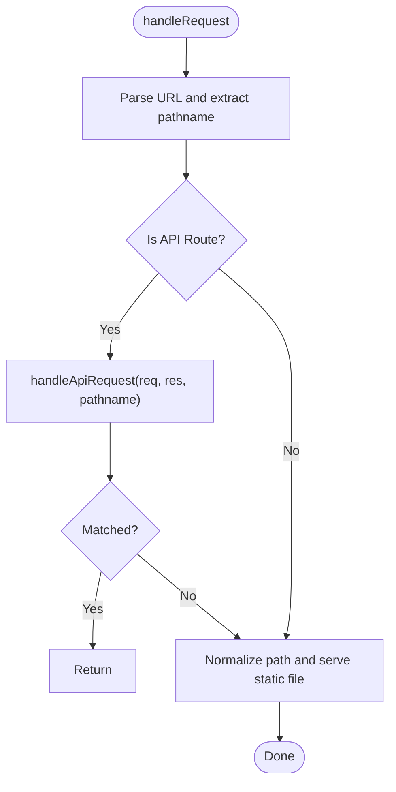
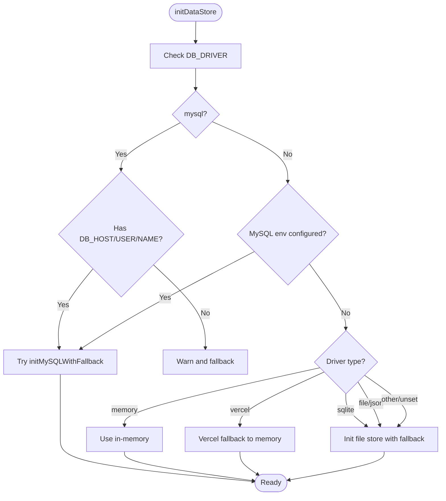
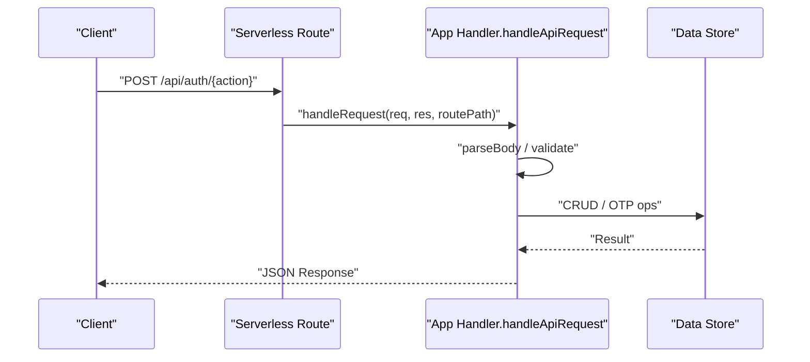
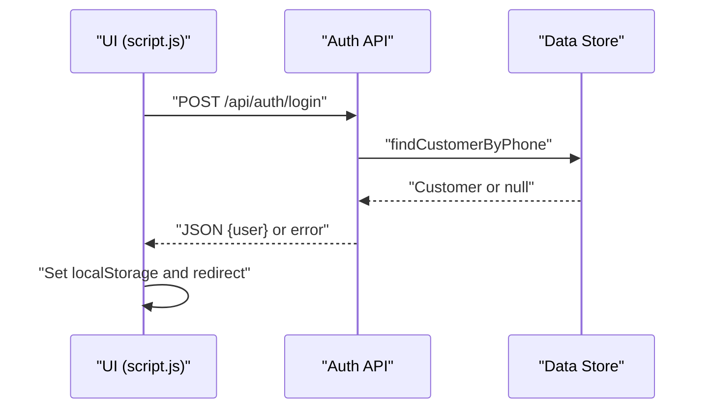
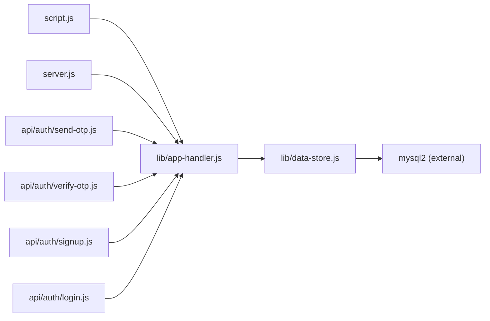

# Architecture Overview

<cite>
**Referenced Files in This Document**
- [server.js](file://server.js)
- [lib/app-handler.js](file://lib/app-handler.js)
- [lib/data-store.js](file://lib/data-store.js)
- [api/auth/send-otp.js](file://api/auth/send-otp.js)
- [api/auth/verify-otp.js](file://api/auth/verify-otp.js)
- [api/auth/signup.js](file://api/auth/signup.js)
- [api/auth/login.js](file://api/auth/login.js)
- [package.json](file://package.json)
- [index.html](file://index.html)
- [script.js](file://script.js)
- [styles.css](file://styles.css)
- [checkout.html](file://checkout.html)
- [checkout.css](file://checkout.css)
</cite>

## Table of Contents
1. [Introduction](#introduction)
2. [Project Structure](#project-structure)
3. [Core Components](#core-components)
4. [Architecture Overview](#architecture-overview)
5. [Detailed Component Analysis](#detailed-component-analysis)
6. [Dependency Analysis](#dependency-analysis)
7. [Performance Considerations](#performance-considerations)
8. [Troubleshooting Guide](#troubleshooting-guide)
9. [Conclusion](#conclusion)
10. [Appendices](#appendices)

## Introduction
This document describes the Night Foodies system architecture. It focuses on the high-level design showing the relationship between the Node.js HTTP server, the custom application handler, and the data store modules. It documents the layered architecture separating presentation (HTML/CSS/JavaScript), business logic (application handler), and data access (data store). It explains the custom HTTP server implementation, request routing patterns, and middleware approach. It details the multi-backend storage architecture supporting MySQL, JSON file, and in-memory storage with automatic fallback mechanisms. It also covers system boundaries, component interactions, data flow patterns, serverless-compatible design principles, factory-like initialization of the data store, and strategy-like route handling. Finally, it addresses scalability considerations, deployment topology, and integration patterns with external services.

## Project Structure
The project is organized into:
- Presentation layer: static HTML pages and client-side JavaScript/CSS
- Business logic layer: a custom HTTP request handler module
- Data access layer: a pluggable data store module with multiple backends
- Server entrypoint: a minimal Node.js HTTP server
- Serverless API routes: thin handlers that delegate to the shared business logic

**Diagram sources**
- [server.js:1-35](file://server.js#L1-L35)
- [lib/app-handler.js:1-332](file://lib/app-handler.js#L1-L332)
- [lib/data-store.js:1-291](file://lib/data-store.js#L1-L291)
- [api/auth/send-otp.js:1-4](file://api/auth/send-otp.js#L1-L4)
- [api/auth/verify-otp.js:1-4](file://api/auth/verify-otp.js#L1-L4)
- [api/auth/signup.js:1-4](file://api/auth/signup.js#L1-L4)
- [api/auth/login.js:1-4](file://api/auth/login.js#L1-L4)
- [index.html:1-105](file://index.html#L1-L105)
- [script.js:1-450](file://script.js#L1-L450)
- [styles.css:1-735](file://styles.css#L1-L735)
- [checkout.html:1-88](file://checkout.html#L1-L88)
- [checkout.css:1-110](file://checkout.css#L1-L110)

**Section sources**
- [server.js:1-35](file://server.js#L1-L35)
- [lib/app-handler.js:1-332](file://lib/app-handler.js#L1-L332)
- [lib/data-store.js:1-291](file://lib/data-store.js#L1-L291)
- [api/auth/send-otp.js:1-4](file://api/auth/send-otp.js#L1-L4)
- [api/auth/verify-otp.js:1-4](file://api/auth/verify-otp.js#L1-L4)
- [api/auth/signup.js:1-4](file://api/auth/signup.js#L1-L4)
- [api/auth/login.js:1-4](file://api/auth/login.js#L1-L4)
- [index.html:1-105](file://index.html#L1-L105)
- [script.js:1-450](file://script.js#L1-L450)
- [styles.css:1-735](file://styles.css#L1-L735)
- [checkout.html:1-88](file://checkout.html#L1-L88)
- [checkout.css:1-110](file://checkout.css#L1-L110)

## Core Components
- Node.js HTTP server: creates an HTTP server and delegates requests to the application handler. It initializes the data store before serving requests and handles uncaught errors gracefully.
- Application handler: centralizes request parsing, routing, validation, and response formatting. It exposes a serverless-compatible handler factory for Vercel API routes.
- Data store: provides a unified interface for customer CRUD and OTP operations, with backend selection and fallback logic. Backends include MySQL, JSON file, and in-memory storage.

Key responsibilities:
- HTTP server: lifecycle management, error handling, and delegation to the handler.
- Application handler: request routing, middleware-like behavior (body parsing, content-type detection, static file serving), and API endpoint implementations.
- Data store: backend selection, initialization, persistence, and fallback mechanisms.

**Section sources**
- [server.js:1-35](file://server.js#L1-L35)
- [lib/app-handler.js:1-332](file://lib/app-handler.js#L1-L332)
- [lib/data-store.js:1-291](file://lib/data-store.js#L1-L291)

## Architecture Overview
The system follows a layered architecture:
- Presentation: HTML/CSS/JavaScript for the UI and client-side logic.
- Business logic: centralized request handling with routing and validation.
- Data access: pluggable storage with automatic fallback.

**Diagram sources**
- [lib/app-handler.js:297-331](file://lib/app-handler.js#L297-L331)
- [lib/data-store.js:140-214](file://lib/data-store.js#L140-L214)
- [lib/data-store.js:216-264](file://lib/data-store.js#L216-L264)
- [lib/data-store.js:266-280](file://lib/data-store.js#L266-L280)

## Detailed Component Analysis

### HTTP Server
The server creates an HTTP server and delegates each request to the application handler. It initializes the data store once during startup and logs helpful messages for serverless environments.

**Diagram sources**
- [server.js:7-32](file://server.js#L7-L32)
- [lib/app-handler.js:297-309](file://lib/app-handler.js#L297-L309)
- [lib/data-store.js:158-214](file://lib/data-store.js#L158-L214)

**Section sources**
- [server.js:1-35](file://server.js#L1-L35)

### Application Handler
The handler performs:
- URL parsing and path normalization
- Static file serving for HTML/CSS/JS
- API routing for authentication endpoints
- Request body parsing and JSON validation
- Content-type detection for static assets
- Response formatting helpers

Routing strategy:
- API routes are matched by method and pathname.
- Non-API requests are treated as static file requests.

Serverless compatibility:
- A factory function generates route-specific handlers for Vercel API routes.

**Diagram sources**
- [lib/app-handler.js:297-309](file://lib/app-handler.js#L297-L309)
- [lib/app-handler.js:271-295](file://lib/app-handler.js#L271-L295)
- [lib/app-handler.js:78-96](file://lib/app-handler.js#L78-L96)

**Section sources**
- [lib/app-handler.js:1-332](file://lib/app-handler.js#L1-L332)

### Data Store
The data store provides:
- Backend selection and initialization with fallback logic
- Customer CRUD operations
- OTP operations (save/get/clear) with expiration
- Unified interface for all backends

Backend selection logic:
- Explicit driver via environment variable
- Environment-driven defaults (MySQL preferred when configured)
- Serverless-aware behavior (in-memory fallback on Vercel)
- Fallback chain: MySQL -> File -> In-memory

**Diagram sources**
- [lib/data-store.js:158-214](file://lib/data-store.js#L158-L214)
- [lib/data-store.js:140-156](file://lib/data-store.js#L140-L156)
- [lib/data-store.js:131-147](file://lib/data-store.js#L131-L147)

**Section sources**
- [lib/data-store.js:1-291](file://lib/data-store.js#L1-L291)

### Authentication Endpoints
The system exposes four authentication endpoints:
- POST /api/auth/send-otp
- POST /api/auth/verify-otp
- POST /api/auth/signup
- POST /api/auth/login

These are implemented in dedicated files that reuse the shared handler factory.

**Diagram sources**
- [api/auth/send-otp.js:1-4](file://api/auth/send-otp.js#L1-L4)
- [api/auth/verify-otp.js:1-4](file://api/auth/verify-otp.js#L1-L4)
- [api/auth/signup.js:1-4](file://api/auth/signup.js#L1-L4)
- [api/auth/login.js:1-4](file://api/auth/login.js#L1-L4)
- [lib/app-handler.js:271-295](file://lib/app-handler.js#L271-L295)
- [lib/data-store.js:216-264](file://lib/data-store.js#L216-L264)

**Section sources**
- [api/auth/send-otp.js:1-4](file://api/auth/send-otp.js#L1-L4)
- [api/auth/verify-otp.js:1-4](file://api/auth/verify-otp.js#L1-L4)
- [api/auth/signup.js:1-4](file://api/auth/signup.js#L1-L4)
- [api/auth/login.js:1-4](file://api/auth/login.js#L1-L4)
- [lib/app-handler.js:271-295](file://lib/app-handler.js#L271-L295)
- [lib/data-store.js:216-264](file://lib/data-store.js#L216-L264)

### Frontend Integration
The client-side JavaScript integrates with the backend by:
- Posting to /api/auth/login and /api/auth/signup
- Persisting authentication state in localStorage
- Navigating between pages based on authentication state
- Fetching and rendering product data locally

**Diagram sources**
- [script.js:122-148](file://script.js#L122-L148)
- [lib/app-handler.js:227-269](file://lib/app-handler.js#L227-L269)
- [lib/data-store.js:216-229](file://lib/data-store.js#L216-L229)

**Section sources**
- [script.js:1-450](file://script.js#L1-L450)
- [lib/app-handler.js:227-269](file://lib/app-handler.js#L227-L269)
- [lib/data-store.js:216-229](file://lib/data-store.js#L216-L229)

## Dependency Analysis
The system exhibits clear separation of concerns:
- Presentation depends on business logic via API calls.
- Business logic depends on data access.
- Data access depends on environment configuration and optional external services (MySQL).

**Diagram sources**
- [script.js:1-450](file://script.js#L1-L450)
- [lib/app-handler.js:1-332](file://lib/app-handler.js#L1-L332)
- [lib/data-store.js:1-291](file://lib/data-store.js#L1-L291)
- [server.js:1-35](file://server.js#L1-L35)
- [api/auth/send-otp.js:1-4](file://api/auth/send-otp.js#L1-L4)
- [api/auth/verify-otp.js:1-4](file://api/auth/verify-otp.js#L1-L4)
- [api/auth/signup.js:1-4](file://api/auth/signup.js#L1-L4)
- [api/auth/login.js:1-4](file://api/auth/login.js#L1-L4)

**Section sources**
- [package.json:12-15](file://package.json#L12-L15)

## Performance Considerations
- Data store initialization is memoized to avoid repeated setup overhead.
- Static file serving uses synchronous file reads; consider asynchronous reads for higher concurrency.
- The in-memory backend is suitable for development and serverless cold starts but loses data across restarts.
- MySQL pooling is configured; ensure proper scaling and connection limits in production.
- Client-side rendering is lightweight; keep payloads minimal for mobile networks.

[No sources needed since this section provides general guidance]

## Troubleshooting Guide
Common issues and resolutions:
- Server fails to start: check environment variables for MySQL configuration and ensure the serverless hint is understood.
- Authentication failures: verify phone number format, password length, and OTP validity.
- Data not persisting: confirm DB_DRIVER and environment variables; on Vercel, data is ephemeral without MySQL.
- Static assets missing: ensure paths are normalized and not attempting traversal.

**Section sources**
- [server.js:24-31](file://server.js#L24-L31)
- [lib/app-handler.js:108-123](file://lib/app-handler.js#L108-L123)
- [lib/app-handler.js:136-170](file://lib/app-handler.js#L136-L170)
- [lib/app-handler.js:188-225](file://lib/app-handler.js#L188-L225)
- [lib/app-handler.js:238-269](file://lib/app-handler.js#L238-L269)
- [lib/data-store.js:140-156](file://lib/data-store.js#L140-L156)
- [lib/data-store.js:187-194](file://lib/data-store.js#L187-L194)

## Conclusion
Night Foodies employs a clean layered architecture with a custom HTTP server delegating to a centralized application handler, which in turn interacts with a pluggable data store. The design supports multiple storage backends with automatic fallback, enabling development, local file persistence, and serverless deployments. The serverless-compatible handler factory allows seamless integration with platforms like Vercel. The system’s modular structure promotes maintainability, scalability, and straightforward deployment across environments.

[No sources needed since this section summarizes without analyzing specific files]

## Appendices

### Deployment Topology
- Local development: Node.js HTTP server serves both static assets and API endpoints.
- Serverless (Vercel): API routes use the shared handler factory; data is ephemeral without MySQL.
- Production (recommended): Configure MySQL via environment variables; the data store will initialize and use MySQL with fallback to file/memory when unavailable.

**Section sources**
- [server.js:28-31](file://server.js#L28-L31)
- [lib/data-store.js:187-194](file://lib/data-store.js#L187-L194)
- [lib/data-store.js:140-156](file://lib/data-store.js#L140-L156)

### Integration Patterns
- Client-side JavaScript communicates with the backend via JSON APIs.
- Static assets are served directly by the server; ensure correct content-type detection.
- External service integrations (e.g., SMS for OTP) are not present in the current codebase; OTP is stored in-memory and validated against the configured data store.

**Section sources**
- [script.js:87-120](file://script.js#L87-L120)
- [lib/app-handler.js:56-96](file://lib/app-handler.js#L56-L96)