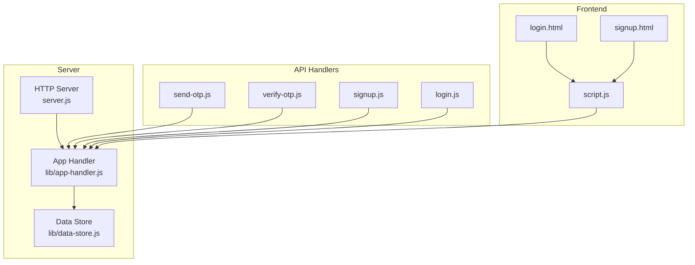
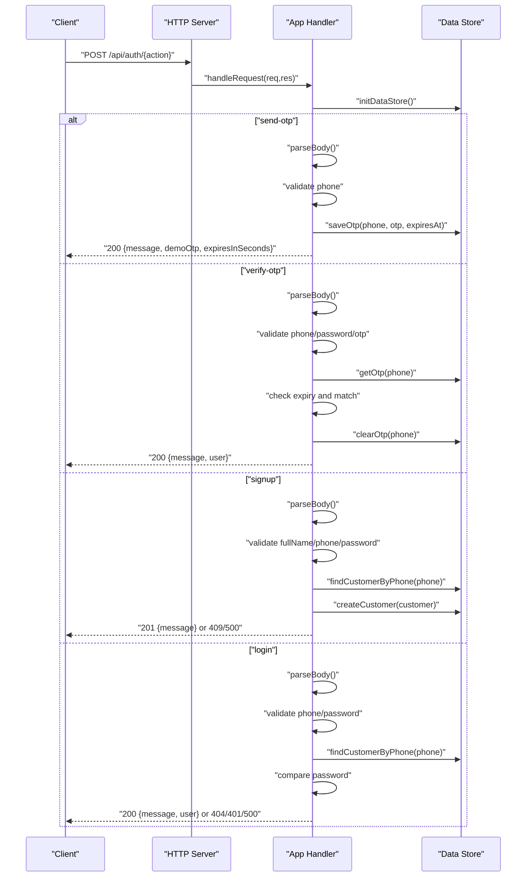
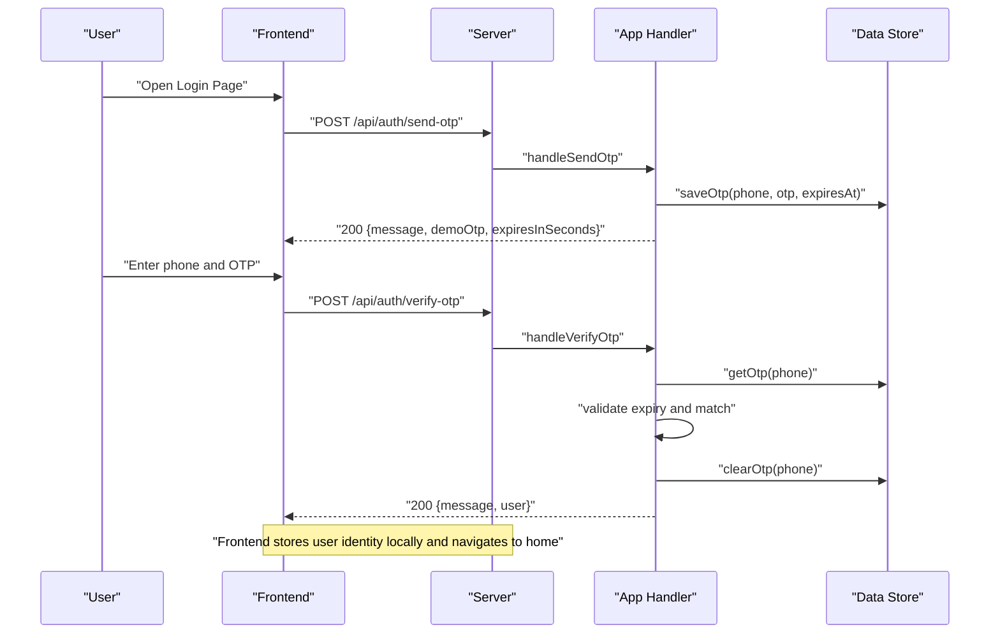
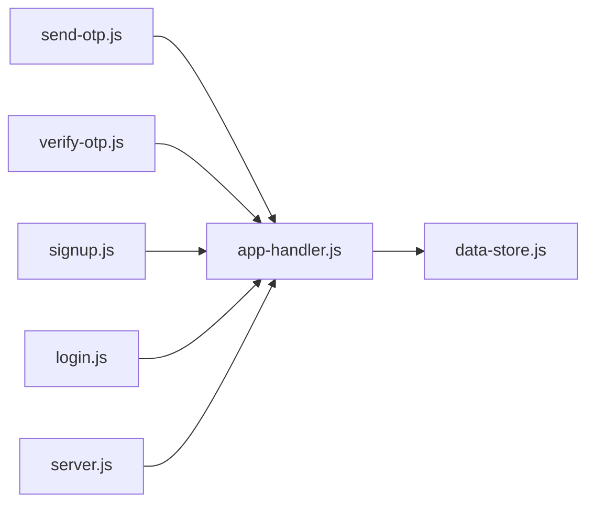

# Authentication Endpoints

<cite>
**Referenced Files in This Document**
- [server.js](file://server.js)
- [lib/app-handler.js](file://lib/app-handler.js)
- [lib/data-store.js](file://lib/data-store.js)
- [api/auth/send-otp.js](file://api/auth/send-otp.js)
- [api/auth/verify-otp.js](file://api/auth/verify-otp.js)
- [api/auth/signup.js](file://api/auth/signup.js)
- [api/auth/login.js](file://api/auth/login.js)
- [login.html](file://login.html)
- [signup.html](file://signup.html)
- [script.js](file://script.js)
- [customers.json](file://customers.json)
</cite>

## Table of Contents
1. [Introduction](#introduction)
2. [Project Structure](#project-structure)
3. [Core Components](#core-components)
4. [Architecture Overview](#architecture-overview)
5. [Detailed Component Analysis](#detailed-component-analysis)
6. [Dependency Analysis](#dependency-analysis)
7. [Performance Considerations](#performance-considerations)
8. [Troubleshooting Guide](#troubleshooting-guide)
9. [Conclusion](#conclusion)
10. [Appendices](#appendices)

## Introduction
This document provides comprehensive API documentation for the Night Foodies authentication endpoints. It covers the four core authentication APIs:
- POST /api/auth/send-otp: generates and sends OTP codes to phone numbers
- POST /api/auth/verify-otp: validates OTP codes and establishes user sessions
- POST /api/auth/signup: creates new customer accounts with phone number verification
- POST /api/auth/login: authenticates existing users

For each endpoint, we specify HTTP methods, URL patterns, request body schemas, response formats, status codes, and error handling. We also include practical curl examples and JavaScript fetch usage patterns, document the complete authentication flow, and address security considerations, rate limiting, and integration guidelines for frontend applications.

## Project Structure
The authentication system is implemented as a small HTTP server with modular handlers and a pluggable data store. The server exposes four API routes under /api/auth, each backed by a thin wrapper that delegates to a shared handler factory. The data store supports multiple backends (MySQL, file-based JSON, in-memory) and manages OTP codes and customer records.

**Diagram sources**
- [server.js:1-35](file://server.js#L1-L35)
- [lib/app-handler.js:271-295](file://lib/app-handler.js#L271-L295)
- [lib/data-store.js:158-214](file://lib/data-store.js#L158-L214)
- [api/auth/send-otp.js:1-4](file://api/auth/send-otp.js#L1-L4)
- [api/auth/verify-otp.js:1-4](file://api/auth/verify-otp.js#L1-L4)
- [api/auth/signup.js:1-4](file://api/auth/signup.js#L1-L4)
- [api/auth/login.js:1-4](file://api/auth/login.js#L1-L4)
- [login.html:1-54](file://login.html#L1-L54)
- [signup.html:1-67](file://signup.html#L1-L67)
- [script.js:87-120](file://script.js#L87-L120)

**Section sources**
- [server.js:1-35](file://server.js#L1-L35)
- [lib/app-handler.js:271-295](file://lib/app-handler.js#L271-L295)
- [lib/data-store.js:158-214](file://lib/data-store.js#L158-L214)

## Core Components
- HTTP Server: Initializes the data store and routes requests to the app handler.
- App Handler: Parses request bodies, validates inputs, executes business logic, and returns JSON responses. It also serves static files for the SPA.
- Data Store: Provides abstraction over MySQL, file-based JSON, or in-memory storage. Manages OTP codes and customer records.
- API Handlers: Thin wrappers that register each endpoint with the app handler factory.

Key behaviors:
- Request body parsing supports JSON payloads.
- Validation enforces phone number length, password length, and OTP format.
- Responses are JSON with a consistent structure containing a message field and optional data.

**Section sources**
- [server.js:7-32](file://server.js#L7-L32)
- [lib/app-handler.js:30-54](file://lib/app-handler.js#L30-L54)
- [lib/app-handler.js:15-21](file://lib/app-handler.js#L15-L21)
- [lib/data-store.js:266-276](file://lib/data-store.js#L266-L276)

## Architecture Overview
The authentication flow is routed through a central handler that dispatches to specific action handlers based on the URL path. The data store is initialized lazily and supports multiple backends.

**Diagram sources**
- [lib/app-handler.js:271-295](file://lib/app-handler.js#L271-L295)
- [lib/app-handler.js:98-123](file://lib/app-handler.js#L98-L123)
- [lib/app-handler.js:125-170](file://lib/app-handler.js#L125-L170)
- [lib/app-handler.js:172-225](file://lib/app-handler.js#L172-L225)
- [lib/app-handler.js:227-269](file://lib/app-handler.js#L227-L269)
- [lib/data-store.js:216-229](file://lib/data-store.js#L216-L229)
- [lib/data-store.js:231-264](file://lib/data-store.js#L231-L264)

## Detailed Component Analysis

### POST /api/auth/send-otp
Purpose: Generate a 6-digit OTP and associate it with the provided phone number for a limited time. Returns a demo OTP for development convenience.

- Method: POST
- URL: /api/auth/send-otp
- Content-Type: application/json
- Request Body Schema:
  - phone: string, required, must be exactly 10 digits
- Response:
  - 200 OK: { message: string, demoOtp: string, expiresInSeconds: number }
  - 400 Bad Request: { message: string }
- Validation Rules:
  - Phone number must be 10 digits
- Success Scenario:
  - OTP generated and stored with expiration
- Error Conditions:
  - Invalid JSON body
  - Phone number missing or invalid
- Security Notes:
  - OTP validity is enforced client-side and server-side
  - Demo OTP included for development; do not expose in production
- Rate Limiting:
  - Not implemented in code; consider adding rate limiting at the application or infrastructure level
- Practical Examples:
  - curl:
    - curl -X POST http://localhost:3000/api/auth/send-otp -H "Content-Type: application/json" -d '{"phone":"9876543210"}'
  - JavaScript (fetch):
    - fetch('/api/auth/send-otp', { method: 'POST', headers: { 'Content-Type': 'application/json' }, body: JSON.stringify({ phone: '9876543210' }) })

**Section sources**
- [lib/app-handler.js:274-123](file://lib/app-handler.js#L274-L123)
- [lib/app-handler.js:15-17](file://lib/app-handler.js#L15-L17)
- [lib/app-handler.js:19-21](file://lib/app-handler.js#L19-L21)
- [lib/app-handler.js:13-13](file://lib/app-handler.js#L13-L13)

### POST /api/auth/verify-otp
Purpose: Validate the OTP for a given phone number and password, clearing the OTP and returning a success message with user identity.

- Method: POST
- URL: /api/auth/verify-otp
- Content-Type: application/json
- Request Body Schema:
  - phone: string, required, must be exactly 10 digits
  - password: string, required, minimum 4 characters
  - otp: string, required, must be exactly 6 digits
- Response:
  - 200 OK: { message: string, user: { phone: string } }
  - 400 Bad Request: { message: string } (OTP not requested or expired)
  - 401 Unauthorized: { message: string } (Incorrect OTP)
  - 500 Internal Server Error: { message: string }
- Validation Rules:
  - Phone number must be 10 digits
  - Password must be at least 4 characters
  - OTP must be 6 digits
  - OTP must not be expired
  - OTP must match the stored value
- Success Scenario:
  - OTP verified, cleared, and user object returned
- Error Conditions:
  - Invalid JSON body
  - Missing or invalid fields
  - OTP not requested or expired
  - Incorrect OTP
- Security Notes:
  - OTP is cleared upon successful verification
  - OTP has a short validity window
- Rate Limiting:
  - Not implemented in code; consider adding rate limiting at the application or infrastructure level
- Practical Examples:
  - curl:
    - curl -X POST http://localhost:3000/api/auth/verify-otp -H "Content-Type: application/json" -d '{"phone":"9876543210","password":"pass","otp":"123456"}'
  - JavaScript (fetch):
    - fetch('/api/auth/verify-otp', { method: 'POST', headers: { 'Content-Type': 'application/json' }, body: JSON.stringify({ phone: '9876543210', password: 'pass', otp: '123456' }) })

**Section sources**
- [lib/app-handler.js:279-170](file://lib/app-handler.js#L279-L170)
- [lib/app-handler.js:134-169](file://lib/app-handler.js#L134-L169)
- [lib/app-handler.js:15-17](file://lib/app-handler.js#L15-L17)
- [lib/app-handler.js:141-144](file://lib/app-handler.js#L141-L144)
- [lib/app-handler.js:146-149](file://lib/app-handler.js#L146-L149)
- [lib/app-handler.js:151-166](file://lib/app-handler.js#L151-L166)

### POST /api/auth/signup
Purpose: Create a new customer account with the provided details. Phone number must be unique.

- Method: POST
- URL: /api/auth/signup
- Content-Type: application/json
- Request Body Schema:
  - fullName: string, required, minimum 2 characters
  - phone: string, required, must be exactly 10 digits
  - email: string, optional
  - address: string, optional
  - password: string, required, minimum 4 characters
- Response:
  - 201 Created: { message: string }
  - 400 Bad Request: { message: string } (validation errors)
  - 409 Conflict: { message: string } (duplicate phone)
  - 500 Internal Server Error: { message: string }
- Validation Rules:
  - Full name required and at least 2 characters
  - Phone number required and exactly 10 digits
  - Password required and at least 4 characters
- Success Scenario:
  - New customer record created with auto-generated ID
- Error Conditions:
  - Invalid JSON body
  - Missing or invalid fields
  - Duplicate phone number
- Security Notes:
  - Password is stored as plaintext (see Security Considerations)
- Rate Limiting:
  - Not implemented in code; consider adding rate limiting at the application or infrastructure level
- Practical Examples:
  - curl:
    - curl -X POST http://localhost:3000/api/auth/signup -H "Content-Type: application/json" -d '{"fullName":"John Doe","phone":"9876543210","email":"john@example.com","address":"123 Main St","password":"pass"}'
  - JavaScript (fetch):
    - fetch('/api/auth/signup', { method: 'POST', headers: { 'Content-Type': 'application/json' }, body: JSON.stringify({ fullName: 'John Doe', phone: '9876543210', email: 'john@example.com', address: '123 Main St', password: 'pass' }) })

**Section sources**
- [lib/app-handler.js:284-225](file://lib/app-handler.js#L284-L225)
- [lib/app-handler.js:172-225](file://lib/app-handler.js#L172-L225)
- [lib/app-handler.js:183-196](file://lib/app-handler.js#L183-L196)
- [lib/app-handler.js:188-191](file://lib/app-handler.js#L188-L191)
- [lib/app-handler.js:193-196](file://lib/app-handler.js#L193-L196)
- [lib/data-store.js:231-239](file://lib/data-store.js#L231-L239)

### POST /api/auth/login
Purpose: Authenticate an existing user by verifying phone and password.

- Method: POST
- URL: /api/auth/login
- Content-Type: application/json
- Request Body Schema:
  - phone: string, required, must be exactly 10 digits
  - password: string, required
- Response:
  - 200 OK: { message: string, user: { id: string, phone: string } }
  - 400 Bad Request: { message: string } (validation errors)
  - 404 Not Found: { message: string } (account not found)
  - 401 Unauthorized: { message: string } (incorrect password)
  - 500 Internal Server Error: { message: string }
- Validation Rules:
  - Phone number required and exactly 10 digits
  - Password required
- Success Scenario:
  - Existing customer found and password matches
- Error Conditions:
  - Invalid JSON body
  - Missing or invalid fields
  - Account not found
  - Incorrect password
- Security Notes:
  - Password is compared as plaintext (see Security Considerations)
- Rate Limiting:
  - Not implemented in code; consider adding rate limiting at the application or infrastructure level
- Practical Examples:
  - curl:
    - curl -X POST http://localhost:3000/api/auth/login -H "Content-Type: application/json" -d '{"phone":"9876543210","password":"pass"}'
  - JavaScript (fetch):
    - fetch('/api/auth/login', { method: 'POST', headers: { 'Content-Type': 'application/json' }, body: JSON.stringify({ phone: '9876543210', password: 'pass' }) })

**Section sources**
- [lib/app-handler.js:289-269](file://lib/app-handler.js#L289-L269)
- [lib/app-handler.js:227-269](file://lib/app-handler.js#L227-L269)
- [lib/app-handler.js:238-246](file://lib/app-handler.js#L238-L246)
- [lib/data-store.js:216-229](file://lib/data-store.js#L216-L229)

### Authentication Flow: From OTP Request to Session Establishment
This flow demonstrates the typical end-to-end journey for a new user to authenticate and establish a session.

**Diagram sources**
- [lib/app-handler.js:274-123](file://lib/app-handler.js#L274-L123)
- [lib/app-handler.js:279-170](file://lib/app-handler.js#L279-L170)
- [lib/data-store.js:266-276](file://lib/data-store.js#L266-L276)

## Dependency Analysis
The authentication endpoints depend on a shared handler and a pluggable data store. The server initializes the data store and delegates routing to the handler.

**Diagram sources**
- [api/auth/send-otp.js:1-4](file://api/auth/send-otp.js#L1-L4)
- [api/auth/verify-otp.js:1-4](file://api/auth/verify-otp.js#L1-L4)
- [api/auth/signup.js:1-4](file://api/auth/signup.js#L1-L4)
- [api/auth/login.js:1-4](file://api/auth/login.js#L1-L4)
- [lib/app-handler.js:1-11](file://lib/app-handler.js#L1-L11)
- [lib/data-store.js:1-17](file://lib/data-store.js#L1-L17)
- [server.js:1-3](file://server.js#L1-L3)

**Section sources**
- [api/auth/send-otp.js:1-4](file://api/auth/send-otp.js#L1-L4)
- [api/auth/verify-otp.js:1-4](file://api/auth/verify-otp.js#L1-L4)
- [api/auth/signup.js:1-4](file://api/auth/signup.js#L1-L4)
- [api/auth/login.js:1-4](file://api/auth/login.js#L1-L4)
- [lib/app-handler.js:1-11](file://lib/app-handler.js#L1-L11)
- [lib/data-store.js:1-17](file://lib/data-store.js#L1-L17)
- [server.js:1-3](file://server.js#L1-L3)

## Performance Considerations
- Data Store Initialization: The data store is initialized lazily on first request. This avoids startup overhead when not needed.
- Storage Backends:
  - MySQL: Best for production with persistence and scalability.
  - File-based JSON: Good for local development; ensure file persistence on platforms that require it.
  - In-memory: Suitable for ephemeral environments; data resets between cold starts.
- OTP Expiration: Short validity window reduces stale data and improves security.
- Frontend Fetch Wrapper: Centralized error handling and network checks reduce repeated logic.

[No sources needed since this section provides general guidance]

## Troubleshooting Guide
Common issues and resolutions:
- Server fails to start:
  - Ensure Node.js runtime meets the required version.
  - Verify environment variables for MySQL configuration if using MySQL.
- 400 Bad Request on authentication endpoints:
  - Confirm request body is valid JSON.
  - Validate required fields and formats (phone length, password length, OTP format).
- 409 Conflict during signup:
  - Phone number already exists; prompt user to log in instead.
- 404 Not Found during login:
  - Account does not exist; prompt user to sign up.
- 401 Unauthorized:
  - Incorrect OTP or password; re-enter credentials.
- Network errors in frontend:
  - Ensure the server is running locally and accessible at the expected port.
  - Avoid opening HTML files directly via file:// protocol; use a local server.

**Section sources**
- [server.js:24-31](file://server.js#L24-L31)
- [lib/app-handler.js:40-53](file://lib/app-handler.js#L40-L53)
- [lib/app-handler.js:108-111](file://lib/app-handler.js#L108-L111)
- [lib/app-handler.js:136-149](file://lib/app-handler.js#L136-L149)
- [lib/app-handler.js:183-196](file://lib/app-handler.js#L183-L196)
- [lib/app-handler.js:238-246](file://lib/app-handler.js#L238-L246)
- [lib/app-handler.js:251-259](file://lib/app-handler.js#L251-L259)
- [script.js:95-110](file://script.js#L95-L110)

## Conclusion
The Night Foodies authentication system provides a straightforward set of endpoints for OTP-based registration and login, along with traditional phone/password login and account creation. The design emphasizes simplicity and modularity, with a clear separation between routing, validation, and data persistence. For production deployments, consider enhancing security (password hashing, HTTPS, CSRF protection), implementing rate limiting, and configuring persistent storage.

[No sources needed since this section summarizes without analyzing specific files]

## Appendices

### Security Considerations
- Password Storage: Passwords are stored as plaintext. This is insecure and should be addressed by hashing passwords with a strong algorithm (e.g., bcrypt) before storing.
- OTP Handling: OTPs are cleared after successful verification, reducing exposure windows.
- Transport Security: Use HTTPS in production to protect credentials and tokens in transit.
- Rate Limiting: Implement rate limiting to prevent brute-force attacks on OTP and login endpoints.
- CORS and Headers: Add appropriate CORS policies and security headers as needed.

[No sources needed since this section provides general guidance]

### Integration Guidelines for Frontend Applications
- Use the centralized fetch wrapper for consistent error handling and network checks.
- Validate inputs on the client side to reduce server load and improve UX.
- Store minimal session identifiers on the client (e.g., user phone) and rely on server-side sessions for sensitive operations.
- Redirect unauthenticated users to the login page when accessing protected pages.

**Section sources**
- [script.js:87-120](file://script.js#L87-L120)
- [script.js:122-148](file://script.js#L122-L148)
- [script.js:156-186](file://script.js#L156-L186)

### Data Store Backends
- MySQL: Requires environment variables for host, port, user, password, and database name. Creates the database and table if they do not exist.
- File-based JSON: Stores customer records in a JSON file. Supports fallback to in-memory storage if file initialization fails.
- In-memory: Temporary storage suitable for ephemeral environments.

**Section sources**
- [lib/data-store.js:68-101](file://lib/data-store.js#L68-L101)
- [lib/data-store.js:112-123](file://lib/data-store.js#L112-L123)
- [lib/data-store.js:125-129](file://lib/data-store.js#L125-L129)
- [lib/data-store.js:140-214](file://lib/data-store.js#L140-L214)
- [customers.json:1-11](file://customers.json#L1-L11)