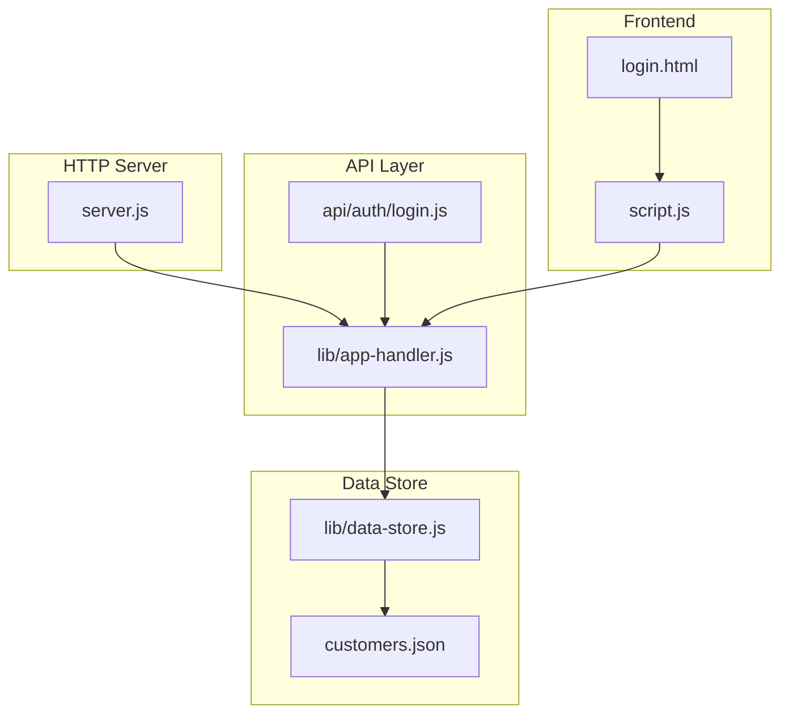
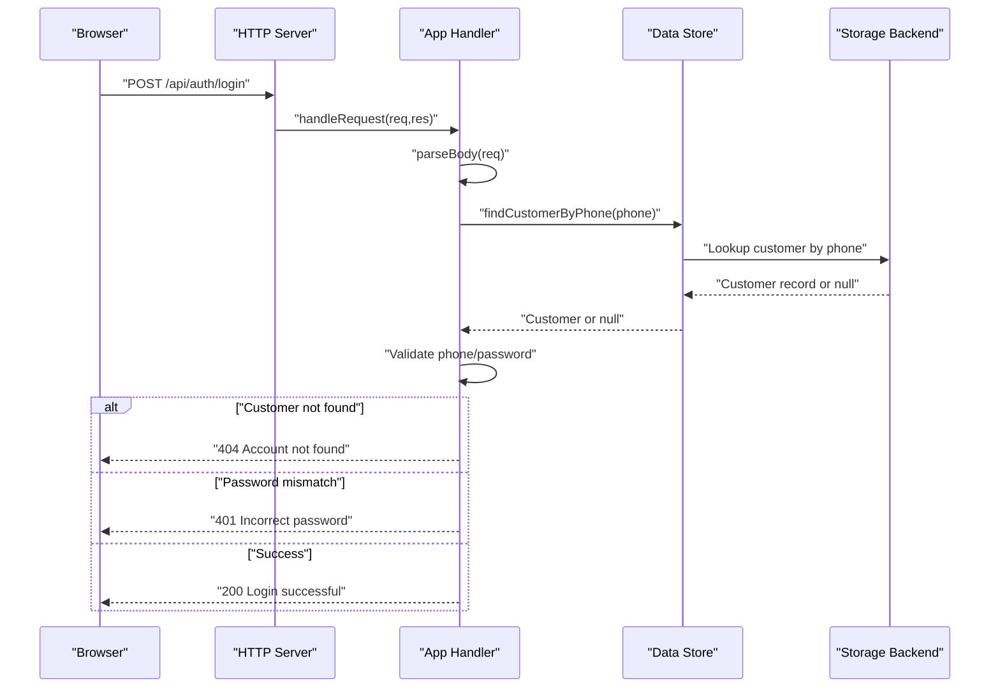
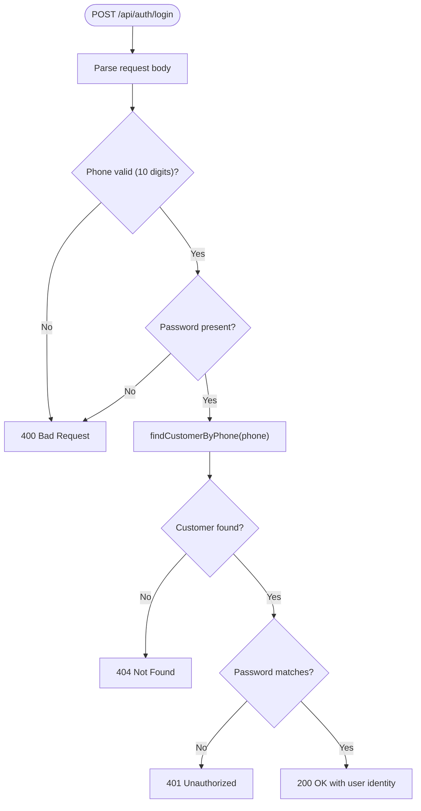
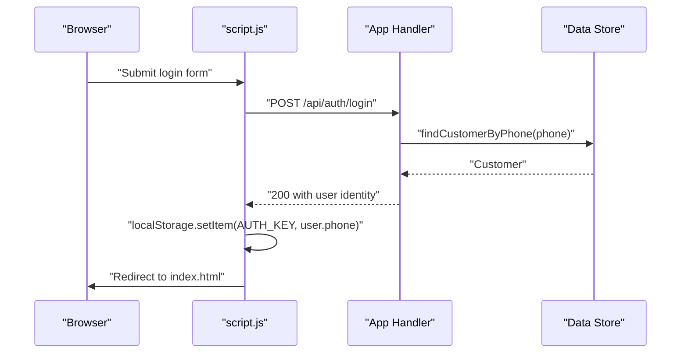
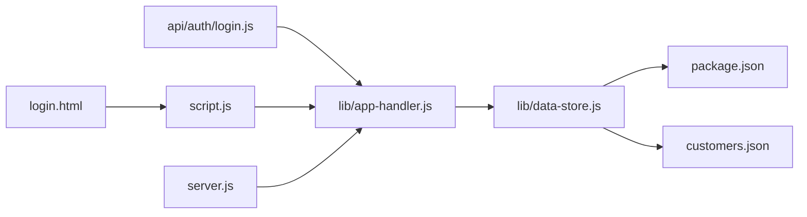

# Login Endpoint

<cite>
**Referenced Files in This Document**
- [login.js](file://api/auth/login.js)
- [app-handler.js](file://lib/app-handler.js)
- [data-store.js](file://lib/data-store.js)
- [server.js](file://server.js)
- [script.js](file://script.js)
- [login.html](file://login.html)
- [customers.json](file://customers.json)
- [package.json](file://package.json)
</cite>

## Table of Contents
1. [Introduction](#introduction)
2. [Project Structure](#project-structure)
3. [Core Components](#core-components)
4. [Architecture Overview](#architecture-overview)
5. [Detailed Component Analysis](#detailed-component-analysis)
6. [Dependency Analysis](#dependency-analysis)
7. [Performance Considerations](#performance-considerations)
8. [Troubleshooting Guide](#troubleshooting-guide)
9. [Conclusion](#conclusion)

## Introduction
This document provides comprehensive API documentation for the POST /api/auth/login endpoint. It covers the customer authentication process, including request body validation, response format, status codes, and the underlying authentication workflow. It also explains password verification, session establishment, integration with the data store, and the serverless handler implementation. Security measures for password handling and session management are addressed, along with practical examples for successful login, invalid credentials, and account not found scenarios.

## Project Structure
The authentication system is organized around a small set of modules:
- API handlers for authentication endpoints
- A shared serverless handler factory
- A data store abstraction supporting MySQL, file, and in-memory modes
- A simple HTTP server for local development
- Frontend integration via a login page and JavaScript client

**Diagram sources**
- [server.js:1-35](file://server.js#L1-L35)
- [app-handler.js:1-332](file://lib/app-handler.js#L1-L332)
- [login.js:1-7](file://api/auth/login.js#L1-L7)
- [data-store.js:1-291](file://lib/data-store.js#L1-L291)
- [login.html:1-54](file://login.html#L1-L54)
- [script.js:1-450](file://script.js#L1-L450)

**Section sources**
- [server.js:1-35](file://server.js#L1-L35)
- [app-handler.js:1-332](file://lib/app-handler.js#L1-L332)
- [login.js:1-7](file://api/auth/login.js#L1-L7)
- [data-store.js:1-291](file://lib/data-store.js#L1-L291)
- [login.html:1-54](file://login.html#L1-L54)
- [script.js:1-450](file://script.js#L1-L450)

## Core Components
- POST /api/auth/login: Validates phone and password, authenticates the customer against the data store, and returns a success response with user identity.
- Serverless handler factory: Creates lightweight handlers for API endpoints, routing requests to the appropriate handler based on the route path.
- Data store: Provides customer lookup and persistence across MySQL, file, and in-memory modes.
- Frontend client: Submits login requests from the login page and manages local session state.

Key responsibilities:
- Request validation: Phone number format and password presence.
- Customer lookup: Retrieves customer record by phone number using the data store abstraction.
- Authentication: Compares provided password with stored password.
- Response: Returns standardized JSON payloads with appropriate HTTP status codes.

**Section sources**
- [app-handler.js:227-269](file://lib/app-handler.js#L227-L269)
- [app-handler.js:311-325](file://lib/app-handler.js#L311-L325)
- [data-store.js:216-229](file://lib/data-store.js#L216-L229)
- [login.html:30-47](file://login.html#L30-L47)
- [script.js:122-148](file://script.js#L122-L148)

## Architecture Overview
The login flow integrates the frontend, HTTP server, API handler, and data store:

**Diagram sources**
- [server.js:7-32](file://server.js#L7-L32)
- [app-handler.js:271-295](file://lib/app-handler.js#L271-L295)
- [app-handler.js:227-269](file://lib/app-handler.js#L227-L269)
- [data-store.js:216-229](file://lib/data-store.js#L216-L229)

## Detailed Component Analysis

### API Endpoint Definition
- Method: POST
- Path: /api/auth/login
- Purpose: Authenticate a customer using phone number and password.

Request body schema:
- phone: string, required, must match 10 digits
- password: string, required, must be present

Response format:
- On success: 200 OK with JSON payload containing a success message and user identity
- On validation errors: 400 Bad Request with an error message
- On account not found: 404 Not Found with an error message
- On incorrect password: 401 Unauthorized with an error message
- On internal errors: 500 Internal Server Error with an error message

Status codes:
- 200: Successful login
- 400: Invalid request body or validation failure
- 401: Incorrect password
- 404: Account not found
- 500: Internal server error

Security considerations:
- Password comparison is performed as a string equality check.
- No cryptographic hashing is implemented for passwords.
- Session management is client-side using localStorage.

Practical examples:
- Successful login:
  - Request: { "phone": "9022015583", "password": "123456" }
  - Response: { "message": "Login successful.", "user": { "id": "...", "phone": "9022015583" } }
- Invalid credentials:
  - Request: { "phone": "9022015583", "password": "wrong" }
  - Response: { "message": "Incorrect password." }
- Account not found:
  - Request: { "phone": "0000000000", "password": "any" }
  - Response: { "message": "Account not found. Please Sign Up first." }

**Section sources**
- [app-handler.js:227-269](file://lib/app-handler.js#L227-L269)
- [login.html:30-47](file://login.html#L30-L47)
- [script.js:122-148](file://script.js#L122-L148)
- [customers.json:1-11](file://customers.json#L1-L11)

### Authentication Workflow
The login workflow follows these steps:
1. Parse and validate the incoming request body.
2. Lookup the customer by phone number using the data store abstraction.
3. Compare the provided password with the stored password.
4. Return appropriate responses based on validation and authentication outcomes.

**Diagram sources**
- [app-handler.js:227-269](file://lib/app-handler.js#L227-L269)
- [data-store.js:216-229](file://lib/data-store.js#L216-L229)

**Section sources**
- [app-handler.js:227-269](file://lib/app-handler.js#L227-L269)
- [data-store.js:216-229](file://lib/data-store.js#L216-L229)

### Password Verification
- Validation: The handler checks that the phone number matches 10 digits and that a password is provided.
- Verification: The handler compares the provided password with the stored password using strict equality.
- Security note: There is no password hashing or salting. This is a design choice reflected in the implementation.

**Section sources**
- [app-handler.js:238-246](file://lib/app-handler.js#L238-L246)
- [app-handler.js:256-259](file://lib/app-handler.js#L256-L259)

### Session Establishment
- Client-side session: Upon successful login, the frontend stores the user's phone number in localStorage under a fixed key.
- Navigation: The client redirects to the home page after a successful login.
- Logout: Removing the localStorage key logs the user out.

**Diagram sources**
- [script.js:122-148](file://script.js#L122-L148)
- [app-handler.js:261-264](file://lib/app-handler.js#L261-L264)

**Section sources**
- [script.js:122-148](file://script.js#L122-L148)
- [app-handler.js:261-264](file://lib/app-handler.js#L261-L264)

### Integration with Data Store
The data store abstraction supports multiple backends:
- MySQL: Requires environment variables for host, port, user, password, and database name.
- File: Uses a JSON file as the customer store.
- Memory: In-memory Map for testing or serverless environments.

Customer lookup:
- The handler calls findCustomerByPhone(phone) to retrieve a customer record.
- The data store selects the backend based on initialization and returns the customer or null.

Initialization:
- The handler initializes the data store before processing requests.
- Initialization logic chooses MySQL, file, or memory mode depending on environment variables and platform constraints.

**Section sources**
- [data-store.js:216-229](file://lib/data-store.js#L216-L229)
- [data-store.js:158-214](file://lib/data-store.js#L158-L214)
- [app-handler.js:272-272](file://lib/app-handler.js#L272-L272)

### Serverless Handler Implementation
The serverless handler factory creates a lightweight handler for a given action:
- Route path: /api/auth/{action}
- Behavior: Parses the request body, delegates to the appropriate handler based on the route path, and returns JSON responses with appropriate status codes.
- Fallback: Returns 404 Not Found if the route does not match.

The login module exports the handler created for the "login" action.

**Section sources**
- [app-handler.js:311-325](file://lib/app-handler.js#L311-L325)
- [login.js:1-7](file://api/auth/login.js#L1-L7)

## Dependency Analysis
The login endpoint depends on several modules and their relationships:

**Diagram sources**
- [login.js:1-7](file://api/auth/login.js#L1-L7)
- [app-handler.js:1-332](file://lib/app-handler.js#L1-L332)
- [data-store.js:1-291](file://lib/data-store.js#L1-L291)
- [package.json:1-18](file://package.json#L1-L18)
- [customers.json:1-11](file://customers.json#L1-L11)
- [script.js:1-450](file://script.js#L1-L450)
- [login.html:1-54](file://login.html#L1-L54)
- [server.js:1-35](file://server.js#L1-L35)

**Section sources**
- [login.js:1-7](file://api/auth/login.js#L1-L7)
- [app-handler.js:1-332](file://lib/app-handler.js#L1-L332)
- [data-store.js:1-291](file://lib/data-store.js#L1-L291)
- [package.json:1-18](file://package.json#L1-L18)
- [customers.json:1-11](file://customers.json#L1-L11)
- [script.js:1-450](file://script.js#L1-L450)
- [login.html:1-54](file://login.html#L1-L54)
- [server.js:1-35](file://server.js#L1-L35)

## Performance Considerations
- Data store initialization: The data store is initialized once per request lifecycle to ensure availability of the selected backend.
- Customer lookup: The findCustomerByPhone operation is O(1) for memory and Map-backed lookups, O(n) for file-based arrays, and O(log n) for MySQL with an index on phone.
- Request parsing: Body parsing is asynchronous and handles streaming chunks; ensure payloads are reasonable in size.
- Network overhead: The frontend performs a single POST request per login attempt.

[No sources needed since this section provides general guidance]

## Troubleshooting Guide
Common issues and resolutions:
- 400 Bad Request: Occurs when the phone number is not 10 digits or when the password is missing. Verify the request body format and content.
- 401 Unauthorized: Indicates an incorrect password. Confirm the password matches the stored value.
- 404 Not Found: Indicates the account does not exist. Ensure the phone number is registered.
- 500 Internal Server Error: Indicates an unhandled error during processing. Check server logs for details.

Environment and configuration:
- MySQL mode requires DB_HOST, DB_USER, DB_NAME, and optionally DB_PORT. Ensure these environment variables are set correctly.
- File mode uses a JSON file path determined by CUSTOMERS_FILE or defaults to customers.json in the project root.
- In serverless environments (e.g., Vercel), file storage is not persistent; the system falls back to in-memory mode.

Frontend integration:
- The login page validates phone number format and password length before sending the request.
- On success, the client stores the user's phone number in localStorage and navigates to the home page.

**Section sources**
- [app-handler.js:238-246](file://lib/app-handler.js#L238-L246)
- [app-handler.js:256-259](file://lib/app-handler.js#L256-L259)
- [app-handler.js:251-253](file://lib/app-handler.js#L251-L253)
- [data-store.js:158-214](file://lib/data-store.js#L158-L214)
- [login.html:30-47](file://login.html#L30-L47)
- [script.js:122-148](file://script.js#L122-L148)

## Conclusion
The POST /api/auth/login endpoint provides a straightforward authentication mechanism with clear validation and response semantics. It integrates with a flexible data store abstraction supporting multiple backends and relies on client-side session management for user state. While the current implementation uses plaintext password comparison, the modular architecture allows for future enhancements such as password hashing and secure session tokens.