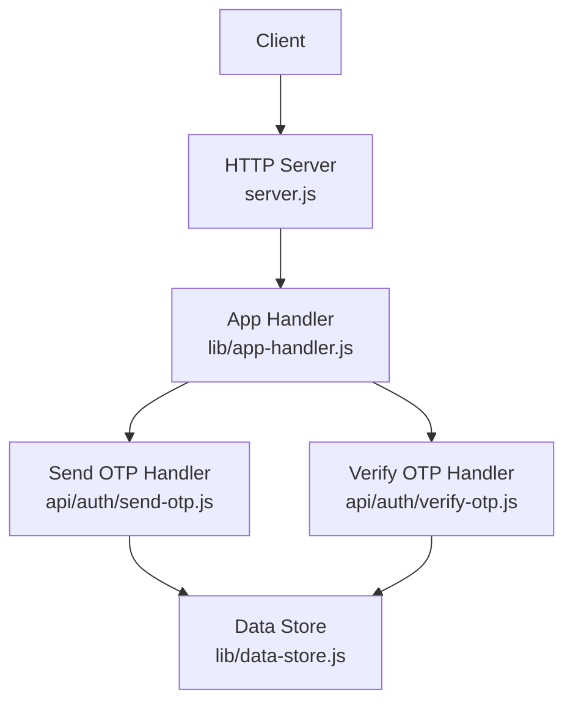
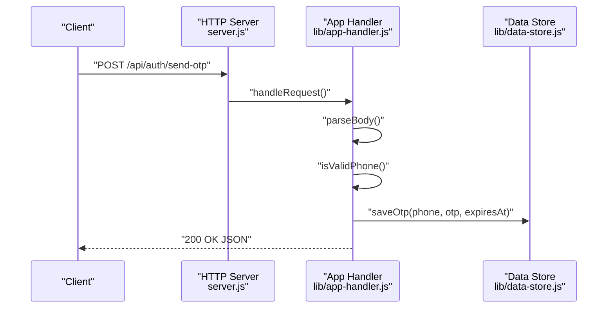
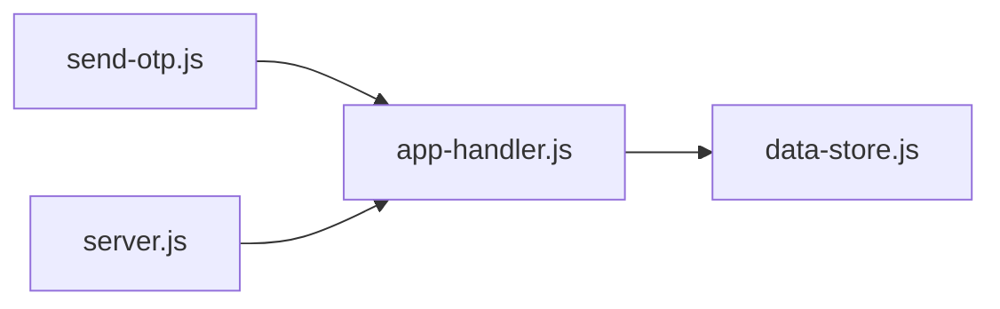

# Send OTP Endpoint

<cite>
**Referenced Files in This Document**
- [server.js](file://server.js)
- [app-handler.js](file://lib/app-handler.js)
- [data-store.js](file://lib/data-store.js)
- [send-otp.js](file://api/auth/send-otp.js)
- [verify-otp.js](file://api/auth/verify-otp.js)
- [login.html](file://login.html)
- [signup.html](file://signup.html)
</cite>

## Table of Contents
1. [Introduction](#introduction)
2. [Project Structure](#project-structure)
3. [Core Components](#core-components)
4. [Architecture Overview](#architecture-overview)
5. [Detailed Component Analysis](#detailed-component-analysis)
6. [Dependency Analysis](#dependency-analysis)
7. [Performance Considerations](#performance-considerations)
8. [Troubleshooting Guide](#troubleshooting-guide)
9. [Conclusion](#conclusion)
10. [Appendices](#appendices)

## Introduction
This document provides detailed API documentation for the POST /api/auth/send-otp endpoint. It explains how OTPs are generated, validated, stored, and delivered, along with the request/response formats, status codes, and security considerations. It also covers the serverless handler pattern used and the integration with the data store for OTP persistence.

## Project Structure
The application exposes a small set of API endpoints under /api/auth, with a shared HTTP server and a reusable serverless-style handler factory. OTP functionality is implemented in a dedicated module that integrates with a pluggable data store supporting memory, file, and MySQL modes.

**Diagram sources**
- [server.js:1-35](file://server.js#L1-L35)
- [app-handler.js:271-295](file://lib/app-handler.js#L271-L295)
- [send-otp.js:1-7](file://api/auth/send-otp.js#L1-L7)
- [verify-otp.js:1-7](file://api/auth/verify-otp.js#L1-L7)
- [data-store.js:266-276](file://lib/data-store.js#L266-L276)

**Section sources**
- [server.js:1-35](file://server.js#L1-L35)
- [app-handler.js:271-295](file://lib/app-handler.js#L271-L295)

## Core Components
- HTTP server: Creates an HTTP server and delegates requests to the application handler.
- Application handler: Centralizes routing, request parsing, response formatting, and OTP logic.
- Data store: Provides OTP persistence in memory, file, or MySQL depending on environment configuration.
- Serverless handler factory: Wraps handlers to support serverless-style routing.

Key responsibilities:
- Validate incoming request body and phone number format.
- Generate a 6-digit OTP with a fixed validity window.
- Persist OTP with expiration metadata.
- Respond with structured JSON indicating success and OTP details.

**Section sources**
- [server.js:7-32](file://server.js#L7-L32)
- [app-handler.js:98-123](file://lib/app-handler.js#L98-L123)
- [data-store.js:266-276](file://lib/data-store.js#L266-L276)

## Architecture Overview
The endpoint follows a serverless-style handler pattern. The HTTP server delegates to a handler factory that routes to the appropriate action based on the path. The send-otp action parses the request body, validates the phone number, generates an OTP, persists it, and returns a JSON response.

**Diagram sources**
- [server.js:11-19](file://server.js#L11-L19)
- [app-handler.js:274-276](file://lib/app-handler.js#L274-L276)
- [app-handler.js:98-123](file://lib/app-handler.js#L98-L123)
- [data-store.js:266-268](file://lib/data-store.js#L266-L268)

## Detailed Component Analysis

### Endpoint Definition
- Method: POST
- Path: /api/auth/send-otp
- Purpose: Generate and persist an OTP for the provided phone number and return a success response with OTP details.

**Section sources**
- [app-handler.js:274-276](file://lib/app-handler.js#L274-L276)

### Request Body Schema
- Content-Type: application/json
- Required fields:
  - phone: string, 10 digits only
- Example:
  - {
      "phone": "1234567890"
    }

Validation rules:
- Phone number must match exactly 10 digits.
- JSON body must be valid; otherwise a 400 error is returned.

Response format:
- Success (200):
  - message: string
  - demoOtp: string (6-digit OTP)
  - expiresInSeconds: number (OTP validity window in seconds)
- Error (400):
  - message: string explaining the validation failure

Status codes:
- 200 OK on success
- 400 Bad Request on validation errors or invalid JSON

Security note:
- The response includes demoOtp for development convenience. In production, remove or restrict this field.

**Section sources**
- [app-handler.js:98-123](file://lib/app-handler.js#L98-L123)
- [app-handler.js:15-17](file://lib/app-handler.js#L15-L17)
- [app-handler.js:30-54](file://lib/app-handler.js#L30-L54)

### OTP Generation Algorithm
- Generates a random 6-digit integer in the range [100000, 999999].
- Stores the OTP alongside an expiration timestamp derived from the current time plus a fixed validity window.

Validity window:
- Fixed duration of 2 minutes.

Storage mechanism:
- OTP is stored in an in-memory Map keyed by phone number.
- Each entry contains the OTP and its expiration timestamp.

Delivery methods:
- The implementation stores the OTP in memory. No external SMS delivery is performed in this codebase.

**Section sources**
- [app-handler.js:19-21](file://lib/app-handler.js#L19-L21)
- [app-handler.js:13](file://lib/app-handler.js#L13)
- [data-store.js:266-268](file://lib/data-store.js#L266-L268)

### Data Store Integration
The data store supports multiple backends:
- Memory: In-memory Map for OTPs and customer records.
- File: Local JSON file for persistence.
- MySQL: Relational database via mysql2.

OTP persistence:
- saveOtp(phone, otp, expiresAt) writes to an in-memory Map.
- getOtp(phone) reads OTP and expiration.
- clearOtp(phone) removes entries after verification or expiry.

Initialization:
- The data store is initialized on first use via initDataStore, which selects backend based on environment variables and platform constraints.

**Section sources**
- [data-store.js:266-276](file://lib/data-store.js#L266-L276)
- [data-store.js:158-214](file://lib/data-store.js#L158-L214)
- [app-handler.js:272](file://lib/app-handler.js#L272)

### Serverless Handler Pattern
The handler factory creates a serverless-style route for each action:
- createServerlessHandler(action) constructs a route path (/api/auth/{action}).
- The returned handler invokes handleApiRequest with the specific route path.
- If the route does not match, a 404 Not Found response is returned.

This pattern enables clean separation of concerns and easy extension to additional endpoints.

**Section sources**
- [app-handler.js:311-325](file://lib/app-handler.js#L311-L325)
- [send-otp.js:1-7](file://api/auth/send-otp.js#L1-L7)

### Practical Usage Examples

curl: Successful OTP request
- Command:
  - curl -X POST http://localhost:3000/api/auth/send-otp -H "Content-Type: application/json" -d '{"phone":"1234567890"}'
- Expected response:
  - {
      "message": "OTP sent successfully.",
      "demoOtp": "123456",
      "expiresInSeconds": 120
    }

curl: Invalid phone number
- Command:
  - curl -X POST http://localhost:3000/api/auth/send-otp -H "Content-Type: application/json" -d '{"phone":"123"}'
- Expected response:
  - {
      "message": "Phone number must be 10 digits."
    }

curl: Invalid JSON body
- Command:
  - curl -X POST http://localhost:3000/api/auth/send-otp -H "Content-Type: application/json" -d '{invalid json}'
- Expected response:
  - {
      "message": "Invalid JSON body."
    }

curl: Rate limiting considerations
- The code does not implement rate limiting. If you deploy this service behind a proxy or platform that enforces rate limits, you may receive 429 responses from upstream infrastructure. Consider adding rate limiting at the platform level or in front of the server.

**Section sources**
- [app-handler.js:98-123](file://lib/app-handler.js#L98-L123)
- [app-handler.js:30-54](file://lib/app-handler.js#L30-L54)

### Security Considerations
- OTP exposure: The response includes demoOtp for development convenience. Remove or restrict this field in production environments.
- Transport security: Use HTTPS in production to protect credentials and OTPs in transit.
- Rate limiting: No built-in rate limiting exists. Add platform-level or application-level rate limiting to prevent abuse.
- Storage security: OTPs are stored in memory by default. For persistent deployments, configure MySQL to ensure secure storage and access controls.
- Validation: Phone number validation ensures only 10-digit numeric input. Consider additional sanitization and input normalization if accepting international numbers.

**Section sources**
- [app-handler.js:118-122](file://lib/app-handler.js#L118-L122)
- [data-store.js:158-214](file://lib/data-store.js#L158-L214)

## Dependency Analysis
The send-otp endpoint depends on:
- Application handler for request routing, parsing, and response formatting.
- Data store for OTP persistence.
- Serverless handler factory for route binding.

**Diagram sources**
- [send-otp.js:1-7](file://api/auth/send-otp.js#L1-L7)
- [app-handler.js:271-295](file://lib/app-handler.js#L271-L295)
- [data-store.js:266-276](file://lib/data-store.js#L266-L276)
- [server.js:11-19](file://server.js#L11-L19)

**Section sources**
- [send-otp.js:1-7](file://api/auth/send-otp.js#L1-L7)
- [app-handler.js:271-295](file://lib/app-handler.js#L271-L295)
- [data-store.js:266-276](file://lib/data-store.js#L266-L276)
- [server.js:11-19](file://server.js#L11-L19)

## Performance Considerations
- In-memory OTP storage is fast but ephemeral. For production, configure MySQL to ensure persistence across restarts.
- The OTP validity window is fixed at 2 minutes. Adjust as needed for your security and usability requirements.
- The data store initialization is asynchronous and cached. Subsequent requests benefit from reduced initialization overhead.

[No sources needed since this section provides general guidance]

## Troubleshooting Guide
Common issues and resolutions:
- 400 Invalid JSON body: Ensure the request body is valid JSON.
- 400 Phone number must be 10 digits: Provide a 10-digit numeric phone number.
- 500 Internal server error: Check server logs for unhandled exceptions during request processing.
- Data store mode: If OTPs disappear after cold starts, the app is using in-memory mode. Configure MySQL for persistent storage.

**Section sources**
- [app-handler.js:102-111](file://lib/app-handler.js#L102-L111)
- [app-handler.js:320-323](file://lib/app-handler.js#L320-L323)
- [data-store.js:158-214](file://lib/data-store.js#L158-L214)

## Conclusion
The POST /api/auth/send-otp endpoint provides a minimal, serverless-style implementation for OTP generation and persistence. It validates inputs, generates a 6-digit OTP with a fixed validity window, and stores it in memory. For production, enable MySQL-backed persistence, enforce rate limiting, and secure transport to mitigate risks.

[No sources needed since this section summarizes without analyzing specific files]

## Appendices

### API Reference Summary
- Endpoint: POST /api/auth/send-otp
- Request body:
  - phone: string (10 digits)
- Success response (200):
  - message: string
  - demoOtp: string (6-digit OTP)
  - expiresInSeconds: number
- Error responses (400):
  - message: string (validation or JSON parsing error)

**Section sources**
- [app-handler.js:98-123](file://lib/app-handler.js#L98-L123)