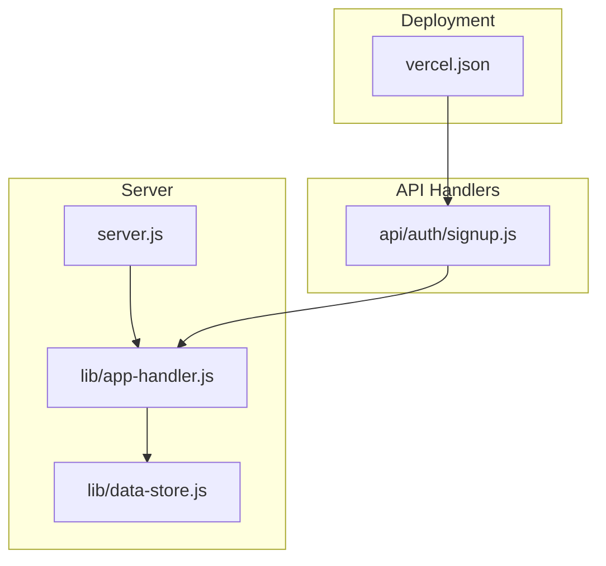
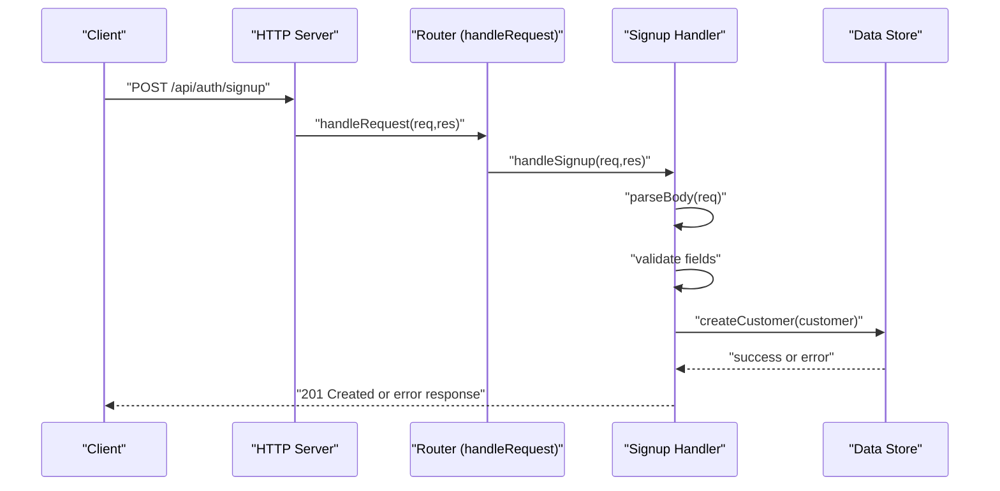
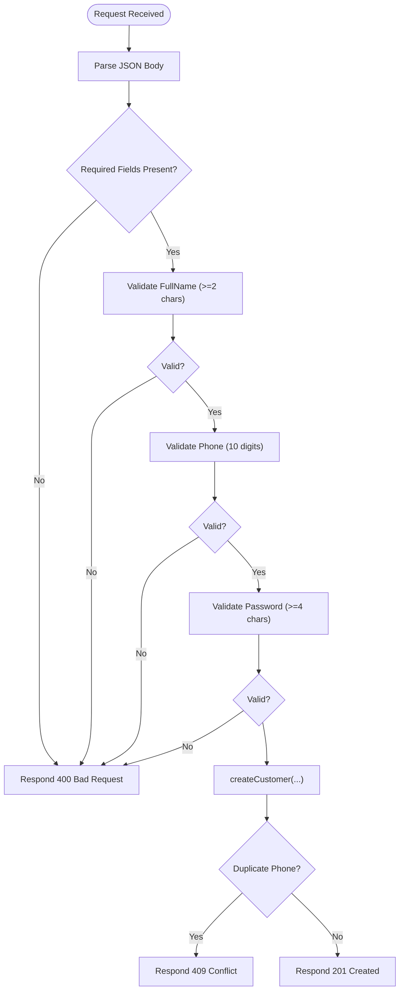
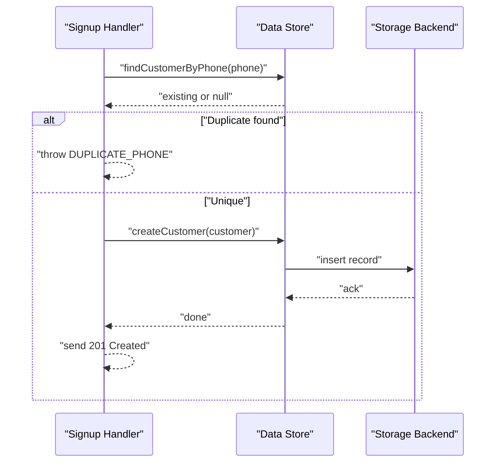
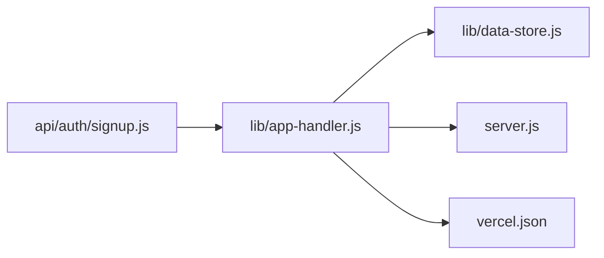

# Signup Endpoint

<cite>
**Referenced Files in This Document**
- [server.js](file://server.js)
- [lib/app-handler.js](file://lib/app-handler.js)
- [lib/data-store.js](file://lib/data-store.js)
- [api/auth/signup.js](file://api/auth/signup.js)
- [vercel.json](file://vercel.json)
- [package.json](file://package.json)
- [signup.html](file://signup.html)
- [script.js](file://script.js)
- [customers.json](file://customers.json)
</cite>

## Table of Contents
1. [Introduction](#introduction)
2. [Project Structure](#project-structure)
3. [Core Components](#core-components)
4. [Architecture Overview](#architecture-overview)
5. [Detailed Component Analysis](#detailed-component-analysis)
6. [Dependency Analysis](#dependency-analysis)
7. [Performance Considerations](#performance-considerations)
8. [Troubleshooting Guide](#troubleshooting-guide)
9. [Conclusion](#conclusion)
10. [Appendices](#appendices)

## Introduction
This document provides detailed API documentation for the POST /api/auth/signup endpoint. It covers the customer registration process, including request body validation, response format, status codes, the customer creation workflow, password handling, and persistence across different data stores. It also explains the serverless handler implementation, integration with the data store, and security considerations for protecting customer data.

## Project Structure
The application is a Node.js HTTP server with a small set of API endpoints under /api/auth. The signup endpoint is implemented as a serverless handler that delegates to a shared request router and data store.

**Diagram sources**
- [server.js:1-35](file://server.js#L1-L35)
- [lib/app-handler.js:1-332](file://lib/app-handler.js#L1-L332)
- [lib/data-store.js:1-291](file://lib/data-store.js#L1-L291)
- [api/auth/signup.js:1-7](file://api/auth/signup.js#L1-L7)
- [vercel.json:1-48](file://vercel.json#L1-L48)

**Section sources**
- [server.js:1-35](file://server.js#L1-L35)
- [lib/app-handler.js:284-295](file://lib/app-handler.js#L284-L295)
- [api/auth/signup.js:1-7](file://api/auth/signup.js#L1-L7)
- [vercel.json:26-30](file://vercel.json#L26-L30)

## Core Components
- Server entrypoint initializes the data store and handles HTTP requests.
- Shared request router maps HTTP methods and paths to handlers.
- Serverless handler wrapper for API endpoints.
- Data store abstraction supporting MySQL, file-based JSON, and in-memory modes.
- Frontend form posts to the signup endpoint.

Key behaviors:
- Request parsing and JSON body validation.
- Validation rules for full name, phone, and password.
- Customer creation with duplicate phone detection.
- Response formatting and status codes.

**Section sources**
- [server.js:7-32](file://server.js#L7-L32)
- [lib/app-handler.js:30-54](file://lib/app-handler.js#L30-L54)
- [lib/app-handler.js:172-225](file://lib/app-handler.js#L172-L225)
- [lib/data-store.js:216-264](file://lib/data-store.js#L216-L264)
- [api/auth/signup.js:1-7](file://api/auth/signup.js#L1-L7)

## Architecture Overview
The signup endpoint follows a layered architecture:
- HTTP server receives requests and initializes the data store.
- Router identifies the path and dispatches to the signup handler.
- Handler validates the request body and creates a customer record.
- Data store persists the customer using the selected backend.

**Diagram sources**
- [server.js:11-19](file://server.js#L11-L19)
- [lib/app-handler.js:271-295](file://lib/app-handler.js#L271-L295)
- [lib/app-handler.js:172-225](file://lib/app-handler.js#L172-L225)
- [lib/data-store.js:231-264](file://lib/data-store.js#L231-L264)

## Detailed Component Analysis

### Endpoint Definition
- Method: POST
- Path: /api/auth/signup
- Purpose: Register a new customer with validated credentials.

Request body schema:
- fullName: string, required, minimum length 2 after trimming
- phone: string, required, must match 10 digits
- email: string, optional
- address: string, optional
- password: string, required, minimum length 4 after trimming

Response format:
- On success: 201 Created with a message indicating success.
- On validation failure: 400 Bad Request with a message.
- On duplicate phone: 409 Conflict with a message.
- On internal error: 500 Internal Server Error with a message.

Status codes:
- 201 Created: Registration successful.
- 400 Bad Request: Validation errors (missing fields, invalid phone, short password).
- 409 Conflict: Duplicate phone number.
- 500 Internal Server Error: Unexpected server-side error.

Security considerations:
- Password is stored as plaintext in the current implementation. This is acceptable for development but strongly discouraged for production.
- No password hashing is implemented; consider bcrypt or a secure hashing library in production.
- The data store supports multiple backends; MySQL is recommended for production.

Practical examples:
- Successful registration:
  - Request: { "fullName": "John Doe", "phone": "1234567890", "email": "john@example.com", "address": "123 Main St", "password": "pass123" }
  - Response: 201 Created with a success message.
- Duplicate phone number:
  - Request: Same phone as an existing customer.
  - Response: 409 Conflict with a message indicating the account already exists.
- Validation failures:
  - Missing fullName or password: 400 Bad Request.
  - Invalid phone (not 10 digits): 400 Bad Request.
  - Short password (< 4 characters): 400 Bad Request.

Integration with data store:
- The handler calls createCustomer with normalized fields.
- The data store checks for duplicates by phone before insertion.
- Persistence occurs in MySQL, file JSON, or in-memory depending on configuration.

Serverless handler implementation:
- The endpoint is exposed via a serverless handler that wraps the router for the path /api/auth/signup.
- On Vercel, the route mapping ensures the correct handler is invoked.

**Section sources**
- [lib/app-handler.js:172-225](file://lib/app-handler.js#L172-L225)
- [lib/data-store.js:231-264](file://lib/data-store.js#L231-L264)
- [api/auth/signup.js:1-7](file://api/auth/signup.js#L1-L7)
- [vercel.json:26-30](file://vercel.json#L26-L30)

### Request Body Validation Flow

**Diagram sources**
- [lib/app-handler.js:172-225](file://lib/app-handler.js#L172-L225)
- [lib/data-store.js:231-264](file://lib/data-store.js#L231-L264)

### Customer Creation Workflow
- Normalize input fields (trim, defaults).
- Check for existing customer by phone.
- Insert customer into the selected backend (MySQL, file JSON, or in-memory).
- Return success or propagate error.

**Diagram sources**
- [lib/app-handler.js:198-207](file://lib/app-handler.js#L198-L207)
- [lib/data-store.js:216-264](file://lib/data-store.js#L216-L264)

### Password Handling
- Current implementation stores passwords as plaintext.
- Recommended improvements for production:
  - Use a secure hashing library (bcrypt) to hash passwords before storing.
  - Compare hashed passwords during login.
  - Add salting and pepper strategies if applicable.

**Section sources**
- [lib/app-handler.js:248-259](file://lib/app-handler.js#L248-L259)
- [lib/data-store.js:241-254](file://lib/data-store.js#L241-L254)

### Data Store Modes and Persistence
- MySQL: Recommended for production. Enforces uniqueness on phone and persists records.
- File JSON: Local JSON file storage. Used when MySQL is unavailable or not configured.
- In-memory: Fallback mode. Data resets between cold starts; used on Vercel by default.

Configuration precedence:
- Explicit DB_DRIVER selection.
- Environment variables for MySQL configuration.
- Vercel deployment defaults to in-memory mode.

**Section sources**
- [lib/data-store.js:158-214](file://lib/data-store.js#L158-L214)
- [lib/data-store.js:216-264](file://lib/data-store.js#L216-L264)
- [vercel.json:44-46](file://vercel.json#L44-L46)

### Frontend Integration
- The signup page collects full name, phone, email, address, and password.
- The client posts to /api/auth/signup with JSON payload.
- On success, the client redirects to the login page.

**Section sources**
- [signup.html:30-60](file://signup.html#L30-L60)
- [script.js:156-186](file://script.js#L156-L186)

## Dependency Analysis
The signup endpoint depends on:
- Router to dispatch the request to the correct handler.
- Data store for customer existence checks and creation.
- Environment configuration to select the storage backend.

**Diagram sources**
- [api/auth/signup.js:1-7](file://api/auth/signup.js#L1-L7)
- [lib/app-handler.js:271-295](file://lib/app-handler.js#L271-L295)
- [lib/data-store.js:158-214](file://lib/data-store.js#L158-L214)
- [server.js:1-35](file://server.js#L1-L35)
- [vercel.json:26-30](file://vercel.json#L26-L30)

**Section sources**
- [lib/app-handler.js:271-295](file://lib/app-handler.js#L271-L295)
- [lib/data-store.js:158-214](file://lib/data-store.js#L158-L214)
- [vercel.json:26-30](file://vercel.json#L26-L30)

## Performance Considerations
- Input parsing is synchronous and buffered; keep payloads small.
- MySQL operations are asynchronous; ensure connection pooling is configured appropriately.
- File-based storage writes occur synchronously; consider batching for bulk inserts.
- In-memory mode is fastest but ephemeral; suitable only for development.

[No sources needed since this section provides general guidance]

## Troubleshooting Guide
Common issues and resolutions:
- 400 Bad Request:
  - Missing or invalid fields cause validation failures.
  - Ensure fullName, phone, and password meet the minimum requirements.
- 409 Conflict:
  - A customer with the same phone already exists.
  - Prompt the user to log in instead.
- 500 Internal Server Error:
  - Unexpected server-side error during processing.
  - Check server logs for details.

Environment configuration:
- On Vercel, DB_DRIVER is set to memory by default.
- Configure MySQL environment variables to enable persistent storage in production.

**Section sources**
- [lib/app-handler.js:183-196](file://lib/app-handler.js#L183-L196)
- [lib/app-handler.js:216-224](file://lib/app-handler.js#L216-L224)
- [vercel.json:44-46](file://vercel.json#L44-L46)

## Conclusion
The POST /api/auth/signup endpoint provides a straightforward customer registration flow with basic validation and flexible persistence. For production, prioritize secure password handling, robust error reporting, and persistent storage with MySQL. The current implementation serves as a solid foundation for extending authentication and customer management capabilities.

[No sources needed since this section summarizes without analyzing specific files]

## Appendices

### API Definition Summary
- Endpoint: POST /api/auth/signup
- Content-Type: application/json
- Request body fields:
  - fullName: string, required, min length 2
  - phone: string, required, 10 digits
  - email: string, optional
  - address: string, optional
  - password: string, required, min length 4
- Responses:
  - 201 Created: Registration successful
  - 400 Bad Request: Validation errors
  - 409 Conflict: Duplicate phone
  - 500 Internal Server Error: Unexpected error

**Section sources**
- [lib/app-handler.js:172-225](file://lib/app-handler.js#L172-L225)

### Example Requests and Responses
- Successful registration:
  - Request: { "fullName": "Jane Smith", "phone": "9876543210", "email": "jane@example.com", "address": "456 Oak Ave", "password": "mypassword" }
  - Response: 201 Created with a success message
- Duplicate phone:
  - Request: Same phone as an existing customer
  - Response: 409 Conflict with a message indicating the account already exists
- Validation failure:
  - Request: Missing fullName or password
  - Response: 400 Bad Request with a validation message

**Section sources**
- [lib/app-handler.js:183-196](file://lib/app-handler.js#L183-L196)
- [lib/app-handler.js:216-224](file://lib/app-handler.js#L216-L224)

### Data Store Schema (MySQL)
- Table: customers
- Columns:
  - id: VARCHAR(64) PRIMARY KEY
  - fullName: VARCHAR(255) NOT NULL
  - phone: VARCHAR(20) NOT NULL, UNIQUE
  - email: VARCHAR(255)
  - address: TEXT
  - password: VARCHAR(255) NOT NULL
  - createdAt: VARCHAR(64)

**Section sources**
- [lib/data-store.js:86-97](file://lib/data-store.js#L86-L97)

### Frontend Form Fields
- Full Name: text input
- Phone Number: tel input (pattern 10 digits)
- Email: email input (optional)
- Address: textarea (optional)
- Password: password input (min length 4)

**Section sources**
- [signup.html:30-60](file://signup.html#L30-L60)