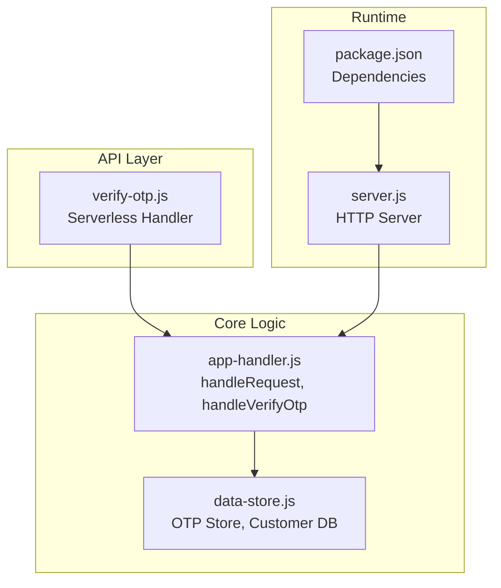
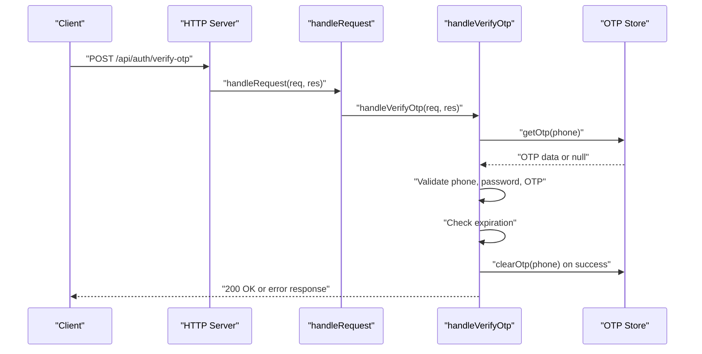
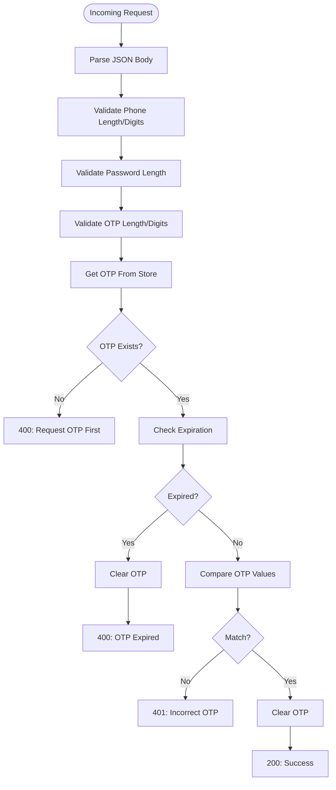
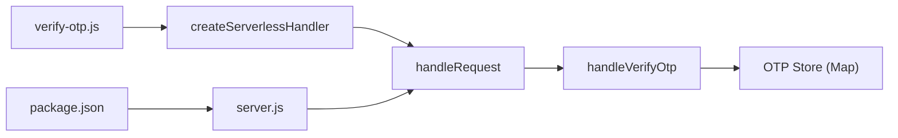

# Verify OTP Endpoint

<cite>
**Referenced Files in This Document**
- [verify-otp.js](file://api/auth/verify-otp.js)
- [app-handler.js](file://lib/app-handler.js)
- [data-store.js](file://lib/data-store.js)
- [server.js](file://server.js)
- [package.json](file://package.json)
- [customers.json](file://customers.json)
</cite>

## Table of Contents
1. [Introduction](#introduction)
2. [Project Structure](#project-structure)
3. [Core Components](#core-components)
4. [Architecture Overview](#architecture-overview)
5. [Detailed Component Analysis](#detailed-component-analysis)
6. [Dependency Analysis](#dependency-analysis)
7. [Performance Considerations](#performance-considerations)
8. [Troubleshooting Guide](#troubleshooting-guide)
9. [Conclusion](#conclusion)

## Introduction
This document provides comprehensive API documentation for the POST /api/auth/verify-otp endpoint. It explains the OTP validation process, including request body schema, response format, status codes, OTP verification logic, expiration handling, and user session establishment. It also covers integration with the data store for OTP retrieval and validation, the serverless handler implementation, and security measures for OTP verification and session management.

## Project Structure
The OTP verification flow is implemented as part of a modular authentication system:
- API handlers for authentication actions are thin wrappers around a shared serverless handler factory.
- The serverless handler delegates to a central request router that validates requests and executes action-specific logic.
- A data store module manages OTP storage and customer persistence across multiple backends (in-memory, file-based, MySQL).

**Diagram sources**
- [verify-otp.js:1-7](file://api/auth/verify-otp.js#L1-L7)
- [app-handler.js:271-295](file://lib/app-handler.js#L271-L295)
- [data-store.js:266-276](file://lib/data-store.js#L266-L276)
- [server.js:1-35](file://server.js#L1-L35)
- [package.json:1-18](file://package.json#L1-L18)

**Section sources**
- [verify-otp.js:1-7](file://api/auth/verify-otp.js#L1-L7)
- [app-handler.js:271-295](file://lib/app-handler.js#L271-L295)
- [data-store.js:266-276](file://lib/data-store.js#L266-L276)
- [server.js:1-35](file://server.js#L1-L35)
- [package.json:1-18](file://package.json#L1-L18)

## Core Components
- Serverless handler wrapper: The verify-otp.js file exports a serverless handler created by a factory that binds the route path to the central request router.
- Request router: The central router recognizes POST /api/auth/verify-otp and invokes the OTP verification handler.
- OTP verification logic: Validates request body, checks OTP existence and expiration, compares OTP values, clears OTP on success, and returns a success response with minimal user data.
- Data store: Provides OTP storage via an in-memory Map and integrates with MySQL, file-based JSON, or in-memory fallback modes.

Key implementation references:
- Serverless handler creation and export: [verify-otp.js:1-7](file://api/auth/verify-otp.js#L1-L7)
- Route registration and dispatch: [app-handler.js:271-295](file://lib/app-handler.js#L271-L295)
- OTP verification handler: [app-handler.js:125-170](file://lib/app-handler.js#L125-L170)
- OTP store functions: [data-store.js:266-276](file://lib/data-store.js#L266-L276)

**Section sources**
- [verify-otp.js:1-7](file://api/auth/verify-otp.js#L1-L7)
- [app-handler.js:125-170](file://lib/app-handler.js#L125-L170)
- [data-store.js:266-276](file://lib/data-store.js#L266-L276)

## Architecture Overview
The verify-otp endpoint follows a layered architecture:
- HTTP server receives requests and initializes the data store.
- Central request router identifies the route and delegates to the OTP verification handler.
- The OTP verification handler validates inputs, checks OTP validity against the OTP store, and responds with appropriate status codes and messages.

**Diagram sources**
- [server.js:7-32](file://server.js#L7-L32)
- [app-handler.js:271-295](file://lib/app-handler.js#L271-L295)
- [app-handler.js:125-170](file://lib/app-handler.js#L125-L170)
- [data-store.js:266-276](file://lib/data-store.js#L266-L276)

## Detailed Component Analysis

### Endpoint Definition
- Method: POST
- Path: /api/auth/verify-otp
- Purpose: Verify an OTP sent to a phone number and establish a minimal session representation upon success.

Security posture:
- The endpoint does not issue long-lived tokens; it returns a success message and minimal user data suitable for client-side session establishment.
- OTP is validated against an in-memory store with strict expiration semantics.

**Section sources**
- [app-handler.js:279-282](file://lib/app-handler.js#L279-L282)
- [app-handler.js:125-170](file://lib/app-handler.js#L125-L170)

### Request Body Schema
The endpoint expects a JSON payload with the following fields:
- phone: string, required. Must be a 10-digit numeric string.
- password: string, required. Must be at least 4 characters.
- otp: string, required. Must be a 6-digit numeric string.

Validation rules:
- Phone number length and digit-only format are enforced.
- Password length is validated.
- OTP must be exactly 6 digits.

Failure responses:
- 400 Bad Request with a message indicating the validation failure.

**Section sources**
- [app-handler.js:134-149](file://lib/app-handler.js#L134-L149)

### OTP Retrieval and Validation
OTP lifecycle:
- OTP is stored under the phone key with an associated expiration timestamp.
- On successful verification, the OTP is cleared from the store.

Validation steps:
- Retrieve OTP data for the given phone.
- If no OTP exists for the phone, respond with a message instructing to request OTP first.
- If the current time exceeds the OTP’s expiration, clear the OTP and respond with an expiration message.
- If the provided OTP does not match the stored OTP, respond with an incorrect OTP message.
- On success, clear the OTP and return a success message with minimal user data.

Expiration handling:
- OTP validity window is defined by a constant in milliseconds and is enforced at verification time.

**Section sources**
- [data-store.js:266-276](file://lib/data-store.js#L266-L276)
- [app-handler.js:151-169](file://lib/app-handler.js#L151-L169)

### Response Format
Success response:
- Status: 200 OK
- Body: Object containing a success message and a minimal user object with phone.

Failure responses:
- 400 Bad Request: Returned when OTP is missing or expired.
- 401 Unauthorized: Returned when the OTP is incorrect.

Response examples:
- Successful verification: { message: "Login successful.", user: { phone: "<phone>" } }
- Expired OTP: { message: "OTP expired. Please request a new OTP." }
- Incorrect OTP: { message: "Incorrect OTP. Please try again." }
- Missing OTP: { message: "Please request OTP first." }

Note: The response intentionally omits sensitive fields such as user ID or password.

**Section sources**
- [app-handler.js:168-169](file://lib/app-handler.js#L168-L169)
- [app-handler.js:158-160](file://lib/app-handler.js#L158-L160)
- [app-handler.js:163-165](file://lib/app-handler.js#L163-L165)
- [app-handler.js:153-154](file://lib/app-handler.js#L153-L154)

### Status Codes
- 200 OK: Verification succeeded.
- 400 Bad Request: Validation errors or OTP-related issues (missing/expired).
- 401 Unauthorized: Incorrect OTP.
- 404 Not Found: Route not found (handled by the serverless handler wrapper).
- 500 Internal Server Error: Unhandled server errors.

**Section sources**
- [app-handler.js:157-165](file://lib/app-handler.js#L157-L165)
- [app-handler.js:152-154](file://lib/app-handler.js#L152-L154)
- [app-handler.js:314-325](file://lib/app-handler.js#L314-L325)

### Practical Examples

#### Successful Verification
- Request: POST /api/auth/verify-otp with body fields phone, password, and otp.
- Outcome: 200 OK with a success message and minimal user data.

#### Expired OTP Scenario
- Request: POST /api/auth/verify-otp with an expired OTP.
- Outcome: 400 Bad Request with an expiration message.

#### Incorrect OTP Attempt
- Request: POST /api/auth/verify-otp with an incorrect OTP.
- Outcome: 401 Unauthorized with an incorrect OTP message.

Note: These examples describe expected outcomes based on the implementation. They do not include literal request/response bodies.

**Section sources**
- [app-handler.js:157-169](file://lib/app-handler.js#L157-L169)

### Integration with Data Store
OTP storage:
- OTPs are stored in an in-memory Map keyed by phone number.
- Each entry includes the OTP value and an expiration timestamp.

Customer persistence:
- While the verify-otp endpoint focuses on OTP validation, customer records are managed by the data store and can be used for account existence checks in other flows.

Storage modes:
- The data store supports MySQL, file-based JSON, and in-memory modes. OTP storage is always in-memory regardless of the selected backend.

**Section sources**
- [data-store.js:6](file://lib/data-store.js#L6)
- [data-store.js:266-276](file://lib/data-store.js#L266-L276)
- [data-store.js:140-214](file://lib/data-store.js#L140-L214)

### Serverless Handler Implementation
The verify-otp handler is created by a factory that binds the route path to the central request router. The router then delegates to the OTP verification handler, which performs validation and responds accordingly.

**Diagram sources**
- [app-handler.js:125-170](file://lib/app-handler.js#L125-L170)
- [data-store.js:266-276](file://lib/data-store.js#L266-L276)

**Section sources**
- [verify-otp.js:1-7](file://api/auth/verify-otp.js#L1-L7)
- [app-handler.js:311-325](file://lib/app-handler.js#L311-L325)
- [app-handler.js:125-170](file://lib/app-handler.js#L125-L170)

## Dependency Analysis
The verify-otp endpoint depends on:
- The serverless handler factory to bind the route path.
- The central request router for dispatching to the OTP verification handler.
- The OTP store for retrieving and clearing OTP entries.
- The data store initialization for backend selection and fallback behavior.

**Diagram sources**
- [verify-otp.js:1-7](file://api/auth/verify-otp.js#L1-L7)
- [app-handler.js:311-325](file://lib/app-handler.js#L311-L325)
- [app-handler.js:271-295](file://lib/app-handler.js#L271-L295)
- [data-store.js:266-276](file://lib/data-store.js#L266-L276)
- [server.js:1-35](file://server.js#L1-L35)
- [package.json:1-18](file://package.json#L1-L18)

**Section sources**
- [verify-otp.js:1-7](file://api/auth/verify-otp.js#L1-L7)
- [app-handler.js:311-325](file://lib/app-handler.js#L311-L325)
- [app-handler.js:271-295](file://lib/app-handler.js#L271-L295)
- [data-store.js:266-276](file://lib/data-store.js#L266-L276)
- [server.js:1-35](file://server.js#L1-L35)
- [package.json:1-18](file://package.json#L1-L18)

## Performance Considerations
- OTP store operations are O(1) lookups and deletions using an in-memory Map.
- The OTP validity window is fixed and enforced at verification time, minimizing repeated network calls.
- For production deployments, consider migrating OTP storage to a distributed cache or database to support horizontal scaling and persistence across cold starts.

[No sources needed since this section provides general guidance]

## Troubleshooting Guide
Common issues and resolutions:
- Missing or invalid JSON body: The endpoint returns 400 with a message indicating invalid JSON or empty body.
- Phone number validation failure: Returns 400 with a message indicating the phone must be 10 digits.
- Password validation failure: Returns 400 with a message indicating the password must be at least 4 characters.
- OTP validation failure: Returns 400 with a message indicating OTP must be 6 digits.
- No OTP present for the phone: Returns 400 with a message instructing to request OTP first.
- Expired OTP: Returns 400 with an expiration message; the OTP is cleared automatically.
- Incorrect OTP: Returns 401 with an incorrect OTP message.
- Route not found: The serverless handler wrapper returns 404 Not Found.
- Internal server errors: The serverless handler wrapper returns 500 with a generic message.

Operational tips:
- Ensure the OTP was requested previously and is still within the validity window.
- Confirm the phone number and OTP format match the validation rules.
- For persistent data in production, configure MySQL environment variables to avoid in-memory limitations.

**Section sources**
- [app-handler.js:125-170](file://lib/app-handler.js#L125-L170)
- [app-handler.js:314-325](file://lib/app-handler.js#L314-L325)

## Conclusion
The POST /api/auth/verify-otp endpoint provides a streamlined OTP verification mechanism with strict input validation, robust expiration handling, and secure response design. It integrates cleanly with the central request router and OTP store while maintaining simplicity for client-side session establishment. For production environments, consider enhancing OTP storage persistence and adding rate limiting and audit logging to strengthen security and reliability.