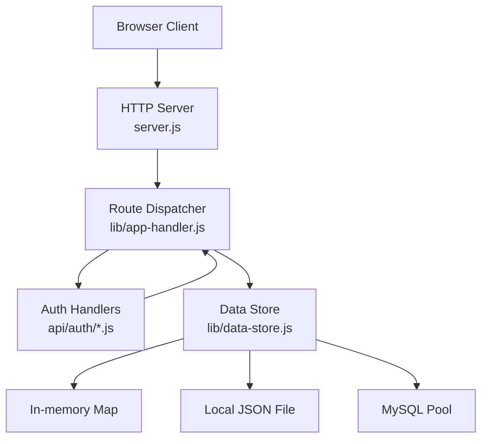
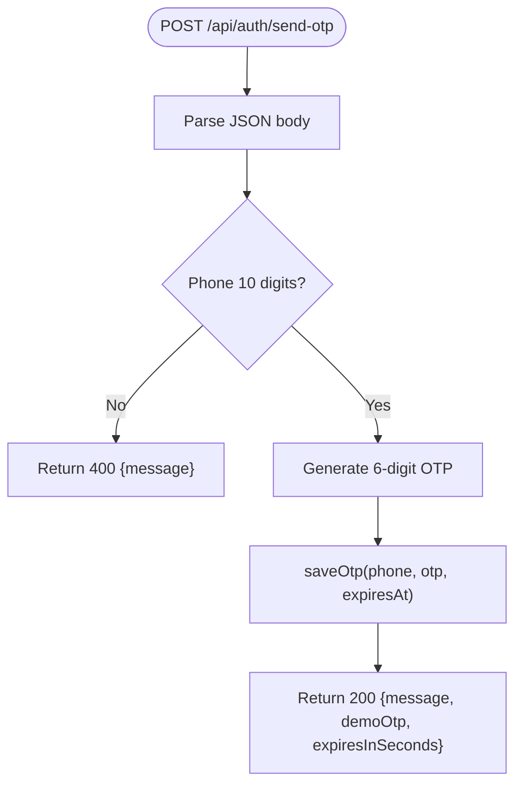
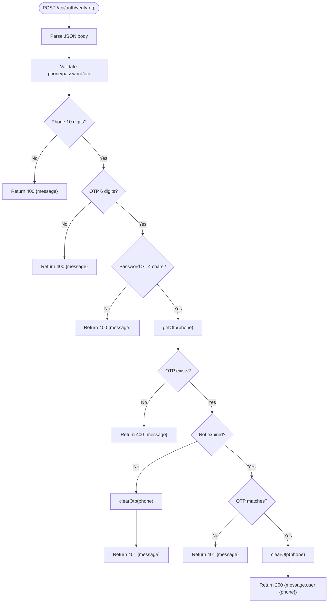
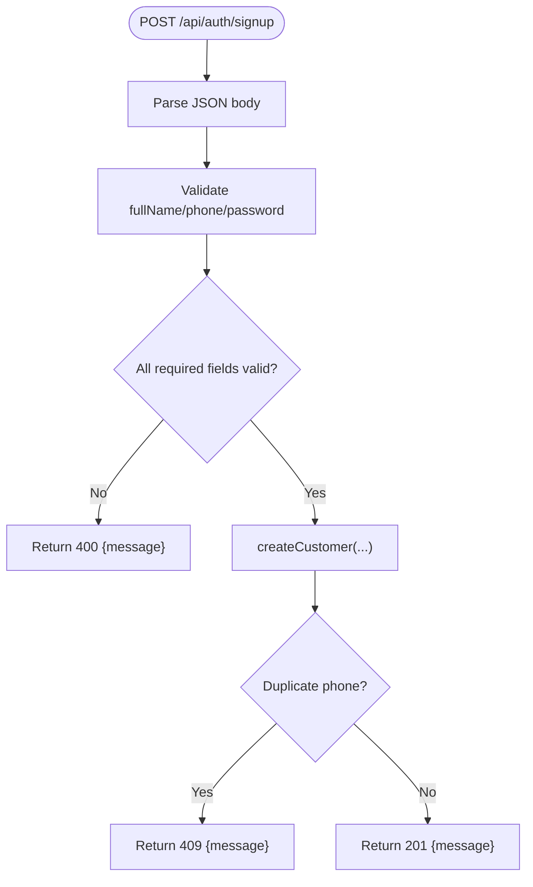
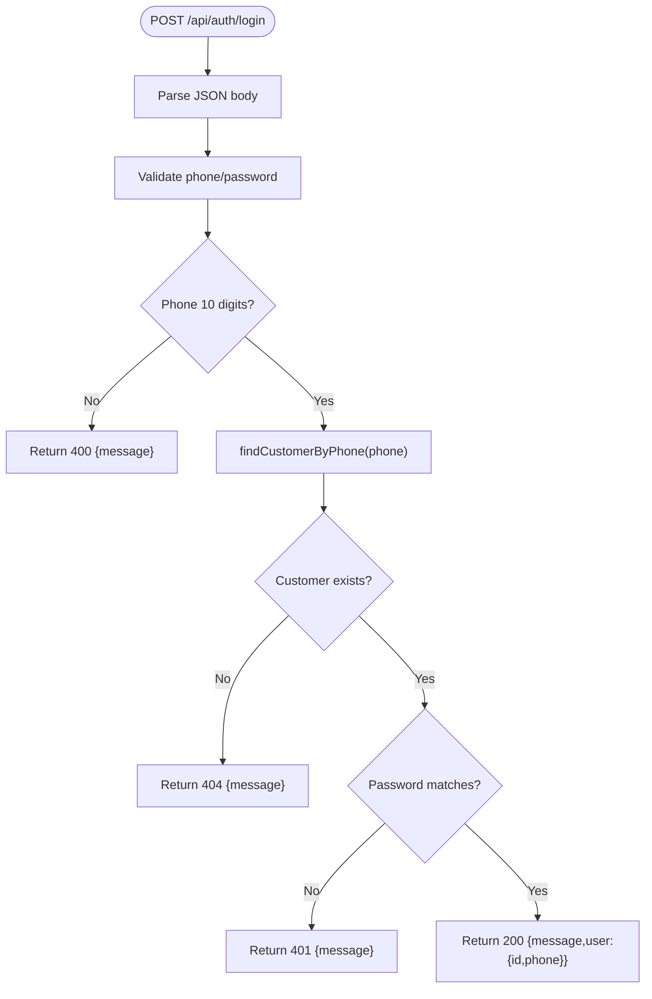
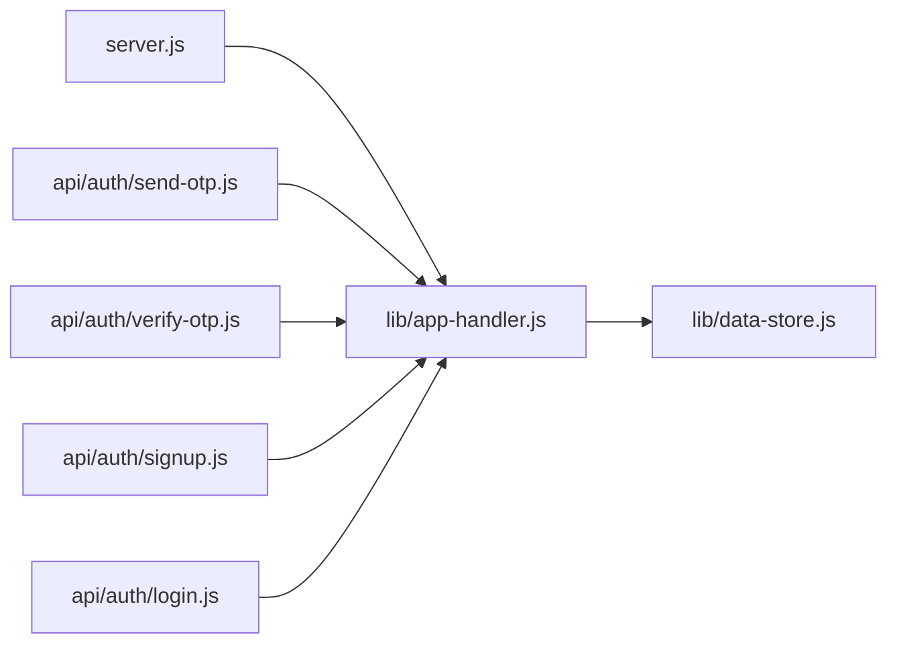

# Backend API Reference

<cite>
**Referenced Files in This Document**
- [server.js](file://server.js)
- [lib/app-handler.js](file://lib/app-handler.js)
- [lib/data-store.js](file://lib/data-store.js)
- [api/auth/send-otp.js](file://api/auth/send-otp.js)
- [api/auth/verify-otp.js](file://api/auth/verify-otp.js)
- [api/auth/signup.js](file://api/auth/signup.js)
- [api/auth/login.js](file://api/auth/login.js)
- [package.json](file://package.json)
- [script.js](file://script.js)
</cite>

## Table of Contents
1. [Introduction](#introduction)
2. [Project Structure](#project-structure)
3. [Core Components](#core-components)
4. [Architecture Overview](#architecture-overview)
5. [Detailed Component Analysis](#detailed-component-analysis)
6. [Dependency Analysis](#dependency-analysis)
7. [Performance Considerations](#performance-considerations)
8. [Troubleshooting Guide](#troubleshooting-guide)
9. [Conclusion](#conclusion)
10. [Appendices](#appendices)

## Introduction
This document provides comprehensive API documentation for the Night Foodies backend REST endpoints focused on authentication. It covers:
- OTP-based authentication flow: POST /api/auth/send-otp, POST /api/auth/verify-otp
- Customer account lifecycle: POST /api/auth/signup, POST /api/auth/login
- Request/response schemas, validation rules, error handling, and integration guidance
- Practical curl examples and code snippet references for frontend usage

The backend is a Node.js HTTP server that exposes serverless-style handlers for authentication routes and persists customer data using in-memory, file-based, or MySQL storage modes.

## Project Structure
The backend is organized around a small set of modules:
- server.js: HTTP server bootstrap and request routing
- lib/app-handler.js: Route dispatch, request parsing, JSON helpers, and authentication handlers
- lib/data-store.js: Storage abstraction (in-memory, file, MySQL) and OTP storage
- api/auth/*.js: Thin serverless handlers that delegate to app-handler
- Frontend integration via script.js for form submissions and client-side navigation

**Diagram sources**
- [server.js:1-35](file://server.js#L1-L35)
- [lib/app-handler.js:271-295](file://lib/app-handler.js#L271-L295)
- [lib/data-store.js:6-291](file://lib/data-store.js#L6-L291)
- [api/auth/send-otp.js:1-4](file://api/auth/send-otp.js#L1-L4)
- [api/auth/verify-otp.js:1-4](file://api/auth/verify-otp.js#L1-L4)
- [api/auth/signup.js:1-4](file://api/auth/signup.js#L1-L4)
- [api/auth/login.js:1-4](file://api/auth/login.js#L1-L4)

**Section sources**
- [server.js:1-35](file://server.js#L1-L35)
- [lib/app-handler.js:271-295](file://lib/app-handler.js#L271-L295)
- [lib/data-store.js:6-291](file://lib/data-store.js#L6-L291)
- [api/auth/send-otp.js:1-4](file://api/auth/send-otp.js#L1-L4)
- [api/auth/verify-otp.js:1-4](file://api/auth/verify-otp.js#L1-L4)
- [api/auth/signup.js:1-4](file://api/auth/signup.js#L1-L4)
- [api/auth/login.js:1-4](file://api/auth/login.js#L1-L4)

## Core Components
- HTTP Server: Creates an HTTP server, initializes the data store, and delegates requests to the dispatcher.
- Route Dispatcher: Matches incoming requests to authentication endpoints and invokes the appropriate handler.
- Authentication Handlers: Implement OTP generation/sending, OTP verification and login, customer signup, and customer login.
- Data Store: Provides a unified interface for customer CRUD and OTP storage across memory, file, and MySQL backends.

Key behaviors:
- All auth endpoints are POST.
- Requests must be JSON with Content-Type application/json.
- Validation errors return 400; authentication failures return 401; not found returns 404; duplicates return 409; internal errors return 500.

**Section sources**
- [server.js:7-32](file://server.js#L7-L32)
- [lib/app-handler.js:271-295](file://lib/app-handler.js#L271-L295)
- [lib/app-handler.js:98-170](file://lib/app-handler.js#L98-L170)
- [lib/app-handler.js:172-269](file://lib/app-handler.js#L172-L269)
- [lib/data-store.js:266-280](file://lib/data-store.js#L266-L280)

## Architecture Overview
The authentication flow is designed around OTP for new users and traditional credentials for returning users. The serverless-style handlers in api/auth/* simply wrap the shared dispatcher.

```mermaid
sequenceDiagram
participant Client as "Client"
participant Server as "HTTP Server"
participant Dispatcher as "Route Dispatcher"
participant Handler as "Auth Handler"
participant Store as "Data Store"
Client->>Server : POST /api/auth/send-otp {phone}
Server->>Dispatcher : handleApiRequest(path="/api/auth/send-otp")
Dispatcher->>Handler : handleSendOtp(req,res)
Handler->>Handler : validate phone
Handler->>Store : saveOtp(phone, otp, expiresAt)
Handler-->>Client : 200 {message, demoOtp, expiresInSeconds}
Client->>Server : POST /api/auth/verify-otp {phone,password,otp}
Server->>Dispatcher : handleApiRequest(path="/api/auth/verify-otp")
Dispatcher->>Handler : handleVerifyOtp(req,res)
Handler->>Handler : validate phone/password/otp
Handler->>Store : getOtp(phone)
alt OTP missing/expired
Handler-->>Client : 400 {message}
else OTP invalid
Handler-->>Client : 401 {message}
else OTP valid
Handler->>Store : clearOtp(phone)
Handler-->>Client : 200 {message,user : {phone}}
end
Client->>Server : POST /api/auth/signup {fullName,phone,email,address,password}
Server->>Dispatcher : handleApiRequest(path="/api/auth/signup")
Dispatcher->>Handler : handleSignup(req,res)
Handler->>Handler : validate inputs
Handler->>Store : createCustomer(...)
alt Duplicate phone
Handler-->>Client : 409 {message}
else Success
Handler-->>Client : 201 {message}
end
Client->>Server : POST /api/auth/login {phone,password}
Server->>Dispatcher : handleApiRequest(path="/api/auth/login")
Dispatcher->>Handler : handleLogin(req,res)
Handler->>Handler : validate inputs
Handler->>Store : findCustomerByPhone(phone)
alt Not found
Handler-->>Client : 404 {message}
else Password mismatch
Handler-->>Client : 401 {message}
else Success
Handler-->>Client : 200 {message,user : {id,phone}}
end
```

**Diagram sources**
- [lib/app-handler.js:271-295](file://lib/app-handler.js#L271-L295)
- [lib/app-handler.js:98-170](file://lib/app-handler.js#L98-L170)
- [lib/app-handler.js:172-269](file://lib/app-handler.js#L172-L269)
- [lib/data-store.js:216-264](file://lib/data-store.js#L216-L264)

## Detailed Component Analysis

### Endpoint: POST /api/auth/send-otp
- Purpose: Generate and persist an OTP for the given phone number and return a success response with metadata.
- Authentication: None required.
- Request body:
  - phone: string, required, must be exactly 10 digits
- Response:
  - 200 OK: { message, demoOtp, expiresInSeconds }
  - 400 Bad Request: { message } for invalid JSON or invalid phone
- Notes:
  - OTP validity is enforced by the handler.
  - The demoOtp field is included for development convenience.

**Diagram sources**
- [lib/app-handler.js:98-123](file://lib/app-handler.js#L98-L123)
- [lib/data-store.js:266-276](file://lib/data-store.js#L266-L276)

**Section sources**
- [lib/app-handler.js:98-123](file://lib/app-handler.js#L98-L123)
- [lib/data-store.js:266-276](file://lib/data-store.js#L266-L276)
- [api/auth/send-otp.js:1-4](file://api/auth/send-otp.js#L1-L4)

### Endpoint: POST /api/auth/verify-otp
- Purpose: Verify OTP for a phone number; on success, returns a user object indicating successful login.
- Authentication: None required.
- Request body:
  - phone: string, required, must be exactly 10 digits
  - password: string, required, minimum 4 characters
  - otp: string, required, must be exactly 6 digits
- Response:
  - 200 OK: { message, user: { phone } }
  - 400 Bad Request: { message } for invalid JSON, invalid phone, invalid OTP, or missing OTP
  - 401 Unauthorized: { message } for expired OTP or incorrect OTP
- Notes:
  - OTP must be present and unexpired.
  - On success, OTP is cleared.

**Diagram sources**
- [lib/app-handler.js:125-170](file://lib/app-handler.js#L125-L170)
- [lib/data-store.js:270-276](file://lib/data-store.js#L270-L276)

**Section sources**
- [lib/app-handler.js:125-170](file://lib/app-handler.js#L125-L170)
- [lib/data-store.js:270-276](file://lib/data-store.js#L270-L276)
- [api/auth/verify-otp.js:1-4](file://api/auth/verify-otp.js#L1-L4)

### Endpoint: POST /api/auth/signup
- Purpose: Create a new customer account.
- Authentication: None required.
- Request body:
  - fullName: string, required, minimum length 2
  - phone: string, required, must be exactly 10 digits
  - email: string, optional
  - address: string, optional
  - password: string, required, minimum length 4
- Response:
  - 201 Created: { message } (contextual message depending on storage mode)
  - 400 Bad Request: { message } for invalid JSON, missing/invalid fields
  - 409 Conflict: { message } if phone already exists
  - 500 Internal Server Error: { message } for unexpected errors
- Notes:
  - Storage mode affects the exact message returned.

**Diagram sources**
- [lib/app-handler.js:172-225](file://lib/app-handler.js#L172-L225)
- [lib/data-store.js:231-264](file://lib/data-store.js#L231-L264)

**Section sources**
- [lib/app-handler.js:172-225](file://lib/app-handler.js#L172-L225)
- [lib/data-store.js:231-264](file://lib/data-store.js#L231-L264)
- [api/auth/signup.js:1-4](file://api/auth/signup.js#L1-L4)

### Endpoint: POST /api/auth/login
- Purpose: Authenticate an existing customer using phone and password.
- Authentication: None required.
- Request body:
  - phone: string, required, must be exactly 10 digits
  - password: string, required
- Response:
  - 200 OK: { message, user: { id, phone } }
  - 400 Bad Request: { message } for invalid JSON or invalid phone
  - 401 Unauthorized: { message } for incorrect password
  - 404 Not Found: { message } if account does not exist
  - 500 Internal Server Error: { message } for unexpected errors
- Notes:
  - Password comparison is direct string equality.

**Diagram sources**
- [lib/app-handler.js:227-269](file://lib/app-handler.js#L227-L269)
- [lib/data-store.js:216-229](file://lib/data-store.js#L216-L229)

**Section sources**
- [lib/app-handler.js:227-269](file://lib/app-handler.js#L227-L269)
- [lib/data-store.js:216-229](file://lib/data-store.js#L216-L229)
- [api/auth/login.js:1-4](file://api/auth/login.js#L1-L4)

## Dependency Analysis
- server.js depends on lib/app-handler for request handling and initialization.
- lib/app-handler depends on lib/data-store for customer and OTP operations.
- api/auth/*.js depend on lib/app-handler to expose serverless-style handlers.

**Diagram sources**
- [server.js:3-3](file://server.js#L3-L3)
- [lib/app-handler.js:1-11](file://lib/app-handler.js#L1-L11)
- [lib/data-store.js:1-17](file://lib/data-store.js#L1-L17)
- [api/auth/send-otp.js:1-4](file://api/auth/send-otp.js#L1-L4)
- [api/auth/verify-otp.js:1-4](file://api/auth/verify-otp.js#L1-L4)
- [api/auth/signup.js:1-4](file://api/auth/signup.js#L1-L4)
- [api/auth/login.js:1-4](file://api/auth/login.js#L1-L4)

**Section sources**
- [server.js:3-3](file://server.js#L3-L3)
- [lib/app-handler.js:1-11](file://lib/app-handler.js#L1-L11)
- [lib/data-store.js:1-17](file://lib/data-store.js#L1-L17)
- [api/auth/send-otp.js:1-4](file://api/auth/send-otp.js#L1-L4)
- [api/auth/verify-otp.js:1-4](file://api/auth/verify-otp.js#L1-L4)
- [api/auth/signup.js:1-4](file://api/auth/signup.js#L1-L4)
- [api/auth/login.js:1-4](file://api/auth/login.js#L1-L4)

## Performance Considerations
- OTP validity window: 2 minutes. This reduces long-term state maintenance overhead.
- Storage modes:
  - In-memory: fastest for development; data resets between cold starts.
  - File-based: suitable for local deployments; writes occur on create/update.
  - MySQL: recommended for production; ensures persistence and scalability.
- Rate limiting: Not implemented in the current codebase. Consider adding rate limits for OTP generation and verification endpoints to prevent abuse.

[No sources needed since this section provides general guidance]

## Troubleshooting Guide
Common issues and resolutions:
- Invalid JSON body: Ensure Content-Type application/json and valid JSON payload.
- Phone number validation failures: Must be exactly 10 digits.
- OTP verification failures:
  - OTP not requested first: Request OTP before verifying.
  - Expired OTP: Request a new OTP.
  - Incorrect OTP: Re-enter the OTP shown in the demoOtp field during development.
- Duplicate phone on signup: Use a different phone number or log in instead.
- Login failures:
  - Account not found: Sign up first.
  - Incorrect password: Re-enter the password.

**Section sources**
- [lib/app-handler.js:30-54](file://lib/app-handler.js#L30-L54)
- [lib/app-handler.js:107-111](file://lib/app-handler.js#L107-L111)
- [lib/app-handler.js:136-149](file://lib/app-handler.js#L136-L149)
- [lib/app-handler.js:151-166](file://lib/app-handler.js#L151-L166)
- [lib/app-handler.js:188-191](file://lib/app-handler.js#L188-L191)
- [lib/app-handler.js:238-246](file://lib/app-handler.js#L238-L246)
- [lib/app-handler.js:249-259](file://lib/app-handler.js#L249-L259)

## Conclusion
The Night Foodies authentication API provides a straightforward OTP-first flow for new users and traditional login for existing users. The design emphasizes simplicity and clear error signaling. For production, configure MySQL via environment variables and consider implementing rate limiting and transport security.

[No sources needed since this section summarizes without analyzing specific files]

## Appendices

### Authentication Flow Summary
- New user flow:
  1) POST /api/auth/send-otp with phone
  2) Receive OTP (demoOtp) and expiry
  3) POST /api/auth/verify-otp with phone, password, otp
  4) On success, receive user object
- Returning user flow:
  1) POST /api/auth/login with phone, password
  2) On success, receive user object

**Section sources**
- [lib/app-handler.js:98-170](file://lib/app-handler.js#L98-L170)
- [lib/app-handler.js:227-269](file://lib/app-handler.js#L227-L269)

### Practical curl Examples
- Generate OTP:
  - curl -X POST http://localhost:3000/api/auth/send-otp -H "Content-Type: application/json" -d '{"phone":"1234567890"}'
- Verify OTP:
  - curl -X POST http://localhost:3000/api/auth/verify-otp -H "Content-Type: application/json" -d '{"phone":"1234567890","password":"pass","otp":"123456"}'
- Signup:
  - curl -X POST http://localhost:3000/api/auth/signup -H "Content-Type: application/json" -d '{"fullName":"John Doe","phone":"1234567890","email":"","address":"","password":"pass"}'
- Login:
  - curl -X POST http://localhost:3000/api/auth/login -H "Content-Type: application/json" -d '{"phone":"1234567890","password":"pass"}'

[No sources needed since this section provides general guidance]

### Frontend Integration Guidelines
- Use the shared postJson helper to submit requests to the auth endpoints.
- On successful login/signup, store the user’s phone identifier in localStorage under the key used by the app.
- Redirect users appropriately based on authentication state.

**Section sources**
- [script.js:87-120](file://script.js#L87-L120)
- [script.js:141-147](file://script.js#L141-L147)
- [script.js:177-185](file://script.js#L177-L185)

### Environment and Storage Configuration
- DB_DRIVER: memory, file/json, sqlite (treated as file), mysql
- DB_HOST, DB_USER, DB_NAME: required for MySQL
- CUSTOMERS_FILE: path to local JSON file for customer storage
- VERCEL: when set, forces in-memory mode for non-persistent environments

**Section sources**
- [lib/data-store.js:158-214](file://lib/data-store.js#L158-L214)
- [package.json:12-15](file://package.json#L12-L15)