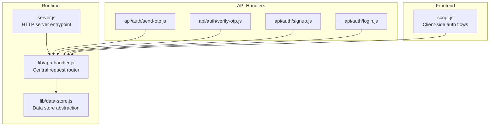
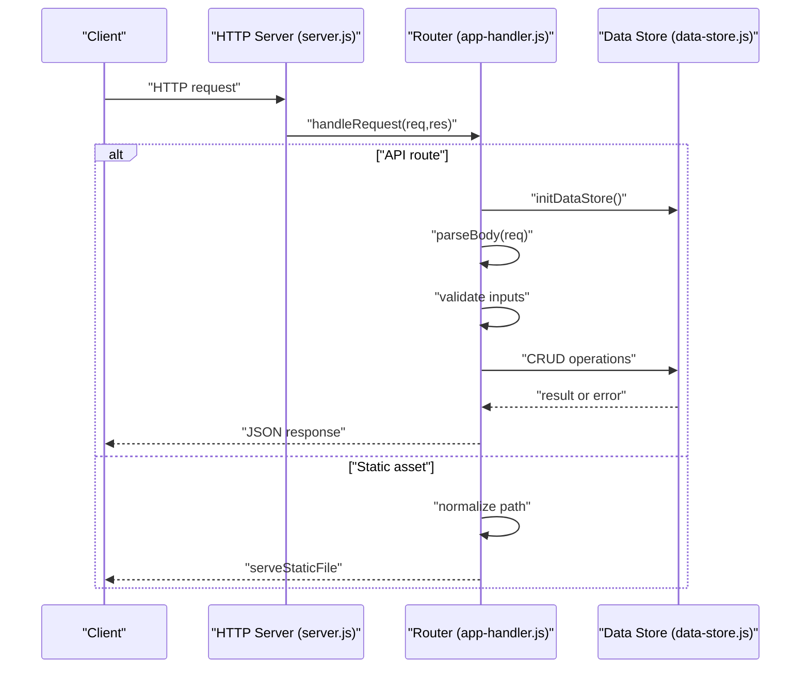
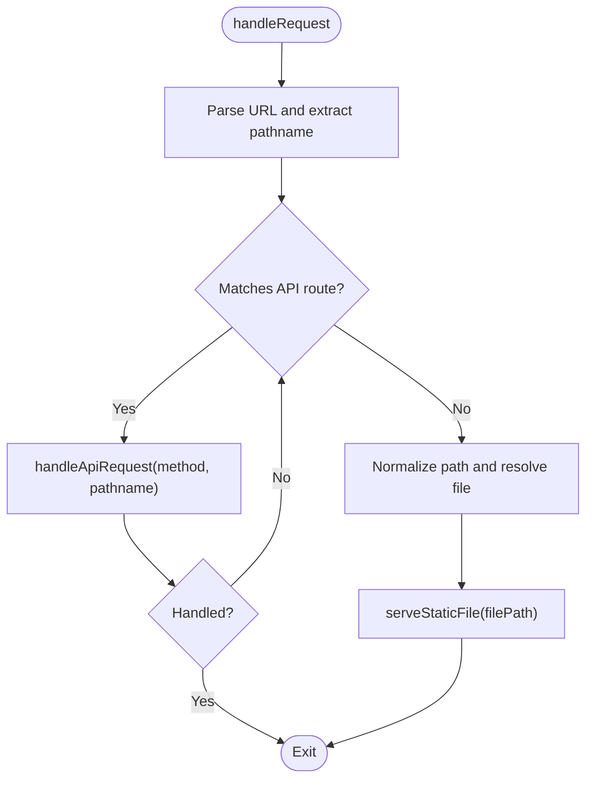
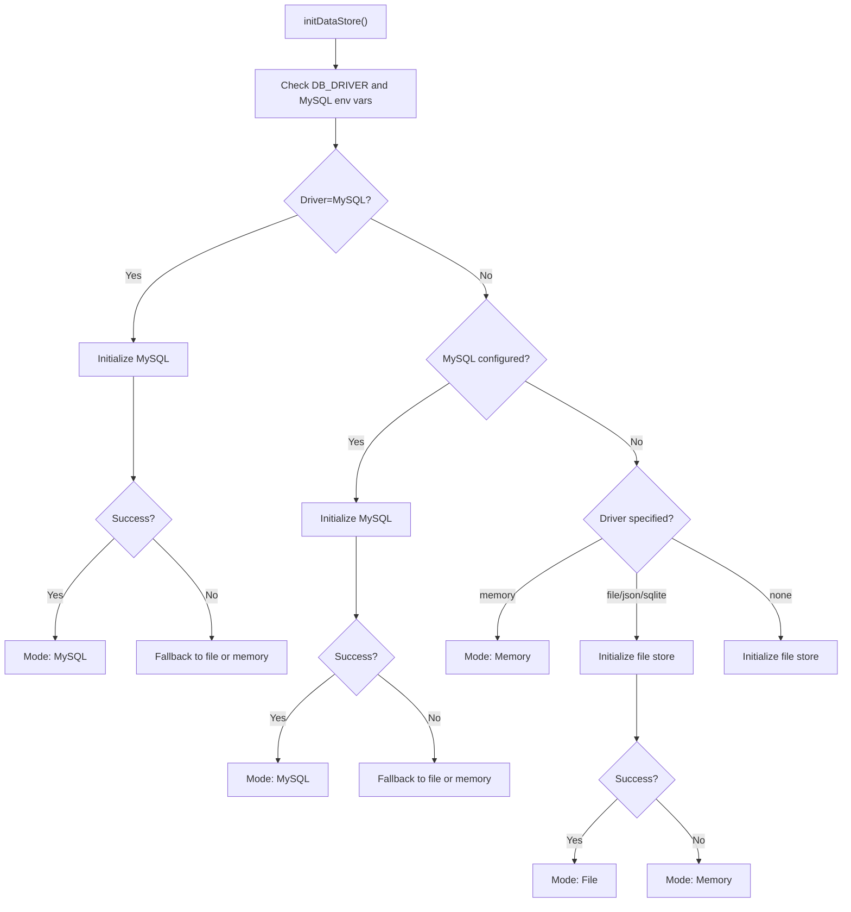
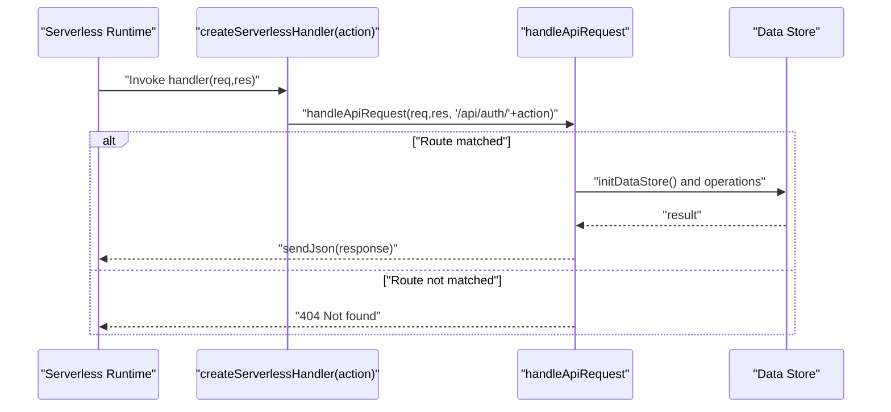
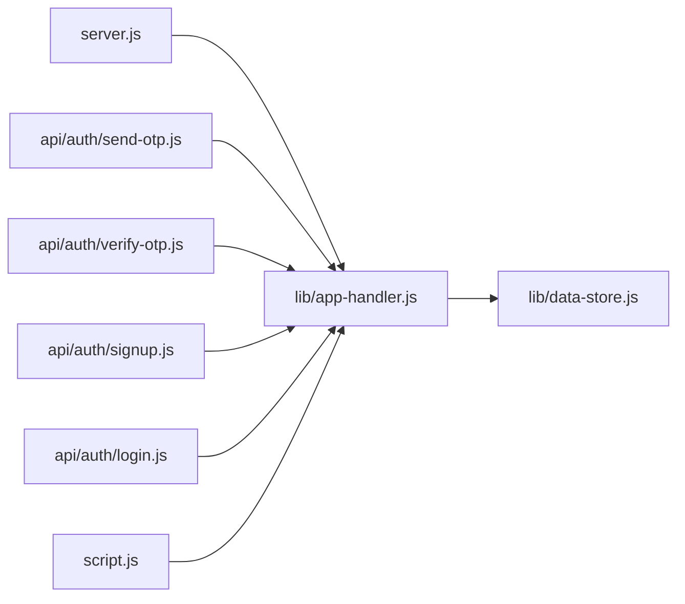

# Request/Response Handling

<cite>
**Referenced Files in This Document**
- [server.js](file://server.js)
- [lib/app-handler.js](file://lib/app-handler.js)
- [lib/data-store.js](file://lib/data-store.js)
- [api/auth/send-otp.js](file://api/auth/send-otp.js)
- [api/auth/verify-otp.js](file://api/auth/verify-otp.js)
- [api/auth/signup.js](file://api/auth/signup.js)
- [api/auth/login.js](file://api/auth/login.js)
- [script.js](file://script.js)
- [package.json](file://package.json)
</cite>

## Table of Contents
1. [Introduction](#introduction)
2. [Project Structure](#project-structure)
3. [Core Components](#core-components)
4. [Architecture Overview](#architecture-overview)
5. [Detailed Component Analysis](#detailed-component-analysis)
6. [Dependency Analysis](#dependency-analysis)
7. [Performance Considerations](#performance-considerations)
8. [Troubleshooting Guide](#troubleshooting-guide)
9. [Conclusion](#conclusion)
10. [Appendices](#appendices)

## Introduction
This document explains the Night Foodies request/response handling system. It focuses on the centralized request routing and processing implemented in the app-handler module, the serverless-compatible handler creation pattern, request parsing and validation, response formatting standards, error handling strategies, middleware pipeline, static file serving with security validation, and dynamic route resolution based on HTTP methods and URL patterns. It also covers the handler factory pattern for creating API endpoints, integration with the data store layer, extension guidance, performance considerations, logging strategies, and debugging techniques.

## Project Structure
The application is organized around a small set of modules:
- A server entrypoint that initializes the data store and creates an HTTP server.
- A central request handler that routes requests to API endpoints or serves static files.
- A data store abstraction that supports memory, file, and MySQL modes with graceful fallbacks.
- Serverless-style API handlers that wrap the central handler for Vercel-style deployments.
- Frontend scripts that issue authenticated API calls to the backend.

**Diagram sources**
- [server.js:1-35](file://server.js#L1-L35)
- [lib/app-handler.js:1-332](file://lib/app-handler.js#L1-L332)
- [lib/data-store.js:1-291](file://lib/data-store.js#L1-L291)
- [api/auth/send-otp.js:1-7](file://api/auth/send-otp.js#L1-L7)
- [api/auth/verify-otp.js:1-7](file://api/auth/verify-otp.js#L1-L7)
- [api/auth/signup.js:1-7](file://api/auth/signup.js#L1-L7)
- [api/auth/login.js:1-7](file://api/auth/login.js#L1-L7)
- [script.js:1-450](file://script.js#L1-L450)

**Section sources**
- [server.js:1-35](file://server.js#L1-L35)
- [lib/app-handler.js:1-332](file://lib/app-handler.js#L1-L332)
- [lib/data-store.js:1-291](file://lib/data-store.js#L1-L291)
- [api/auth/send-otp.js:1-7](file://api/auth/send-otp.js#L1-L7)
- [api/auth/verify-otp.js:1-7](file://api/auth/verify-otp.js#L1-L7)
- [api/auth/signup.js:1-7](file://api/auth/signup.js#L1-L7)
- [api/auth/login.js:1-7](file://api/auth/login.js#L1-L7)
- [script.js:1-450](file://script.js#L1-L450)

## Core Components
- Central request router and processor: Implements dynamic route resolution by HTTP method and pathname, request parsing/validation, response formatting, and static file serving with security checks.
- Data store abstraction: Provides initialization and fallback logic for memory, file, and MySQL modes, plus CRUD operations for customers and OTP.
- Serverless handler factory: Creates serverless-compatible handlers for Vercel-style deployments.
- API endpoints: Thin wrappers that delegate to the central handler with a fixed route path.
- Frontend client: Issues authenticated POST requests to the API endpoints.

Key responsibilities:
- Route resolution: POST /api/auth/* endpoints mapped to specific handlers.
- Request parsing: Body parsing with JSON validation and error propagation.
- Validation: Phone number, password, OTP, and content-type checks.
- Response formatting: JSON responses with standardized status codes.
- Static serving: Safe file serving with normalization and content-type detection.
- Error handling: Centralized try/catch with JSON error payloads.

**Section sources**
- [lib/app-handler.js:23-332](file://lib/app-handler.js#L23-L332)
- [lib/data-store.js:158-291](file://lib/data-store.js#L158-L291)
- [api/auth/send-otp.js:1-7](file://api/auth/send-otp.js#L1-L7)
- [api/auth/verify-otp.js:1-7](file://api/auth/verify-otp.js#L1-L7)
- [api/auth/signup.js:1-7](file://api/auth/signup.js#L1-L7)
- [api/auth/login.js:1-7](file://api/auth/login.js#L1-L7)
- [script.js:87-120](file://script.js#L87-L120)

## Architecture Overview
The runtime architecture combines a traditional Node.js HTTP server with a serverless-compatible handler pattern. Requests are routed centrally, validated, processed against the data store, and responded to with JSON. Static assets are served securely from the filesystem.

**Diagram sources**
- [server.js:7-35](file://server.js#L7-L35)
- [lib/app-handler.js:297-309](file://lib/app-handler.js#L297-L309)
- [lib/data-store.js:158-214](file://lib/data-store.js#L158-L214)

## Detailed Component Analysis

### Central Request Router and Processor
Responsibilities:
- Dynamic route resolution: Matches HTTP method and pathname to specific handlers.
- Request parsing: Reads and parses request bodies with robust error handling.
- Validation: Validates phone numbers, passwords, OTP, and payload presence.
- Response formatting: Standardized JSON responses with appropriate status codes.
- Static file serving: Securely resolves and serves static assets with content-type detection.
- Error handling: Centralized try/catch with JSON error payloads.

Key functions and flows:
- Route resolution: Uses method and pathname to dispatch to handlers for OTP sending, OTP verification, signup, and login.
- Body parsing: Streams request body, validates JSON, and handles errors.
- Validation: Phone regex, password length, OTP format, and existence checks.
- Response formatting: sendJson sets Content-Type and serializes payloads.
- Static serving: Path normalization prevents directory traversal; content-type derived from extension.

**Diagram sources**
- [lib/app-handler.js:297-309](file://lib/app-handler.js#L297-L309)

**Section sources**
- [lib/app-handler.js:23-332](file://lib/app-handler.js#L23-L332)

### Data Store Abstraction
Responsibilities:
- Initialization and fallback: Supports memory, file, and MySQL modes with graceful fallbacks.
- Customer operations: Find by phone, create customer, and persistence to selected backend.
- OTP operations: Save, retrieve, and clear OTP with expiration.
- Environment-driven selection: Chooses backend based on environment variables and platform constraints.

Initialization logic:
- Explicit driver selection via environment variables.
- MySQL initialization with database creation and table setup.
- File storage initialization with JSON file persistence.
- Memory fallback for development and serverless environments.
- Platform-aware behavior for Vercel deployments.

**Diagram sources**
- [lib/data-store.js:158-214](file://lib/data-store.js#L158-L214)

**Section sources**
- [lib/data-store.js:158-291](file://lib/data-store.js#L158-L291)

### Serverless-Compatible Handler Factory
Pattern:
- createServerlessHandler(action): Builds a handler that maps to a fixed route path (/api/auth/{action}).
- Delegates to handleApiRequest with the fixed route path.
- Wraps execution in try/catch to return JSON error responses.

Usage:
- Each API endpoint file exports a handler created via createServerlessHandler with the action name.

**Diagram sources**
- [lib/app-handler.js:311-325](file://lib/app-handler.js#L311-L325)
- [api/auth/send-otp.js:1-7](file://api/auth/send-otp.js#L1-L7)
- [api/auth/verify-otp.js:1-7](file://api/auth/verify-otp.js#L1-L7)
- [api/auth/signup.js:1-7](file://api/auth/signup.js#L1-L7)
- [api/auth/login.js:1-7](file://api/auth/login.js#L1-L7)

**Section sources**
- [lib/app-handler.js:311-325](file://lib/app-handler.js#L311-L325)
- [api/auth/send-otp.js:1-7](file://api/auth/send-otp.js#L1-L7)
- [api/auth/verify-otp.js:1-7](file://api/auth/verify-otp.js#L1-L7)
- [api/auth/signup.js:1-7](file://api/auth/signup.js#L1-L7)
- [api/auth/login.js:1-7](file://api/auth/login.js#L1-L7)

### API Endpoints and Client Integration
- API endpoints: Each endpoint file exports a handler created via createServerlessHandler with the action name.
- Client integration: The frontend script posts JSON payloads to the API endpoints (/api/auth/*) and handles responses or errors.

Examples of client-side request/response handling:
- Authentication flows: The client posts credentials to /api/auth/login and stores user session locally.
- Account creation: The client posts customer details to /api/auth/signup and redirects on success.
- Error propagation: The client reads JSON messages from the server and displays user-friendly messages.

**Section sources**
- [api/auth/send-otp.js:1-7](file://api/auth/send-otp.js#L1-L7)
- [api/auth/verify-otp.js:1-7](file://api/auth/verify-otp.js#L1-L7)
- [api/auth/signup.js:1-7](file://api/auth/signup.js#L1-L7)
- [api/auth/login.js:1-7](file://api/auth/login.js#L1-L7)
- [script.js:122-186](file://script.js#L122-L186)

## Dependency Analysis
- server.js depends on app-handler for request handling and data store initialization.
- app-handler depends on data-store for database operations and OTP management.
- API endpoint files depend on app-handler for handler creation.
- Frontend script depends on app-handler’s API endpoints for authentication and account management.

**Diagram sources**
- [server.js:1-35](file://server.js#L1-L35)
- [lib/app-handler.js:1-332](file://lib/app-handler.js#L1-L332)
- [lib/data-store.js:1-291](file://lib/data-store.js#L1-L291)
- [api/auth/send-otp.js:1-7](file://api/auth/send-otp.js#L1-L7)
- [api/auth/verify-otp.js:1-7](file://api/auth/verify-otp.js#L1-L7)
- [api/auth/signup.js:1-7](file://api/auth/signup.js#L1-L7)
- [api/auth/login.js:1-7](file://api/auth/login.js#L1-L7)
- [script.js:1-450](file://script.js#L1-L450)

**Section sources**
- [server.js:1-35](file://server.js#L1-L35)
- [lib/app-handler.js:1-332](file://lib/app-handler.js#L1-L332)
- [lib/data-store.js:1-291](file://lib/data-store.js#L1-L291)
- [api/auth/send-otp.js:1-7](file://api/auth/send-otp.js#L1-L7)
- [api/auth/verify-otp.js:1-7](file://api/auth/verify-otp.js#L1-L7)
- [api/auth/signup.js:1-7](file://api/auth/signup.js#L1-L7)
- [api/auth/login.js:1-7](file://api/auth/login.js#L1-L7)
- [script.js:1-450](file://script.js#L1-L450)

## Performance Considerations
- Initialization caching: The data store initialization promise avoids repeated initialization across requests.
- Minimal parsing overhead: Body parsing streams chunks and only parses when needed.
- Static serving: Direct file reads with content-type detection; consider adding caching headers for production.
- Network efficiency: Client-side JSON payloads reduce overhead; ensure payloads are minimal.
- Storage modes: Memory mode is fastest but ephemeral; file mode persists across restarts; MySQL mode scales for production.

[No sources needed since this section provides general guidance]

## Troubleshooting Guide
Common issues and resolutions:
- Invalid JSON body: The parser rejects malformed JSON and returns a 400 error with a descriptive message.
- Missing or invalid phone/password/OTP: Validation functions return 400/401 errors with clear messages.
- OTP expiration or mismatch: OTP verification returns 400/401 errors; expired OTPs are cleared automatically.
- Duplicate phone during signup: Returns 409 with a conflict message.
- Internal server errors: Unhandled exceptions log an error and return a 500 JSON response.
- Static file not found: Returns 404 with a plain text message; server errors return 500.

Debugging techniques:
- Enable logging: The server logs startup and error messages; data store logs mode changes.
- Inspect environment variables: Verify DB_DRIVER, DB_HOST, DB_USER, DB_NAME, CUSTOMERS_FILE, and VERCEL.
- Test endpoints: Use curl or Postman to POST to /api/auth/* with JSON payloads.
- Client-side error handling: The frontend script surfaces server messages to users.

**Section sources**
- [lib/app-handler.js:23-54](file://lib/app-handler.js#L23-L54)
- [lib/app-handler.js:98-170](file://lib/app-handler.js#L98-L170)
- [lib/app-handler.js:172-225](file://lib/app-handler.js#L172-L225)
- [lib/app-handler.js:227-269](file://lib/app-handler.js#L227-L269)
- [lib/data-store.js:231-264](file://lib/data-store.js#L231-L264)
- [server.js:14-18](file://server.js#L14-L18)
- [script.js:87-120](file://script.js#L87-L120)

## Conclusion
The Night Foodies request/response handling system centers on a clean, modular architecture:
- A single router handles dynamic routing, parsing, validation, response formatting, and static serving.
- A flexible data store abstraction supports multiple backends with graceful fallbacks.
- Serverless-compatible handlers enable easy deployment on platforms like Vercel.
- The client integrates seamlessly with the API endpoints for authentication and account management.

This design balances simplicity, scalability, and portability while maintaining clear error handling and predictable behavior.

[No sources needed since this section summarizes without analyzing specific files]

## Appendices

### Request/Response Handling Reference
- Request parsing and validation:
  - Body parsing with JSON validation and error propagation.
  - Phone number, password, and OTP validation.
- Response formatting:
  - JSON responses with appropriate status codes.
  - Content-Type headers set per file extension for static assets.
- Error handling:
  - Centralized try/catch with JSON error payloads.
  - Specific status codes for validation failures and conflicts.

**Section sources**
- [lib/app-handler.js:30-54](file://lib/app-handler.js#L30-L54)
- [lib/app-handler.js:98-170](file://lib/app-handler.js#L98-L170)
- [lib/app-handler.js:172-225](file://lib/app-handler.js#L172-L225)
- [lib/app-handler.js:227-269](file://lib/app-handler.js#L227-L269)
- [lib/app-handler.js:23-28](file://lib/app-handler.js#L23-L28)
- [lib/app-handler.js:56-96](file://lib/app-handler.js#L56-L96)

### Extending the System
- Adding a new API endpoint:
  - Create a new handler file under api/auth/<action>.js that exports createServerlessHandler("<action>").
  - Add a new route case in handleApiRequest for the new method and pathname.
  - Implement a dedicated handler function with request parsing, validation, and response formatting.
- Adding custom middleware:
  - Insert pre-processing steps in handleRequest or handleApiRequest before invoking the specific handler.
  - Ensure middleware preserves request/response semantics and propagates errors consistently.
- Integrating with the data store:
  - Use initDataStore to initialize the store before operations.
  - Implement CRUD operations using the exported functions from data-store.js.

**Section sources**
- [api/auth/send-otp.js:1-7](file://api/auth/send-otp.js#L1-L7)
- [api/auth/verify-otp.js:1-7](file://api/auth/verify-otp.js#L1-L7)
- [api/auth/signup.js:1-7](file://api/auth/signup.js#L1-L7)
- [api/auth/login.js:1-7](file://api/auth/login.js#L1-L7)
- [lib/app-handler.js:271-295](file://lib/app-handler.js#L271-L295)
- [lib/data-store.js:158-291](file://lib/data-store.js#L158-L291)

### Environment and Deployment Notes
- Dependencies: dotenv and mysql2 are required for environment configuration and MySQL connectivity.
- Port configuration: The server listens on the PORT environment variable or defaults to 3000.
- Serverless deployment: The handler factory pattern enables Vercel-style serverless endpoints.

**Section sources**
- [package.json:13-16](file://package.json#L13-L16)
- [server.js:5](file://server.js#L5)
- [lib/app-handler.js:311-325](file://lib/app-handler.js#L311-L325)