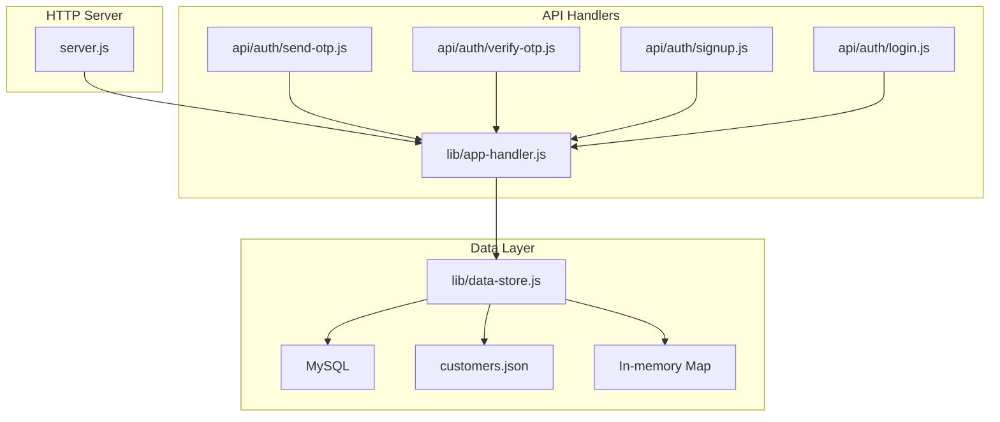
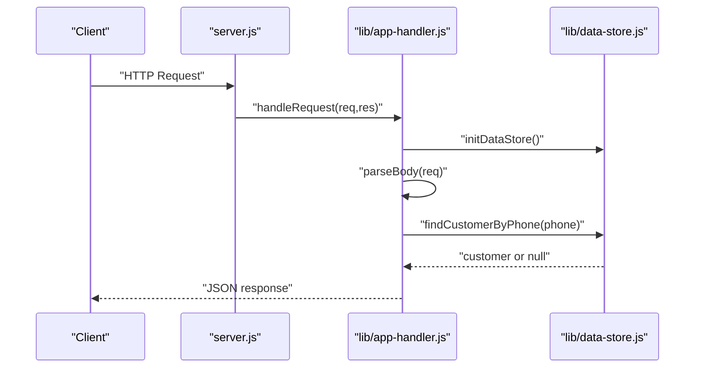
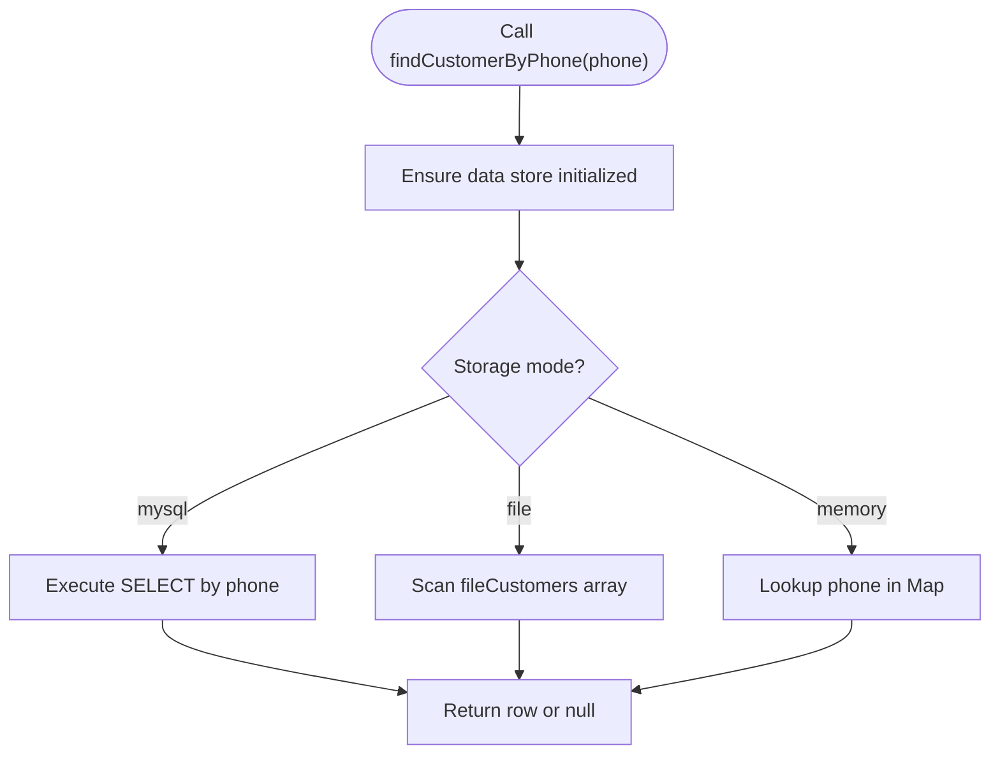
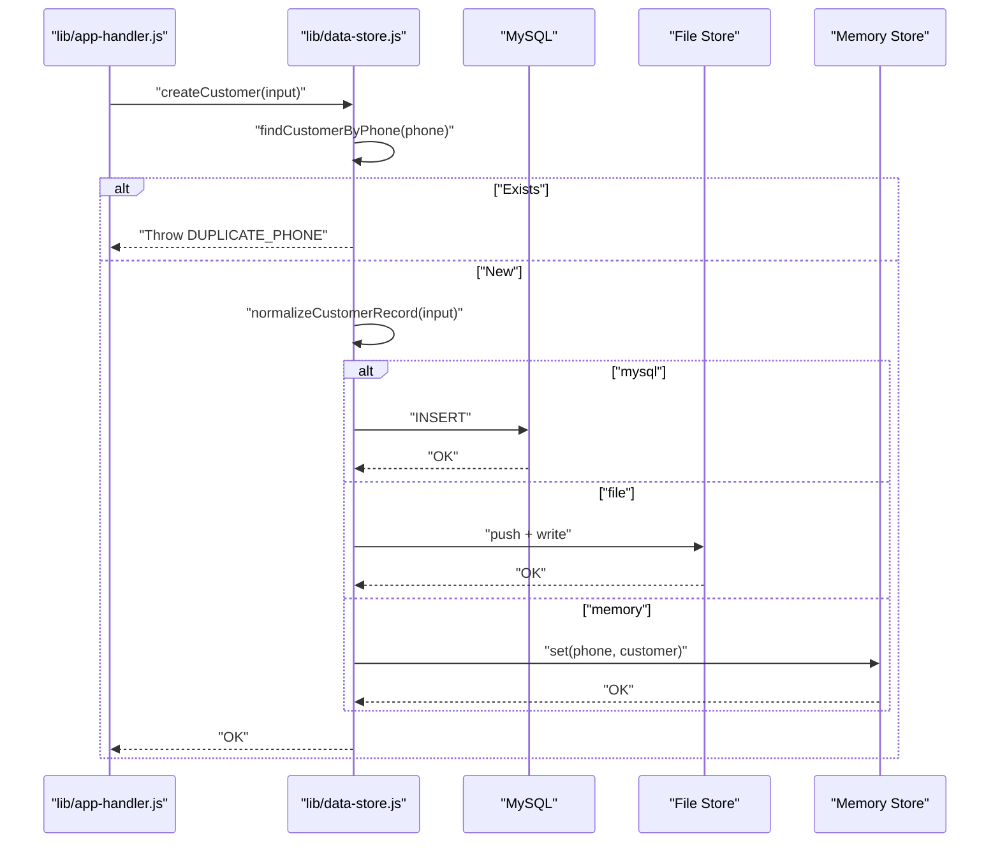
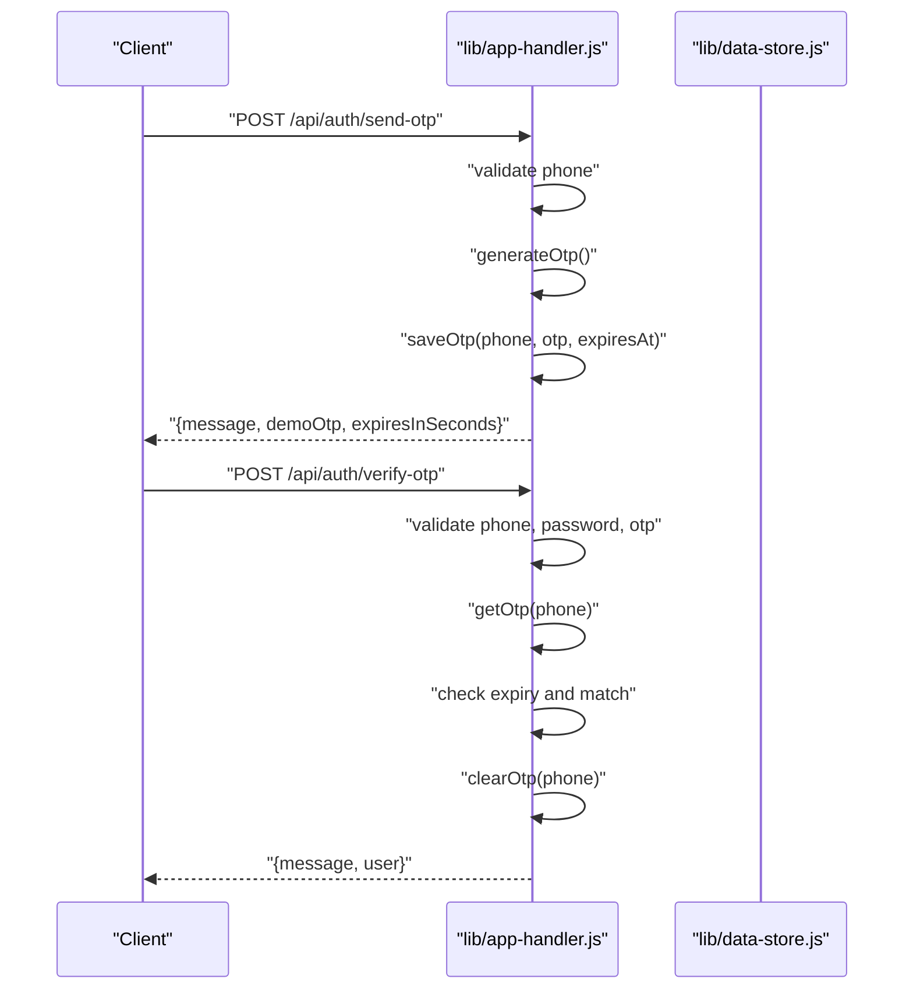
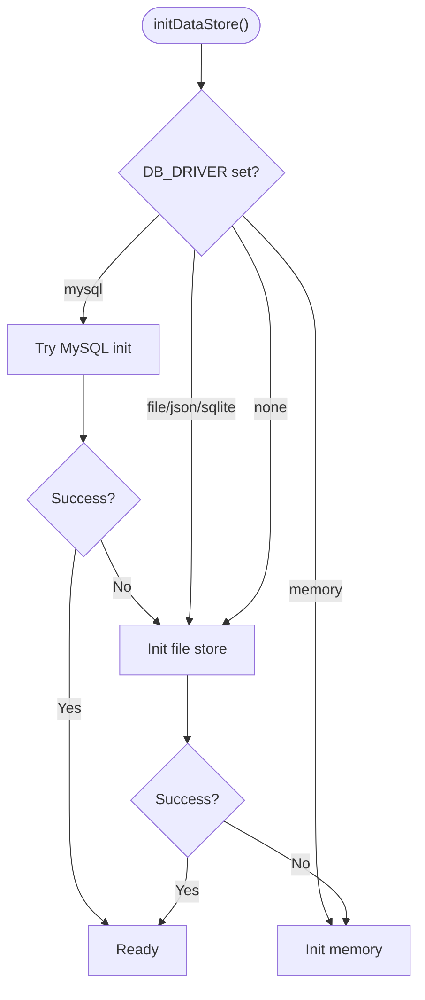
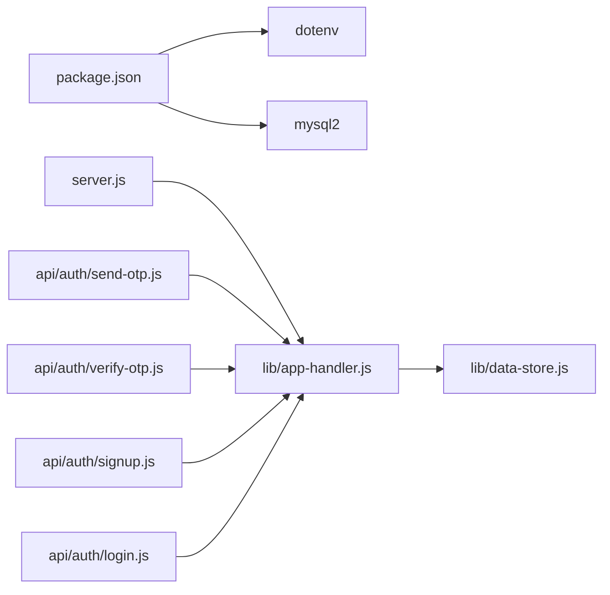

# Customer Data Management

<cite>
**Referenced Files in This Document**
- [server.js](file://server.js)
- [lib/app-handler.js](file://lib/app-handler.js)
- [lib/data-store.js](file://lib/data-store.js)
- [api/auth/signup.js](file://api/auth/signup.js)
- [api/auth/login.js](file://api/auth/login.js)
- [api/auth/send-otp.js](file://api/auth/send-otp.js)
- [api/auth/verify-otp.js](file://api/auth/verify-otp.js)
- [customers.json](file://customers.json)
- [package.json](file://package.json)
</cite>

## Table of Contents
1. [Introduction](#introduction)
2. [Project Structure](#project-structure)
3. [Core Components](#core-components)
4. [Architecture Overview](#architecture-overview)
5. [Detailed Component Analysis](#detailed-component-analysis)
6. [Dependency Analysis](#dependency-analysis)
7. [Performance Considerations](#performance-considerations)
8. [Troubleshooting Guide](#troubleshooting-guide)
9. [Conclusion](#conclusion)
10. [Appendices](#appendices)

## Introduction
This document describes the customer data management system for Night Foodies. It covers the customer data model, normalization and validation rules, CRUD operations, storage backends, authentication integration, and operational considerations such as migrations, backups, and performance.

## Project Structure
The application is a Node.js HTTP server with a small set of API routes for authentication and static asset serving. Customer data is persisted through pluggable storage backends: MySQL, local JSON file, or in-memory Map.

**Diagram sources**
- [server.js:1-35](file://server.js#L1-L35)
- [lib/app-handler.js:1-332](file://lib/app-handler.js#L1-L332)
- [lib/data-store.js:1-291](file://lib/data-store.js#L1-L291)
- [api/auth/send-otp.js:1-7](file://api/auth/send-otp.js#L1-L7)
- [api/auth/verify-otp.js:1-7](file://api/auth/verify-otp.js#L1-L7)
- [api/auth/signup.js:1-7](file://api/auth/signup.js#L1-L7)
- [api/auth/login.js:1-7](file://api/auth/login.js#L1-L7)

**Section sources**
- [server.js:1-35](file://server.js#L1-L35)
- [lib/app-handler.js:1-332](file://lib/app-handler.js#L1-L332)
- [lib/data-store.js:1-291](file://lib/data-store.js#L1-L291)
- [api/auth/send-otp.js:1-7](file://api/auth/send-otp.js#L1-L7)
- [api/auth/verify-otp.js:1-7](file://api/auth/verify-otp.js#L1-L7)
- [api/auth/signup.js:1-7](file://api/auth/signup.js#L1-L7)
- [api/auth/login.js:1-7](file://api/auth/login.js#L1-L7)

## Core Components
- Customer data model fields: id, fullName, phone, email, address, password, createdAt.
- Normalization function ensures consistent types and trimming.
- Validation rules enforce phone length, password length, and OTP format.
- CRUD operations:
  - findCustomerByPhone: lookup by phone across backends.
  - createCustomer: insert new customer with duplicate phone prevention.
- Storage backends:
  - MySQL: primary persistent backend with unique constraint on phone.
  - File: local JSON file with automatic persistence.
  - Memory: in-memory Map for ephemeral testing or serverless environments.

**Section sources**
- [lib/data-store.js:34-44](file://lib/data-store.js#L34-L44)
- [lib/data-store.js:216-229](file://lib/data-store.js#L216-L229)
- [lib/data-store.js:231-264](file://lib/data-store.js#L231-L264)
- [lib/data-store.js:86-97](file://lib/data-store.js#L86-L97)
- [lib/data-store.js:103-110](file://lib/data-store.js#L103-L110)
- [lib/data-store.js:68-101](file://lib/data-store.js#L68-L101)
- [lib/data-store.js:112-123](file://lib/data-store.js#L112-L123)
- [lib/data-store.js:125-129](file://lib/data-store.js#L125-L129)

## Architecture Overview
The system initializes the data store based on environment configuration and runtime conditions. Requests are routed to handlers that validate inputs, call data-layer functions, and return structured JSON responses.

**Diagram sources**
- [server.js:7-32](file://server.js#L7-L32)
- [lib/app-handler.js:297-309](file://lib/app-handler.js#L297-L309)
- [lib/app-handler.js:30-54](file://lib/app-handler.js#L30-L54)
- [lib/data-store.js:216-229](file://lib/data-store.js#L216-L229)

## Detailed Component Analysis

### Customer Data Model
- Fields: id, fullName, phone, email, address, password, createdAt.
- Types: All stored as strings; normalization converts inputs to strings and trims whitespace.
- Constraints:
  - phone is unique (MySQL unique index).
  - fullName minimum length enforced by handler.
  - password minimum length enforced by handler.
  - phone length enforced by handler.
  - OTP format enforced by handler.

**Section sources**
- [lib/data-store.js:34-44](file://lib/data-store.js#L34-L44)
- [lib/data-store.js:86-97](file://lib/data-store.js#L86-L97)
- [lib/app-handler.js:15-17](file://lib/app-handler.js#L15-L17)
- [lib/app-handler.js:183-196](file://lib/app-handler.js#L183-L196)
- [lib/app-handler.js:243-246](file://lib/app-handler.js#L243-L246)
- [lib/app-handler.js:146-149](file://lib/app-handler.js#L146-L149)

### Normalization and Type Conversion
- normalizeCustomerRecord enforces:
  - id: string, auto-generated if missing.
  - fullName, phone, email, address: trimmed strings.
  - password: string.
  - createdAt: ISO string.
- This ensures consistent representation across backends.

**Section sources**
- [lib/data-store.js:34-44](file://lib/data-store.js#L34-L44)

### Validation Rules
- Phone: 10 digits regex.
- Password: minimum 4 characters.
- OTP: exactly 6 digits.
- Full name: minimum 2 characters.

**Section sources**
- [lib/app-handler.js:15-17](file://lib/app-handler.js#L15-L17)
- [lib/app-handler.js:183-196](file://lib/app-handler.js#L183-L196)
- [lib/app-handler.js:243-246](file://lib/app-handler.js#L243-L246)
- [lib/app-handler.js:146-149](file://lib/app-handler.js#L146-L149)

### CRUD Operations

#### findCustomerByPhone
- Purpose: Retrieve customer by phone number.
- Backends:
  - MySQL: SELECT with LIMIT 1.
  - File: linear scan of array.
  - Memory: Map lookup by phone.
- Complexity:
  - MySQL: O(1) average due to unique index on phone.
  - File: O(n).
  - Memory: O(1).

**Diagram sources**
- [lib/data-store.js:216-229](file://lib/data-store.js#L216-L229)

**Section sources**
- [lib/data-store.js:216-229](file://lib/data-store.js#L216-L229)

#### createCustomer
- Purpose: Insert a new customer.
- Steps:
  - Check for existing customer by phone.
  - Normalize input.
  - Persist to selected backend.
- Duplicate phone prevention:
  - Pre-check via findCustomerByPhone.
  - MySQL unique constraint prevents duplicates.
- Error handling:
  - Throws DUPLICATE_PHONE error for duplicate phone.

**Diagram sources**
- [lib/data-store.js:231-264](file://lib/data-store.js#L231-L264)
- [lib/data-store.js:216-229](file://lib/data-store.js#L216-L229)
- [lib/data-store.js:103-110](file://lib/data-store.js#L103-L110)
- [lib/data-store.js:86-97](file://lib/data-store.js#L86-L97)

**Section sources**
- [lib/data-store.js:231-264](file://lib/data-store.js#L231-L264)
- [lib/data-store.js:216-229](file://lib/data-store.js#L216-L229)
- [lib/data-store.js:103-110](file://lib/data-store.js#L103-L110)
- [lib/data-store.js:86-97](file://lib/data-store.js#L86-L97)

### Authentication Integration
- OTP-based login flow:
  - Send OTP: validates phone, generates 6-digit OTP, stores expiry.
  - Verify OTP: validates OTP format, checks expiry, compares OTP, clears OTP on success.
- Signup flow:
  - Validates inputs, normalizes customer, persists via createCustomer.
- Login flow:
  - Validates phone and password, retrieves customer by phone, compares password.

**Diagram sources**
- [lib/app-handler.js:98-123](file://lib/app-handler.js#L98-L123)
- [lib/app-handler.js:125-170](file://lib/app-handler.js#L125-L170)

**Section sources**
- [lib/app-handler.js:98-123](file://lib/app-handler.js#L98-L123)
- [lib/app-handler.js:125-170](file://lib/app-handler.js#L125-L170)
- [lib/app-handler.js:172-225](file://lib/app-handler.js#L172-L225)
- [lib/app-handler.js:227-269](file://lib/app-handler.js#L227-L269)

### Data Consistency Guarantees
- MySQL:
  - Unique index on phone prevents duplicates.
  - Transactions and connection pooling ensure ACID-like behavior for inserts.
- File:
  - Atomic write after append to fileCustomers.
  - No concurrent writer protection; use only for development or single-writer scenarios.
- Memory:
  - Ephemeral across restarts; suitable for testing or serverless environments.

**Section sources**
- [lib/data-store.js:86-97](file://lib/data-store.js#L86-L97)
- [lib/data-store.js:103-110](file://lib/data-store.js#L103-L110)
- [lib/data-store.js:125-129](file://lib/data-store.js#L125-L129)

### Storage Backend Selection and Fallbacks
- Environment-driven selection:
  - DB_DRIVER=mysql: initialize MySQL.
  - DB_DRIVER=file/json/sqlite/memory: initialize file/memory fallbacks.
  - Vercel deployments: force memory fallback due to lack of persistent filesystem.
- Initialization order:
  - Try MySQL; on failure, fall back to file; on file failure, fall back to memory.

**Diagram sources**
- [lib/data-store.js:158-214](file://lib/data-store.js#L158-L214)

**Section sources**
- [lib/data-store.js:158-214](file://lib/data-store.js#L158-L214)

### Data Access Patterns and Query Optimization
- Prefer phone-based lookups for customer retrieval.
- MySQL:
  - Unique index on phone enables O(1) lookup.
  - Use prepared statements for repeated queries.
- File:
  - Linear scan; consider caching frequently accessed phones in memory for development.
- Memory:
  - Ideal for ephemeral caches; not for persistence.

**Section sources**
- [lib/data-store.js:216-229](file://lib/data-store.js#L216-L229)
- [lib/data-store.js:86-97](file://lib/data-store.js#L86-L97)

### Integration with Authentication Flows
- OTP lifecycle:
  - send-otp validates phone and generates OTP.
  - verify-otp validates OTP, expiry, and phone.
  - On success, login flow authenticates against stored customer credentials.
- Signup:
  - Validates inputs, normalizes, and persists customer.
  - Returns environment-appropriate success message.

**Section sources**
- [api/auth/send-otp.js:1-7](file://api/auth/send-otp.js#L1-L7)
- [api/auth/verify-otp.js:1-7](file://api/auth/verify-otp.js#L1-L7)
- [api/auth/signup.js:1-7](file://api/auth/signup.js#L1-L7)
- [api/auth/login.js:1-7](file://api/auth/login.js#L1-L7)
- [lib/app-handler.js:98-123](file://lib/app-handler.js#L98-L123)
- [lib/app-handler.js:125-170](file://lib/app-handler.js#L125-L170)
- [lib/app-handler.js:172-225](file://lib/app-handler.js#L172-L225)
- [lib/app-handler.js:227-269](file://lib/app-handler.js#L227-L269)

## Dependency Analysis
- Runtime dependencies:
  - dotenv: loads environment variables.
  - mysql2: MySQL driver and promise-based pool.
- Application dependencies:
  - server.js depends on app-handler.
  - app-handler depends on data-store.
  - API serverless handlers depend on app-handler.

**Diagram sources**
- [package.json:13-16](file://package.json#L13-L16)
- [server.js:1-3](file://server.js#L1-L3)
- [lib/app-handler.js:1-11](file://lib/app-handler.js#L1-L11)
- [lib/data-store.js:1-4](file://lib/data-store.js#L1-L4)
- [api/auth/send-otp.js:1](file://api/auth/send-otp.js#L1)
- [api/auth/verify-otp.js:1](file://api/auth/verify-otp.js#L1)
- [api/auth/signup.js:1](file://api/auth/signup.js#L1)
- [api/auth/login.js:1](file://api/auth/login.js#L1)

**Section sources**
- [package.json:13-16](file://package.json#L13-L16)
- [server.js:1-3](file://server.js#L1-L3)
- [lib/app-handler.js:1-11](file://lib/app-handler.js#L1-L11)
- [lib/data-store.js:1-4](file://lib/data-store.js#L1-L4)
- [api/auth/send-otp.js:1](file://api/auth/send-otp.js#L1)
- [api/auth/verify-otp.js:1](file://api/auth/verify-otp.js#L1)
- [api/auth/signup.js:1](file://api/auth/signup.js#L1)
- [api/auth/login.js:1](file://api/auth/login.js#L1)

## Performance Considerations
- MySQL:
  - Unique index on phone ensures fast lookups.
  - Connection pooling limits connections and queues.
- File:
  - Writes are synchronous; avoid frequent writes in production.
  - Consider batching writes or using a transactional database.
- Memory:
  - Suitable for ephemeral caches; not for persistence.
- Recommendations:
  - Use MySQL for production.
  - For development, file mode is acceptable but monitor write frequency.
  - For serverless, rely on MySQL or accept ephemeral memory mode.

[No sources needed since this section provides general guidance]

## Troubleshooting Guide
- Duplicate phone during signup:
  - Error code DUPLICATE_PHONE; handler responds with conflict.
- OTP issues:
  - Missing OTP request: handler instructs to request OTP first.
  - Expired OTP: handler clears and informs client.
  - Incorrect OTP: handler rejects with unauthorized.
- Input validation failures:
  - Phone must be 10 digits; password minimum length enforced.
  - OTP must be 6 digits.
- Server startup:
  - On Vercel, memory fallback is forced; configure MySQL for persistence.
  - Unhandled errors return generic 500 responses.

**Section sources**
- [lib/data-store.js:234-239](file://lib/data-store.js#L234-L239)
- [lib/app-handler.js:216-224](file://lib/app-handler.js#L216-L224)
- [lib/app-handler.js:151-166](file://lib/app-handler.js#L151-L166)
- [lib/app-handler.js:108-111](file://lib/app-handler.js#L108-L111)
- [lib/app-handler.js:157-160](file://lib/app-handler.js#L157-L160)
- [lib/app-handler.js:163-165](file://lib/app-handler.js#L163-L165)
- [lib/app-handler.js:188-190](file://lib/app-handler.js#L188-L190)
- [lib/app-handler.js:243-246](file://lib/app-handler.js#L243-L246)
- [lib/app-handler.js:146-149](file://lib/app-handler.js#L146-L149)
- [server.js:24-31](file://server.js#L24-L31)

## Conclusion
Night Foodies implements a flexible customer data management system with pluggable storage backends. The design emphasizes normalization, validation, and clear error signaling. Production deployments should use MySQL for reliability and performance, while development and serverless environments can leverage file or memory modes with appropriate caveats.

[No sources needed since this section summarizes without analyzing specific files]

## Appendices

### Customer Record Schema Definition
- id: string, unique identifier.
- fullName: string, trimmed.
- phone: string, unique, 10 digits.
- email: string, trimmed.
- address: string, trimmed.
- password: string, minimum 4 characters.
- createdAt: string, ISO timestamp.

**Section sources**
- [lib/data-store.js:34-44](file://lib/data-store.js#L34-L44)
- [lib/data-store.js:86-97](file://lib/data-store.js#L86-L97)

### Data Migration Procedures
- From file to MySQL:
  - Export customers.json records.
  - Normalize each record using normalizeCustomerRecord semantics.
  - Bulk insert into MySQL customers table.
  - Verify uniqueness on phone.
- From MySQL to file:
  - Export from MySQL.
  - Write to customers.json with array format.
- From memory to MySQL:
  - Iterate Map entries.
  - Insert into MySQL with unique phone constraint.

[No sources needed since this section provides general guidance]

### Backup and Recovery Processes
- MySQL:
  - Use standard MySQL backup tools; ensure unique index remains intact.
- File:
  - Back up customers.json regularly; restore atomically.
- Memory:
  - Not persistent; rely on MySQL for recovery.

[No sources needed since this section provides general guidance]

### Operational Notes
- Environment variables:
  - DB_DRIVER: mysql, file, json, sqlite, memory.
  - DB_HOST, DB_USER, DB_NAME, DB_PORT, DB_PASSWORD: MySQL configuration.
  - CUSTOMERS_FILE: path to customers.json for file mode.
  - VERCEL: triggers memory fallback behavior.
- Serverless:
  - Use serverless API routes; configure MySQL for persistent data.

**Section sources**
- [lib/data-store.js:164-207](file://lib/data-store.js#L164-L207)
- [lib/data-store.js:187-194](file://lib/data-store.js#L187-L194)
- [lib/data-store.js:196-204](file://lib/data-store.js#L196-L204)
- [customers.json:1-11](file://customers.json#L1-L11)
- [server.js:24-31](file://server.js#L24-L31)