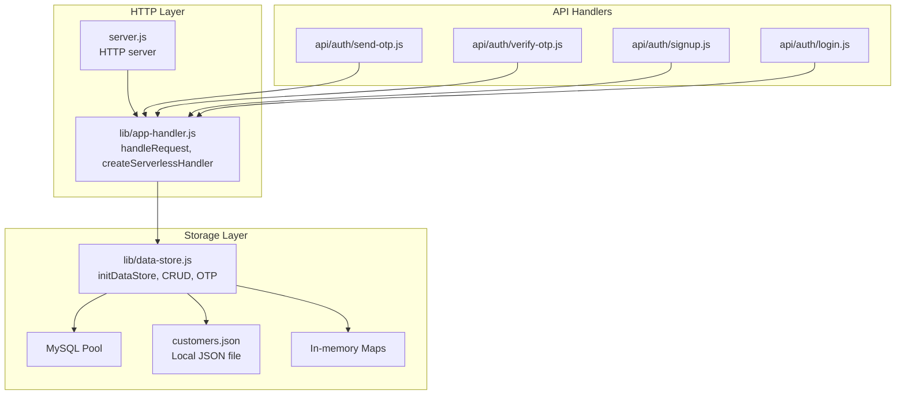
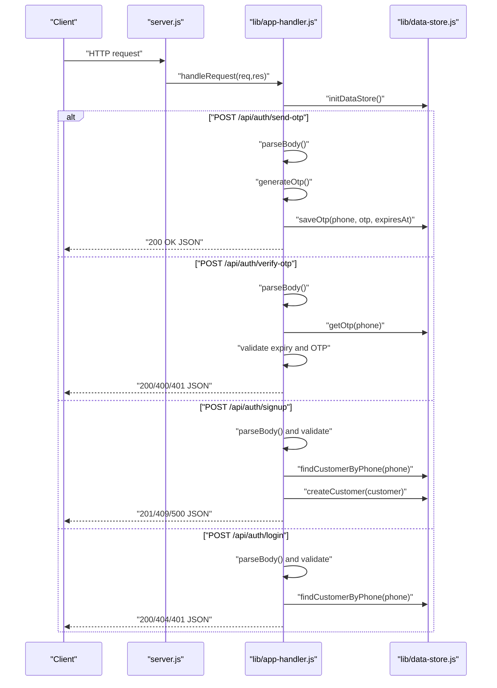
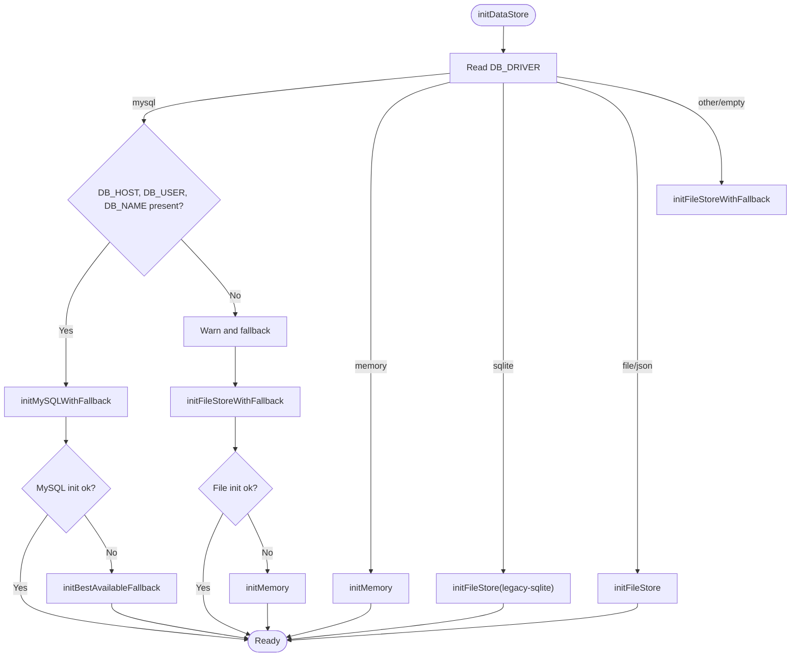
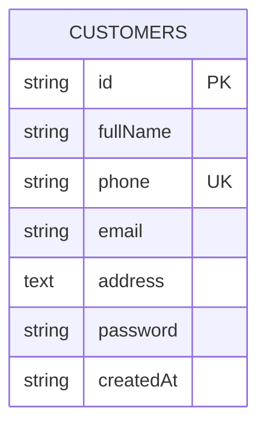
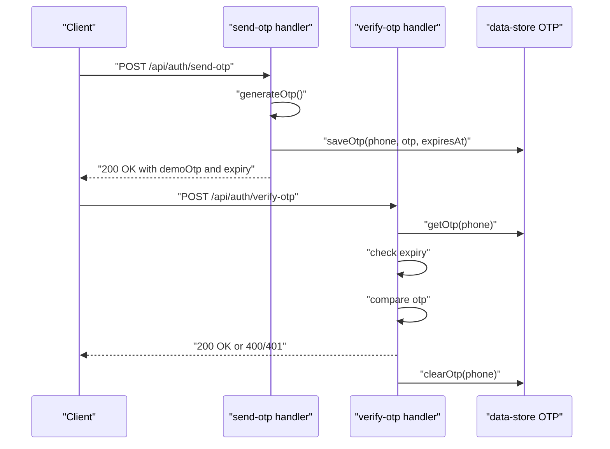
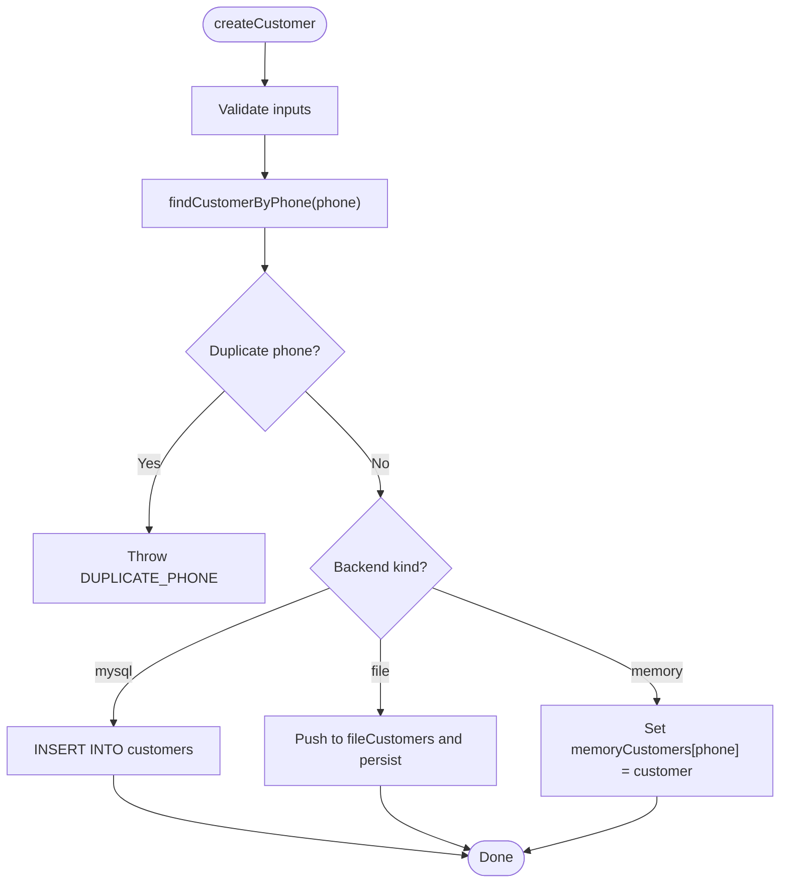
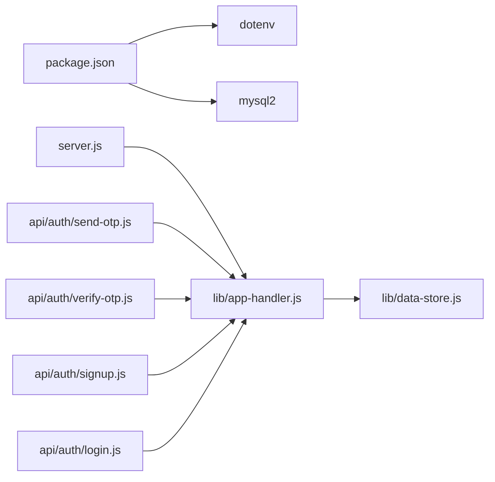

# Data Storage System

<cite>
**Referenced Files in This Document**
- [server.js](file://server.js)
- [lib/app-handler.js](file://lib/app-handler.js)
- [lib/data-store.js](file://lib/data-store.js)
- [api/auth/send-otp.js](file://api/auth/send-otp.js)
- [api/auth/verify-otp.js](file://api/auth/verify-otp.js)
- [api/auth/signup.js](file://api/auth/signup.js)
- [api/auth/login.js](file://api/auth/login.js)
- [customers.json](file://customers.json)
- [package.json](file://package.json)
</cite>

## Table of Contents
1. [Introduction](#introduction)
2. [Project Structure](#project-structure)
3. [Core Components](#core-components)
4. [Architecture Overview](#architecture-overview)
5. [Detailed Component Analysis](#detailed-component-analysis)
6. [Dependency Analysis](#dependency-analysis)
7. [Performance Considerations](#performance-considerations)
8. [Troubleshooting Guide](#troubleshooting-guide)
9. [Conclusion](#conclusion)
10. [Appendices](#appendices)

## Introduction
This document describes the Night Foodies data storage system, which supports multiple storage backends: MySQL, JSON file storage, and in-memory storage. It explains the automatic fallback mechanism that selects the best available backend depending on the environment, configuration, and platform constraints. It documents the customer data model, OTP management, CRUD operations, query optimization, data consistency guarantees, configuration options, and operational procedures such as migration, backup, and recovery.

## Project Structure
The data storage system spans several modules:
- Application handler orchestrates HTTP requests and delegates to the data store.
- Data store initializes and manages the selected backend, exposes CRUD operations, and handles OTP lifecycle.
- API serverless handlers wrap the application handler for serverless environments.
- Static file serving supports the frontend pages.
- Package configuration defines runtime dependencies.

**Diagram sources**
- [server.js:1-35](file://server.js#L1-L35)
- [lib/app-handler.js:1-332](file://lib/app-handler.js#L1-L332)
- [lib/data-store.js:1-291](file://lib/data-store.js#L1-L291)
- [api/auth/send-otp.js:1-4](file://api/auth/send-otp.js#L1-L4)
- [api/auth/verify-otp.js:1-4](file://api/auth/verify-otp.js#L1-L4)
- [api/auth/signup.js:1-4](file://api/auth/signup.js#L1-L4)
- [api/auth/login.js:1-4](file://api/auth/login.js#L1-L4)

**Section sources**
- [server.js:1-35](file://server.js#L1-L35)
- [lib/app-handler.js:1-332](file://lib/app-handler.js#L1-L332)
- [lib/data-store.js:1-291](file://lib/data-store.js#L1-L291)
- [api/auth/send-otp.js:1-4](file://api/auth/send-otp.js#L1-L4)
- [api/auth/verify-otp.js:1-4](file://api/auth/verify-otp.js#L1-L4)
- [api/auth/signup.js:1-4](file://api/auth/signup.js#L1-L4)
- [api/auth/login.js:1-4](file://api/auth/login.js#L1-L4)

## Core Components
- Data Store Initialization and Fallback
  - Selects backend based on environment variables and platform constraints.
  - Supports MySQL, JSON file, and in-memory modes with graceful fallback.
- Customer Data Model
  - Schema fields, normalization, validation rules, and uniqueness constraints.
- OTP Management
  - Generation, expiration handling, storage, and verification.
- CRUD Operations
  - Create, read by phone, and backend-agnostic operations.
- Query Optimization and Consistency
  - Indexing strategy, uniqueness constraint, and consistency guarantees.

**Section sources**
- [lib/data-store.js:158-214](file://lib/data-store.js#L158-L214)
- [lib/data-store.js:34-44](file://lib/data-store.js#L34-L44)
- [lib/data-store.js:86-97](file://lib/data-store.js#L86-L97)
- [lib/app-handler.js:13-21](file://lib/app-handler.js#L13-L21)
- [lib/app-handler.js:216-225](file://lib/app-handler.js#L216-L225)

## Architecture Overview
The system initializes the data store once per process and routes requests to the appropriate handler. The handler validates inputs, invokes the data store, and returns JSON responses. The data store encapsulates backend selection and operations.

**Diagram sources**
- [server.js:7-32](file://server.js#L7-L32)
- [lib/app-handler.js:271-295](file://lib/app-handler.js#L271-L295)
- [lib/data-store.js:216-264](file://lib/data-store.js#L216-L264)

## Detailed Component Analysis

### Data Store Initialization and Fallback
The initialization logic evaluates environment variables and platform constraints to select the best backend:
- Explicit driver selection via DB_DRIVER.
- MySQL availability checks for DB_HOST, DB_USER, DB_NAME.
- Vercel-specific behavior: in-memory fallback for non-persistent file storage.
- File storage fallback chain: initialize file store, fallback to memory on failure.
- Unknown driver defaults to file storage with a warning.

**Diagram sources**
- [lib/data-store.js:158-214](file://lib/data-store.js#L158-L214)
- [lib/data-store.js:140-156](file://lib/data-store.js#L140-L156)
- [lib/data-store.js:131-138](file://lib/data-store.js#L131-L138)

Key behaviors:
- MySQL mode creates the database and customers table with a unique index on phone.
- File mode reads and writes the customers JSON file, ensuring parent directories exist.
- Memory mode stores customers and OTPs in in-memory maps; data resets on cold start.

**Section sources**
- [lib/data-store.js:68-101](file://lib/data-store.js#L68-L101)
- [lib/data-store.js:112-123](file://lib/data-store.js#L112-L123)
- [lib/data-store.js:125-129](file://lib/data-store.js#L125-L129)
- [lib/data-store.js:140-156](file://lib/data-store.js#L140-L156)
- [lib/data-store.js:158-214](file://lib/data-store.js#L158-L214)

### Customer Data Model
Schema definition and normalization:
- Fields: id, fullName, phone, email, address, password, createdAt.
- Normalization ensures string types, trimming, and consistent createdAt.
- Uniqueness: phone is unique in MySQL; enforced at DB level and validated during creation.

Indexing and constraints:
- MySQL: primary key on id, unique index on phone.
- File and memory: uniqueness enforced by application logic (duplicate phone detection).

Validation rules:
- Phone must be 10 digits.
- Password must be at least 4 characters.
- Full name must be at least 2 characters.

**Diagram sources**
- [lib/data-store.js:86-97](file://lib/data-store.js#L86-L97)
- [lib/data-store.js:34-44](file://lib/data-store.js#L34-L44)
- [lib/app-handler.js:183-196](file://lib/app-handler.js#L183-L196)

**Section sources**
- [lib/data-store.js:34-44](file://lib/data-store.js#L34-L44)
- [lib/data-store.js:86-97](file://lib/data-store.js#L86-L97)
- [lib/app-handler.js:183-196](file://lib/app-handler.js#L183-L196)

### OTP Management System
OTP lifecycle:
- Generation: 6-digit numeric code.
- Expiration: 2 minutes validity window.
- Storage: in-memory Map keyed by phone.
- Verification: checks presence, expiry, and equality; clears OTP on success or expiry.

**Diagram sources**
- [lib/app-handler.js:98-170](file://lib/app-handler.js#L98-L170)
- [lib/data-store.js:266-276](file://lib/data-store.js#L266-L276)

Security considerations:
- OTP is stored in-process; no persistence across restarts.
- Expiry is enforced by timestamp comparison.
- Demo OTP is returned for development convenience.

**Section sources**
- [lib/app-handler.js:13-21](file://lib/app-handler.js#L13-L21)
- [lib/app-handler.js:98-170](file://lib/app-handler.js#L98-L170)
- [lib/data-store.js:266-276](file://lib/data-store.js#L266-L276)

### CRUD Operations for Customer Data
- Create: Validates inputs, checks for duplicate phone, inserts into selected backend.
- Read: Finds customer by phone using backend-specific query.
- Update/Delete: Not implemented in the current codebase.

Consistency guarantees:
- MySQL: ACID transactions, unique constraint on phone.
- File: Atomic write after append; risk of partial writes if interrupted.
- Memory: In-memory updates; no persistence across restarts.

**Diagram sources**
- [lib/data-store.js:231-264](file://lib/data-store.js#L231-L264)
- [lib/app-handler.js:198-225](file://lib/app-handler.js#L198-L225)

**Section sources**
- [lib/data-store.js:216-264](file://lib/data-store.js#L216-L264)
- [lib/app-handler.js:198-225](file://lib/app-handler.js#L198-L225)

### Query Optimization Techniques
- Unique index on phone: O(1) lookup for findCustomerByPhone in MySQL.
- File mode: linear scan; suitable for small datasets; consider pagination or caching for larger datasets.
- Memory mode: Map lookup; efficient for moderate sizes.

Indexing strategy:
- Primary key on id for fast row identification.
- Unique key on phone for fast deduplication and lookup.

**Section sources**
- [lib/data-store.js:86-97](file://lib/data-store.js#L86-L97)
- [lib/data-store.js:224-228](file://lib/data-store.js#L224-L228)

### Configuration Options
Environment variables:
- DB_DRIVER: "mysql", "memory", "file", "json", "sqlite".
- DB_HOST, DB_USER, DB_NAME, DB_PORT: MySQL connection parameters.
- CUSTOMERS_FILE: Path to the JSON file for file storage.
- VERCEL: Platform flag enabling in-memory fallback for non-persistent file storage.

Connection pooling for MySQL:
- Connection limit: 10.
- Queue behavior: wait for connections; unlimited queue.

**Section sources**
- [lib/data-store.js:68-84](file://lib/data-store.js#L68-L84)
- [lib/data-store.js:19-25](file://lib/data-store.js#L19-L25)
- [lib/data-store.js:164-168](file://lib/data-store.js#L164-L168)
- [lib/data-store.js:187-194](file://lib/data-store.js#L187-L194)

### Data Access Patterns and Integration
- Serverless handlers: Each API endpoint is exposed as a serverless function that wraps the application handler.
- Request routing: The handler inspects method and pathname to dispatch to the correct operation.
- Static file serving: Non-API requests serve static assets from the filesystem.

Example patterns:
- OTP send: Validates phone, generates OTP, stores expiry, responds with demo OTP and expiry seconds.
- OTP verify: Validates OTP length, checks presence and expiry, compares OTP, clears on success.
- Signup: Validates inputs, checks duplicate phone, persists customer, returns appropriate status.
- Login: Validates credentials against stored customer record.

**Section sources**
- [api/auth/send-otp.js:1-4](file://api/auth/send-otp.js#L1-L4)
- [api/auth/verify-otp.js:1-4](file://api/auth/verify-otp.js#L1-L4)
- [api/auth/signup.js:1-4](file://api/auth/signup.js#L1-L4)
- [api/auth/login.js:1-4](file://api/auth/login.js#L1-L4)
- [lib/app-handler.js:271-295](file://lib/app-handler.js#L271-L295)

## Dependency Analysis
External dependencies:
- dotenv: Loads environment variables from .env files.
- mysql2/promise: MySQL driver with promise-based API and connection pooling.

Internal dependencies:
- server.js depends on app-handler for request handling and data store initialization.
- app-handler depends on data-store for CRUD and OTP operations.
- API handlers depend on app-handler for serverless routing.

**Diagram sources**
- [package.json:12-15](file://package.json#L12-L15)
- [server.js:1-3](file://server.js#L1-L3)
- [lib/app-handler.js:1-11](file://lib/app-handler.js#L1-L11)
- [lib/data-store.js:1-4](file://lib/data-store.js#L1-L4)
- [api/auth/send-otp.js:1-3](file://api/auth/send-otp.js#L1-L3)
- [api/auth/verify-otp.js:1-3](file://api/auth/verify-otp.js#L1-L3)
- [api/auth/signup.js:1-3](file://api/auth/signup.js#L1-L3)
- [api/auth/login.js:1-3](file://api/auth/login.js#L1-L3)

**Section sources**
- [package.json:12-15](file://package.json#L12-L15)
- [server.js:1-3](file://server.js#L1-L3)
- [lib/app-handler.js:1-11](file://lib/app-handler.js#L1-L11)
- [lib/data-store.js:1-4](file://lib/data-store.js#L1-L4)

## Performance Considerations
- MySQL
  - Use connection pooling to manage concurrent connections efficiently.
  - Ensure network latency is minimized; keep DB close to application.
  - Monitor queue limits and adjust connectionLimit as needed.
- File
  - Keep file size reasonable; consider rotating or archiving old entries.
  - Use atomic writes to prevent corruption.
- Memory
  - Suitable for ephemeral or development deployments.
  - Plan for cold-start resets and consider persistence for production.

[No sources needed since this section provides general guidance]

## Troubleshooting Guide
Common issues and resolutions:
- MySQL initialization failures
  - Verify DB_HOST, DB_USER, DB_NAME are set and reachable.
  - Check network connectivity and credentials.
  - The system falls back to file or memory on failure.
- File storage errors
  - Ensure CUSTOMERS_FILE path is writable and parent directories exist.
  - On Vercel, file storage is not persistent; switch to MySQL or accept in-memory mode.
- OTP verification failures
  - Confirm OTP was requested and not expired.
  - Ensure OTP is exactly 6 digits.
- Duplicate phone errors
  - Occur when attempting to sign up with an existing phone number.

Operational tips:
- Use environment variables to force a specific backend for testing.
- Monitor logs for fallback warnings and adjust configuration accordingly.

**Section sources**
- [lib/data-store.js:149-156](file://lib/data-store.js#L149-L156)
- [lib/data-store.js:131-138](file://lib/data-store.js#L131-L138)
- [lib/app-handler.js:108-111](file://lib/app-handler.js#L108-L111)
- [lib/app-handler.js:146-149](file://lib/app-handler.js#L146-L149)
- [lib/app-handler.js:217-220](file://lib/app-handler.js#L217-L220)

## Conclusion
Night Foodies employs a flexible, multi-backend data storage system with automatic fallback to ensure resilience across diverse deployment environments. The design balances simplicity for development and scalability for production by leveraging MySQL when available, with file and in-memory modes as safe fallbacks. The OTP system provides secure, short-lived authentication tokens, while the customer model enforces strong uniqueness and validation rules. Proper configuration and monitoring enable reliable operations in both traditional servers and serverless platforms.

[No sources needed since this section summarizes without analyzing specific files]

## Appendices

### Data Migration Procedures
- From file to MySQL
  - Export customers.json records.
  - Normalize records to match schema.
  - Bulk insert into MySQL customers table.
  - Update environment variables to DB_DRIVER=mysql and provide DB_* variables.
- From MySQL to file
  - Export customers table to JSON.
  - Set CUSTOMERS_FILE to target path.
  - Set DB_DRIVER=file or json.
  - Verify data integrity post-migration.

[No sources needed since this section provides general guidance]

### Backup and Recovery
- MySQL
  - Use standard MySQL backup tools to export the night_foodies database.
  - Restore by importing the dump into a new or existing database.
- File
  - Back up the customers.json file regularly.
  - Restore by replacing the file with a previous backup.
- Memory
  - Not persistent; rely on MySQL or file backups for recovery.

[No sources needed since this section provides general guidance]

### Example Data Access Patterns
- Initialize data store before handling requests.
- Use serverless handlers for OTP send/verify and signup/login.
- Validate inputs early and return structured JSON responses.

**Section sources**
- [lib/app-handler.js:271-295](file://lib/app-handler.js#L271-L295)
- [api/auth/send-otp.js:1-4](file://api/auth/send-otp.js#L1-L4)
- [api/auth/verify-otp.js:1-4](file://api/auth/verify-otp.js#L1-L4)
- [api/auth/signup.js:1-4](file://api/auth/signup.js#L1-L4)
- [api/auth/login.js:1-4](file://api/auth/login.js#L1-L4)