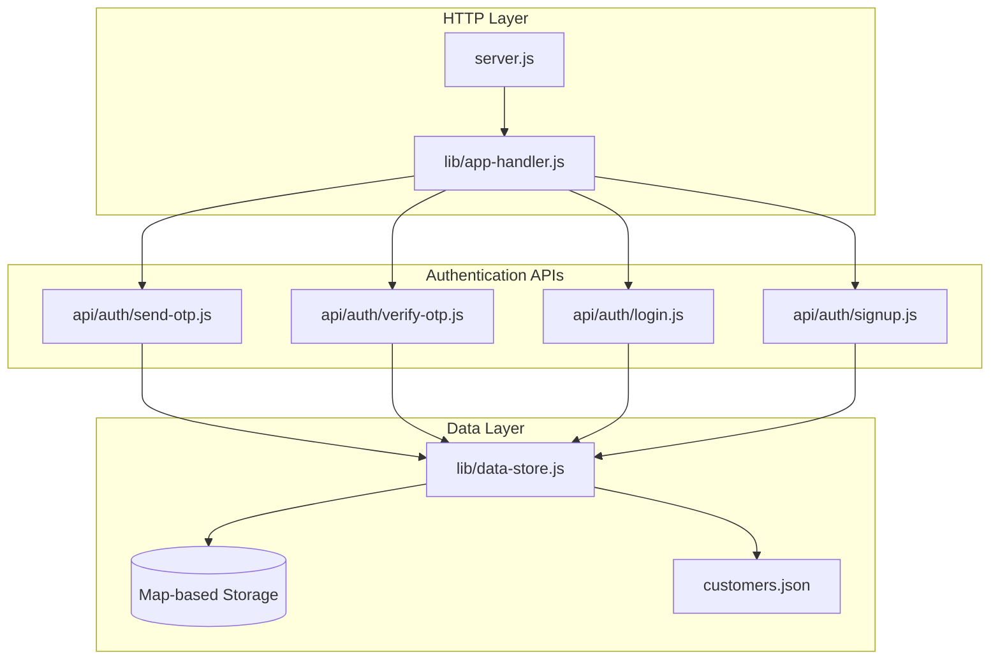
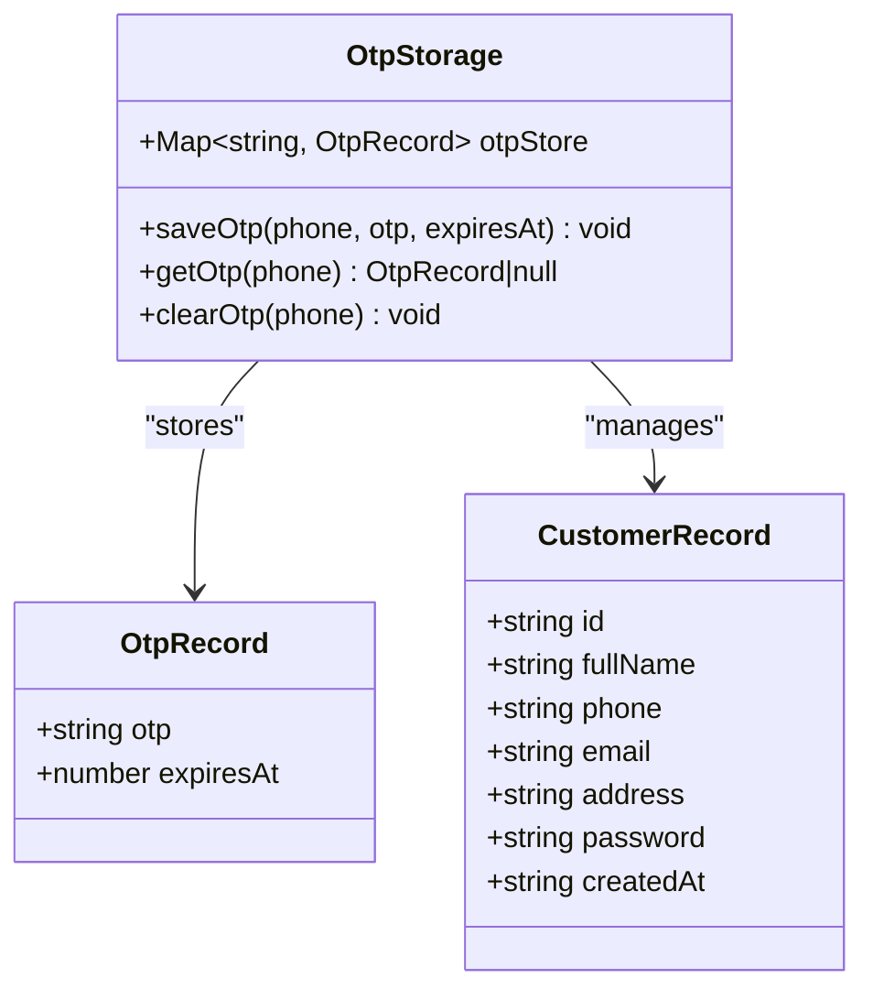
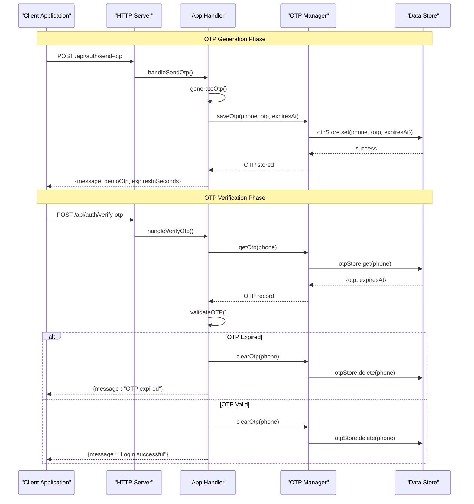
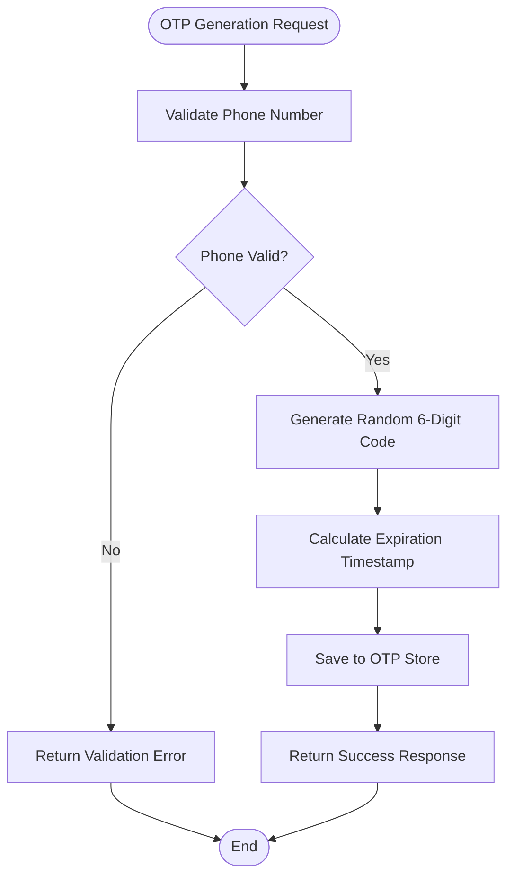
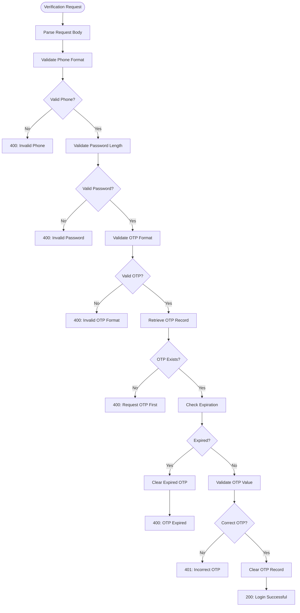
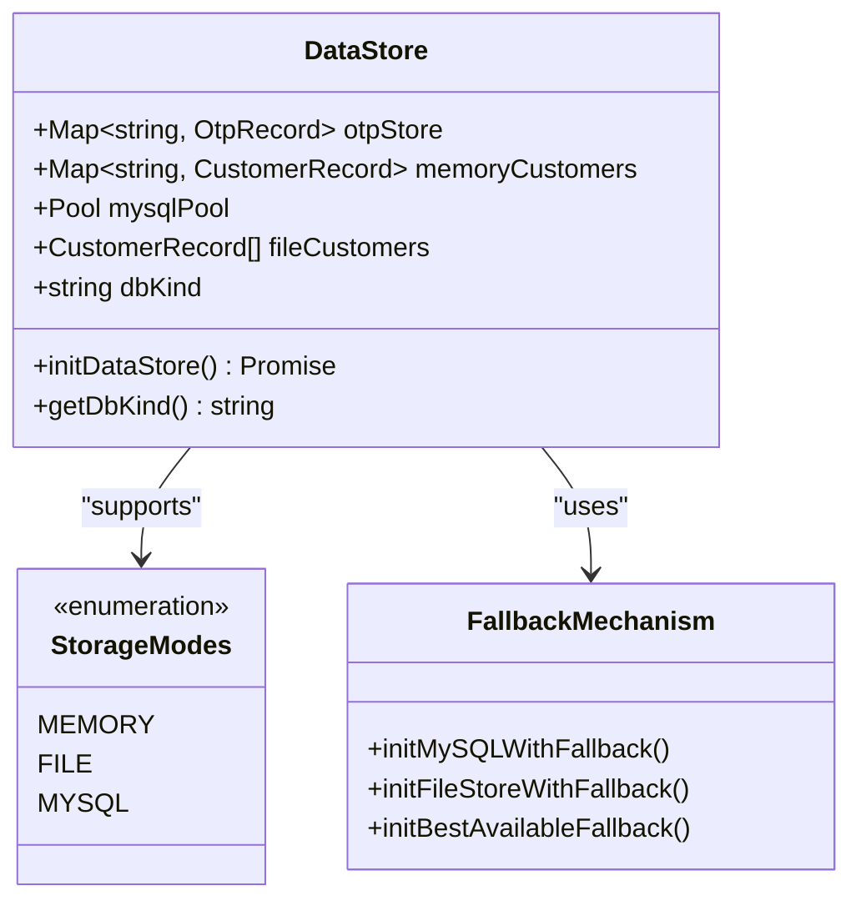
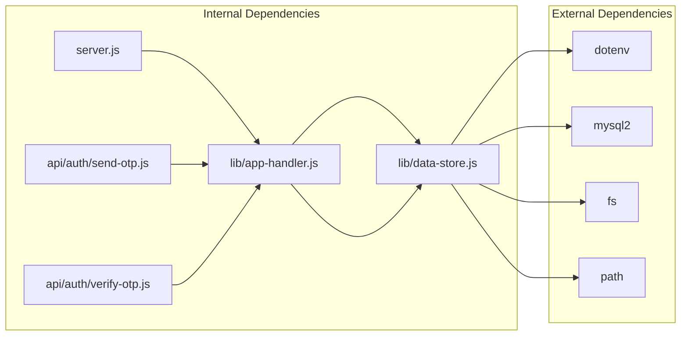

# OTP Management System

<cite>
**Referenced Files in This Document**
- [server.js](file://server.js)
- [lib/app-handler.js](file://lib/app-handler.js)
- [lib/data-store.js](file://lib/data-store.js)
- [api/auth/send-otp.js](file://api/auth/send-otp.js)
- [api/auth/verify-otp.js](file://api/auth/verify-otp.js)
- [api/auth/login.js](file://api/auth/login.js)
- [api/auth/signup.js](file://api/auth/signup.js)
- [package.json](file://package.json)
- [customers.json](file://customers.json)
</cite>

## Table of Contents
1. [Introduction](#introduction)
2. [Project Structure](#project-structure)
3. [Core Components](#core-components)
4. [Architecture Overview](#architecture-overview)
5. [Detailed Component Analysis](#detailed-component-analysis)
6. [Dependency Analysis](#dependency-analysis)
7. [Performance Considerations](#performance-considerations)
8. [Troubleshooting Guide](#troubleshooting-guide)
9. [Conclusion](#conclusion)

## Introduction
This document provides comprehensive documentation for the OTP (One-Time Password) management system used in Night Foodies authentication flow. The system implements secure OTP generation, temporary storage using in-memory Map-based storage, and robust expiration handling with expiresAt timestamps. It covers the complete OTP lifecycle from generation through verification to cleanup, including security considerations, validation processes, and integration patterns with the request handler.

The OTP system is designed for late-night food delivery services, providing mobile-based authentication with SMS-like OTP functionality. The implementation emphasizes simplicity, security, and reliability while maintaining flexibility for different deployment environments.

## Project Structure
The OTP management system is organized within a modular architecture that separates concerns between HTTP request handling, data persistence, and authentication logic.



**Diagram sources**
- [server.js:1-35](file://server.js#L1-L35)
- [lib/app-handler.js:1-332](file://lib/app-handler.js#L1-L332)
- [lib/data-store.js:1-291](file://lib/data-store.js#L1-L291)

**Section sources**
- [server.js:1-35](file://server.js#L1-L35)
- [lib/app-handler.js:1-332](file://lib/app-handler.js#L1-L332)
- [lib/data-store.js:1-291](file://lib/data-store.js#L1-L291)

## Core Components
The OTP management system consists of several interconnected components that work together to provide secure authentication functionality.

### OTP Storage Mechanism
The system uses a Map-based in-memory storage mechanism for OTP data persistence. The storage structure is designed to efficiently manage OTP records with automatic cleanup capabilities.



**Diagram sources**
- [lib/data-store.js:6](file://lib/data-store.js#L6)
- [lib/data-store.js:266-276](file://lib/data-store.js#L266-L276)

### Authentication Flow Controllers
The system implements separate handlers for different authentication operations, each with specific responsibilities and validation logic.

**Section sources**
- [lib/data-store.js:266-276](file://lib/data-store.js#L266-L276)
- [lib/app-handler.js:98-170](file://lib/app-handler.js#L98-L170)

## Architecture Overview
The OTP management system follows a layered architecture pattern with clear separation between presentation, business logic, and data persistence layers.



**Diagram sources**
- [lib/app-handler.js:98-170](file://lib/app-handler.js#L98-L170)
- [lib/data-store.js:266-276](file://lib/data-store.js#L266-L276)

The architecture ensures that OTP operations are isolated from other authentication logic, allowing for independent testing and maintenance of the OTP system.

**Section sources**
- [lib/app-handler.js:98-170](file://lib/app-handler.js#L98-L170)
- [lib/data-store.js:266-276](file://lib/data-store.js#L266-L276)

## Detailed Component Analysis

### OTP Generation Algorithm
The OTP generation system produces cryptographically secure random 6-digit codes suitable for authentication purposes.



**Diagram sources**
- [lib/app-handler.js:19-21](file://lib/app-handler.js#L19-L21)
- [lib/app-handler.js:113-116](file://lib/app-handler.js#L113-L116)

The generation algorithm uses a mathematical approach to create deterministic 6-digit codes within the range 100000-999999, ensuring consistent length and format for user verification.

**Section sources**
- [lib/app-handler.js:19-21](file://lib/app-handler.js#L19-L21)
- [lib/app-handler.js:113-116](file://lib/app-handler.js#L113-L116)

### OTP Storage and Retrieval Functions
The OTP storage system provides three primary functions for managing OTP lifecycle: saveOtp, getOtp, and clearOtp.

#### saveOtp Function
The saveOtp function creates a new OTP record in the Map-based storage with associated expiration metadata.

**Usage Pattern:**
```javascript
// Typical usage in OTP generation flow
const otp = generateOtp();
const expiresAt = Date.now() + OTP_VALIDITY_MS;
saveOtp(phone, otp, expiresAt);
```

#### getOtp Function
The getOtp function retrieves OTP records with automatic expiration checking and returns null for expired or non-existent entries.

**Usage Pattern:**
```javascript
// Typical usage in OTP verification flow
const otpRecord = getOtp(phone);
if (!otpRecord) {
    // Handle missing OTP
}
if (Date.now() > otpRecord.expiresAt) {
    // Handle expired OTP
}
```

#### clearOtp Function
The clearOtp function removes OTP records from storage after successful verification or upon expiration, preventing replay attacks.

**Section sources**
- [lib/data-store.js:266-276](file://lib/data-store.js#L266-L276)

### OTP Verification Workflow
The OTP verification process implements comprehensive validation checks to ensure security and reliability.



**Diagram sources**
- [lib/app-handler.js:125-170](file://lib/app-handler.js#L125-L170)

**Section sources**
- [lib/app-handler.js:125-170](file://lib/app-handler.js#L125-L170)

### Data Persistence Layer
The system implements a flexible data persistence layer that supports multiple storage backends with automatic fallback mechanisms.



**Diagram sources**
- [lib/data-store.js:6](file://lib/data-store.js#L6)
- [lib/data-store.js:158-214](file://lib/data-store.js#L158-L214)

**Section sources**
- [lib/data-store.js:6](file://lib/data-store.js#L6)
- [lib/data-store.js:158-214](file://lib/data-store.js#L158-L214)

## Dependency Analysis
The OTP management system exhibits clean dependency relationships with minimal coupling between components.



**Diagram sources**
- [package.json:13-16](file://package.json#L13-L16)
- [lib/data-store.js:1](file://lib/data-store.js#L1)
- [lib/app-handler.js:3-11](file://lib/app-handler.js#L3-L11)

The dependency analysis reveals a well-structured system where the data store module serves as the central dependency for all authentication operations, while external dependencies are managed through environment configuration.

**Section sources**
- [package.json:13-16](file://package.json#L13-L16)
- [lib/data-store.js:1](file://lib/data-store.js#L1)
- [lib/app-handler.js:3-11](file://lib/app-handler.js#L3-L11)

## Performance Considerations
The OTP management system is designed for optimal performance in typical authentication scenarios with several built-in optimizations.

### Storage Efficiency
- **Map-based Storage**: Uses native JavaScript Map for O(1) average-case lookup, insertion, and deletion operations
- **Memory Management**: Automatic cleanup of expired OTP records prevents memory leaks
- **Minimal Serialization**: OTP data stored as simple objects without complex serialization overhead

### Concurrency Handling
- **Non-blocking Operations**: All OTP operations are synchronous and lightweight
- **Thread Safety**: Map operations are atomic, preventing race conditions in single-threaded Node.js environment
- **Resource Cleanup**: Immediate removal of OTP records after verification reduces memory footprint

### Scalability Factors
- **Horizontal Scaling**: OTP data is ephemeral and not shared across instances
- **Stateless Design**: Each OTP request is independent, enabling easy load balancing
- **Memory Constraints**: In-memory storage limits data retention but maximizes performance

## Troubleshooting Guide

### Common Issues and Solutions

#### OTP Not Received
**Symptoms:** Users report not receiving OTP messages
**Causes:**
- Invalid phone number format (must be exactly 10 digits)
- Network connectivity issues
- Server configuration problems

**Solutions:**
- Verify phone number validation: `isValidPhone(phone)` in app-handler.js
- Check server logs for initialization errors
- Confirm OTP validity period (2 minutes) in OTP_VALIDITY_MS constant

#### OTP Verification Fails
**Symptoms:** Users receive "Incorrect OTP" or "OTP expired" messages
**Causes:**
- Wrong OTP format (must be 6 digits)
- Expired OTP beyond 2-minute validity period
- Phone number mismatch between generation and verification

**Solutions:**
- Validate OTP format: `^\d{6}$` pattern in handleVerifyOtp
- Check expiration logic: `Date.now() > data.expiresAt`
- Verify phone number consistency throughout the flow

#### Server Startup Failures
**Symptoms:** Application fails to start with database errors
**Causes:**
- MySQL configuration missing or incorrect
- File storage permission issues
- Environment variable misconfiguration

**Solutions:**
- Configure MySQL environment variables (DB_HOST, DB_USER, DB_NAME)
- Verify file storage path permissions
- Check fallback mechanisms for development environments

### Debugging Techniques

#### Logging and Monitoring
The system implements comprehensive logging for troubleshooting authentication flows:

```javascript
// Enable debug logging
console.log("OTP generated:", { phone, otp, expiresAt });
console.log("OTP verification attempt:", { phone, providedOtp });
console.log("OTP storage state:", otpStore.size, "records");
```

#### Error Handling Patterns
The system provides structured error responses for different failure scenarios:

| Error Type | HTTP Status | Message | Cause |
|------------|-------------|---------|--------|
| Validation Error | 400 | Phone/password/OTP format invalid | Input validation failure |
| Missing OTP | 400 | Please request OTP first | Verification without generation |
| Expired OTP | 400 | OTP expired | Time-based expiration |
| Incorrect OTP | 401 | Incorrect OTP | Authentication failure |
| Internal Error | 500 | Internal server error | System failures |

**Section sources**
- [lib/app-handler.js:108-111](file://lib/app-handler.js#L108-L111)
- [lib/app-handler.js:152-166](file://lib/app-handler.js#L152-L166)
- [server.js:14-18](file://server.js#L14-L18)

## Conclusion
The Night Foodies OTP management system provides a robust, secure, and efficient authentication solution for mobile-based food delivery services. The implementation demonstrates excellent architectural principles with clear separation of concerns, comprehensive error handling, and flexible storage mechanisms.

Key strengths of the system include:
- **Security:** 6-digit OTP generation, strict validation, and automatic expiration handling
- **Reliability:** Comprehensive error handling and fallback mechanisms
- **Performance:** Efficient Map-based storage with automatic cleanup
- **Maintainability:** Clean modular architecture with well-defined interfaces

The system successfully balances security requirements with performance considerations, making it suitable for production deployment in various environments. The modular design allows for easy extension and customization while maintaining the core OTP functionality essential for mobile authentication workflows.

Future enhancements could include configurable OTP lengths, rate limiting for OTP requests, and integration with external SMS providers for production deployments requiring persistent OTP storage across application instances.