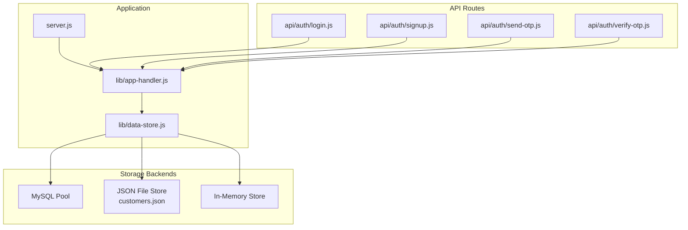
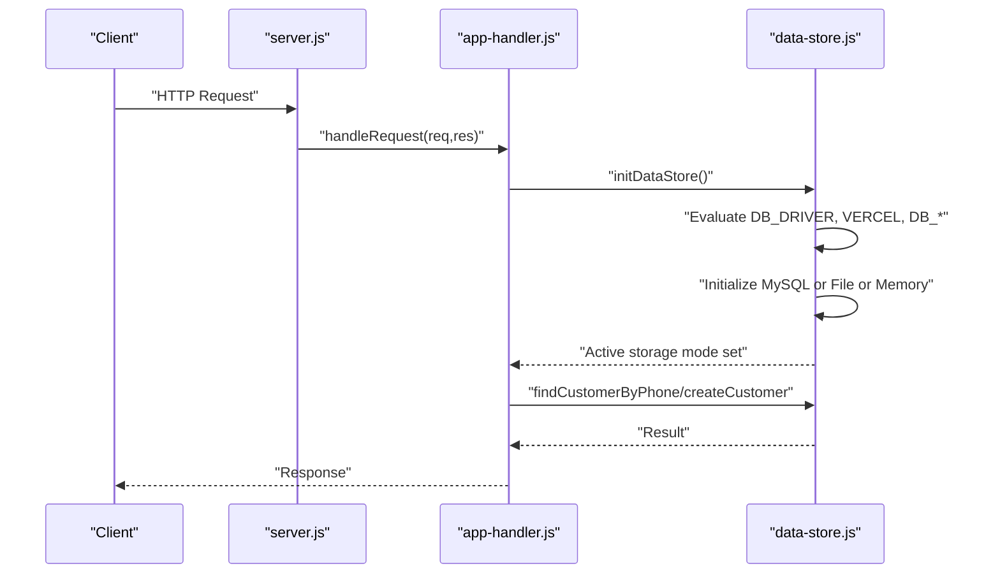
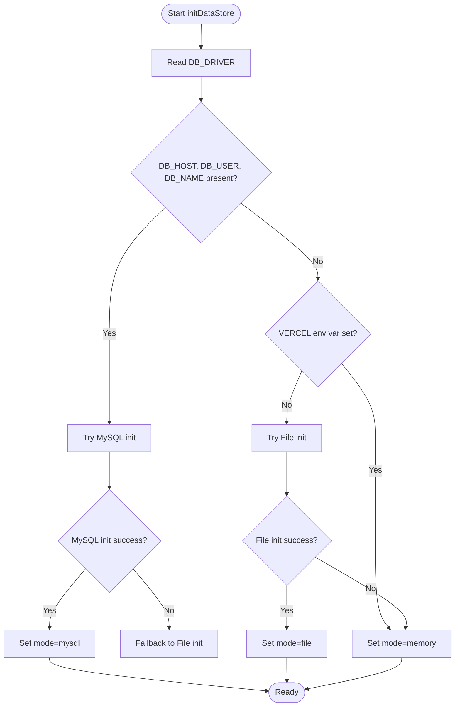
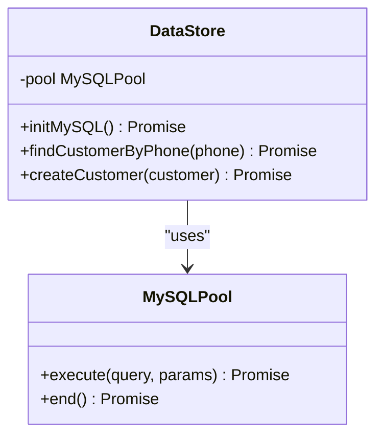
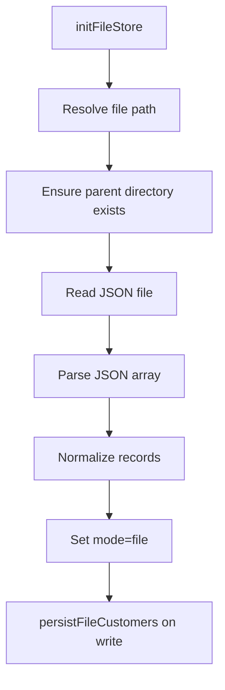
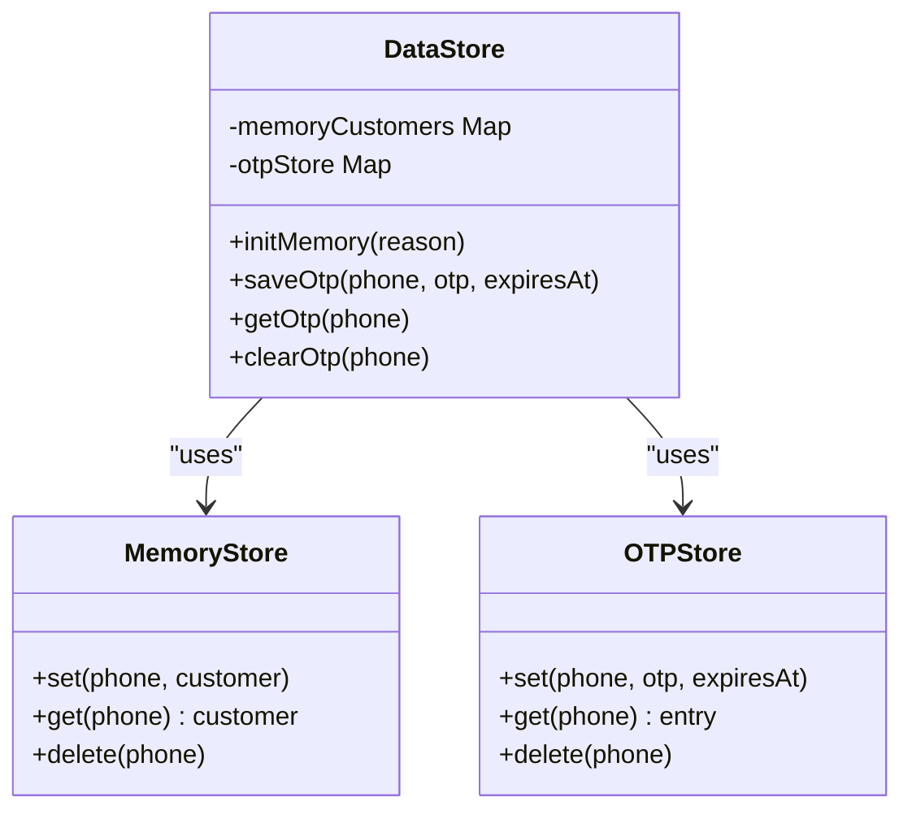
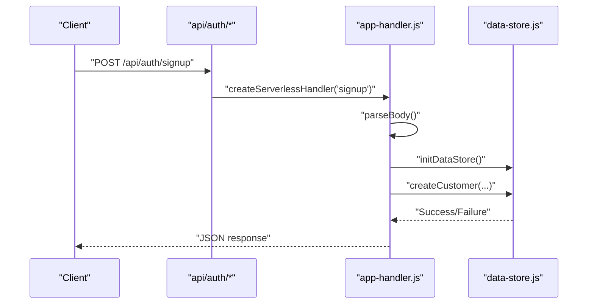
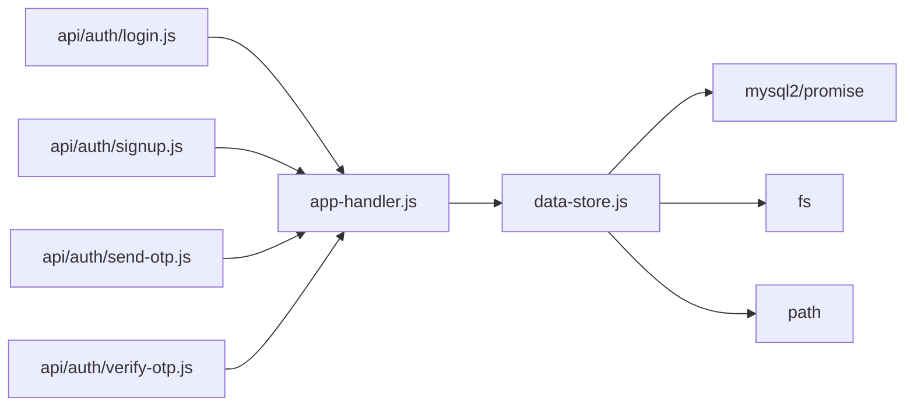

# Storage Architecture

<cite>
**Referenced Files in This Document**
- [data-store.js](file://lib/data-store.js)
- [app-handler.js](file://lib/app-handler.js)
- [server.js](file://server.js)
- [login.js](file://api/auth/login.js)
- [signup.js](file://api/auth/signup.js)
- [send-otp.js](file://api/auth/send-otp.js)
- [verify-otp.js](file://api/auth/verify-otp.js)
- [customers.json](file://customers.json)
- [package.json](file://package.json)
</cite>

## Table of Contents
1. [Introduction](#introduction)
2. [Project Structure](#project-structure)
3. [Core Components](#core-components)
4. [Architecture Overview](#architecture-overview)
5. [Detailed Component Analysis](#detailed-component-analysis)
6. [Dependency Analysis](#dependency-analysis)
7. [Performance Considerations](#performance-considerations)
8. [Troubleshooting Guide](#troubleshooting-guide)
9. [Conclusion](#conclusion)
10. [Appendices](#appendices)

## Introduction
This document describes the Night Foodies storage architecture, focusing on a multi-backend design that supports MySQL, JSON file storage, and in-memory storage modes. It explains the automatic fallback mechanism that ensures data persistence across environments, including Vercel serverless deployments. The document covers storage mode selection logic based on environment variables, configuration detection, the factory-like initialization pattern, connection pooling for MySQL, and fallback strategies when primary storage fails. It also outlines configuration options, performance characteristics, and deployment considerations, with examples of storage mode switching and integration with the application handler.

## Project Structure
The storage system is implemented in a dedicated module and integrated into the application handler and server entry point. API routes for authentication integrate with the handler to trigger storage initialization and operations.

**Diagram sources**
- [server.js:1-35](file://server.js#L1-L35)
- [app-handler.js:1-332](file://lib/app-handler.js#L1-L332)
- [data-store.js:1-291](file://lib/data-store.js#L1-L291)
- [login.js:1-4](file://api/auth/login.js#L1-L4)
- [signup.js:1-4](file://api/auth/signup.js#L1-L4)
- [send-otp.js:1-4](file://api/auth/send-otp.js#L1-L4)
- [verify-otp.js:1-4](file://api/auth/verify-otp.js#L1-L4)

**Section sources**
- [server.js:1-35](file://server.js#L1-L35)
- [app-handler.js:1-332](file://lib/app-handler.js#L1-L332)
- [data-store.js:1-291](file://lib/data-store.js#L1-L291)

## Core Components
- Storage Factory and Initialization
  - Centralized initialization logic determines the active storage mode based on environment variables and availability.
  - Supports MySQL, JSON file, and in-memory modes with robust fallbacks.
- MySQL Backend
  - Uses a promise-based MySQL client with connection pooling.
  - Creates the database and table on first boot and performs CRUD operations.
- JSON File Backend
  - Reads and writes customer records to a JSON file, with normalization and persistence.
- In-Memory Backend
  - Provides ephemeral storage suitable for development and serverless environments without persistent volumes.
- OTP Store
  - Separate in-memory OTP store keyed by phone number with expiration handling.
- Application Handler Integration
  - Exposes handlers for authentication endpoints and orchestrates storage initialization and operations.

**Section sources**
- [data-store.js:158-214](file://lib/data-store.js#L158-L214)
- [data-store.js:68-101](file://lib/data-store.js#L68-L101)
- [data-store.js:112-123](file://lib/data-store.js#L112-L123)
- [data-store.js:257-264](file://lib/data-store.js#L257-L264)
- [app-handler.js:271-295](file://lib/app-handler.js#L271-L295)

## Architecture Overview
The storage architecture follows a factory-like initialization pattern that selects the best available storage backend at runtime. The selection considers explicit driver configuration, environment-specific constraints (notably Vercel), and the presence of required MySQL credentials. The system initializes only once and exposes unified APIs for customer operations and OTP management.

**Diagram sources**
- [server.js:7-32](file://server.js#L7-L32)
- [app-handler.js:297-309](file://lib/app-handler.js#L297-L309)
- [data-store.js:158-214](file://lib/data-store.js#L158-L214)

## Detailed Component Analysis

### Storage Mode Selection Logic
The selection logic evaluates environment variables and deployment context to pick the optimal storage mode:
- Explicit driver: DB_DRIVER controls the mode ("mysql", "memory", "file"/"json", "sqlite").
- MySQL availability: If DB_HOST, DB_USER, and DB_NAME are present, MySQL is preferred.
- Vercel constraint: On Vercel, local file storage is not persistent; the system falls back to in-memory mode.
- Fallback chain: MySQL -> File -> Memory, with warnings logged for failures.

**Diagram sources**
- [data-store.js:158-214](file://lib/data-store.js#L158-L214)

**Section sources**
- [data-store.js:158-214](file://lib/data-store.js#L158-L214)

### MySQL Backend
- Connection Pooling
  - A MySQL pool is created with configurable limits and queue behavior.
  - On first boot, the database and customer table are created if missing.
- Operations
  - Customer lookup by phone and insertion with duplicate phone detection.
- Environment Variables
  - DB_HOST, DB_PORT, DB_USER, DB_PASSWORD, DB_NAME control connection and database selection.

**Diagram sources**
- [data-store.js:68-101](file://lib/data-store.js#L68-L101)
- [data-store.js:216-264](file://lib/data-store.js#L216-L264)

**Section sources**
- [data-store.js:68-101](file://lib/data-store.js#L68-L101)
- [data-store.js:216-264](file://lib/data-store.js#L216-L264)
- [package.json:12-15](file://package.json#L12-L15)

### JSON File Backend
- Persistence Location
  - Path determined by CUSTOMERS_FILE environment variable or defaults to customers.json in the working directory.
- Initialization
  - Reads existing customer records from the file and normalizes them.
- Writes
  - Appends new customer records and persists the entire array to disk.
- Normalization
  - Ensures consistent field types and trimming for phone, email, address, and fullName.

**Diagram sources**
- [data-store.js:19-25](file://lib/data-store.js#L19-L25)
- [data-store.js:112-123](file://lib/data-store.js#L112-L123)
- [data-store.js:46-66](file://lib/data-store.js#L46-L66)
- [data-store.js:103-110](file://lib/data-store.js#L103-L110)
- [customers.json:1-11](file://customers.json#L1-L11)

**Section sources**
- [data-store.js:19-25](file://lib/data-store.js#L19-L25)
- [data-store.js:112-123](file://lib/data-store.js#L112-L123)
- [data-store.js:46-66](file://lib/data-store.js#L46-L66)
- [data-store.js:103-110](file://lib/data-store.js#L103-L110)
- [customers.json:1-11](file://customers.json#L1-L11)

### In-Memory Backend
- Purpose
  - Ephemeral storage for development and serverless environments without persistent volumes.
- OTP Store
  - Separate Map-based store for OTPs with expiration tracking.
- Behavior
  - Data resets on cold starts; suitable for temporary demos or testing.

**Diagram sources**
- [data-store.js:6-7](file://lib/data-store.js#L6-L7)
- [data-store.js:257-264](file://lib/data-store.js#L257-L264)
- [data-store.js:266-276](file://lib/data-store.js#L266-L276)

**Section sources**
- [data-store.js:6-7](file://lib/data-store.js#L6-L7)
- [data-store.js:257-264](file://lib/data-store.js#L257-L264)
- [data-store.js:266-276](file://lib/data-store.js#L266-L276)

### Application Handler Integration
- Authentication Handlers
  - Serverless handlers for send-otp, verify-otp, signup, and login route through the application handler.
- Request Routing
  - The handler parses requests, validates payloads, and delegates to storage operations.
- Storage Initialization
  - Each API endpoint calls initDataStore to ensure the storage subsystem is ready.

**Diagram sources**
- [login.js:1-4](file://api/auth/login.js#L1-L4)
- [signup.js:1-4](file://api/auth/signup.js#L1-L4)
- [send-otp.js:1-4](file://api/auth/send-otp.js#L1-L4)
- [verify-otp.js:1-4](file://api/auth/verify-otp.js#L1-L4)
- [app-handler.js:271-295](file://lib/app-handler.js#L271-L295)
- [app-handler.js:172-225](file://lib/app-handler.js#L172-L225)

**Section sources**
- [login.js:1-4](file://api/auth/login.js#L1-L4)
- [signup.js:1-4](file://api/auth/signup.js#L1-L4)
- [send-otp.js:1-4](file://api/auth/send-otp.js#L1-L4)
- [verify-otp.js:1-4](file://api/auth/verify-otp.js#L1-L4)
- [app-handler.js:271-295](file://lib/app-handler.js#L271-L295)
- [app-handler.js:172-225](file://lib/app-handler.js#L172-L225)

## Dependency Analysis
- Internal Dependencies
  - app-handler depends on data-store for storage operations and OTP management.
  - API routes depend on app-handler to expose serverless endpoints.
- External Dependencies
  - MySQL client library for MySQL operations.
  - dotenv for loading environment variables.
- Coupling and Cohesion
  - data-store encapsulates all storage concerns, promoting cohesion and reducing coupling to the rest of the application.

**Diagram sources**
- [data-store.js:1-4](file://lib/data-store.js#L1-L4)
- [app-handler.js:1-11](file://lib/app-handler.js#L1-L11)
- [login.js:1-4](file://api/auth/login.js#L1-L4)
- [signup.js:1-4](file://api/auth/signup.js#L1-L4)
- [send-otp.js:1-4](file://api/auth/send-otp.js#L1-L4)
- [verify-otp.js:1-4](file://api/auth/verify-otp.js#L1-L4)

**Section sources**
- [data-store.js:1-4](file://lib/data-store.js#L1-L4)
- [app-handler.js:1-11](file://lib/app-handler.js#L1-L11)
- [login.js:1-4](file://api/auth/login.js#L1-L4)
- [signup.js:1-4](file://api/auth/signup.js#L1-L4)
- [send-otp.js:1-4](file://api/auth/send-otp.js#L1-L4)
- [verify-otp.js:1-4](file://api/auth/verify-otp.js#L1-L4)

## Performance Considerations
- MySQL
  - Connection pooling reduces overhead and improves concurrency.
  - Index on phone enforces uniqueness and accelerates lookups.
  - Consider scaling pool size and monitoring queue wait times under load.
- JSON File
  - File I/O is synchronous in nature; frequent writes can cause contention.
  - Normalize and persist only on insert/update to minimize I/O.
  - Ensure adequate filesystem permissions and disk space.
- In-Memory
  - Fastest for read/write operations but ephemeral.
  - Suitable for development and serverless environments where persistence is not required.
- OTP Store
  - Uses Map for O(1) average-time operations; expiration handled via timestamps.

[No sources needed since this section provides general guidance]

## Troubleshooting Guide
- MySQL Initialization Failure
  - Verify DB_HOST, DB_USER, DB_NAME, and DB_PORT are set correctly.
  - Check network connectivity and credentials.
  - Review logs for pool creation errors.
- File Storage Issues
  - Ensure CUSTOMERS_FILE path is writable and the parent directory exists.
  - Confirm the file contains a valid JSON array.
- Vercel Deployment
  - Local file storage is not persistent; the system automatically falls back to in-memory mode.
  - Configure MySQL environment variables for persistent data in production.
- Duplicate Phone Error
  - Occurs when attempting to create a customer with an existing phone number.
  - Return a conflict response to clients.

**Section sources**
- [data-store.js:149-156](file://lib/data-store.js#L149-L156)
- [data-store.js:131-138](file://lib/data-store.js#L131-L138)
- [data-store.js:187-194](file://lib/data-store.js#L187-L194)
- [data-store.js:234-239](file://lib/data-store.js#L234-L239)

## Conclusion
The Night Foodies storage architecture provides a flexible, environment-aware solution that automatically selects the best available storage backend. The factory-like initialization pattern, combined with robust fallbacks, ensures reliable operation across diverse deployment scenarios, including Vercel serverless environments. MySQL offers persistent, scalable storage with connection pooling, while JSON file and in-memory modes support development and ephemeral deployments. The OTP store complements the system with fast, temporary credential management.

[No sources needed since this section summarizes without analyzing specific files]

## Appendices

### Configuration Options
- Environment Variables
  - DB_DRIVER: Selects storage mode ("mysql", "memory", "file"/"json", "sqlite").
  - DB_HOST, DB_PORT, DB_USER, DB_PASSWORD, DB_NAME: MySQL connection and database configuration.
  - CUSTOMERS_FILE: Absolute or relative path to the JSON customer file.
  - VERCEL: Presence indicates serverless deployment; triggers in-memory fallback.
- Defaults
  - DB_HOST: localhost
  - DB_PORT: 3306
  - DB_NAME: night_foodies
  - CUSTOMERS_FILE: customers.json in the working directory

**Section sources**
- [data-store.js:68-84](file://lib/data-store.js#L68-L84)
- [data-store.js:19-25](file://lib/data-store.js#L19-L25)
- [data-store.js:187-194](file://lib/data-store.js#L187-L194)

### Example Storage Mode Switching
- Force Memory Mode
  - Set DB_DRIVER=memory to bypass MySQL and file initialization.
- Prefer MySQL
  - Ensure DB_HOST, DB_USER, DB_NAME are set; the system will initialize MySQL first.
- Vercel Serverless
  - On Vercel, regardless of DB_DRIVER, the system falls back to in-memory mode due to non-persistent file storage.

**Section sources**
- [data-store.js:182-184](file://lib/data-store.js#L182-L184)
- [data-store.js:187-194](file://lib/data-store.js#L187-L194)

### Integration with Application Handler
- Server Startup
  - The server calls initDataStore during startup to prepare storage.
- API Endpoints
  - Each endpoint calls initDataStore before processing requests.
- Responses
  - The handler returns appropriate HTTP responses and messages based on storage mode and operation outcomes.

**Section sources**
- [server.js:7-32](file://server.js#L7-L32)
- [app-handler.js:271-295](file://lib/app-handler.js#L271-L295)
- [app-handler.js:172-225](file://lib/app-handler.js#L172-L225)