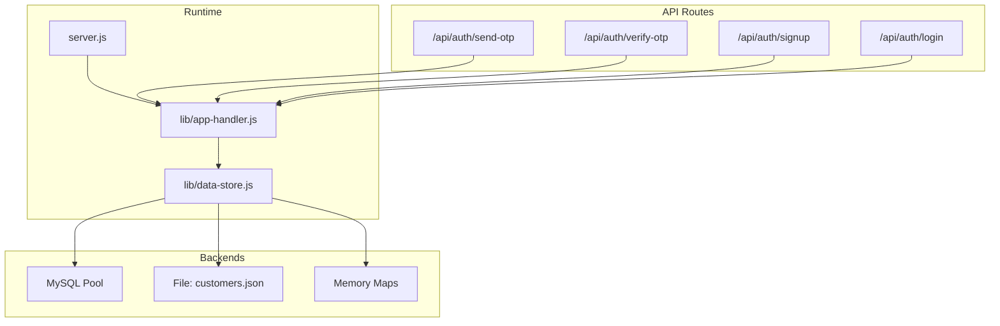
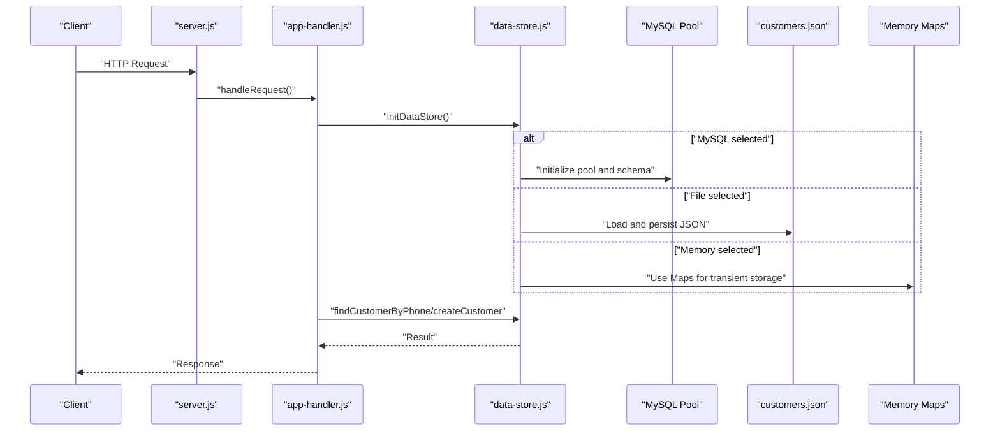
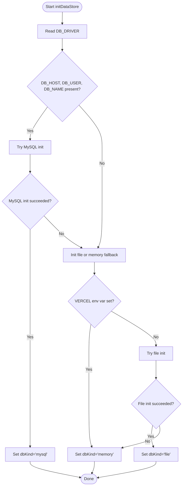
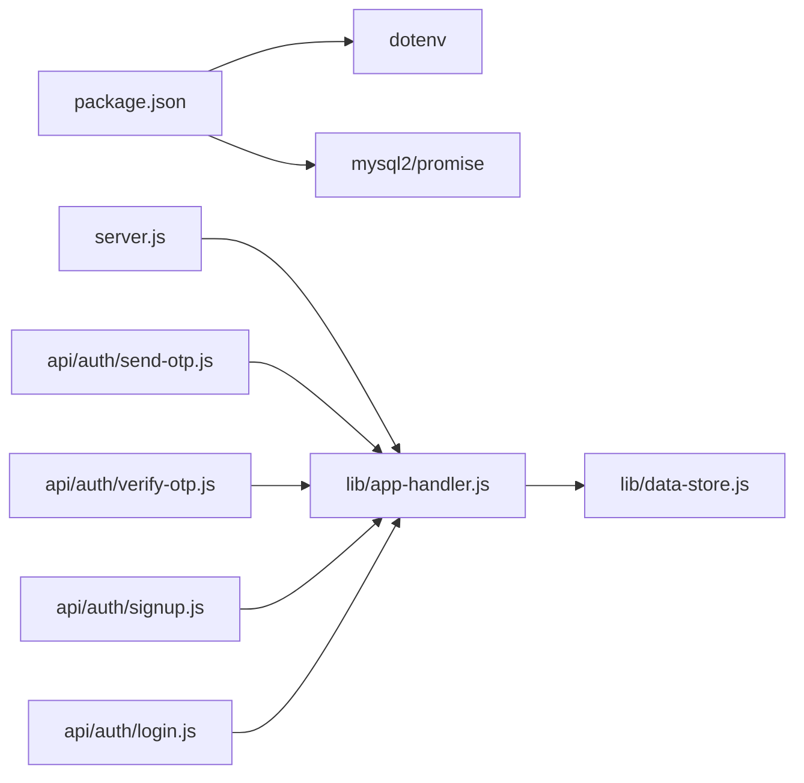

# Storage Backends

<cite>
**Referenced Files in This Document**
- [data-store.js](file://lib/data-store.js)
- [app-handler.js](file://lib/app-handler.js)
- [server.js](file://server.js)
- [customers.json](file://customers.json)
- [package.json](file://package.json)
- [vercel.json](file://vercel.json)
- [login.js](file://api/auth/login.js)
- [signup.js](file://api/auth/signup.js)
- [send-otp.js](file://api/auth/send-otp.js)
- [verify-otp.js](file://api/auth/verify-otp.js)
</cite>

## Table of Contents
1. [Introduction](#introduction)
2. [Project Structure](#project-structure)
3. [Core Components](#core-components)
4. [Architecture Overview](#architecture-overview)
5. [Detailed Component Analysis](#detailed-component-analysis)
6. [Dependency Analysis](#dependency-analysis)
7. [Performance Considerations](#performance-considerations)
8. [Troubleshooting Guide](#troubleshooting-guide)
9. [Conclusion](#conclusion)
10. [Appendices](#appendices)

## Introduction
This document explains the storage backends supported by Night Foodies and how they are initialized and used at runtime. The application supports three storage modes:
- MySQL: persistent relational storage with connection pooling and schema initialization.
- JSON file: local file-backed persistence for customer records.
- In-memory: transient Map-based storage, suitable for development and serverless cold-start scenarios.

It covers configuration options, initialization procedures, schema details, and operational guidance for each backend, including performance characteristics, scalability limitations, and migration procedures between backends.

## Project Structure
The storage logic is centralized in a dedicated module that is consumed by the HTTP server and serverless API routes.

**Diagram sources**
- [server.js:1-35](file://server.js#L1-L35)
- [app-handler.js:1-332](file://lib/app-handler.js#L1-L332)
- [data-store.js:1-291](file://lib/data-store.js#L1-L291)

**Section sources**
- [server.js:1-35](file://server.js#L1-L35)
- [app-handler.js:1-332](file://lib/app-handler.js#L1-L332)
- [data-store.js:1-291](file://lib/data-store.js#L1-L291)

## Core Components
- Data Store Module: Initializes and selects the storage backend based on environment variables and platform constraints. It exposes functions to create and query customers, manage OTPs, and report the active backend.
- Application Handler: Integrates the data store into HTTP handlers and serverless routes, parsing requests, validating inputs, and delegating to the data store.
- Server: Boots the HTTP server and initializes the data store before serving requests.
- Serverless Routes: Thin wrappers around the application handler for Vercel serverless endpoints.

Key responsibilities:
- Backend selection and initialization
- Customer CRUD operations
- OTP lifecycle management
- Static asset serving and routing

**Section sources**
- [data-store.js:1-291](file://lib/data-store.js#L1-L291)
- [app-handler.js:1-332](file://lib/app-handler.js#L1-L332)
- [server.js:1-35](file://server.js#L1-L35)
- [login.js:1-7](file://api/auth/login.js#L1-L7)
- [signup.js:1-7](file://api/auth/signup.js#L1-L7)
- [send-otp.js:1-7](file://api/auth/send-otp.js#L1-L7)
- [verify-otp.js:1-7](file://api/auth/verify-otp.js#L1-L7)

## Architecture Overview
The runtime architecture routes HTTP requests through the application handler to the selected storage backend. Initialization is performed once and shared across all handlers.

**Diagram sources**
- [server.js:7-32](file://server.js#L7-L32)
- [app-handler.js:297-309](file://lib/app-handler.js#L297-L309)
- [data-store.js:158-214](file://lib/data-store.js#L158-L214)
- [data-store.js:216-264](file://lib/data-store.js#L216-L264)

## Detailed Component Analysis

### MySQL Backend
- Purpose: Persistent, relational storage with indexing and constraints.
- Connection Pooling: Uses a promise-based MySQL client with configurable limits and queue behavior.
- Schema: Defines a customers table with primary key and unique constraint on phone.
- Initialization: Creates the database and table if missing; sets the active backend mode.

Configuration options:
- DB_HOST, DB_PORT, DB_USER, DB_PASSWORD, DB_NAME
- DB_DRIVER set to "mysql" to force MySQL mode

Initialization procedure:
- Bootstrap a pool to create the database if absent.
- Recreate a pool targeting the named database.
- Create the customers table with primary key and unique index on phone.

Constraints and indexes:
- Primary key: id (VARCHAR)
- Unique index: phone (VARCHAR)

Operational notes:
- Connection pooling is enabled with a fixed limit.
- Schema creation runs once during initialization.

**Section sources**
- [data-store.js:68-101](file://lib/data-store.js#L68-L101)
- [data-store.js:86-97](file://lib/data-store.js#L86-L97)
- [data-store.js:163-180](file://lib/data-store.js#L163-L180)

### JSON File Storage
- Purpose: Local, file-backed persistence for customer records.
- Path Resolution: Respects CUSTOMERS_FILE environment variable; otherwise defaults to customers.json in the current working directory.
- Serialization: Reads and writes a JSON array of normalized customer records.
- Persistence: Writes back to disk after insertions.

Normalization:
- Ensures consistent field types and trimming for id, fullName, phone, email, address, password, createdAt.

Fallback behavior:
- If file initialization fails, falls back to memory mode.
- On Vercel, file storage is not persistent; the system automatically falls back to memory.

**Section sources**
- [data-store.js:19-25](file://lib/data-store.js#L19-L25)
- [data-store.js:34-44](file://lib/data-store.js#L34-L44)
- [data-store.js:46-66](file://lib/data-store.js#L46-L66)
- [data-store.js:103-110](file://lib/data-store.js#L103-L110)
- [data-store.js:112-123](file://lib/data-store.js#L112-L123)
- [data-store.js:131-138](file://lib/data-store.js#L131-L138)
- [data-store.js:187-194](file://lib/data-store.js#L187-L194)

### In-Memory Storage
- Purpose: Transient storage using Map-based structures for phone-to-customer and OTP entries.
- Data structures:
  - memoryCustomers: Map keyed by phone number.
  - otpStore: Map keyed by phone number storing OTP and expiration.
- Deployment considerations:
  - Data resets on cold starts.
  - Recommended for development and serverless environments where persistence is not guaranteed.

**Section sources**
- [data-store.js:6](file://lib/data-store.js#L6-L7)
- [data-store.js:257-264](file://lib/data-store.js#L257-L264)
- [data-store.js:266-276](file://lib/data-store.js#L266-L276)
- [data-store.js:125-129](file://lib/data-store.js#L125-L129)
- [data-store.js:140-147](file://lib/data-store.js#L140-L147)

### Backend Selection Logic
The system chooses the backend based on environment variables and platform constraints:

**Diagram sources**
- [data-store.js:158-214](file://lib/data-store.js#L158-L214)

**Section sources**
- [data-store.js:158-214](file://lib/data-store.js#L158-L214)

### API Integration and OTP Management
- OTP lifecycle: Generated, stored with expiration, validated, and cleared upon verification.
- Authentication endpoints:
  - Send OTP: Validates phone, generates 6-digit OTP, stores with expiry.
  - Verify OTP: Checks existence, expiry, and correctness; clears OTP on success.
  - Signup: Inserts a new customer; warns if using memory mode.
  - Login: Retrieves customer by phone and validates password.

**Section sources**
- [app-handler.js:98-170](file://lib/app-handler.js#L98-L170)
- [app-handler.js:172-225](file://lib/app-handler.js#L172-L225)
- [app-handler.js:227-269](file://lib/app-handler.js#L227-L269)
- [data-store.js:266-276](file://lib/data-store.js#L266-L276)

## Dependency Analysis
- Runtime dependencies:
  - dotenv: Loads environment variables from .env files.
  - mysql2/promise: Provides asynchronous MySQL operations and connection pooling.
- Internal dependencies:
  - server.js depends on app-handler.js for request handling and data store initialization.
  - app-handler.js depends on data-store.js for customer and OTP operations.
  - Serverless routes depend on app-handler.js for endpoint handling.

**Diagram sources**
- [package.json:13-16](file://package.json#L13-L16)
- [server.js:1-3](file://server.js#L1-L3)
- [app-handler.js:3-11](file://lib/app-handler.js#L3-L11)
- [data-store.js:1-4](file://lib/data-store.js#L1-L4)
- [login.js:1-7](file://api/auth/login.js#L1-L7)
- [signup.js:1-7](file://api/auth/signup.js#L1-L7)
- [send-otp.js:1-7](file://api/auth/send-otp.js#L1-L7)
- [verify-otp.js:1-7](file://api/auth/verify-otp.js#L1-L7)

**Section sources**
- [package.json:13-16](file://package.json#L13-L16)
- [server.js:1-3](file://server.js#L1-L3)
- [app-handler.js:3-11](file://lib/app-handler.js#L3-L11)
- [data-store.js:1-4](file://lib/data-store.js#L1-L4)

## Performance Considerations
- MySQL
  - Connection pooling: Configured with a fixed limit and queue behavior; suitable for moderate concurrency.
  - Indexing: Unique index on phone enables efficient lookups.
  - Scalability: Relational model scales with proper indexing and hardware; consider read replicas and connection tuning for higher loads.
- JSON File
  - I/O bound: Reads entire file on load and writes on every insertion; acceptable for small datasets.
  - Concurrency: No built-in locking; avoid concurrent writers.
  - Persistence: Not persistent on serverless platforms; use MySQL for production.
- In-Memory
  - Fastest for read/write operations.
  - Volatile: Data lost on restarts; ideal for ephemeral environments.

[No sources needed since this section provides general guidance]

## Troubleshooting Guide
Common issues and resolutions:
- MySQL initialization failures
  - Cause: Missing or invalid DB credentials or network issues.
  - Action: Verify DB_HOST, DB_PORT, DB_USER, DB_PASSWORD, DB_NAME; ensure the database is reachable.
  - Behavior: Falls back to file or memory depending on environment.
- File storage errors
  - Cause: Permission denied or invalid path.
  - Action: Check CUSTOMERS_FILE path permissions; ensure parent directories exist.
  - Behavior: Falls back to memory mode.
- Vercel deployment
  - Observation: Local file storage is not persistent.
  - Action: Configure MySQL environment variables; DB_DRIVER can be set to "memory" via Vercel configuration.
- Duplicate phone number
  - Cause: Attempting to sign up with an existing phone.
  - Action: Use a different phone or log in instead.
- OTP validation failures
  - Cause: Expired or incorrect OTP.
  - Action: Request a new OTP; ensure phone format is correct.

**Section sources**
- [data-store.js:149-156](file://lib/data-store.js#L149-L156)
- [data-store.js:131-138](file://lib/data-store.js#L131-L138)
- [data-store.js:187-194](file://lib/data-store.js#L187-L194)
- [app-handler.js:216-224](file://lib/app-handler.js#L216-L224)
- [app-handler.js:157-161](file://lib/app-handler.js#L157-L161)
- [vercel.json:44-46](file://vercel.json#L44-L46)

## Conclusion
Night Foodies supports three storage backends tailored to different environments:
- MySQL for production-grade persistence and scalability.
- JSON file for local development and small-scale deployments.
- In-memory for ephemeral environments and serverless cold-start scenarios.

Backend selection is automatic based on environment variables and platform constraints, with clear fallbacks and warnings. For production, configure MySQL and monitor connection pooling and schema performance.

[No sources needed since this section summarizes without analyzing specific files]

## Appendices

### Setup Instructions
- Prerequisites
  - Node.js runtime.
  - MySQL server (for MySQL mode) or a writable directory (for file mode).
- Environment variables
  - MySQL mode:
    - DB_HOST, DB_PORT, DB_USER, DB_PASSWORD, DB_NAME
  - File mode:
    - CUSTOMERS_FILE (optional; defaults to customers.json)
  - Forced backend:
    - DB_DRIVER: "mysql", "file", "memory"
  - Platform:
    - VERCEL: triggers serverless behavior and memory fallback
- Running locally
  - Start the server; it initializes the data store and serves static assets and API routes.
- Serverless (Vercel)
  - Routes are defined under /api/auth; DB_DRIVER is set to "memory" by default.

**Section sources**
- [server.js:5-32](file://server.js#L5-L32)
- [vercel.json:26-46](file://vercel.json#L26-L46)
- [data-store.js:163-207](file://lib/data-store.js#L163-L207)

### Migration Procedures
- From MySQL to File
  - Export data from MySQL to a JSON array compatible with the expected schema.
  - Set CUSTOMERS_FILE to point to the target file.
  - Set DB_DRIVER to "file".
  - Start the server; it will initialize file mode and load the customer records.
- From File to MySQL
  - Ensure DB_HOST, DB_PORT, DB_USER, DB_PASSWORD, DB_NAME are configured.
  - Start the server; it will initialize MySQL and create the schema.
  - Import existing customer records into the MySQL table.
- From File/MySQL to In-Memory
  - Set DB_DRIVER to "memory".
  - Start the server; note that data will be transient and reset on cold starts.
- From In-Memory to MySQL
  - Configure MySQL environment variables.
  - Start the server; it will initialize MySQL and create the schema.
  - Re-seed data as needed.

**Section sources**
- [data-store.js:112-123](file://lib/data-store.js#L112-L123)
- [data-store.js:68-101](file://lib/data-store.js#L68-L101)
- [data-store.js:182-184](file://lib/data-store.js#L182-L184)
- [data-store.js:187-194](file://lib/data-store.js#L187-L194)

### Backend-Specific Configuration Options
- MySQL
  - DB_HOST, DB_PORT, DB_USER, DB_PASSWORD, DB_NAME
  - DB_DRIVER: "mysql"
- File
  - CUSTOMERS_FILE: absolute or relative path to the JSON file
  - DB_DRIVER: "file" or "json" or unset
- In-Memory
  - DB_DRIVER: "memory"
  - VERCEL: triggers automatic memory fallback

**Section sources**
- [data-store.js:68-84](file://lib/data-store.js#L68-L84)
- [data-store.js:19-25](file://lib/data-store.js#L19-L25)
- [data-store.js:163-207](file://lib/data-store.js#L163-L207)
- [vercel.json:44-46](file://vercel.json#L44-L46)

### Use Case Recommendations
- Development and testing
  - File mode for local persistence; MySQL for CI/CD pipelines.
- Production
  - MySQL for durable, scalable persistence; monitor pool usage and schema growth.
- Serverless (e.g., Vercel)
  - Prefer MySQL for persistent data; if using memory, accept transient behavior.

[No sources needed since this section provides general guidance]