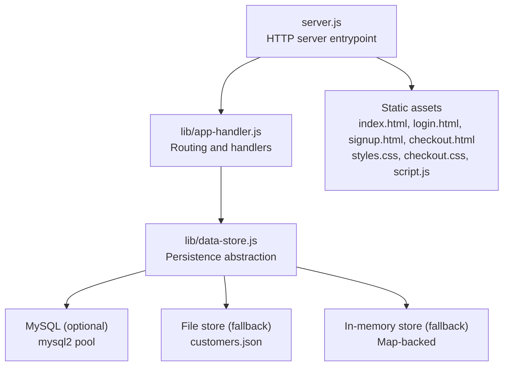
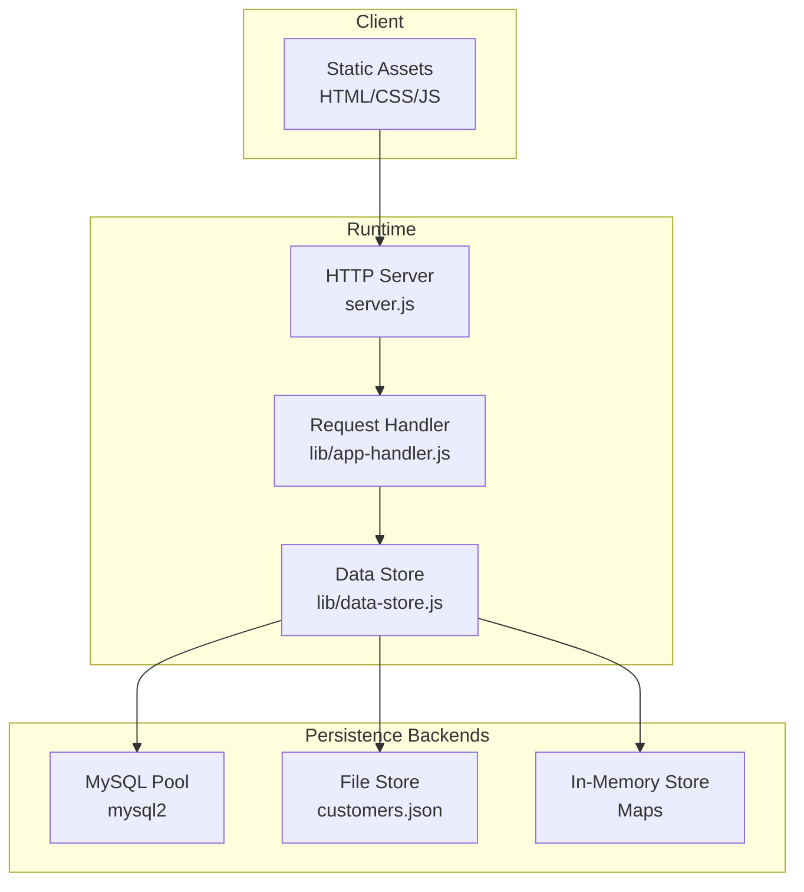

# Deployment Guide

<cite>
**Referenced Files in This Document**
- [package.json](file://package.json)
- [server.js](file://server.js)
- [lib/app-handler.js](file://lib/app-handler.js)
- [lib/data-store.js](file://lib/data-store.js)
- [index.html](file://index.html)
- [login.html](file://login.html)
- [signup.html](file://signup.html)
- [checkout.html](file://checkout.html)
- [styles.css](file://styles.css)
- [checkout.css](file://checkout.css)
- [script.js](file://script.js)
</cite>

## Table of Contents
1. [Introduction](#introduction)
2. [Project Structure](#project-structure)
3. [Core Components](#core-components)
4. [Architecture Overview](#architecture-overview)
5. [Detailed Component Analysis](#detailed-component-analysis)
6. [Dependency Analysis](#dependency-analysis)
7. [Performance Considerations](#performance-considerations)
8. [Troubleshooting Guide](#troubleshooting-guide)
9. [Conclusion](#conclusion)
10. [Appendices](#appendices)

## Introduction
This guide provides end-to-end deployment instructions for the Night Foodies application. It covers local development setup, production deployment requirements, server and containerization options, monitoring and logging, rollback and disaster recovery, scaling and load balancing, and operational checklists. The application is a Node.js HTTP server with embedded static asset serving and pluggable persistence (in-memory, file-based JSON, or MySQL).

## Project Structure
The repository is organized around a minimal Node.js server that serves static HTML/CSS/JS assets and exposes a small set of authentication APIs. Persistence is abstracted via a data store module supporting multiple backends.

**Diagram sources**
- [server.js:1-35](file://server.js#L1-L35)
- [lib/app-handler.js:1-332](file://lib/app-handler.js#L1-L332)
- [lib/data-store.js:1-291](file://lib/data-store.js#L1-L291)

**Section sources**
- [server.js:1-35](file://server.js#L1-L35)
- [lib/app-handler.js:1-332](file://lib/app-handler.js#L1-L332)
- [lib/data-store.js:1-291](file://lib/data-store.js#L1-L291)

## Core Components
- HTTP server and lifecycle
  - Creates an HTTP server, initializes the data store, and logs startup.
  - Handles uncaught errors during initialization and request processing.
- Request routing and handler
  - Parses JSON bodies, validates inputs, and dispatches to API endpoints.
  - Serves static assets for non-API requests.
- Data store abstraction
  - Supports MySQL, file-based JSON, and in-memory modes with graceful fallbacks.
  - Initializes database schema and enforces uniqueness constraints.
- Frontend assets
  - Single-page application logic with client-side routing and cart persistence.

Key runtime and environment behaviors:
- Node.js engine requirement is pinned to a specific major version.
- Environment variables control persistence mode and MySQL connectivity.
- Server listens on a configurable port.

**Section sources**
- [package.json:1-17](file://package.json#L1-L17)
- [server.js:1-35](file://server.js#L1-L35)
- [lib/app-handler.js:1-332](file://lib/app-handler.js#L1-L332)
- [lib/data-store.js:1-291](file://lib/data-store.js#L1-L291)

## Architecture Overview
The application follows a thin server model:
- The server delegates API handling to a handler module.
- The handler module depends on a data store module for persistence.
- Static assets are served directly from the filesystem.

**Diagram sources**
- [server.js:1-35](file://server.js#L1-L35)
- [lib/app-handler.js:1-332](file://lib/app-handler.js#L1-L332)
- [lib/data-store.js:1-291](file://lib/data-store.js#L1-L291)

## Detailed Component Analysis

### HTTP Server and Startup
- Loads environment variables, initializes the data store, and starts the HTTP server.
- Logs startup and handles initialization failures by exiting with a non-zero code and printing a hint for serverless environments.

Operational notes:
- Configure the PORT environment variable for production deployments.
- Ensure the working directory contains writable locations for file-based persistence.

**Section sources**
- [server.js:1-35](file://server.js#L1-L35)

### Request Routing and Handlers
- Routes API endpoints under /api/auth for sending OTP, verifying OTP, signing up, and logging in.
- Validates inputs and responds with structured JSON.
- Serves static assets for non-API paths after normalizing and resolving the file path safely.

Security and correctness:
- Normalizes and sanitizes file paths to prevent directory traversal.
- Returns appropriate HTTP status codes for validation and error conditions.

**Section sources**
- [lib/app-handler.js:271-309](file://lib/app-handler.js#L271-L309)
- [lib/app-handler.js:311-325](file://lib/app-handler.js#L311-L325)

### Data Store Abstraction
- Supports three modes:
  - MySQL: Creates database and table if missing, enforces unique phone constraint.
  - File-based JSON: Reads/writes customer records to a JSON file with automatic directory creation.
  - In-memory: Uses Map-backed stores for transient data.
- Graceful fallbacks:
  - Attempts MySQL; falls back to file; then to in-memory if needed.
  - On Vercel, file-based storage is not persistent; defaults to in-memory.

Environment variables:
- DB_DRIVER: Explicitly selects backend ("mysql", "file", "memory").
- DB_HOST, DB_PORT, DB_USER, DB_PASSWORD, DB_NAME: MySQL configuration.
- CUSTOMERS_FILE: Path to the JSON file for file-based store.
- VERCEL: Detects serverless hosting to adjust behavior.

**Section sources**
- [lib/data-store.js:68-101](file://lib/data-store.js#L68-L101)
- [lib/data-store.js:103-123](file://lib/data-store.js#L103-L123)
- [lib/data-store.js:125-138](file://lib/data-store.js#L125-L138)
- [lib/data-store.js:140-214](file://lib/data-store.js#L140-L214)
- [lib/data-store.js:216-264](file://lib/data-store.js#L216-L264)

### Frontend Application
- Single-page app with client-side navigation and cart persistence in localStorage.
- Makes authenticated POST requests to /api/auth endpoints.
- Provides responsive UI with glassmorphism styling and dynamic cart totals.

Operational notes:
- Requires the server to be running locally or behind a reverse proxy for API calls.
- Avoid opening HTML files directly in the browser; use a local server.

**Section sources**
- [script.js:87-120](file://script.js#L87-L120)
- [script.js:122-148](file://script.js#L122-L148)
- [script.js:156-186](file://script.js#L156-L186)
- [index.html:1-105](file://index.html#L1-L105)
- [login.html:1-54](file://login.html#L1-L54)
- [signup.html:1-67](file://signup.html#L1-L67)
- [checkout.html:1-88](file://checkout.html#L1-L88)
- [styles.css:1-735](file://styles.css#L1-L735)
- [checkout.css:1-110](file://checkout.css#L1-L110)

## Dependency Analysis
- Runtime dependencies
  - dotenv: Loads environment variables from .env files.
  - mysql2: MySQL driver and promise-based pool for database operations.
- Scripts
  - start: Runs the server using Node.js.

Version and compatibility
- Node.js engine is pinned to a specific major version.

**Section sources**
- [package.json:1-17](file://package.json#L1-L17)

## Performance Considerations
- Database pooling
  - The MySQL pool is configured with a fixed connection limit suitable for small deployments.
  - For higher concurrency, tune connectionLimit and consider external connection pooling.
- File-based persistence
  - JSON reads/writes occur synchronously in some paths; consider moving to asynchronous writes and caching for improved throughput.
- Static asset serving
  - The server serves static files directly; for production, offload static assets to a CDN or reverse proxy to reduce CPU load.
- Request parsing
  - Body parsing is synchronous; consider streaming parsers for large payloads.
- Caching
  - Introduce response caching for read-heavy endpoints and static assets.
- Concurrency
  - The server is single-process; scale horizontally with multiple instances behind a load balancer.

[No sources needed since this section provides general guidance]

## Troubleshooting Guide
Common deployment issues and resolutions:
- Server fails to start
  - Verify Node.js version matches the engine requirement.
  - Check that required environment variables for MySQL are set if using that backend.
  - Review initialization logs for fallback behavior.
- Authentication endpoints fail
  - Confirm the server is reachable at the expected host/port.
  - Ensure CORS is not blocking requests if served from a different origin.
- Static assets not loading
  - Confirm the working directory is correct and assets are present.
  - Avoid opening HTML files directly; use a local server.
- MySQL connectivity errors
  - Validate host, port, user, password, and database name.
  - Ensure the database server is reachable from the deployment environment.
- Data not persisting
  - On serverless platforms, file-based storage is not persistent; configure MySQL or accept in-memory behavior.

**Section sources**
- [server.js:24-31](file://server.js#L24-L31)
- [lib/data-store.js:140-214](file://lib/data-store.js#L140-L214)

## Conclusion
Night Foodies is designed for simplicity and portability. For production, pair the Node.js server with a managed MySQL service, deploy behind a CDN/reverse proxy for static assets, and scale horizontally. Use environment variables to control persistence and ensure robust monitoring and backups for reliability.

[No sources needed since this section summarizes without analyzing specific files]

## Appendices

### Local Development Setup
- Prerequisites
  - Node.js matching the engine requirement.
  - Optional: MySQL server or a managed MySQL service.
- Steps
  - Install dependencies.
  - Set environment variables for persistence mode and MySQL credentials if desired.
  - Run the server using the start script.
  - Access the application via the configured port.
- Hot reload and debugging
  - Use a Node.js debugger to attach to the running process.
  - For rapid iteration, consider nodemon or similar tools to restart on file changes.
- Development server optimization
  - Serve static assets via a reverse proxy or CDN.
  - Enable gzip/brotli compression at the proxy level.

**Section sources**
- [package.json:6-11](file://package.json#L6-L11)
- [server.js:5-35](file://server.js#L5-L35)

### Production Deployment Requirements
- Node.js version compatibility
  - Match the engine requirement exactly.
- System dependencies
  - Ensure the runtime has access to the filesystem for file-based persistence.
  - For MySQL, ensure network access to the database endpoint.
- Performance optimization
  - Use a reverse proxy to serve static assets and compress responses.
  - Scale horizontally with multiple server instances behind a load balancer.
  - Tune MySQL connection limits and consider read replicas for scaling.

**Section sources**
- [package.json:9-11](file://package.json#L9-L11)
- [lib/data-store.js:68-101](file://lib/data-store.js#L68-L101)

### Server Requirements
- Hardware specifications
  - Start with modest resources; scale based on traffic and database load.
- Network configuration
  - Expose the application port securely; restrict inbound access via firewall rules.
  - Configure health checks to monitor uptime.
- Security hardening
  - Enforce HTTPS at the edge (reverse proxy or CDN).
  - Sanitize and validate all inputs on the server.
  - Rotate secrets and limit permissions for database access.

[No sources needed since this section provides general guidance]

### Containerization with Docker
- Build and run
  - Create a Dockerfile that installs dependencies and runs the start script.
  - Mount volumes for persistent data if using file-based storage.
  - Expose the application port and set environment variables for persistence.
- Orchestration
  - Use Docker Compose to orchestrate the server and a MySQL service.
  - Configure health checks and restart policies.

[No sources needed since this section provides general guidance]

### Cloud Platform Deployment
- Options
  - Traditional VMs or containers with a managed MySQL service.
  - Serverless functions for API routes with a managed MySQL backend.
- Recommendations
  - Use platform-specific environment variable management and secrets.
  - Offload static assets to a CDN or object storage.

[No sources needed since this section provides general guidance]

### Serverless Deployment Strategies
- Compatibility
  - The handler supports serverless invocation for API routes.
  - On serverless platforms, file-based persistence is not persistent; rely on MySQL or in-memory behavior.
- Guidance
  - Configure environment variables for MySQL.
  - Use platform-provided logging and monitoring.

**Section sources**
- [lib/app-handler.js:311-325](file://lib/app-handler.js#L311-L325)
- [server.js:28-30](file://server.js#L28-L30)
- [lib/data-store.js:140-194](file://lib/data-store.js#L140-L194)

### Monitoring and Logging
- Health checks
  - Implement a lightweight GET endpoint to verify server readiness.
- Logging
  - Capture structured logs for requests, errors, and initialization events.
- Metrics
  - Track request latency, error rates, and database query durations.
  - Export metrics to a monitoring stack.

[No sources needed since this section provides general guidance]

### Rollback Procedures, Maintenance Windows, and Disaster Recovery
- Rollback
  - Keep previous container images or artifact versions.
  - Re-deploy with a simple A/B switch or blue/green deployment.
- Maintenance windows
  - Schedule deployments during low-traffic periods.
  - Communicate planned downtime to stakeholders.
- Disaster recovery
  - Back up the MySQL database regularly.
  - For file-based storage, back up the JSON file location.

[No sources needed since this section provides general guidance]

### Scaling, Load Balancing, and Database Optimization
- Horizontal scaling
  - Run multiple server instances behind a load balancer.
  - Ensure session-less stateless design for easy scaling.
- Load balancing
  - Use health-checked instances and sticky sessions if needed.
- Database optimization
  - Index frequently queried columns (e.g., phone).
  - Monitor slow queries and adjust pool settings.

**Section sources**
- [lib/data-store.js:86-97](file://lib/data-store.js#L86-L97)

### Deployment Checklists
- Pre-deployment
  - Verify Node.js version and environment variables.
  - Test authentication flows and static asset serving.
  - Confirm database connectivity and schema presence.
- Post-deployment
  - Validate health checks and logs.
  - Smoke-test critical user flows.
  - Confirm static assets load without mixed-content warnings.

[No sources needed since this section provides general guidance]

### Pre-Deployment Validation and Post-Deployment Verification
- Pre-deployment
  - Run unit tests for the handler and data store logic.
  - Validate environment variable combinations for each persistence mode.
- Post-deployment
  - Perform end-to-end tests for sign-up, login, and checkout.
  - Confirm database writes and reads are functioning.

[No sources needed since this section provides general guidance]