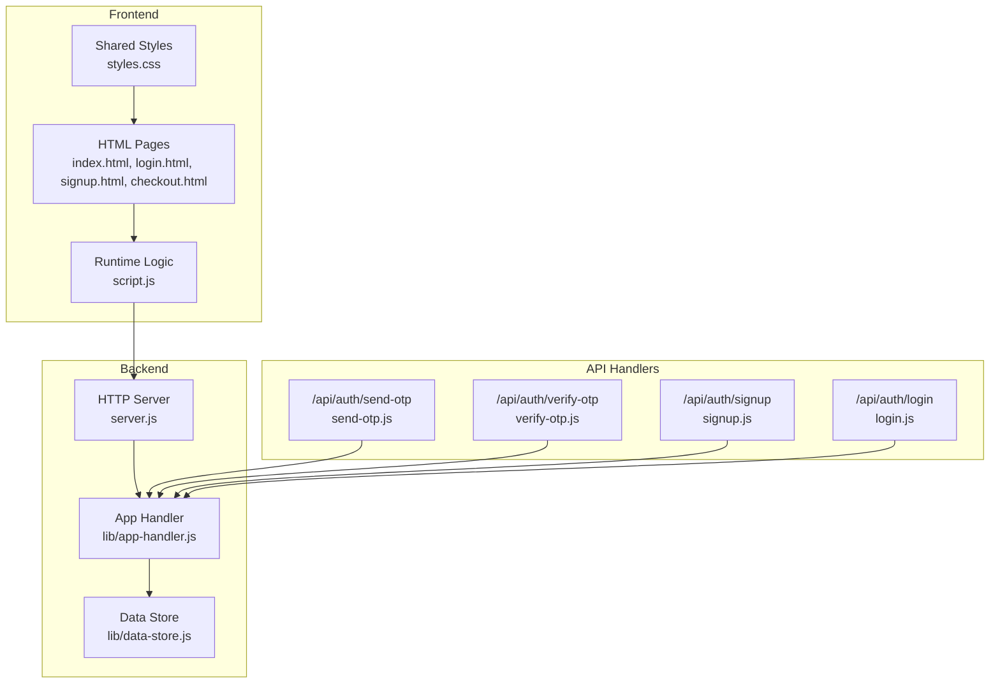
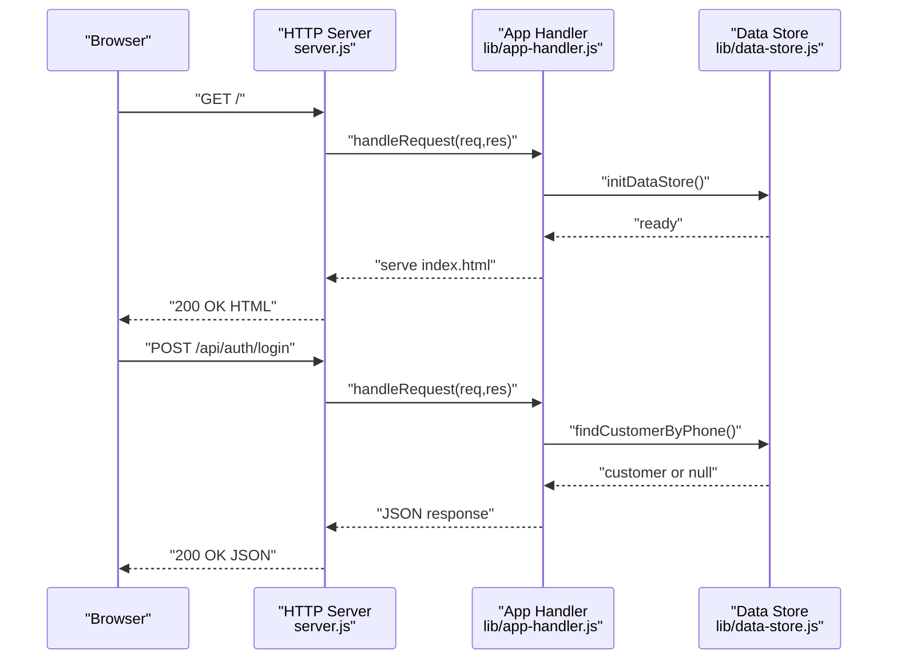
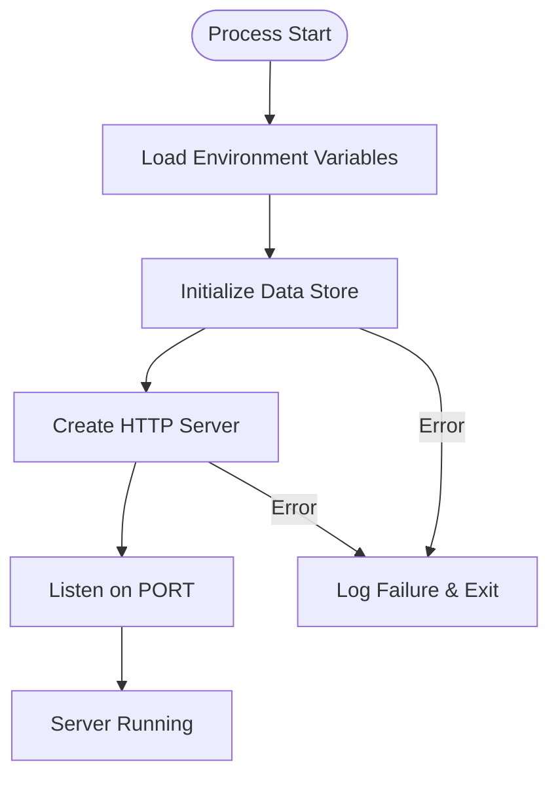
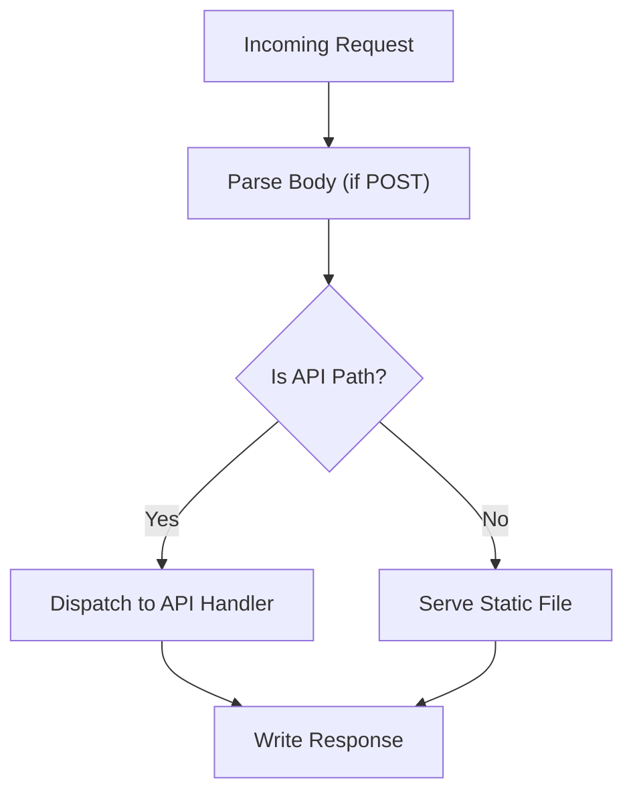
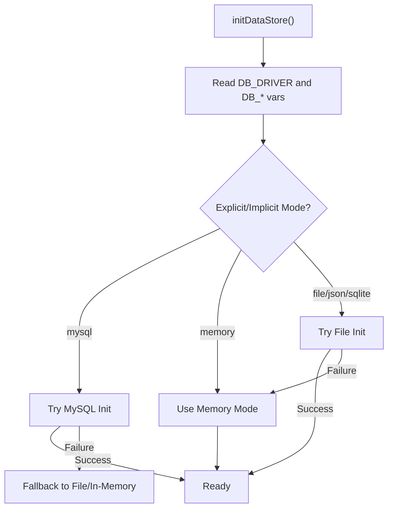
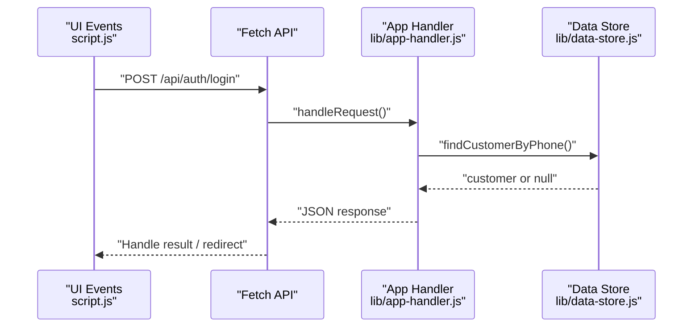
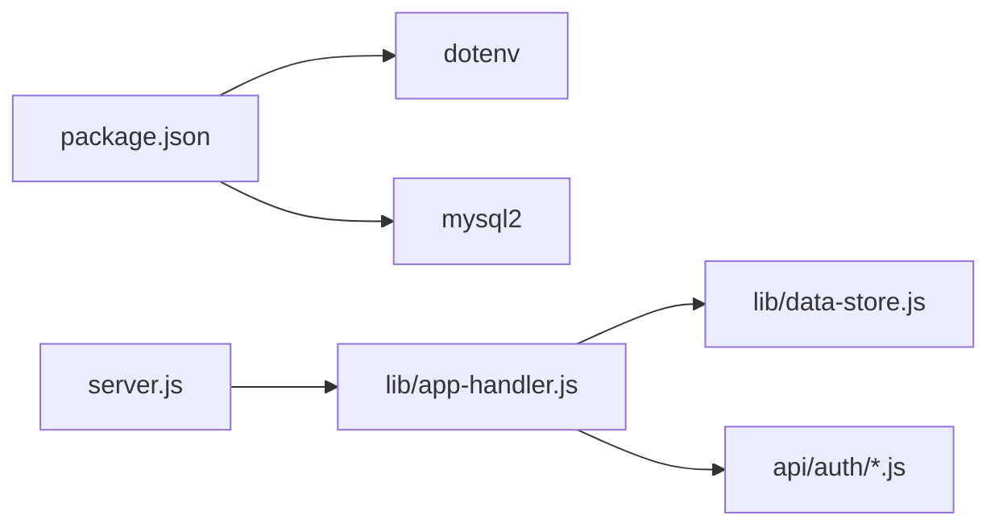

# Local Development Setup

<cite>
**Referenced Files in This Document**
- [package.json](file://package.json)
- [server.js](file://server.js)
- [lib/app-handler.js](file://lib/app-handler.js)
- [lib/data-store.js](file://lib/data-store.js)
- [api/auth/send-otp.js](file://api/auth/send-otp.js)
- [api/auth/verify-otp.js](file://api/auth/verify-otp.js)
- [api/auth/signup.js](file://api/auth/signup.js)
- [api/auth/login.js](file://api/auth/login.js)
- [script.js](file://script.js)
- [index.html](file://index.html)
- [login.html](file://login.html)
- [signup.html](file://signup.html)
- [checkout.html](file://checkout.html)
- [styles.css](file://styles.css)
</cite>

## Table of Contents
1. [Introduction](#introduction)
2. [Project Structure](#project-structure)
3. [Core Components](#core-components)
4. [Architecture Overview](#architecture-overview)
5. [Detailed Component Analysis](#detailed-component-analysis)
6. [Dependency Analysis](#dependency-analysis)
7. [Performance Considerations](#performance-considerations)
8. [Troubleshooting Guide](#troubleshooting-guide)
9. [Conclusion](#conclusion)
10. [Appendices](#appendices)

## Introduction
This document provides a complete local development setup guide for Night Foodies. It covers Node.js version requirements, dependency installation, environment variable configuration, development server startup, port configuration, hot reload alternatives, debugging techniques, development workflow, IDE setup recommendations, and troubleshooting. The project is a static-first web application with a Node.js HTTP server that serves HTML/CSS/JS and exposes a small set of authentication APIs.

## Project Structure
Night Foodies is organized into:
- Frontend: HTML pages, shared CSS, and a single JavaScript runtime bundle
- Backend: A minimal Node.js HTTP server and request routing
- Authentication API: Serverless-style handlers under api/auth/
- Data persistence: Pluggable storage modes (in-memory, file-backed JSON, MySQL)

**Diagram sources**
- [server.js:1-35](file://server.js#L1-L35)
- [lib/app-handler.js:1-332](file://lib/app-handler.js#L1-L332)
- [lib/data-store.js:1-291](file://lib/data-store.js#L1-L291)
- [api/auth/send-otp.js:1-7](file://api/auth/send-otp.js#L1-L7)
- [api/auth/verify-otp.js:1-7](file://api/auth/verify-otp.js#L1-L7)
- [api/auth/signup.js:1-7](file://api/auth/signup.js#L1-L7)
- [api/auth/login.js:1-7](file://api/auth/login.js#L1-L7)
- [script.js:1-450](file://script.js#L1-L450)
- [index.html:1-105](file://index.html#L1-L105)
- [login.html:1-54](file://login.html#L1-L54)
- [signup.html:1-67](file://signup.html#L1-L67)
- [checkout.html:1-88](file://checkout.html#L1-L88)
- [styles.css:1-735](file://styles.css#L1-L735)

**Section sources**
- [package.json:1-18](file://package.json#L1-L18)
- [server.js:1-35](file://server.js#L1-L35)
- [lib/app-handler.js:1-332](file://lib/app-handler.js#L1-L332)
- [lib/data-store.js:1-291](file://lib/data-store.js#L1-L291)
- [api/auth/send-otp.js:1-7](file://api/auth/send-otp.js#L1-L7)
- [api/auth/verify-otp.js:1-7](file://api/auth/verify-otp.js#L1-L7)
- [api/auth/signup.js:1-7](file://api/auth/signup.js#L1-L7)
- [api/auth/login.js:1-7](file://api/auth/login.js#L1-L7)
- [script.js:1-450](file://script.js#L1-L450)
- [index.html:1-105](file://index.html#L1-L105)
- [login.html:1-54](file://login.html#L1-L54)
- [signup.html:1-67](file://signup.html#L1-L67)
- [checkout.html:1-88](file://checkout.html#L1-L88)
- [styles.css:1-735](file://styles.css#L1-L735)

## Core Components
- HTTP Server: Starts the Node.js HTTP server, loads environment variables, initializes the data store, and registers request handling.
- App Handler: Routes requests to either API endpoints or serves static files. Handles JSON parsing, content-type mapping, and static file serving.
- Data Store: Provides pluggable persistence modes (in-memory, file-backed JSON, MySQL). Initializes storage based on environment variables and availability.
- API Handlers: Thin wrappers around the app handler to expose authentication endpoints as serverless-style handlers.
- Frontend Runtime: Single-page application logic in script.js that handles authentication forms, cart operations, and network requests to the backend.

Key implementation references:
- Server startup and error logging: [server.js:1-35](file://server.js#L1-L35)
- Request routing and static serving: [lib/app-handler.js:297-309](file://lib/app-handler.js#L297-L309)
- Data store initialization and fallbacks: [lib/data-store.js:158-214](file://lib/data-store.js#L158-L214)
- API handler wiring: [api/auth/*.js:1-7](file://api/auth/send-otp.js#L1-L7)

**Section sources**
- [server.js:1-35](file://server.js#L1-L35)
- [lib/app-handler.js:1-332](file://lib/app-handler.js#L1-L332)
- [lib/data-store.js:1-291](file://lib/data-store.js#L1-L291)
- [api/auth/send-otp.js:1-7](file://api/auth/send-otp.js#L1-L7)
- [api/auth/verify-otp.js:1-7](file://api/auth/verify-otp.js#L1-L7)
- [api/auth/signup.js:1-7](file://api/auth/signup.js#L1-L7)
- [api/auth/login.js:1-7](file://api/auth/login.js#L1-L7)

## Architecture Overview
The development stack consists of:
- A Node.js HTTP server that serves static assets and handles API requests
- A pluggable data store that can use in-memory, file-backed JSON, or MySQL
- A single-page application that communicates with the backend via fetch

**Diagram sources**
- [server.js:1-35](file://server.js#L1-L35)
- [lib/app-handler.js:297-309](file://lib/app-handler.js#L297-L309)
- [lib/data-store.js:216-229](file://lib/data-store.js#L216-L229)

## Detailed Component Analysis

### HTTP Server Startup
- Loads environment variables via dotenv
- Initializes the data store
- Creates an HTTP server and listens on PORT (default 3000)
- Logs startup messages and handles uncaught errors gracefully

**Diagram sources**
- [server.js:1-35](file://server.js#L1-L35)

**Section sources**
- [server.js:1-35](file://server.js#L1-L35)

### App Handler: Routing and Static Serving
- Parses JSON bodies for POST requests
- Routes API endpoints to specific handlers
- Serves static files with appropriate content types
- Normalizes paths and prevents directory traversal

**Diagram sources**
- [lib/app-handler.js:30-54](file://lib/app-handler.js#L30-L54)
- [lib/app-handler.js:271-295](file://lib/app-handler.js#L271-L295)
- [lib/app-handler.js:78-96](file://lib/app-handler.js#L78-L96)

**Section sources**
- [lib/app-handler.js:1-332](file://lib/app-handler.js#L1-L332)

### Data Store: Storage Modes and Initialization
- Supports three modes: in-memory, file-backed JSON, MySQL
- Initializes based on environment variables and availability
- Falls back gracefully when preferred mode is unavailable
- Provides customer CRUD and OTP helpers

**Diagram sources**
- [lib/data-store.js:158-214](file://lib/data-store.js#L158-L214)
- [lib/data-store.js:68-101](file://lib/data-store.js#L68-L101)
- [lib/data-store.js:112-123](file://lib/data-store.js#L112-L123)

**Section sources**
- [lib/data-store.js:1-291](file://lib/data-store.js#L1-L291)

### API Handlers: Serverless Wrappers
- Each handler wraps the shared app handler for a specific action
- Exposes endpoints compatible with serverless routing patterns

**Section sources**
- [api/auth/send-otp.js:1-7](file://api/auth/send-otp.js#L1-L7)
- [api/auth/verify-otp.js:1-7](file://api/auth/verify-otp.js#L1-L7)
- [api/auth/signup.js:1-7](file://api/auth/signup.js#L1-L7)
- [api/auth/login.js:1-7](file://api/auth/login.js#L1-L7)

### Frontend Runtime: Application Logic
- Handles authentication forms and redirects
- Manages product filtering, cart operations, and checkout summary
- Performs fetch calls to backend API endpoints
- Provides user feedback and error messaging

**Diagram sources**
- [script.js:122-147](file://script.js#L122-L147)
- [lib/app-handler.js:227-269](file://lib/app-handler.js#L227-L269)
- [lib/data-store.js:216-229](file://lib/data-store.js#L216-L229)

**Section sources**
- [script.js:1-450](file://script.js#L1-L450)

## Dependency Analysis
- Node.js engine requirement: 24.x
- Dependencies:
  - dotenv: loads environment variables
  - mysql2: MySQL client for persistent storage
- Scripts:
  - start: runs the server
  - build: placeholder for static builds

**Diagram sources**
- [package.json:1-18](file://package.json#L1-L18)
- [server.js:1-35](file://server.js#L1-L35)
- [lib/app-handler.js:1-332](file://lib/app-handler.js#L1-L332)
- [lib/data-store.js:1-291](file://lib/data-store.js#L1-L291)
- [api/auth/send-otp.js:1-7](file://api/auth/send-otp.js#L1-L7)
- [api/auth/verify-otp.js:1-7](file://api/auth/verify-otp.js#L1-L7)
- [api/auth/signup.js:1-7](file://api/auth/signup.js#L1-L7)
- [api/auth/login.js:1-7](file://api/auth/login.js#L1-L7)

**Section sources**
- [package.json:1-18](file://package.json#L1-L18)

## Performance Considerations
- Static file serving: The server reads files synchronously from disk; for large assets or high concurrency, consider a reverse proxy or CDN in front of the server.
- Data store choice: In-memory mode is fastest but ephemeral; file-backed JSON is simple and sufficient for development; MySQL offers robustness and scalability.
- Network requests: The frontend performs fetch calls; avoid unnecessary re-renders by batching DOM updates and using efficient selectors.
- Asset optimization: Compress CSS/JS and images for faster load times during development.

[No sources needed since this section provides general guidance]

## Troubleshooting Guide
Common development issues and resolutions:
- Server fails to start
  - Verify Node.js version matches the required engine (24.x).
  - Ensure environment variables are loaded (dotenv).
  - Check for permission errors when initializing MySQL or writing to file storage.
- Port conflicts
  - Change PORT environment variable if 3000 is in use.
- Authentication failures
  - Confirm API endpoints are reachable and CORS is not blocking requests.
  - Validate form inputs and ensure POST bodies are properly formatted JSON.
- Static assets not loading
  - Ensure paths are correct and not attempting to traverse outside the working directory.
- MySQL connectivity
  - Verify DB_HOST, DB_PORT, DB_USER, DB_NAME, and DB_PASSWORD are set appropriately.
  - Ensure the database server is running and accessible.

**Section sources**
- [server.js:21-31](file://server.js#L21-L31)
- [lib/data-store.js:164-180](file://lib/data-store.js#L164-L180)
- [lib/app-handler.js:78-96](file://lib/app-handler.js#L78-L96)
- [script.js:87-120](file://script.js#L87-L120)

## Conclusion
Night Foodies provides a straightforward local development experience with a Node.js HTTP server, pluggable data store, and a cohesive frontend runtime. By following the setup steps below, configuring environment variables, and leveraging the built-in error logging, you can develop efficiently with reliable feedback loops.

[No sources needed since this section summarizes without analyzing specific files]

## Appendices

### Step-by-Step Setup Instructions

#### Prerequisites
- Install Node.js matching the required engine version (24.x)
- Install npm (bundled with Node.js)

#### Clone and Install
- Navigate to the project directory
- Install dependencies using npm

#### Environment Variables
Create a .env file at the project root with the following keys as needed:
- PORT: Server port (default 3000)
- DB_DRIVER: "mysql", "memory", "file", "json", or "sqlite"
- DB_HOST, DB_PORT, DB_USER, DB_PASSWORD, DB_NAME: MySQL connection details
- CUSTOMERS_FILE: Path to the JSON customer store file (when using file mode)

Notes:
- If DB_DRIVER is omitted and DB_HOST/DB_USER/DB_NAME are present, MySQL is attempted automatically.
- Unknown DB_DRIVER values fall back to file storage.
- On Vercel deployments, file storage is not persistent; the code intentionally falls back to in-memory mode.

**Section sources**
- [lib/data-store.js:158-214](file://lib/data-store.js#L158-L214)
- [lib/data-store.js:68-101](file://lib/data-store.js#L68-L101)
- [lib/data-store.js:19-25](file://lib/data-store.js#L19-L25)
- [server.js:5](file://server.js#L5)

#### Start the Development Server
- Run the start script to launch the server
- Access the application at http://localhost:PORT

Hot reload:
- The server does not include an automatic restart mechanism.
- Manual restart is required after code changes.
- For automatic restarts, integrate nodemon or a similar tool externally.

**Section sources**
- [package.json:6-8](file://package.json#L6-L8)
- [server.js:21-23](file://server.js#L21-L23)

#### Development Workflow
- File watching: Use your editor’s live reload or external tools.
- Automatic restarts: Use nodemon or equivalent to watch server files and restart the process.
- Development-specific configurations: Set NODE_ENV to development if you want to differentiate behavior in future extensions.

[No sources needed since this section provides general guidance]

#### Debugging Techniques
- Console logging: The server logs startup and error messages to the console.
- Error handling: Centralized try/catch blocks in server startup and request handling log meaningful errors and return appropriate responses.
- Frontend debugging: Use browser developer tools to inspect network requests, console logs, and DOM state.

**Section sources**
- [server.js:21-31](file://server.js#L21-L31)
- [lib/app-handler.js:12-18](file://lib/app-handler.js#L12-L18)
- [script.js:95-105](file://script.js#L95-L105)

#### IDE Setup Recommendations
- Enable ESLint/Prettier for consistent formatting
- Configure breakpoints in server.js and lib/app-handler.js for backend debugging
- Use browser devtools for frontend debugging in script.js
- Set environment variables in your IDE’s run configuration

[No sources needed since this section provides general guidance]

#### Operating System Notes
- Windows: Ensure Node.js 24.x is installed and use Command Prompt or PowerShell. Use forward slashes in paths within scripts if editing manually.
- macOS/Linux: Use terminal to install dependencies and run the server. Permissions for file storage and MySQL must be configured accordingly.

[No sources needed since this section provides general guidance]