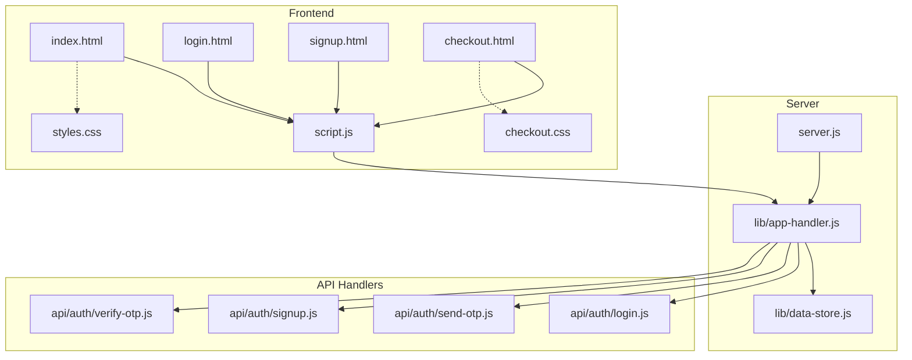
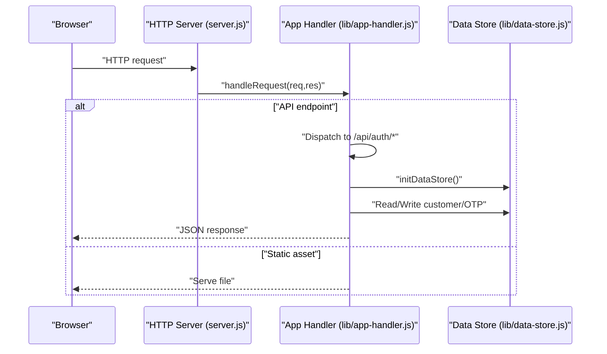
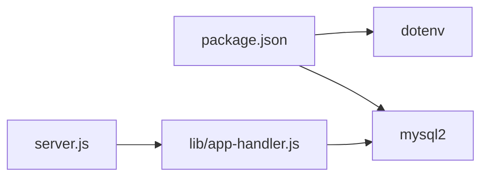

# Monitoring and Maintenance

<cite>
**Referenced Files in This Document**
- [server.js](file://server.js)
- [package.json](file://package.json)
- [lib/app-handler.js](file://lib/app-handler.js)
- [lib/data-store.js](file://lib/data-store.js)
- [api/auth/login.js](file://api/auth/login.js)
- [api/auth/send-otp.js](file://api/auth/send-otp.js)
- [api/auth/signup.js](file://api/auth/signup.js)
- [api/auth/verify-otp.js](file://api/auth/verify-otp.js)
- [script.js](file://script.js)
- [index.html](file://index.html)
- [login.html](file://login.html)
- [signup.html](file://signup.html)
- [checkout.html](file://checkout.html)
- [styles.css](file://styles.css)
- [checkout.css](file://checkout.css)
</cite>

## Table of Contents
1. [Introduction](#introduction)
2. [Project Structure](#project-structure)
3. [Core Components](#core-components)
4. [Architecture Overview](#architecture-overview)
5. [Detailed Component Analysis](#detailed-component-analysis)
6. [Dependency Analysis](#dependency-analysis)
7. [Performance Considerations](#performance-considerations)
8. [Troubleshooting Guide](#troubleshooting-guide)
9. [Conclusion](#conclusion)
10. [Appendices](#appendices)

## Introduction
This document provides comprehensive monitoring and maintenance guidance for the Night Foodies production systems. It covers health checks, server monitoring, performance metrics, logging strategies, maintenance procedures (backups, migrations, updates), alerting and incident response, capacity planning, security monitoring, and operational runbooks for 24/7 operations. The guidance is grounded in the repository’s implementation and adapted to production-grade practices.

## Project Structure
The application is a Node.js HTTP server with a simple in-memory or persistent storage backend. Authentication flows are exposed via serverless-compatible handlers under the api/auth directory. The frontend consists of static HTML/CSS/JS pages served by the same server.

**Diagram sources**
- [server.js:1-35](file://server.js#L1-L35)
- [lib/app-handler.js:1-332](file://lib/app-handler.js#L1-L332)
- [lib/data-store.js:1-291](file://lib/data-store.js#L1-L291)
- [api/auth/login.js:1-7](file://api/auth/login.js#L1-L7)
- [api/auth/send-otp.js:1-7](file://api/auth/send-otp.js#L1-L7)
- [api/auth/signup.js:1-7](file://api/auth/signup.js#L1-L7)
- [api/auth/verify-otp.js:1-7](file://api/auth/verify-otp.js#L1-L7)
- [script.js:1-450](file://script.js#L1-L450)
- [index.html:1-105](file://index.html#L1-L105)
- [login.html:1-54](file://login.html#L1-L54)
- [signup.html:1-67](file://signup.html#L1-L67)
- [checkout.html:1-88](file://checkout.html#L1-L88)
- [styles.css:1-735](file://styles.css#L1-L735)
- [checkout.css:1-110](file://checkout.css#L1-L110)

**Section sources**
- [server.js:1-35](file://server.js#L1-L35)
- [lib/app-handler.js:1-332](file://lib/app-handler.js#L1-L332)
- [lib/data-store.js:1-291](file://lib/data-store.js#L1-L291)
- [api/auth/login.js:1-7](file://api/auth/login.js#L1-L7)
- [api/auth/send-otp.js:1-7](file://api/auth/send-otp.js#L1-L7)
- [api/auth/signup.js:1-7](file://api/auth/signup.js#L1-L7)
- [api/auth/verify-otp.js:1-7](file://api/auth/verify-otp.js#L1-L7)
- [script.js:1-450](file://script.js#L1-L450)
- [index.html:1-105](file://index.html#L1-L105)
- [login.html:1-54](file://login.html#L1-L54)
- [signup.html:1-67](file://signup.html#L1-L67)
- [checkout.html:1-88](file://checkout.html#L1-L88)
- [styles.css:1-735](file://styles.css#L1-L735)
- [checkout.css:1-110](file://checkout.css#L1-L110)

## Core Components
- HTTP server and lifecycle: Initializes environment, data store, and starts the HTTP server with graceful error handling and startup diagnostics.
- Request routing and API handlers: Centralized handler dispatches requests to appropriate endpoints and serves static assets.
- Data persistence: Supports MySQL, file-based JSON, and in-memory modes with automatic fallback and initialization logic.
- Authentication flows: OTP send/verify and user signup/login endpoints exposed via serverless-compatible wrappers.
- Frontend: Static pages with client-side logic for authentication, cart, and checkout flows.

Key implementation references:
- Server bootstrap and error handling: [server.js:7-32](file://server.js#L7-L32)
- Request routing and API dispatch: [lib/app-handler.js:271-295](file://lib/app-handler.js#L271-L295)
- Data store initialization and fallback: [lib/data-store.js:140-214](file://lib/data-store.js#L140-L214)
- Authentication handlers: [api/auth/*.js:1-7](file://api/auth/login.js#L1-L7), [api/auth/send-otp.js:1-7](file://api/auth/send-otp.js#L1-L7), [api/auth/signup.js:1-7](file://api/auth/signup.js#L1-L7), [api/auth/verify-otp.js:1-7](file://api/auth/verify-otp.js#L1-L7)
- Client-side API calls: [script.js:87-120](file://script.js#L87-L120)

**Section sources**
- [server.js:1-35](file://server.js#L1-L35)
- [lib/app-handler.js:1-332](file://lib/app-handler.js#L1-L332)
- [lib/data-store.js:1-291](file://lib/data-store.js#L1-L291)
- [api/auth/login.js:1-7](file://api/auth/login.js#L1-L7)
- [api/auth/send-otp.js:1-7](file://api/auth/send-otp.js#L1-L7)
- [api/auth/signup.js:1-7](file://api/auth/signup.js#L1-L7)
- [api/auth/verify-otp.js:1-7](file://api/auth/verify-otp.js#L1-L7)
- [script.js:1-450](file://script.js#L1-L450)

## Architecture Overview
The runtime architecture combines a single-threaded Node.js HTTP server with a pluggable persistence layer. Requests are routed to either API endpoints or static asset serving. Authentication endpoints are exposed as serverless handlers for compatibility with platform deployments.

**Diagram sources**
- [server.js:11-23](file://server.js#L11-L23)
- [lib/app-handler.js:297-309](file://lib/app-handler.js#L297-L309)
- [lib/data-store.js:158-214](file://lib/data-store.js#L158-L214)

**Section sources**
- [server.js:1-35](file://server.js#L1-L35)
- [lib/app-handler.js:1-332](file://lib/app-handler.js#L1-L332)
- [lib/data-store.js:1-291](file://lib/data-store.js#L1-L291)

## Detailed Component Analysis

### Health Checks and Readiness
- Startup diagnostics: Logs environment-dependent modes and startup failures. Use this to validate environment variables and persistence configuration.
- Unhandled error handling: Catches and logs unhandled errors during request processing and responds with a generic 500 JSON payload.
- Readiness: The server listens on the configured port after initializing the data store. Add a lightweight GET endpoint returning 200 OK for readiness probes.

Recommended additions:
- Readiness endpoint: Return 200 when data store is initialized and reachable.
- Liveness endpoint: Return 200 when process is responsive.

**Section sources**
- [server.js:21-30](file://server.js#L21-L30)
- [lib/data-store.js:158-214](file://lib/data-store.js#L158-L214)

### Logging Strategies
Current behavior:
- Console logging for startup, errors, and warnings.
- No structured logging framework is integrated.

Recommendations:
- Structured logging: Use a structured logger (e.g., Winston or Pino) with JSON output for centralized log aggregation.
- Log levels: Error for unhandled exceptions; warn for fallbacks; info for startup and endpoint hits; debug for request/response bodies (with caution).
- Log rotation: Configure log rotation at the container/host level (e.g., logrotate) to prevent disk growth.
- Error tracking: Integrate an error tracking service (e.g., Sentry) to capture stack traces and context.

**Section sources**
- [server.js:15-17](file://server.js#L15-L17)
- [lib/app-handler.js:222-224](file://lib/app-handler.js#L222-L224)
- [lib/app-handler.js:266-268](file://lib/app-handler.js#L266-L268)

### Server Monitoring Setup
- Metrics: Expose Prometheus-compatible metrics (request count, latency, error rates) and integrate with a metrics collector.
- Resource monitoring: Track CPU, memory, and file descriptor usage.
- Database metrics: For MySQL mode, monitor connection pool utilization and query latency.

Implementation hooks:
- Wrap request handling to record timing and outcomes.
- Instrument data store operations for latency and error counts.

**Section sources**
- [lib/app-handler.js:271-295](file://lib/app-handler.js#L271-L295)
- [lib/data-store.js:68-101](file://lib/data-store.js#L68-L101)

### Performance Metrics Collection
- Endpoint-level metrics: Count successes/failures per route.
- Latency histograms: Record p50/p95/p99 latency per endpoint.
- Throughput: Requests per second by endpoint and method.
- Database latency: Separate metrics for MySQL vs file/in-memory modes.

**Section sources**
- [lib/app-handler.js:271-295](file://lib/app-handler.js#L271-L295)
- [lib/data-store.js:216-264](file://lib/data-store.js#L216-L264)

### Database Backup Strategies
- MySQL mode:
  - Schedule periodic logical backups (mysqldump or Percona XtraBackup).
  - Validate backups regularly and test restoration procedures.
- File mode:
  - Back up the customer JSON file location and ensure offsite replication.
- In-memory mode:
  - Not suitable for production persistence; ensure MySQL is configured in production.

Backup verification checklist:
- Confirm backup existence and integrity.
- Perform a dry-run restore on staging.
- Automate alerts on backup failures.

**Section sources**
- [lib/data-store.js:68-101](file://lib/data-store.js#L68-L101)
- [lib/data-store.js:19-25](file://lib/data-store.js#L19-L25)
- [lib/data-store.js:140-214](file://lib/data-store.js#L140-L214)

### Data Migration Processes
- Schema changes (MySQL):
  - Use idempotent migrations to alter tables and add indexes.
  - Validate constraints and unique keys before applying.
- Data fixes:
  - Use batch scripts to normalize phone numbers or addresses.
  - Ensure uniqueness constraints are respected.

Operational safety:
- Run migrations in maintenance windows.
- Use read replicas for long-running operations.
- Rollback plans for each migration.

**Section sources**
- [lib/data-store.js:86-97](file://lib/data-store.js#L86-L97)
- [lib/data-store.js:231-264](file://lib/data-store.js#L231-L264)

### System Updates and Maintenance Procedures
- Rolling restarts: Graceful shutdown with drain period to avoid dropping requests.
- Blue/green deployments: Switch traffic after validating health checks.
- Database upgrades: Test on staging; schedule downtime minimally.

**Section sources**
- [server.js:21-23](file://server.js#L21-L23)
- [package.json:6-8](file://package.json#L6-L8)

### Alerting Configuration
- Thresholds:
  - Error rate > 1% over 5 minutes.
  - Latency p95 > threshold for critical endpoints.
  - Database connection pool exhaustion.
- Channels: PagerDuty, Slack, email.
- Escalation: Tier 1 on-call triages; Tier 2 escalates after N minutes.

**Section sources**
- [lib/app-handler.js:271-295](file://lib/app-handler.js#L271-L295)
- [lib/data-store.js:68-101](file://lib/data-store.js#L68-L101)

### Incident Response Procedures
- Detection: Monitor alerts and dashboards.
- Containment: Isolate failing instances or disable problematic endpoints.
- Resolution: Apply hotfixes or rollback releases.
- Postmortem: Document root cause, impact, and remediation steps.

**Section sources**
- [server.js:15-17](file://server.js#L15-L17)
- [lib/app-handler.js:222-224](file://lib/app-handler.js#L222-L224)

### Troubleshooting Workflows
- Authentication failures:
  - Verify phone/password length/format.
  - Check OTP validity and expiration.
- Signup conflicts:
  - Duplicate phone detected; instruct user to log in.
- Network errors:
  - Client reports “cannot connect”; confirm server is running and listening.

**Section sources**
- [lib/app-handler.js:107-123](file://lib/app-handler.js#L107-L123)
- [lib/app-handler.js:125-170](file://lib/app-handler.js#L125-L170)
- [lib/app-handler.js:172-225](file://lib/app-handler.js#L172-L225)
- [script.js:96-105](file://script.js#L96-L105)

### Capacity Planning and Performance Tuning
- Horizontal scaling: Stateless server behind a load balancer.
- Vertical scaling: Increase CPU/memory based on observed latency and error rates.
- Database tuning:
  - Optimize queries and add missing indexes.
  - Adjust MySQL connection pool size.
- Caching:
  - Cache frequently accessed customer records (with invalidation).
- CDN/static assets: Serve CSS/JS/images via CDN.

**Section sources**
- [lib/data-store.js:216-264](file://lib/data-store.js#L216-L264)
- [lib/data-store.js:68-101](file://lib/data-store.js#L68-L101)

### Security Monitoring, Vulnerability Scanning, and Compliance
- Secrets management: Store DB credentials and environment variables in a secrets manager; avoid committing to source control.
- Vulnerability scanning: Scan dependencies periodically and patch promptly.
- Compliance: Enforce HTTPS, secure headers, and audit logs retention policies.

**Section sources**
- [lib/data-store.js:68-84](file://lib/data-store.js#L68-L84)
- [package.json:13-16](file://package.json#L13-L16)

### Operational Runbooks, Escalation, and Coordination
- Runbook topics:
  - Startup failure diagnostics.
  - Database initialization fallbacks.
  - Backup verification and restore drills.
- Escalation:
  - Tier 1: Resolve within 30 minutes.
  - Tier 2: Engage database/admin within 60 minutes.
- Coordination:
  - Use shared chat channels and incident commander rotation.

**Section sources**
- [server.js:24-30](file://server.js#L24-L30)
- [lib/data-store.js:140-214](file://lib/data-store.js#L140-L214)

## Dependency Analysis
Runtime dependencies and their roles:
- dotenv: Loads environment variables.
- mysql2: MySQL driver and connection pooling.
- http: Built-in Node.js server.

**Diagram sources**
- [package.json:13-16](file://package.json#L13-L16)
- [server.js:3](file://server.js#L3)
- [lib/app-handler.js:3-11](file://lib/app-handler.js#L3-L11)

**Section sources**
- [package.json:1-18](file://package.json#L1-L18)
- [server.js:1-35](file://server.js#L1-L35)
- [lib/app-handler.js:1-332](file://lib/app-handler.js#L1-L332)

## Performance Considerations
- Minimize synchronous I/O in request path; rely on async/await.
- Use connection pooling for MySQL; monitor pool saturation.
- Cache warm-up: Preload frequently accessed data to reduce cold-start latency.
- Frontend performance: Defer non-critical JS, preload critical resources.

[No sources needed since this section provides general guidance]

## Troubleshooting Guide
Common issues and resolutions:
- Server fails to start:
  - Check environment variables for MySQL configuration.
  - Review startup logs for fallback to file/memory mode.
- Authentication errors:
  - Validate phone number format and password length.
  - Confirm OTP expiration and correctness.
- Client network errors:
  - Ensure server is running locally and reachable.
  - Avoid opening HTML files directly via file://.

**Section sources**
- [server.js:24-30](file://server.js#L24-L30)
- [lib/app-handler.js:107-123](file://lib/app-handler.js#L107-L123)
- [lib/app-handler.js:125-170](file://lib/app-handler.js#L125-L170)
- [script.js:96-105](file://script.js#L96-L105)

## Conclusion
This guide outlines production-grade monitoring, maintenance, and operations practices tailored to the Night Foodies codebase. By implementing structured logging, robust alerting, resilient data persistence, and disciplined change management, the system can achieve reliable, scalable, and secure operation.

[No sources needed since this section summarizes without analyzing specific files]

## Appendices

### Appendix A: Environment Variables and Configuration
- Port: Configurable via environment variable; defaults to 3000.
- MySQL: DB_HOST, DB_PORT, DB_USER, DB_NAME, DB_PASSWORD.
- Storage: DB_DRIVER supports mysql, file/json, memory; fallback logic applies.
- Deployment: VERCEL-specific behavior switches to in-memory mode.

**Section sources**
- [server.js:5](file://server.js#L5)
- [lib/data-store.js:68-84](file://lib/data-store.js#L68-L84)
- [lib/data-store.js:140-214](file://lib/data-store.js#L140-L214)

### Appendix B: API Endpoints Reference
- POST /api/auth/send-otp
- POST /api/auth/verify-otp
- POST /api/auth/signup
- POST /api/auth/login

These endpoints are exposed via serverless-compatible handlers.

**Section sources**
- [lib/app-handler.js:274-292](file://lib/app-handler.js#L274-L292)
- [api/auth/send-otp.js:1-7](file://api/auth/send-otp.js#L1-L7)
- [api/auth/verify-otp.js:1-7](file://api/auth/verify-otp.js#L1-L7)
- [api/auth/signup.js:1-7](file://api/auth/signup.js#L1-L7)
- [api/auth/login.js:1-7](file://api/auth/login.js#L1-L7)