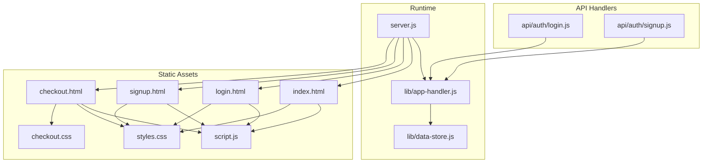
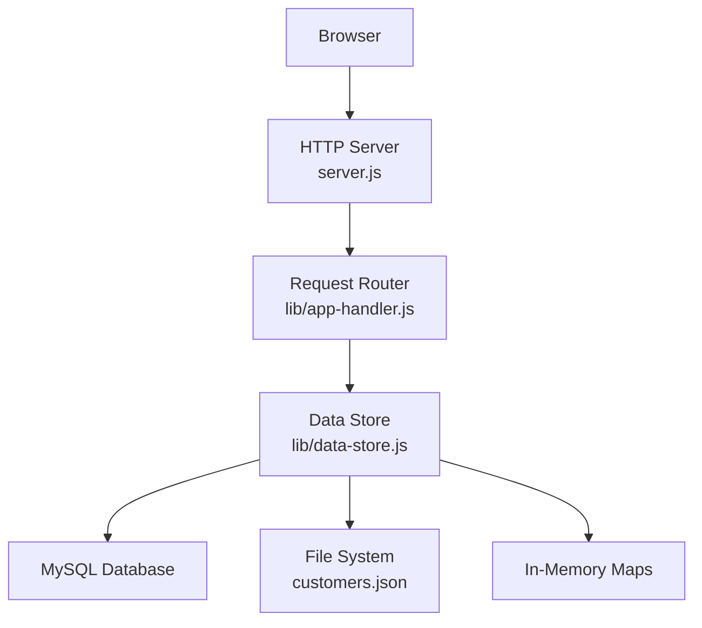
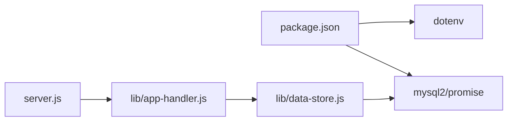

# Production Deployment

<cite>
**Referenced Files in This Document**
- [package.json](file://package.json)
- [server.js](file://server.js)
- [lib/app-handler.js](file://lib/app-handler.js)
- [lib/data-store.js](file://lib/data-store.js)
- [api/auth/login.js](file://api/auth/login.js)
- [api/auth/signup.js](file://api/auth/signup.js)
- [index.html](file://index.html)
- [login.html](file://login.html)
- [signup.html](file://signup.html)
- [checkout.html](file://checkout.html)
- [script.js](file://script.js)
- [styles.css](file://styles.css)
- [checkout.css](file://checkout.css)
</cite>

## Table of Contents
1. [Introduction](#introduction)
2. [Project Structure](#project-structure)
3. [Core Components](#core-components)
4. [Architecture Overview](#architecture-overview)
5. [Detailed Component Analysis](#detailed-component-analysis)
6. [Dependency Analysis](#dependency-analysis)
7. [Performance Considerations](#performance-considerations)
8. [Troubleshooting Guide](#troubleshooting-guide)
9. [Conclusion](#conclusion)
10. [Appendices](#appendices)

## Introduction
This document provides production-grade deployment guidance for Night Foodies. It covers server requirements, environment configuration, platform-specific deployment approaches (traditional servers, cloud, and serverless), performance optimization, monitoring, CI/CD automation, scaling, and operational checklists. The application is a Node.js HTTP server with a simple in-memory or persistent storage backend (MySQL, file-based JSON, or in-memory), and a static single-page frontend.

## Project Structure
Night Foodies is organized around a minimal Node.js server that serves static assets and exposes a small set of API endpoints under /api/auth. Authentication endpoints are also exposed as serverless handlers for platforms like Vercel.

**Diagram sources**
- [server.js:1-35](file://server.js#L1-L35)
- [lib/app-handler.js:1-332](file://lib/app-handler.js#L1-L332)
- [lib/data-store.js:1-291](file://lib/data-store.js#L1-L291)
- [api/auth/login.js:1-7](file://api/auth/login.js#L1-L7)
- [api/auth/signup.js:1-7](file://api/auth/signup.js#L1-L7)
- [index.html:1-105](file://index.html#L1-L105)
- [login.html:1-54](file://login.html#L1-L54)
- [signup.html:1-67](file://signup.html#L1-L67)
- [checkout.html:1-88](file://checkout.html#L1-L88)
- [script.js:1-450](file://script.js#L1-L450)
- [styles.css:1-735](file://styles.css#L1-L735)
- [checkout.css:1-110](file://checkout.css#L1-L110)

**Section sources**
- [server.js:1-35](file://server.js#L1-L35)
- [lib/app-handler.js:1-332](file://lib/app-handler.js#L1-L332)
- [lib/data-store.js:1-291](file://lib/data-store.js#L1-L291)
- [api/auth/login.js:1-7](file://api/auth/login.js#L1-L7)
- [api/auth/signup.js:1-7](file://api/auth/signup.js#L1-L7)
- [index.html:1-105](file://index.html#L1-L105)
- [login.html:1-54](file://login.html#L1-L54)
- [signup.html:1-67](file://signup.html#L1-L67)
- [checkout.html:1-88](file://checkout.html#L1-L88)
- [script.js:1-450](file://script.js#L1-L450)
- [styles.css:1-735](file://styles.css#L1-L735)
- [checkout.css:1-110](file://checkout.css#L1-L110)

## Core Components
- HTTP server entrypoint initializes environment, data store, and creates an HTTP server listening on the configured port.
- Request router dispatches API requests to dedicated handlers and serves static files otherwise.
- Data store supports three modes: MySQL (recommended for production), file-based JSON, or in-memory (temporary).
- Serverless handlers wrap API endpoints for serverless platforms.

Key runtime and configuration references:
- Node.js engine requirement and start script.
- Environment variables for database configuration and storage mode.
- Port binding and graceful startup/shutdown behavior.

**Section sources**
- [package.json:1-18](file://package.json#L1-L18)
- [server.js:1-35](file://server.js#L1-L35)
- [lib/app-handler.js:297-309](file://lib/app-handler.js#L297-L309)
- [lib/data-store.js:158-214](file://lib/data-store.js#L158-L214)

## Architecture Overview
The runtime architecture is a single-process HTTP server with a pluggable persistence layer. API endpoints are served via the main server or via serverless handlers depending on deployment target.

**Diagram sources**
- [server.js:1-35](file://server.js#L1-L35)
- [lib/app-handler.js:271-295](file://lib/app-handler.js#L271-L295)
- [lib/data-store.js:68-101](file://lib/data-store.js#L68-L101)
- [lib/data-store.js:112-123](file://lib/data-store.js#L112-L123)
- [lib/data-store.js:266-276](file://lib/data-store.js#L266-L276)

## Detailed Component Analysis

### HTTP Server and Startup
- Loads environment variables, initializes the data store, and starts an HTTP server bound to the PORT environment variable.
- Catches initialization errors and exits with a non-zero status after printing a tip for serverless environments.

Operational implications:
- Ensure PORT is set in production.
- Provide MySQL credentials or configure file storage for persistence.

**Section sources**
- [server.js:1-35](file://server.js#L1-L35)

### Request Routing and Static Serving
- Routes API requests to handlers under /api/auth.
- Serves static files from the filesystem for non-API paths.
- Normalizes and sanitizes paths to prevent directory traversal.

Security note:
- Path normalization prevents directory traversal attacks.

**Section sources**
- [lib/app-handler.js:271-295](file://lib/app-handler.js#L271-L295)
- [lib/app-handler.js:297-309](file://lib/app-handler.js#L297-L309)
- [lib/app-handler.js:78-96](file://lib/app-handler.js#L78-L96)

### Authentication Handlers
- Login and signup handlers are exposed as serverless functions for platforms like Vercel.
- They reuse the shared request handler and data store.

**Section sources**
- [api/auth/login.js:1-7](file://api/auth/login.js#L1-L7)
- [api/auth/signup.js:1-7](file://api/auth/signup.js#L1-L7)
- [lib/app-handler.js:311-325](file://lib/app-handler.js#L311-L325)

### Data Store Modes and Initialization
- MySQL mode: Creates database and table if missing, uses a connection pool.
- File mode: Persists customer records to a JSON file.
- In-memory mode: Temporary storage, resets on restarts.
- Automatic fallbacks and warnings for unavailable drivers or environments (e.g., Vercel).

Operational guidance:
- Prefer MySQL for production.
- Configure DB_HOST, DB_USER, DB_NAME, DB_PASSWORD, DB_PORT.
- On Vercel without MySQL, expect in-memory mode.

**Section sources**
- [lib/data-store.js:68-101](file://lib/data-store.js#L68-L101)
- [lib/data-store.js:112-123](file://lib/data-store.js#L112-L123)
- [lib/data-store.js:149-214](file://lib/data-store.js#L149-L214)

### Frontend Integration
- Single-page application logic in script.js handles routing, cart, and authentication flows.
- Calls /api/auth endpoints for login/signup.
- Uses localStorage for session persistence.

**Section sources**
- [script.js:87-120](file://script.js#L87-L120)
- [script.js:122-148](file://script.js#L122-L148)
- [script.js:156-186](file://script.js#L156-L186)

## Dependency Analysis
- Runtime dependencies: dotenv for environment loading, mysql2/promise for MySQL connectivity.
- Engines constraint requires Node.js 24.x.

**Diagram sources**
- [package.json:13-16](file://package.json#L13-L16)
- [server.js:1-3](file://server.js#L1-L3)
- [lib/app-handler.js:1-11](file://lib/app-handler.js#L1-L11)
- [lib/data-store.js:4](file://lib/data-store.js#L4)

**Section sources**
- [package.json:13-16](file://package.json#L13-L16)
- [package.json:10-12](file://package.json#L10-L12)

## Performance Considerations
- Process management
  - Run a single HTTP server process per dyno/container. Use a process manager only if needed for health checks or restarts.
- Clustering
  - Not implemented. Avoid clustering for this small application.
- Memory optimization
  - In-memory mode is ephemeral; avoid in production.
  - Use MySQL for durable state.
- Static asset serving
  - Serve static assets directly from the filesystem; no build step is required.
- Database optimization
  - Use a MySQL connection pool with tuned limits.
  - Ensure proper indexing on phone numbers for lookup.
- Health checks
  - Expose a lightweight GET endpoint for readiness/liveness probes.
- Logging
  - Standard out logging is sufficient; integrate with platform logging.
- Metrics
  - Track request latency, error rates, and database pool utilization.

[No sources needed since this section provides general guidance]

## Troubleshooting Guide
Common production issues and resolutions:
- Server fails to start
  - Verify PORT is set and accessible.
  - Check database credentials and connectivity.
- Authentication failures
  - Confirm DB_DRIVER and MySQL environment variables are correctly set.
  - On Vercel without MySQL, expect in-memory mode and data loss on cold start.
- Static assets not loading
  - Ensure the working directory is correct and static paths are normalized.
- CORS and mixed content
  - Ensure HTTPS termination and correct asset URLs.

**Section sources**
- [server.js:24-31](file://server.js#L24-L31)
- [lib/data-store.js:149-214](file://lib/data-store.js#L149-L214)
- [lib/app-handler.js:78-96](file://lib/app-handler.js#L78-L96)

## Conclusion
Night Foodies can be deployed as a single-process Node.js application with MySQL for production durability. Serverless deployments are supported via serverless handlers. Follow the platform-specific guidance below, harden security, monitor performance, and automate deployments with CI/CD.

[No sources needed since this section summarizes without analyzing specific files]

## Appendices

### A. Server Requirements
- Node.js: 24.x
- Operating system: Linux recommended
- Hardware: Minimal footprint; scale based on concurrent users and database capacity

**Section sources**
- [package.json:10-12](file://package.json#L10-L12)

### B. Environment Variables (Production)
- PORT: Listening port for the HTTP server
- DB_DRIVER: mysql | file | memory | json | sqlite (legacy)
- DB_HOST, DB_PORT, DB_USER, DB_PASSWORD, DB_NAME: MySQL connection parameters
- CUSTOMERS_FILE: Path to the JSON customer store (when using file mode)
- VERCEL: Presence indicates serverless environment (in-memory fallback enforced)

**Section sources**
- [server.js:5](file://server.js#L5)
- [lib/data-store.js:68-84](file://lib/data-store.js#L68-L84)
- [lib/data-store.js:19-25](file://lib/data-store.js#L19-L25)
- [lib/data-store.js:141-194](file://lib/data-store.js#L141-L194)

### C. Database Setup (Production)
- Provision a MySQL instance.
- Ensure the application can create the database and table automatically.
- Use a dedicated user with restricted permissions.
- Enable SSL/TLS for connections in production.

**Section sources**
- [lib/data-store.js:68-101](file://lib/data-store.js#L68-L101)

### D. Security Hardening
- Enforce HTTPS at the edge (load balancer or CDN).
- Set appropriate Content-Security-Policy and HSTS headers.
- Sanitize inputs and validate payloads.
- Rotate secrets regularly.
- Limit exposure of administrative endpoints.

[No sources needed since this section provides general guidance]

### E. Platform Deployment Guides

#### Traditional Servers (PM2, systemd)
- Install dependencies and build artifacts if any (none required).
- Set environment variables and database credentials.
- Run with PM2 or systemd unit files.
- Configure reverse proxy (nginx/Apache) for TLS offloading and static serving.

[No sources needed since this section provides general guidance]

#### Cloud Platforms (AWS, GCP, Azure)
- Containerize the application (no build step).
- Use managed databases (RDS, Cloud SQL, Azure Database).
- Deploy behind a load balancer with autoscaling.
- Enable health checks and monitoring.

[No sources needed since this section provides general guidance]

#### Serverless (Vercel)
- Use the provided serverless handlers for /api/auth/login and /api/auth/signup.
- Configure environment variables in the serverless platform.
- Without MySQL, expect in-memory mode; data will not persist across cold starts.

**Section sources**
- [api/auth/login.js:1-7](file://api/auth/login.js#L1-L7)
- [api/auth/signup.js:1-7](file://api/auth/signup.js#L1-L7)
- [lib/data-store.js:141-194](file://lib/data-store.js#L141-L194)
- [server.js:28-30](file://server.js#L28-L30)

### F. Monitoring and Observability
- Health checks: Implement GET /health returning 200 OK.
- Logs: Stream stdout/stderr to platform logging.
- Metrics: Export Prometheus metrics or use platform-native metrics.
- Tracing: Add distributed tracing for API spans.

[No sources needed since this section provides general guidance]

### G. CI/CD Automation
- Build: No build step required.
- Test: Validate environment variables and database connectivity.
- Deploy: Push to target platform (traditional, cloud, or serverless).
- Rollback: Keep previous release tagged and ready to redeploy.

[No sources needed since this section provides general guidance]

### H. Scaling and Load Balancing
- Horizontal scaling: Stateless server; scale replicas behind a load balancer.
- Database scaling: Use read replicas and connection pooling.
- CDN: Serve static assets via CDN for improved latency.

[No sources needed since this section provides general guidance]

### I. Pre-deployment Validation Checklist
- [ ] Node.js 24.x installed
- [ ] Environment variables configured (PORT, DB_* or CUSTOMERS_FILE)
- [ ] MySQL reachable and initialized
- [ ] Static assets present and accessible
- [ ] Health check endpoint verified
- [ ] Secrets rotated and stored securely

[No sources needed since this section provides general guidance]

### J. Post-deployment Verification Checklist
- [ ] Application responds to GET /
- [ ] API endpoints return expected responses
- [ ] Database writes/reads functional
- [ ] Static assets load without errors
- [ ] Logs show normal operation
- [ ] Metrics collected and alerts configured

[No sources needed since this section provides general guidance]