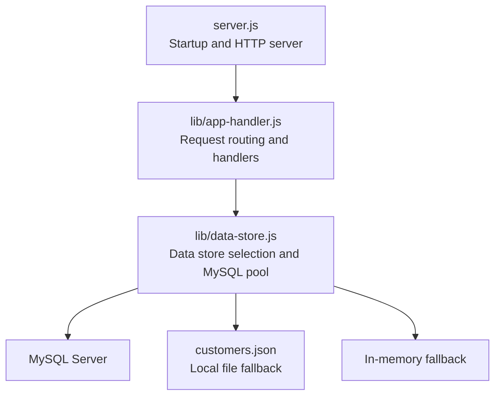
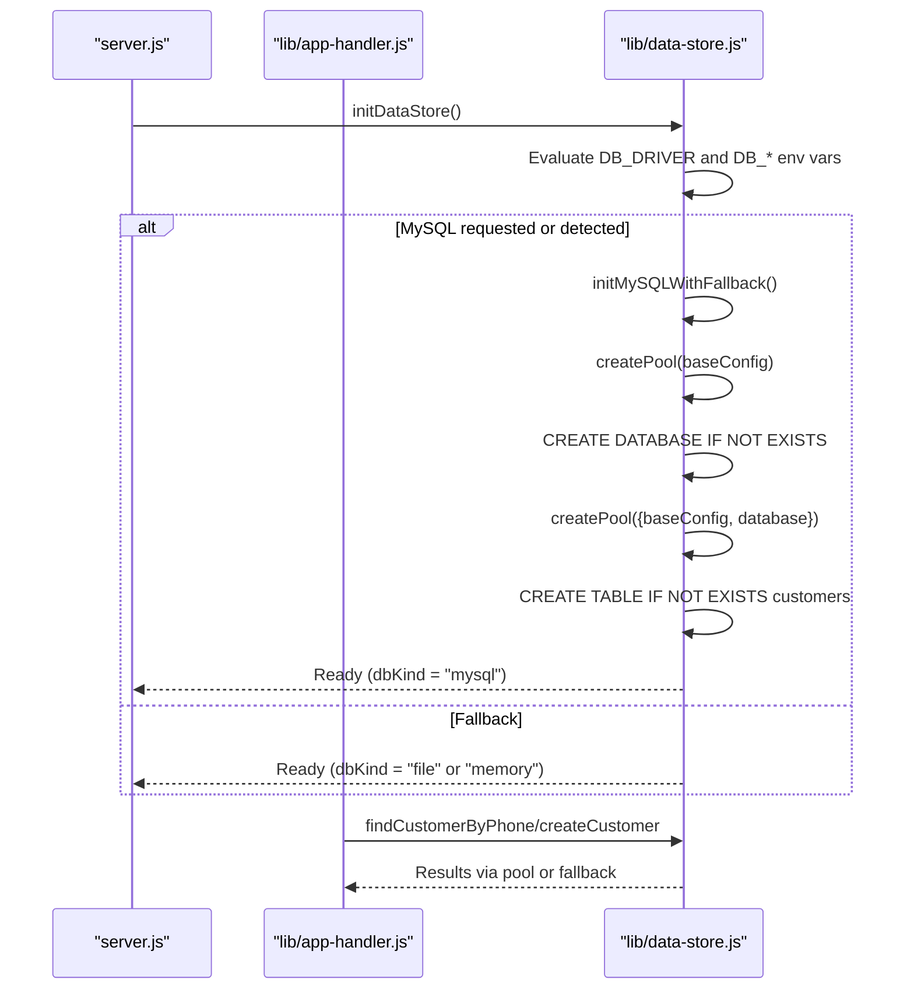
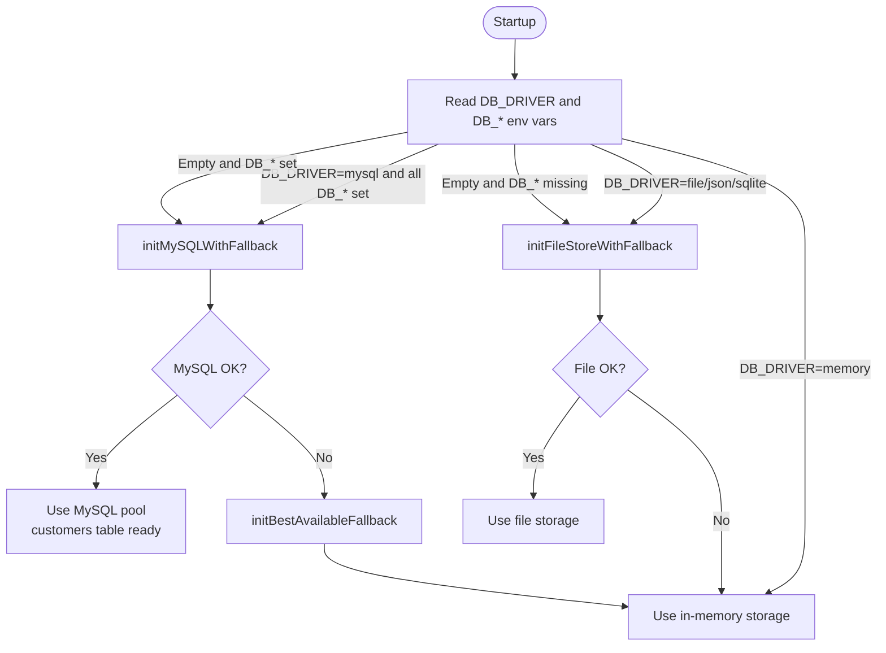
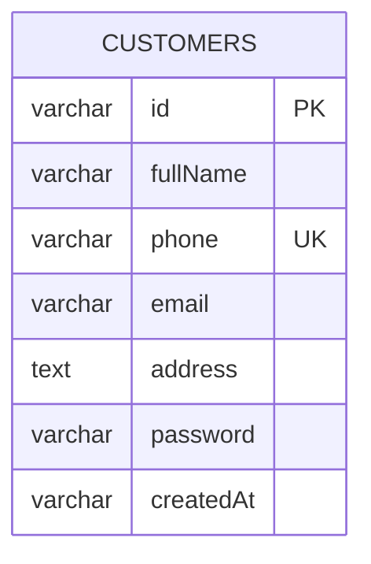

# Database Configuration

<cite>
**Referenced Files in This Document**
- [server.js](file://server.js)
- [lib/data-store.js](file://lib/data-store.js)
- [lib/app-handler.js](file://lib/app-handler.js)
- [package.json](file://package.json)
- [customers.json](file://customers.json)
</cite>

## Table of Contents
1. [Introduction](#introduction)
2. [Project Structure](#project-structure)
3. [Core Components](#core-components)
4. [Architecture Overview](#architecture-overview)
5. [Detailed Component Analysis](#detailed-component-analysis)
6. [Dependency Analysis](#dependency-analysis)
7. [Performance Considerations](#performance-considerations)
8. [Troubleshooting Guide](#troubleshooting-guide)
9. [Conclusion](#conclusion)
10. [Appendices](#appendices)

## Introduction
This document explains how Night Foodies configures and uses MySQL for persistent customer data. It covers environment variables, connection pooling, automatic database initialization, driver configuration, and operational guidance for development and production. It also provides troubleshooting steps and examples for common deployment scenarios.

## Project Structure
The application initializes the data store during server startup and supports multiple storage modes: MySQL, local JSON file, or in-memory. MySQL is enabled automatically when required environment variables are present.

**Diagram sources**
- [server.js:1-35](file://server.js#L1-L35)
- [lib/app-handler.js:1-332](file://lib/app-handler.js#L1-L332)
- [lib/data-store.js:1-291](file://lib/data-store.js#L1-L291)

**Section sources**
- [server.js:1-35](file://server.js#L1-L35)
- [lib/app-handler.js:1-332](file://lib/app-handler.js#L1-L332)
- [lib/data-store.js:1-291](file://lib/data-store.js#L1-L291)

## Core Components
- Environment-driven data store selection
- MySQL connection pool with defaults and automatic initialization
- Customer table creation with unique phone constraint
- Fallbacks to file and in-memory storage

Key behaviors:
- MySQL is selected when DB_HOST, DB_USER, and DB_NAME are set.
- A bootstrap pool creates the database and initializes the customers table.
- Subsequent operations use a dedicated pool connected to the target database.
- On Vercel, local file storage is not persistent; the app falls back to in-memory mode.

**Section sources**
- [lib/data-store.js:68-101](file://lib/data-store.js#L68-L101)
- [lib/data-store.js:158-214](file://lib/data-store.js#L158-L214)
- [lib/data-store.js:216-264](file://lib/data-store.js#L216-L264)

## Architecture Overview
The runtime selects a storage backend at startup based on environment variables and platform constraints. The MySQL path includes automatic database and table creation.

**Diagram sources**
- [server.js:7-10](file://server.js#L7-L10)
- [lib/data-store.js:68-101](file://lib/data-store.js#L68-L101)
- [lib/data-store.js:149-156](file://lib/data-store.js#L149-L156)
- [lib/data-store.js:216-264](file://lib/data-store.js#L216-L264)

## Detailed Component Analysis

### Environment Variables and Defaults
- DB_HOST: Hostname/IP for MySQL. Default: localhost.
- DB_PORT: TCP port for MySQL. Default: 3306.
- DB_USER: Database user. Default: root.
- DB_PASSWORD: Database password. Default: empty string.
- DB_NAME: Target database name. Default: night_foodies.
- DB_DRIVER: Explicit driver choice. Values: mysql, memory, sqlite, file, json. Empty means auto-detect if DB_HOST/DB_USER/DB_NAME are set.
- CUSTOMERS_FILE: Path to the local JSON file for file storage mode. Default: customers.json in project root.
- VERCEL: When set, local file storage is not persistent; the app falls back to in-memory mode.

Security considerations:
- Store secrets in secure environment variables or platform secret managers.
- Avoid committing credentials to version control.
- Use least-privilege accounts and restrict network access to the database host.
- Prefer TLS connections when connecting to managed databases.

Operational notes:
- On Vercel, the app logs guidance to configure MySQL env vars for persistent data.
- If DB_DRIVER is set to mysql but required variables are missing, the app warns and falls back.

**Section sources**
- [lib/data-store.js:69-78](file://lib/data-store.js#L69-L78)
- [lib/data-store.js:164-179](file://lib/data-store.js#L164-L179)
- [lib/data-store.js:187-194](file://lib/data-store.js#L187-L194)
- [server.js:27-29](file://server.js#L27-L29)

### Connection Pooling Configuration
- Driver: mysql2/promise
- Base pool settings:
  - waitForConnections: true
  - connectionLimit: 10
  - queueLimit: 0
- Initialization flow:
  - A bootstrap pool is created with baseConfig to create the database.
  - The bootstrap pool is closed after database creation.
  - A second pool connects to the named database and is used for all subsequent queries.

Connection string format:
- The application constructs a pool from individual configuration fields rather than a single connection string. This avoids embedding credentials in a single string and aligns with environment variable usage.

**Section sources**
- [lib/data-store.js:4](file://lib/data-store.js#L4)
- [lib/data-store.js:68-84](file://lib/data-store.js#L68-L84)

### Automatic Database Initialization
- Database creation:
  - The bootstrap pool executes a statement to create the target database if it does not exist.
- Table creation:
  - The customers table is created with:
    - id: VARCHAR(64) PRIMARY KEY
    - fullName: VARCHAR(255) NOT NULL
    - phone: VARCHAR(20) NOT NULL with UNIQUE KEY
    - email: VARCHAR(255) DEFAULT ''
    - address: TEXT
    - password: VARCHAR(255) NOT NULL
    - createdAt: VARCHAR(64)
  - Storage engine and collation: InnoDB with utf8mb4_unicode_ci.

Unique constraint:
- A unique key on phone prevents duplicate customer records.

**Section sources**
- [lib/data-store.js:80-82](file://lib/data-store.js#L80-L82)
- [lib/data-store.js:86-97](file://lib/data-store.js#L86-L97)

### Data Access Patterns
- Lookup by phone:
  - Uses the pool to SELECT the customer record by phone.
- Insertion:
  - Validates uniqueness by attempting lookup first.
  - Inserts a new customer record into the customers table.

Fallbacks:
- If MySQL fails, the app attempts file storage; if that fails, it falls back to in-memory storage.
- On Vercel, file storage is not persistent; the app warns and uses in-memory mode.

**Section sources**
- [lib/data-store.js:216-229](file://lib/data-store.js#L216-L229)
- [lib/data-store.js:231-264](file://lib/data-store.js#L231-L264)
- [lib/data-store.js:131-156](file://lib/data-store.js#L131-L156)
- [lib/data-store.js:140-147](file://lib/data-store.js#L140-L147)
- [lib/data-store.js:187-194](file://lib/data-store.js#L187-L194)

### Authentication and Password Handling
- The authentication flow compares the submitted password against the stored password field.
- No hashing is applied in the current implementation; treat passwords as plain text.

Recommendations:
- Hash passwords using a strong algorithm (e.g., bcrypt) before storing.
- Enforce minimum password length and complexity policies.

**Section sources**
- [lib/app-handler.js:248-264](file://lib/app-handler.js#L248-L264)

## Architecture Overview
The following diagram maps the runtime selection of storage backends and the MySQL initialization flow.

**Diagram sources**
- [lib/data-store.js:158-214](file://lib/data-store.js#L158-L214)
- [lib/data-store.js:131-156](file://lib/data-store.js#L131-L156)
- [lib/data-store.js:140-147](file://lib/data-store.js#L140-L147)

## Detailed Component Analysis

### Environment Variable Reference
- DB_HOST: MySQL hostname or IP. Default: localhost.
- DB_PORT: MySQL port. Default: 3306.
- DB_USER: MySQL user. Default: root.
- DB_PASSWORD: MySQL password. Default: empty.
- DB_NAME: Target database. Default: night_foodies.
- DB_DRIVER: mysql | memory | sqlite | file | json. Empty enables auto-detection if DB_* are set.
- CUSTOMERS_FILE: Local JSON file path for file storage. Default: customers.json in project root.
- VERCEL: Presence triggers Vercel-specific behavior (in-memory fallback for file storage).

Security and correctness:
- Ensure DB_HOST, DB_USER, and DB_NAME are all provided when forcing mysql mode.
- Avoid backticks in DB_NAME; the code strips them for safety.

**Section sources**
- [lib/data-store.js:69-78](file://lib/data-store.js#L69-L78)
- [lib/data-store.js:164-179](file://lib/data-store.js#L164-L179)
- [lib/data-store.js:69](file://lib/data-store.js#L69)

### MySQL Driver and Pool Settings
- Driver module: mysql2/promise
- Pool settings:
  - waitForConnections: true
  - connectionLimit: 10
  - queueLimit: 0
- Connection method: Pool created from separate host/port/user/password fields.

**Section sources**
- [lib/data-store.js:4](file://lib/data-store.js#L4)
- [lib/data-store.js:68-84](file://lib/data-store.js#L68-L84)

### Automatic Initialization Details
- Bootstrap pool:
  - Creates the database if missing.
  - Closes the bootstrap pool immediately after creation.
- Target pool:
  - Connects to the named database.
  - Ensures the customers table exists with unique phone constraint.

**Section sources**
- [lib/data-store.js:80-84](file://lib/data-store.js#L80-L84)
- [lib/data-store.js:86-97](file://lib/data-store.js#L86-L97)

### Data Model
The customers table schema is defined as part of initialization.

**Diagram sources**
- [lib/data-store.js:86-97](file://lib/data-store.js#L86-L97)

## Dependency Analysis
Runtime dependencies related to database configuration:
- dotenv: Loads environment variables from .env files.
- mysql2: Provides the promise-based MySQL driver.

**Section sources**
- [package.json:12-14](file://package.json#L12-L14)

## Performance Considerations
- Connection pool sizing:
  - Default connectionLimit is 10. Adjust based on expected concurrency and database capacity.
- Queue behavior:
  - queueLimit: 0 allows unlimited queuing; consider setting a finite limit to fail fast under load.
- Unique constraint:
  - The unique phone index helps maintain referential integrity and speeds up lookups.
- File vs. MySQL:
  - File storage is synchronous and not recommended for production. MySQL offers better throughput and reliability.

[No sources needed since this section provides general guidance]

## Troubleshooting Guide

Common issues and resolutions:
- MySQL connection refused:
  - Verify DB_HOST and DB_PORT are reachable from the runtime.
  - Confirm the database service is running and listening on the specified port.
- Authentication failure:
  - Check DB_USER and DB_PASSWORD values.
  - Ensure the user has privileges to CREATE DATABASE and CREATE TABLE.
- Permission errors:
  - Grant appropriate privileges to the user for the target database and table creation.
- Database name conflicts:
  - DB_NAME is sanitized; avoid special characters and ensure the database name is valid.
- Vercel persistence:
  - Local file storage is not persistent on Vercel. Configure MySQL env vars to enable persistent data.
- Duplicate phone errors:
  - The application enforces a unique phone constraint. Ensure the phone number is not already registered.

Operational tips:
- Enable logging to observe which storage mode was selected.
- Monitor pool utilization and adjust connectionLimit if needed.
- For development, consider using a local MySQL instance or a managed MySQL service.

**Section sources**
- [lib/data-store.js:149-156](file://lib/data-store.js#L149-L156)
- [lib/data-store.js:187-194](file://lib/data-store.js#L187-L194)
- [lib/data-store.js:234-239](file://lib/data-store.js#L234-L239)
- [server.js:27-29](file://server.js#L27-L29)

## Conclusion
Night Foodies supports multiple storage backends with MySQL as the primary persistent option. By configuring the required environment variables, the application automatically provisions the database and table, then uses a connection pool for efficient operations. For production, ensure secure credential management, appropriate permissions, and suitable pool sizing. On platforms like Vercel, configure MySQL env vars to achieve persistent data.

[No sources needed since this section summarizes without analyzing specific files]

## Appendices

### Example: Development Setup
- Set environment variables:
  - DB_HOST=localhost
  - DB_PORT=3306
  - DB_USER=root
  - DB_PASSWORD=<your_password>
  - DB_NAME=night_foodies
- Start the server:
  - npm start

**Section sources**
- [lib/data-store.js:69-78](file://lib/data-store.js#L69-L78)
- [package.json:6-8](file://package.json#L6-L8)

### Example: Production Deployment (Vercel)
- Configure environment variables in Vercel dashboard:
  - DB_HOST, DB_PORT, DB_USER, DB_PASSWORD, DB_NAME
- The app will initialize MySQL and use it for persistent storage.
- Avoid relying on local file storage for user data on Vercel.

**Section sources**
- [lib/data-store.js:187-194](file://lib/data-store.js#L187-L194)
- [server.js:27-29](file://server.js#L27-L29)

### Example: Local File Fallback
- If MySQL is not configured, the app can fall back to:
  - File storage: reads/writes customers.json
  - In-memory storage: temporary data lost on restarts
- CUSTOMERS_FILE can override the default JSON file location.

**Section sources**
- [lib/data-store.js:19-25](file://lib/data-store.js#L19-L25)
- [lib/data-store.js:112-123](file://lib/data-store.js#L112-L123)
- [lib/data-store.js:125-129](file://lib/data-store.js#L125-L129)
- [customers.json:1-11](file://customers.json#L1-L11)