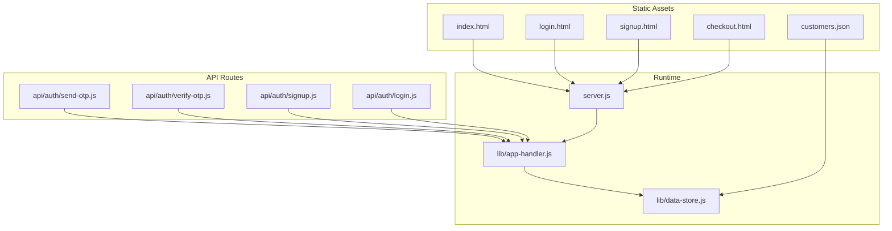
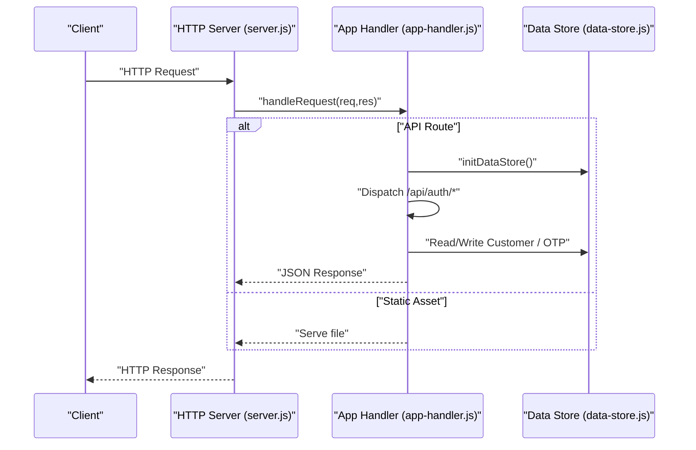
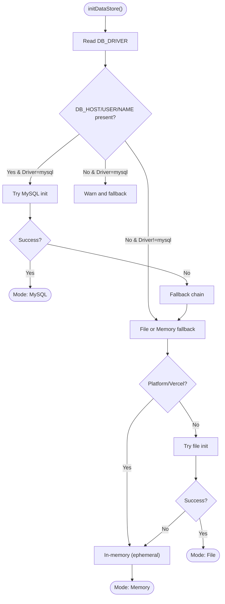
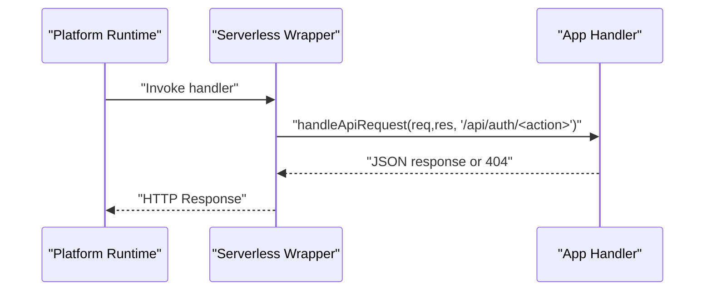

# Deployment Templates

<cite>
**Referenced Files in This Document**
- [package.json](file://package.json)
- [server.js](file://server.js)
- [lib/app-handler.js](file://lib/app-handler.js)
- [lib/data-store.js](file://lib/data-store.js)
- [api/auth/send-otp.js](file://api/auth/send-otp.js)
- [api/auth/verify-otp.js](file://api/auth/verify-otp.js)
- [api/auth/signup.js](file://api/auth/signup.js)
- [api/auth/login.js](file://api/auth/login.js)
- [index.html](file://index.html)
- [login.html](file://login.html)
- [signup.html](file://signup.html)
- [checkout.html](file://checkout.html)
- [customers.json](file://customers.json)
</cite>

## Table of Contents
1. [Introduction](#introduction)
2. [Project Structure](#project-structure)
3. [Core Components](#core-components)
4. [Architecture Overview](#architecture-overview)
5. [Detailed Component Analysis](#detailed-component-analysis)
6. [Environment-Specific Templates](#environment-specific-templates)
7. [Docker Deployment](#docker-deployment)
8. [Serverless Deployment](#serverless-deployment)
9. [CI/CD Pipeline](#cicd-pipeline)
10. [Configuration Validation and Health Checks](#configuration-validation-and-health-checks)
11. [Troubleshooting Guide](#troubleshooting-guide)
12. [Conclusion](#conclusion)

## Introduction
This document provides deployment templates and operational guidance for Night Foodies across development, staging, and production environments. It covers environment variables, storage modes, Docker multi-stage builds, serverless platform configurations (Vercel, AWS Lambda, Google Cloud Functions), CI/CD automation, validation scripts, health checks, and troubleshooting.

## Project Structure
Night Foodies is a Node.js HTTP server with a small static frontend and a pluggable data store supporting in-memory, file-backed JSON, and MySQL persistence. Authentication endpoints are exposed via both traditional server hosting and serverless handlers.

**Diagram sources**
- [server.js:1-35](file://server.js#L1-L35)
- [lib/app-handler.js:1-332](file://lib/app-handler.js#L1-L332)
- [lib/data-store.js:1-291](file://lib/data-store.js#L1-L291)
- [api/auth/send-otp.js:1-7](file://api/auth/send-otp.js#L1-L7)
- [api/auth/verify-otp.js:1-7](file://api/auth/verify-otp.js#L1-L7)
- [api/auth/signup.js:1-7](file://api/auth/signup.js#L1-L7)
- [api/auth/login.js:1-7](file://api/auth/login.js#L1-L7)
- [index.html:1-105](file://index.html#L1-L105)
- [login.html:1-54](file://login.html#L1-L54)
- [signup.html:1-67](file://signup.html#L1-L67)
- [checkout.html:1-88](file://checkout.html#L1-L88)
- [customers.json:1-11](file://customers.json#L1-L11)

**Section sources**
- [package.json:1-18](file://package.json#L1-L18)
- [server.js:1-35](file://server.js#L1-L35)
- [lib/app-handler.js:1-332](file://lib/app-handler.js#L1-L332)
- [lib/data-store.js:1-291](file://lib/data-store.js#L1-L291)

## Core Components
- HTTP server: Creates an HTTP server, initializes the data store, and routes requests to handlers or static files.
- Request router: Dispatches API endpoints and serves static assets.
- Data store: Supports three modes:
  - MySQL: Persistent relational storage with automatic schema creation.
  - File: Local JSON file for customers; resilient fallback.
  - Memory: In-memory map; suitable for ephemeral environments.
- Authentication handlers: OTP send/verify and customer signup/login.

Key runtime behaviors:
- Environment variable-driven storage selection.
- Graceful fallbacks when primary storage fails.
- Serverless handler adapter for platform-specific deployments.

**Section sources**
- [server.js:5-35](file://server.js#L5-L35)
- [lib/app-handler.js:297-331](file://lib/app-handler.js#L297-L331)
- [lib/data-store.js:158-214](file://lib/data-store.js#L158-L214)

## Architecture Overview
The system runs as a single HTTP server with:
- API endpoints under /api/auth/* routed to serverless-compatible handlers.
- Static pages served from the filesystem.
- Data persistence abstracted behind a unified interface.

**Diagram sources**
- [server.js:11-23](file://server.js#L11-L23)
- [lib/app-handler.js:297-309](file://lib/app-handler.js#L297-L309)
- [lib/data-store.js:216-264](file://lib/data-store.js#L216-L264)

## Detailed Component Analysis

### Data Store Initialization Flow
The initialization logic selects storage mode based on environment variables and platform constraints, with robust fallbacks.

**Diagram sources**
- [lib/data-store.js:158-214](file://lib/data-store.js#L158-L214)
- [lib/data-store.js:149-156](file://lib/data-store.js#L149-L156)
- [lib/data-store.js:131-138](file://lib/data-store.js#L131-L138)
- [lib/data-store.js:140-147](file://lib/data-store.js#L140-L147)

**Section sources**
- [lib/data-store.js:68-101](file://lib/data-store.js#L68-L101)
- [lib/data-store.js:112-123](file://lib/data-store.js#L112-L123)
- [lib/data-store.js:125-129](file://lib/data-store.js#L125-L129)
- [lib/data-store.js:149-156](file://lib/data-store.js#L149-L156)
- [lib/data-store.js:158-214](file://lib/data-store.js#L158-L214)

### Serverless Handler Adapter
Serverless handlers wrap the shared API logic for platform-specific routing.

**Diagram sources**
- [lib/app-handler.js:311-325](file://lib/app-handler.js#L311-L325)
- [api/auth/send-otp.js:1-7](file://api/auth/send-otp.js#L1-L7)
- [api/auth/verify-otp.js:1-7](file://api/auth/verify-otp.js#L1-L7)
- [api/auth/signup.js:1-7](file://api/auth/signup.js#L1-L7)
- [api/auth/login.js:1-7](file://api/auth/login.js#L1-L7)

**Section sources**
- [lib/app-handler.js:311-325](file://lib/app-handler.js#L311-L325)
- [api/auth/send-otp.js:1-7](file://api/auth/send-otp.js#L1-L7)
- [api/auth/verify-otp.js:1-7](file://api/auth/verify-otp.js#L1-L7)
- [api/auth/signup.js:1-7](file://api/auth/signup.js#L1-L7)
- [api/auth/login.js:1-7](file://api/auth/login.js#L1-L7)

## Environment-Specific Templates

### Development
- Purpose: Local iteration with minimal setup.
- Storage mode: Prefer file-based persistence for local development.
- Environment variables:
  - DB_DRIVER=file
  - CUSTOMERS_FILE=/absolute/path/to/customers.json
  - Optional: PORT=3000
- Security: No secrets required for local dev; keep credentials unset.
- Notes: File persistence is convenient; for MySQL, set DB_HOST/DB_USER/DB_NAME.

**Section sources**
- [lib/data-store.js:19-25](file://lib/data-store.js#L19-L25)
- [lib/data-store.js:201-204](file://lib/data-store.js#L201-L204)
- [server.js:5](file://server.js#L5)

### Staging
- Purpose: Validate production-like behavior without live traffic.
- Storage mode: MySQL recommended; file fallback acceptable for non-critical testing.
- Environment variables:
  - DB_DRIVER=mysql
  - DB_HOST=<staging-host>
  - DB_PORT=3306
  - DB_USER=<staging-user>
  - DB_PASSWORD=<staging-password>
  - DB_NAME=<staging-db>
  - Optional: PORT=8080
- Security: Rotate staging credentials; restrict network access to DB.
- Notes: Use a dedicated staging database; enable slow query logs.

**Section sources**
- [lib/data-store.js:68-101](file://lib/data-store.js#L68-L101)
- [lib/data-store.js:170-180](file://lib/data-store.js#L170-L180)

### Production
- Purpose: Serve live traffic with reliability and persistence.
- Storage mode: MySQL required for durability.
- Environment variables:
  - DB_DRIVER=mysql
  - DB_HOST=<production-host>
  - DB_PORT=3306
  - DB_USER=<prod-user>
  - DB_PASSWORD=<prod-password>
  - DB_NAME=<prod-db>
  - Optional: PORT=<platform-port>
- Security:
  - Use managed secrets; avoid committing credentials.
  - Restrict DB access to application subnet.
  - Enable TLS for DB connections.
- Notes: Configure read replicas if scaling writes; monitor schema migrations.

**Section sources**
- [lib/data-store.js:68-101](file://lib/data-store.js#L68-L101)
- [lib/data-store.js:170-180](file://lib/data-store.js#L170-L180)

## Docker Deployment
Multi-stage build strategy:
- Stage 1: Install Node.js and build dependencies.
- Stage 2: Copy only runtime artifacts and install production dependencies.
- Stage 3: Final image with minimal OS and runtime.

Recommended Dockerfile outline:
- Base image: Node.js 24.x runtime.
- Set NODE_ENV=production.
- Copy package.json and lockfile; install dependencies.
- Copy source and assets; set working directory.
- Expose port from environment variable.
- Entrypoint uses npm start script.

Environment variables inside container:
- DB_DRIVER=mysql or file
- DB_HOST/DB_PORT/DB_USER/DB_PASSWORD/DB_NAME
- CUSTOMERS_FILE (when using file mode)
- PORT

Security hardening:
- Run as non-root user.
- Drop unnecessary capabilities.
- Use read-only root filesystem.
- Pin dependency versions.

Health check:
- curl against a lightweight endpoint (see Health Checks section).

**Section sources**
- [package.json:6-8](file://package.json#L6-L8)
- [package.json:10-12](file://package.json#L10-L12)
- [server.js:5](file://server.js#L5)
- [lib/data-store.js:19-25](file://lib/data-store.js#L19-L25)

## Serverless Deployment

### Vercel
- Routing: Place serverless functions under api/auth/*. Each file exports a handler created by the adapter.
- Environment variables: Configure in Vercel dashboard or CLI; set DB_DRIVER/mysql variables.
- Persistence: Vercel does not guarantee persistent file storage. Use DB_DRIVER=mysql or accept in-memory mode.
- Build command: None required; static assets are served automatically.
- Output directory: Next.js-style routes supported; place functions under api/auth/.

Key files to deploy:
- api/auth/send-otp.js
- api/auth/verify-otp.js
- api/auth/signup.js
- api/auth/login.js

Notes:
- On Vercel, the system falls back to in-memory storage if file mode is requested.
- Ensure MySQL credentials are set for production-like behavior.

**Section sources**
- [api/auth/send-otp.js:1-7](file://api/auth/send-otp.js#L1-L7)
- [api/auth/verify-otp.js:1-7](file://api/auth/verify-otp.js#L1-L7)
- [api/auth/signup.js:1-7](file://api/auth/signup.js#L1-L7)
- [api/auth/login.js:1-7](file://api/auth/login.js#L1-L7)
- [lib/data-store.js:187-194](file://lib/data-store.js#L187-L194)

### AWS Lambda
- Handler: Export the serverless handler from lib/app-handler.js for each endpoint.
- Environment variables: Same as above; pass via Lambda environment.
- Packaging: Zip runtime files and dependencies; keep payload minimal.
- Storage: Use DB_DRIVER=mysql; mount EFS only if you must persist JSON files.

**Section sources**
- [lib/app-handler.js:311-325](file://lib/app-handler.js#L311-L325)
- [lib/data-store.js:68-101](file://lib/data-store.js#L68-L101)

### Google Cloud Functions
- Entrypoint: Point to the exported handler per endpoint.
- Environment variables: Same DB_* and DB_DRIVER settings.
- Storage: Prefer DB_DRIVER=mysql; file mode is not persistent.

**Section sources**
- [lib/app-handler.js:311-325](file://lib/app-handler.js#L311-L325)
- [lib/data-store.js:68-101](file://lib/data-store.js#L68-L101)

## CI/CD Pipeline
Recommended stages:
- Test: Run unit tests and linters.
- Build: Build Docker image or prepare serverless artifacts.
- Deploy: Deploy to staging; run smoke tests.
- Promote: Deploy to production after validation.
- Rollback: Automated rollback on failure using blue/green or canary strategy.

Validation steps:
- Endpoint tests for /api/auth/send-otp, /api/auth/verify-otp, /api/auth/signup, /api/auth/login.
- Health check endpoint (see below).
- Database connectivity test (if MySQL).

Rollback procedure:
- Re-deploy previous successful image/tag.
- Switch DNS or routing back to previous version.
- Monitor metrics and logs post-rollback.

[No sources needed since this section provides general guidance]

## Configuration Validation and Health Checks
Configuration validation script checklist:
- Verify presence of DB_HOST, DB_USER, DB_NAME when DB_DRIVER=mysql.
- Confirm CUSTOMERS_FILE path exists and is writable (file mode).
- Ensure PORT is numeric and in a valid range.
- Validate environment-specific secrets are set appropriately.

Health check endpoint:
- Expose a lightweight GET endpoint returning service status and current storage mode.
- Example response keys: status, storageMode, timestamp.

Operational checks:
- Database connectivity test during startup.
- File write permissions (file mode).
- Platform-specific constraints (e.g., Vercel ephemeral storage).

**Section sources**
- [lib/data-store.js:164-168](file://lib/data-store.js#L164-L168)
- [lib/data-store.js:19-25](file://lib/data-store.js#L19-L25)
- [server.js:21-23](file://server.js#L21-L23)

## Troubleshooting Guide
Common issues and resolutions:
- MySQL connection failures:
  - Verify DB_HOST/DB_PORT/DB_USER/DB_PASSWORD/DB_NAME.
  - Check network ACLs and firewall rules.
  - Ensure database exists and user has privileges.
- File storage errors:
  - Confirm CUSTOMERS_FILE path and write permissions.
  - Ensure directory exists and is writable.
- Vercel deployment warnings:
  - File storage is not persistent; configure MySQL or accept in-memory mode.
- Port conflicts:
  - Ensure PORT is not blocked; default is 3000.
- CORS/static asset serving:
  - Confirm static file paths and MIME types.

**Section sources**
- [lib/data-store.js:131-138](file://lib/data-store.js#L131-L138)
- [lib/data-store.js:149-156](file://lib/data-store.js#L149-L156)
- [lib/data-store.js:187-194](file://lib/data-store.js#L187-L194)
- [server.js:21-23](file://server.js#L21-L23)

## Conclusion
Night Foodies supports flexible deployment across traditional servers, Docker, and serverless platforms. Choose storage modes aligned with environment requirements, configure environment variables securely, and leverage health checks and CI/CD validation to ensure reliable deployments.