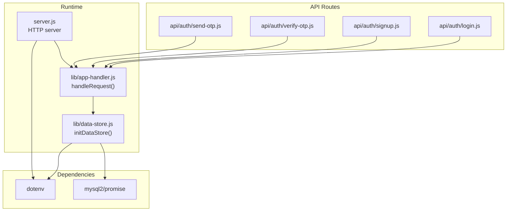
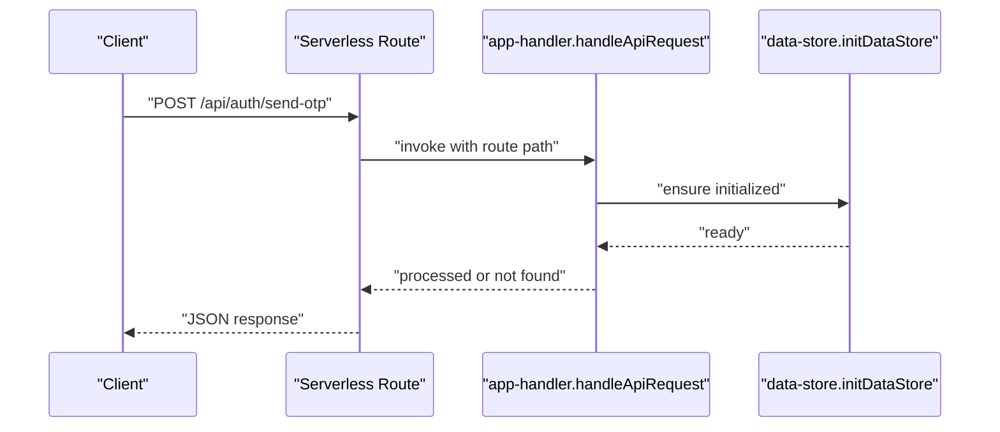
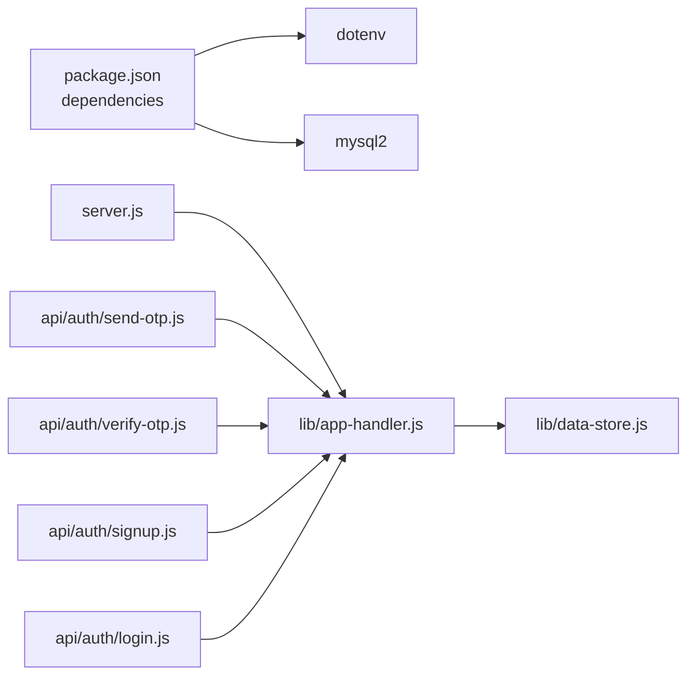

# Environment Configuration

<cite>
**Referenced Files in This Document**
- [server.js](file://server.js)
- [lib/data-store.js](file://lib/data-store.js)
- [lib/app-handler.js](file://lib/app-handler.js)
- [api/auth/send-otp.js](file://api/auth/send-otp.js)
- [api/auth/verify-otp.js](file://api/auth/verify-otp.js)
- [api/auth/signup.js](file://api/auth/signup.js)
- [api/auth/login.js](file://api/auth/login.js)
- [package.json](file://package.json)
</cite>

## Table of Contents
1. [Introduction](#introduction)
2. [Project Structure](#project-structure)
3. [Core Components](#core-components)
4. [Architecture Overview](#architecture-overview)
5. [Detailed Component Analysis](#detailed-component-analysis)
6. [Dependency Analysis](#dependency-analysis)
7. [Performance Considerations](#performance-considerations)
8. [Troubleshooting Guide](#troubleshooting-guide)
9. [Conclusion](#conclusion)
10. [Appendices](#appendices)

## Introduction
This document explains how Night Foodies loads and applies environment configuration at runtime. It covers:
- Environment variable management via dotenv
- Configuration hierarchy from environment variables to defaults
- Database selection and initialization (MySQL, file-based JSON, in-memory)
- Storage mode configuration and fallback behavior
- Security considerations for production
- Deployment templates and validation procedures
- Troubleshooting common configuration issues

## Project Structure
The application is a Node.js HTTP server with a modular configuration system:
- Server entry initializes dotenv and starts the HTTP server
- Request routing delegates to a handler module
- Data persistence is abstracted behind a data store module supporting multiple backends
- Serverless API routes are provided under api/auth for platforms like Vercel



**Diagram sources**
- [server.js:1-35](file://server.js#L1-L35)
- [lib/app-handler.js:297-331](file://lib/app-handler.js#L297-L331)
- [lib/data-store.js:19-214](file://lib/data-store.js#L19-L214)
- [api/auth/send-otp.js:1-4](file://api/auth/send-otp.js#L1-L4)
- [api/auth/verify-otp.js:1-4](file://api/auth/verify-otp.js#L1-L4)
- [api/auth/signup.js:1-4](file://api/auth/signup.js#L1-L4)
- [api/auth/login.js:1-4](file://api/auth/login.js#L1-L4)
- [package.json:12-15](file://package.json#L12-L15)

**Section sources**
- [server.js:1-35](file://server.js#L1-L35)
- [lib/app-handler.js:297-331](file://lib/app-handler.js#L297-L331)
- [lib/data-store.js:19-214](file://lib/data-store.js#L19-L214)
- [package.json:12-15](file://package.json#L12-L15)

## Core Components
- Environment variable loading: dotenv is loaded at module boundaries to ensure configuration is available before any environment-dependent logic runs.
- Port configuration: The server reads PORT from environment variables with a default fallback.
- Data store initialization: The data store selects backend based on environment variables and platform constraints, with robust fallback behavior.

Key environment variables:
- DB_DRIVER: Explicitly selects storage backend ("mysql", "memory", "file"/"json"/"sqlite")
- DB_HOST, DB_PORT, DB_USER, DB_PASSWORD, DB_NAME: MySQL connection configuration
- CUSTOMERS_FILE: Path to the JSON file used for file-based storage
- VERCEL: Platform flag enabling serverless behavior and in-memory fallback semantics
- PORT: HTTP server port (default 3000)

**Section sources**
- [server.js:1-35](file://server.js#L1-L35)
- [lib/data-store.js:19-214](file://lib/data-store.js#L19-L214)

## Architecture Overview
The configuration flow determines the data store backend and server behavior:

```mermaid
flowchart TD
Start(["Process start"]) --> LoadEnv["Load environment variables<br/>dotenv.config()"]
LoadEnv --> InitDS["initDataStore()"]
InitDS --> CheckDriver{"DB_DRIVER set?"}
CheckDriver --> |mysql| CheckMySQLCfg{"DB_HOST, DB_USER, DB_NAME present?"}
CheckMySQLCfg --> |Yes| TryMySQL["Initialize MySQL<br/>createPool()"]
CheckMySQLCfg --> |No| FallbackMySQL["Warn and fallback"]
TryMySQL --> MySQLOK{"Success?"}
MySQLOK --> |Yes| UseMySQL["Use MySQL"]
MySQLOK --> |No| FallbackMySQL
FallbackMySQL --> CheckVercel{"VERCEL?"}
CheckVercel --> |Yes| UseMemory["Use in-memory (serverless)"]
CheckVercel --> |No| TryFile["Try file storage"]
TryFile --> FileOK{"Success?"}
FileOK --> |Yes| UseFile["Use file storage"]
FileOK --> |No| UseMemory["Use in-memory fallback"]
CheckDriver --> |memory| UseMemory
CheckDriver --> |"file"/"json"/"sqlite"| TryFile
CheckDriver --> |none| CheckMySQLCfg
```

**Diagram sources**
- [lib/data-store.js:140-214](file://lib/data-store.js#L140-L214)

**Section sources**
- [lib/data-store.js:140-214](file://lib/data-store.js#L140-L214)

## Detailed Component Analysis

### Environment Variable Management and Dotenv Integration
- dotenv is loaded at the top of both server and data store modules to ensure environment variables are available before any logic depends on them.
- The server also reads PORT from environment variables with a default of 3000.
- The data store module reads DB_* variables and CUSTOMERS_FILE to configure MySQL and file storage.

Operational notes:
- Place a .env file at the project root during local development to populate process.env.
- On platforms like Vercel, environment variables are injected by the platform; dotenv remains useful for local parity.

**Section sources**
- [server.js:1-35](file://server.js#L1-L35)
- [lib/data-store.js:19-214](file://lib/data-store.js#L19-L214)

### Configuration Hierarchy and Resolution
The data store resolves configuration in this order:
1. Explicit driver choice via DB_DRIVER
2. Presence of DB_HOST/DB_USER/DB_NAME to auto-select MySQL
3. Platform awareness via VERCEL to enforce in-memory fallback on serverless
4. File-based storage as a last resort, with automatic creation of parent directories
5. Final fallback to in-memory storage

Resolution rules:
- If DB_DRIVER is "mysql" but required DB_* variables are missing, a warning is logged and fallback occurs.
- If DB_DRIVER is "memory", in-memory storage is forced.
- If DB_DRIVER is "file"/"json"/"sqlite" or unspecified, file storage is attempted; failures fall back to in-memory.
- On VERCEL, file storage is not persistent; the resolver logs a warning and uses in-memory storage.

**Section sources**
- [lib/data-store.js:140-214](file://lib/data-store.js#L140-L214)

### MySQL Database Setup
Connection configuration:
- Host, port, user, password, and database name are read from environment variables with sensible defaults.
- A bootstrap connection is created to ensure the target database exists, then a dedicated pool is created with the target database selected.
- Connection pooling parameters include wait-for-connections, connection limit, and queue limits.

Schema initialization:
- The customers table is created if it does not exist, with appropriate collation and a unique index on phone.

Migration procedure:
- Run the application once with MySQL configured; the initialization routine creates the database and table automatically.
- For manual verification, connect to the target MySQL instance and confirm the presence of the database and table.

Connection pooling:
- The pool is created with default limits suitable for small deployments; adjust DB_PORT and other MySQL settings as needed for your infrastructure.

**Section sources**
- [lib/data-store.js:68-101](file://lib/data-store.js#L68-L101)

### File-Based Storage Configuration
Behavior:
- The customer data file path is resolved from CUSTOMERS_FILE if set; otherwise, it defaults to customers.json in the current working directory.
- Parent directories are created automatically if they do not exist.
- The file is read at startup and written on every change to persistence.

Permissions:
- Ensure the process has read/write permissions to the directory containing the customer data file.
- On Unix-like systems, set ownership and permissions appropriately for the deployment user.

Backup strategies:
- Back up the customer data file regularly.
- Prefer offsite backups and maintain versioned snapshots.
- For production, consider migrating to MySQL to avoid filesystem constraints.

**Section sources**
- [lib/data-store.js:19-25](file://lib/data-store.js#L19-L25)
- [lib/data-store.js:103-123](file://lib/data-store.js#L103-L123)

### Memory Store Fallback
Behavior:
- In-memory storage is used when explicitly requested via DB_DRIVER or when fallback conditions occur (e.g., serverless platforms, file storage failure).
- Data is stored in memory maps and is not persisted across cold starts.

Use cases:
- Local development without a database
- Serverless environments where persistent storage is not available
- Testing scenarios where data volatility is acceptable

**Section sources**
- [lib/data-store.js:125-129](file://lib/data-store.js#L125-L129)
- [lib/data-store.js:140-147](file://lib/data-store.js#L140-L147)

### Serverless API Route Integration
Serverless handlers are thin wrappers around the shared request handler. They ensure that the data store is initialized for each invocation and return appropriate JSON responses.



**Diagram sources**
- [api/auth/send-otp.js:1-4](file://api/auth/send-otp.js#L1-L4)
- [lib/app-handler.js:271-295](file://lib/app-handler.js#L271-L295)
- [lib/data-store.js:158-214](file://lib/data-store.js#L158-L214)

**Section sources**
- [api/auth/send-otp.js:1-4](file://api/auth/send-otp.js#L1-L4)
- [lib/app-handler.js:271-295](file://lib/app-handler.js#L271-L295)
- [lib/data-store.js:158-214](file://lib/data-store.js#L158-L214)

## Dependency Analysis
- Runtime dependencies include dotenv and mysql2/promise.
- The server depends on the app handler, which depends on the data store.
- API routes depend on the app handler.



**Diagram sources**
- [package.json:12-15](file://package.json#L12-L15)
- [server.js:1-35](file://server.js#L1-L35)
- [lib/app-handler.js:297-331](file://lib/app-handler.js#L297-L331)
- [lib/data-store.js:19-214](file://lib/data-store.js#L19-L214)
- [api/auth/send-otp.js:1-4](file://api/auth/send-otp.js#L1-L4)
- [api/auth/verify-otp.js:1-4](file://api/auth/verify-otp.js#L1-L4)
- [api/auth/signup.js:1-4](file://api/auth/signup.js#L1-L4)
- [api/auth/login.js:1-4](file://api/auth/login.js#L1-L4)

**Section sources**
- [package.json:12-15](file://package.json#L12-L15)
- [server.js:1-35](file://server.js#L1-L35)
- [lib/app-handler.js:297-331](file://lib/app-handler.js#L297-L331)
- [lib/data-store.js:19-214](file://lib/data-store.js#L19-L214)
- [api/auth/send-otp.js:1-4](file://api/auth/send-otp.js#L1-L4)
- [api/auth/verify-otp.js:1-4](file://api/auth/verify-otp.js#L1-L4)
- [api/auth/signup.js:1-4](file://api/auth/signup.js#L1-L4)
- [api/auth/login.js:1-4](file://api/auth/login.js#L1-L4)

## Performance Considerations
- MySQL connection pool: The default pool settings are suitable for small deployments. For higher concurrency, tune pool parameters via environment variables and ensure your MySQL instance can handle the load.
- File storage I/O: Frequent writes to the customer data file can impact performance and durability. Prefer MySQL for production workloads.
- In-memory storage: Suitable for ephemeral data and testing; expect data loss after restarts.

[No sources needed since this section provides general guidance]

## Troubleshooting Guide
Common configuration issues and resolutions:
- MySQL initialization fails
  - Verify DB_HOST, DB_USER, DB_NAME are set and reachable.
  - Confirm network access and credentials.
  - Check that the application can create the database and table.
- File storage errors
  - Ensure CUSTOMERS_FILE points to a writable path.
  - Confirm the process has write permissions to the directory.
  - Check that the file contains a valid JSON array.
- Serverless (VERCEL) behavior
  - File storage is not persistent; rely on in-memory mode.
  - Configure DB_DRIVER to "mysql" with proper environment variables for persistent data.
- Port conflicts
  - Set PORT to an available port; default is 3000.
- Unknown DB_DRIVER
  - The system falls back to file storage; set a supported driver or remove the variable.

Validation procedures:
- Start the server and observe console logs indicating the selected database mode.
- Perform a sign-up operation and verify persistence according to the selected backend.
- For MySQL, connect externally and query the customers table to confirm records.

**Section sources**
- [lib/data-store.js:140-214](file://lib/data-store.js#L140-L214)
- [lib/data-store.js:103-123](file://lib/data-store.js#L103-L123)
- [server.js:21-30](file://server.js#L21-L30)

## Conclusion
Night Foodies supports flexible environment-driven configuration with clear fallback behavior. Use MySQL for production, file storage for local development, and in-memory mode for ephemeral or serverless contexts. Apply dotenv locally, manage secrets securely, and validate configuration by observing startup logs and performing functional tests.

[No sources needed since this section summarizes without analyzing specific files]

## Appendices

### Environment Variables Reference
- DB_DRIVER: Selects storage backend ("mysql", "memory", "file"/"json"/"sqlite")
- DB_HOST: MySQL host (default "localhost")
- DB_PORT: MySQL port (default 3306)
- DB_USER: MySQL user (default "root")
- DB_PASSWORD: MySQL password (optional)
- DB_NAME: MySQL database name (default "night_foodies")
- CUSTOMERS_FILE: Path to customer data JSON file (default "customers.json" in CWD)
- VERCEL: Set to enable serverless behavior and in-memory fallback
- PORT: Server port (default 3000)

**Section sources**
- [lib/data-store.js:68-78](file://lib/data-store.js#L68-L78)
- [lib/data-store.js:19-25](file://lib/data-store.js#L19-L25)
- [server.js:5](file://server.js#L5)

### Deployment Templates
- Development
  - Set DB_DRIVER=file or leave unset
  - Provide CUSTOMERS_FILE if storing outside CWD
  - Use dotenv for local variables
- Staging
  - Set DB_DRIVER=mysql
  - Provide DB_HOST, DB_USER, DB_NAME
  - Keep DB_PASSWORD secure and managed by the platform
- Production
  - Set DB_DRIVER=mysql
  - Use strong credentials and network security
  - Consider SSL/TLS for MySQL connections
  - Monitor pool usage and tune parameters as needed

[No sources needed since this section provides general guidance]

### Security Considerations
- Protect database credentials using platform secret management
- Avoid committing .env files to version control
- Use HTTPS for client-server communication
- For MySQL, prefer TLS connections and restrict network access
- Limit file permissions for CUSTOMERS_FILE to reduce exposure

**Section sources**
- [lib/data-store.js:68-78](file://lib/data-store.js#L68-L78)
- [lib/data-store.js:103-123](file://lib/data-store.js#L103-L123)