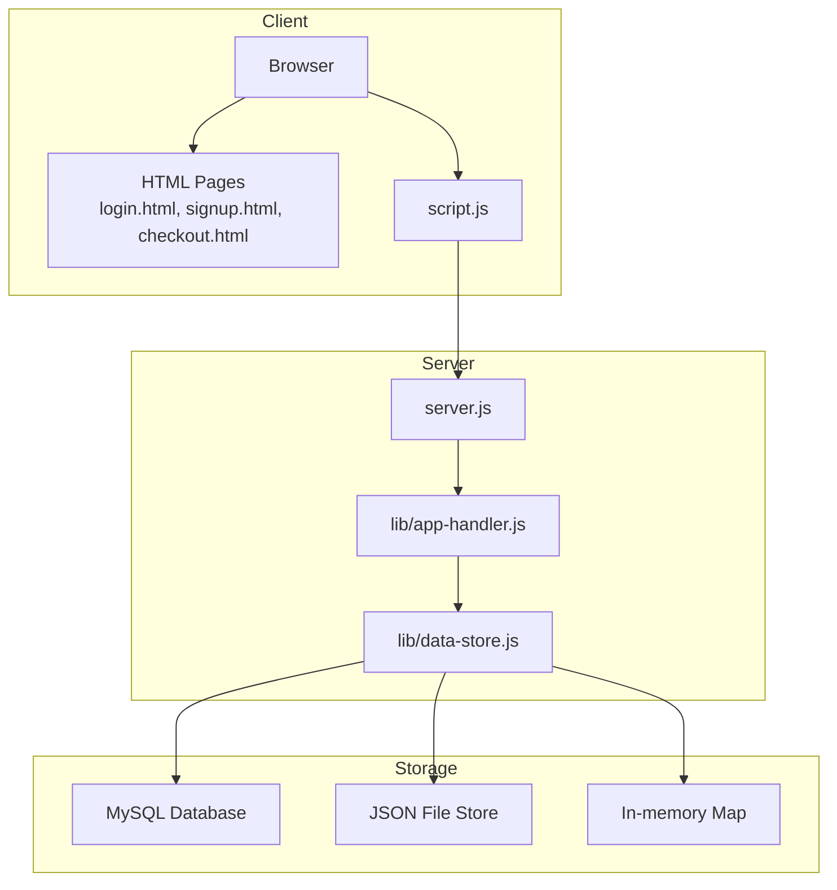
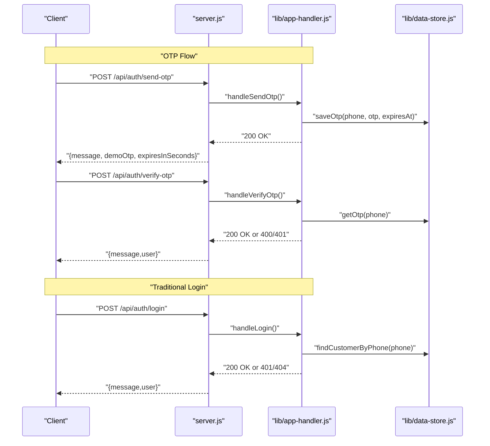
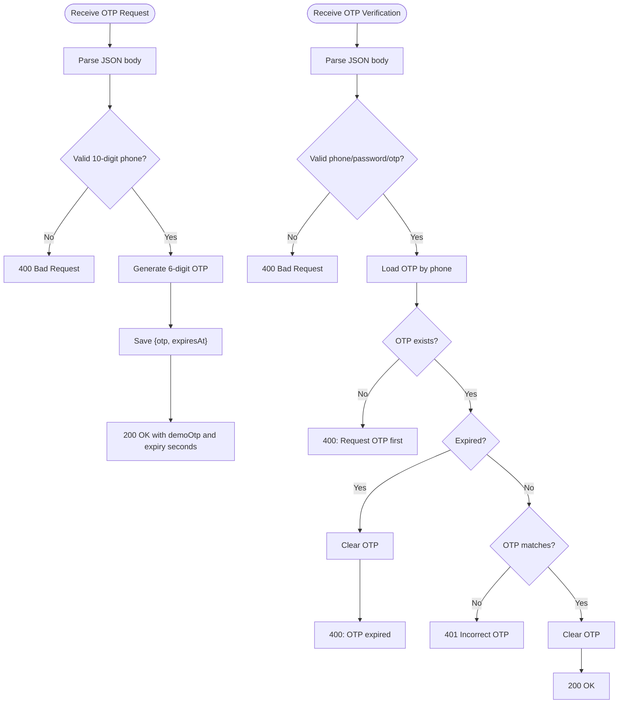
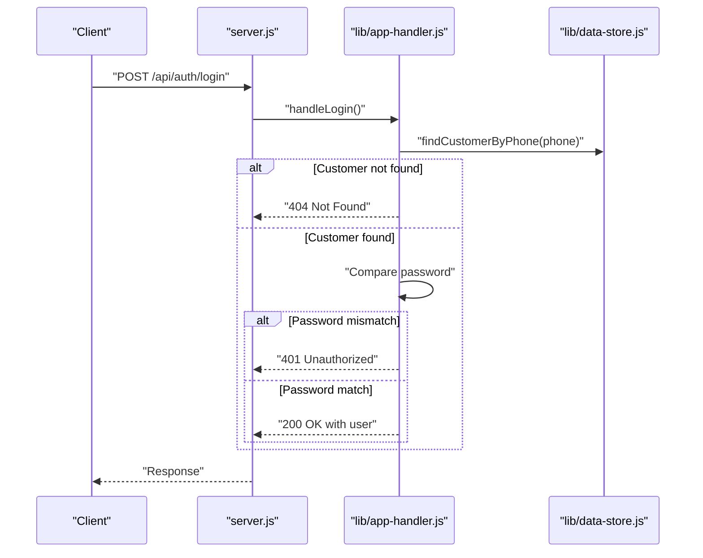
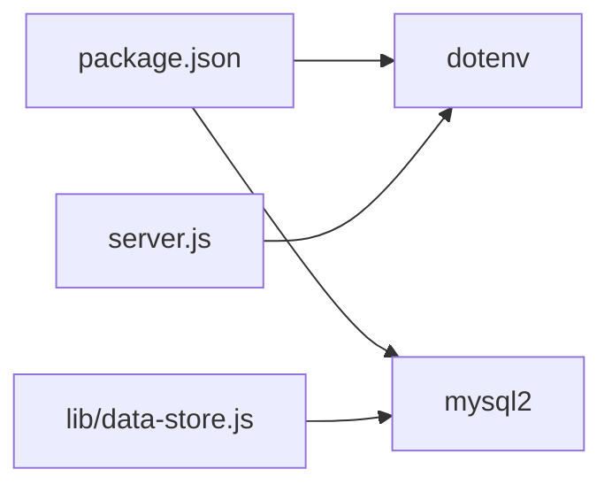

# Security Configuration

<cite>
**Referenced Files in This Document**
- [server.js](file://server.js)
- [package.json](file://package.json)
- [.gitignore](file://.gitignore)
- [lib/app-handler.js](file://lib/app-handler.js)
- [lib/data-store.js](file://lib/data-store.js)
- [api/auth/login.js](file://api/auth/login.js)
- [api/auth/send-otp.js](file://api/auth/send-otp.js)
- [api/auth/verify-otp.js](file://api/auth/verify-otp.js)
- [script.js](file://script.js)
- [login.html](file://login.html)
- [signup.html](file://signup.html)
- [checkout.html](file://checkout.html)
</cite>

## Table of Contents
1. [Introduction](#introduction)
2. [Project Structure](#project-structure)
3. [Core Components](#core-components)
4. [Architecture Overview](#architecture-overview)
5. [Detailed Component Analysis](#detailed-component-analysis)
6. [Dependency Analysis](#dependency-analysis)
7. [Performance Considerations](#performance-considerations)
8. [Troubleshooting Guide](#troubleshooting-guide)
9. [Conclusion](#conclusion)
10. [Appendices](#appendices)

## Introduction
This document provides comprehensive security configuration guidance for deploying Night Foodies in production. It focuses on environment variable security, OTP security, authentication and session management, database security, and operational best practices. The goal is to help operators harden the application against common vulnerabilities while maintaining a smooth user experience.

## Project Structure
The application is a static site with a small Node.js server that serves HTML pages and exposes a minimal set of API endpoints for authentication and OTP flows. Authentication is handled client-side via localStorage for session persistence, and the backend stores user data in either MySQL, a JSON file, or an in-memory map depending on environment configuration.

**Diagram sources**
- [server.js:1-35](file://server.js#L1-L35)
- [lib/app-handler.js:1-332](file://lib/app-handler.js#L1-L332)
- [lib/data-store.js:1-291](file://lib/data-store.js#L1-L291)

**Section sources**
- [server.js:1-35](file://server.js#L1-L35)
- [lib/app-handler.js:1-332](file://lib/app-handler.js#L1-L332)
- [lib/data-store.js:1-291](file://lib/data-store.js#L1-L291)

## Core Components
- Environment configuration and secrets loading via dotenv.
- Request routing and API handlers for authentication and OTP.
- Data store abstraction supporting MySQL, JSON file, and in-memory modes.
- Frontend authentication state persisted in localStorage.

Key security-relevant responsibilities:
- Environment variables for database connectivity and runtime behavior.
- Input validation and sanitization for authentication endpoints.
- OTP generation, storage, and expiration handling.
- Session-like state stored in localStorage on the client.

**Section sources**
- [server.js:1-35](file://server.js#L1-L35)
- [lib/app-handler.js:13-28](file://lib/app-handler.js#L13-L28)
- [lib/data-store.js:1-20](file://lib/data-store.js#L1-L20)
- [script.js:24-55](file://script.js#L24-L55)

## Architecture Overview
The authentication flow uses a two-step process:
- OTP issuance and verification for phone-based login.
- Traditional username/password login for returning users.

**Diagram sources**
- [api/auth/send-otp.js:1-7](file://api/auth/send-otp.js#L1-L7)
- [api/auth/verify-otp.js:1-7](file://api/auth/verify-otp.js#L1-L7)
- [api/auth/login.js:1-7](file://api/auth/login.js#L1-L7)
- [lib/app-handler.js:98-170](file://lib/app-handler.js#L98-L170)
- [lib/data-store.js:266-276](file://lib/data-store.js#L266-L276)

## Detailed Component Analysis

### Environment Variables and Secrets Management
- Secrets are loaded via dotenv at startup.
- Database credentials and driver selection are controlled by environment variables.
- Production deployments should avoid committing secrets to version control.

Recommended variables:
- DB_DRIVER: "mysql", "file", "memory"
- DB_HOST, DB_PORT, DB_USER, DB_NAME, DB_PASSWORD
- CUSTOMERS_FILE: path to JSON file store
- PORT: server port (default 3000)
- VERCEL: presence indicates serverless hosting

Security practices:
- Never commit .env files or sensitive data to the repository.
- Use platform-native secret management (e.g., Vercel Environment Variables).
- Restrict access to secrets at the infrastructure level.

**Section sources**
- [server.js:1-3](file://server.js#L1-L3)
- [lib/data-store.js:1-20](file://lib/data-store.js#L1-L20)
- [lib/data-store.js:68-101](file://lib/data-store.js#L68-L101)
- [.gitignore:2-6](file://.gitignore#L2-L6)

### OTP Security
OTP generation and validation:
- 6-digit numeric OTP generated randomly.
- Expiration enforced via expiresAt timestamp.
- OTP cleared after successful verification or expiry.

Security considerations:
- Expiration handling prevents replay attacks.
- No rate limiting is implemented at the server level for OTP requests.
- Demo OTP is exposed in responses for development convenience; disable in production.

Mitigations:
- Enforce rate limits on OTP requests (per IP or phone).
- Add circuit breaker logic to prevent abuse.
- Consider moving OTP to a dedicated cache with TTL and atomic operations.

**Diagram sources**
- [lib/app-handler.js:98-170](file://lib/app-handler.js#L98-L170)
- [lib/data-store.js:266-276](file://lib/data-store.js#L266-L276)

**Section sources**
- [lib/app-handler.js:13-21](file://lib/app-handler.js#L13-L21)
- [lib/app-handler.js:98-170](file://lib/app-handler.js#L98-L170)
- [lib/data-store.js:266-276](file://lib/data-store.js#L266-L276)

### Authentication Security
Traditional login and signup:
- Validation enforces minimum password length and phone format.
- Password comparison is performed as a string match.
- Successful login sets a localStorage key indicating session state.

Security considerations:
- No password hashing is implemented; plaintext passwords are stored.
- Session state is client-side and not protected by HttpOnly cookies.
- No CSRF protection is present for form submissions.

Mitigations:
- Hash passwords using a strong algorithm (bcrypt) before storing.
- Implement server-managed sessions with HttpOnly cookies.
- Add CSRF tokens and SameSite cookie attributes.
- Enforce stronger password policies and rate limiting.

**Diagram sources**
- [lib/app-handler.js:227-269](file://lib/app-handler.js#L227-L269)
- [lib/data-store.js:216-229](file://lib/data-store.js#L216-L229)

**Section sources**
- [lib/app-handler.js:172-225](file://lib/app-handler.js#L172-L225)
- [lib/app-handler.js:227-269](file://lib/app-handler.js#L227-L269)
- [script.js:122-148](file://script.js#L122-L148)

### Database Security Configuration
Supported storage modes:
- MySQL: Persistent relational storage with table creation and constraints.
- File: Local JSON file store with automatic persistence.
- Memory: In-memory map for ephemeral data.

Security implications:
- MySQL requires secure transport and least-privilege accounts.
- File store should restrict filesystem permissions.
- Memory mode is ephemeral and unsuitable for production data.

Recommended MySQL configuration:
- Use TLS for connections.
- Create a dedicated database user with minimal privileges.
- Limit network access to the database host.
- Encrypt data-at-rest on disk.

Fallback behavior:
- If MySQL initialization fails, the system falls back to file or memory storage.
- On Vercel, file storage is not persistent; memory mode is forced.

**Section sources**
- [lib/data-store.js:68-101](file://lib/data-store.js#L68-L101)
- [lib/data-store.js:112-147](file://lib/data-store.js#L112-L147)
- [lib/data-store.js:149-214](file://lib/data-store.js#L149-L214)

### Frontend Session Management
Client-side session:
- Authentication state is stored in localStorage under a fixed key.
- Navigation guards redirect unauthenticated users to login.
- Logout clears the stored key and redirects to login.

Security considerations:
- localStorage is accessible to XSS attacks.
- No HttpOnly or SameSite protections.
- Sensitive data should not be stored in localStorage.

Mitigations:
- Move session state to HttpOnly cookies.
- Implement CSRF protection.
- Sanitize and escape all dynamic content to prevent XSS.
- Add Content Security Policy headers.

**Section sources**
- [script.js:24-55](file://script.js#L24-L55)
- [script.js:194-199](file://script.js#L194-L199)
- [login.html:30-46](file://login.html#L30-L46)
- [signup.html:30-59](file://signup.html#L30-L59)

### Static Assets and Routing
- Static files are served from the project root with basic MIME-type detection.
- Path normalization prevents directory traversal.
- API routes are handled by serverless-style handlers.

Security considerations:
- Ensure static asset integrity and apply CSP.
- Validate and sanitize all user-supplied inputs.
- Apply rate limiting to static assets if needed.

**Section sources**
- [lib/app-handler.js:78-96](file://lib/app-handler.js#L78-L96)
- [lib/app-handler.js:297-309](file://lib/app-handler.js#L297-L309)

## Dependency Analysis
External dependencies relevant to security:
- dotenv: loads environment variables from .env files.
- mysql2: connects to MySQL with TLS support and SSL profiles.

Operational dependencies:
- Node.js runtime version is pinned in package metadata.

**Diagram sources**
- [package.json:13-16](file://package.json#L13-L16)
- [server.js:1-3](file://server.js#L1-L3)
- [lib/data-store.js:4](file://lib/data-store.js#L4)

**Section sources**
- [package.json:13-16](file://package.json#L13-L16)
- [server.js:1-3](file://server.js#L1-L3)
- [lib/data-store.js:4](file://lib/data-store.js#L4)

## Performance Considerations
- OTP and customer lookups are O(1) for memory mode and O(1) for MySQL unique key lookups.
- File store writes occur synchronously; consider asynchronous persistence for high throughput.
- Consider connection pooling and query timeouts for MySQL.

[No sources needed since this section provides general guidance]

## Troubleshooting Guide
Common issues and resolutions:
- Database initialization failures: Check environment variables and network connectivity; fallback to file/memory mode logs warnings.
- OTP verification errors: Ensure OTP was requested first and has not expired.
- Login failures: Confirm phone exists and password matches; verify storage mode.
- CORS and static file serving: Ensure correct MIME types and path normalization.

**Section sources**
- [lib/data-store.js:149-214](file://lib/data-store.js#L149-L214)
- [lib/app-handler.js:151-170](file://lib/app-handler.js#L151-L170)
- [lib/app-handler.js:248-269](file://lib/app-handler.js#L248-L269)

## Conclusion
Night Foodies currently relies on client-side session storage and plaintext password storage, which are significant security risks. For production, prioritize password hashing, server-managed sessions, rate limiting, and secure database configuration. Implement strict input validation, enforce HTTPS, and adopt robust secrets management practices.

[No sources needed since this section summarizes without analyzing specific files]

## Appendices

### Environment Variables Reference
- DB_DRIVER: "mysql" | "file" | "memory"
- DB_HOST, DB_PORT, DB_USER, DB_NAME, DB_PASSWORD
- CUSTOMERS_FILE: path to JSON file store
- PORT: server port (default 3000)
- VERCEL: presence indicates serverless hosting

**Section sources**
- [lib/data-store.js:164-180](file://lib/data-store.js#L164-L180)
- [lib/data-store.js:187-194](file://lib/data-store.js#L187-L194)
- [server.js:5-5](file://server.js#L5-L5)

### Production Hardening Checklist
- Replace plaintext passwords with hashed values.
- Switch to HttpOnly cookies for session management.
- Add CSRF protection and SameSite cookies.
- Enforce HTTPS and TLS for all communications.
- Configure database with least privilege and network restrictions.
- Implement rate limiting for OTP and login endpoints.
- Audit logs for authentication events.
- Review and tighten CSP and security headers.
- Use platform-native secrets management instead of .env files.

[No sources needed since this section provides general guidance]