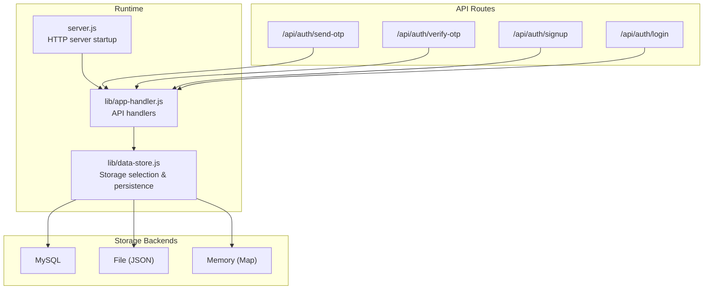
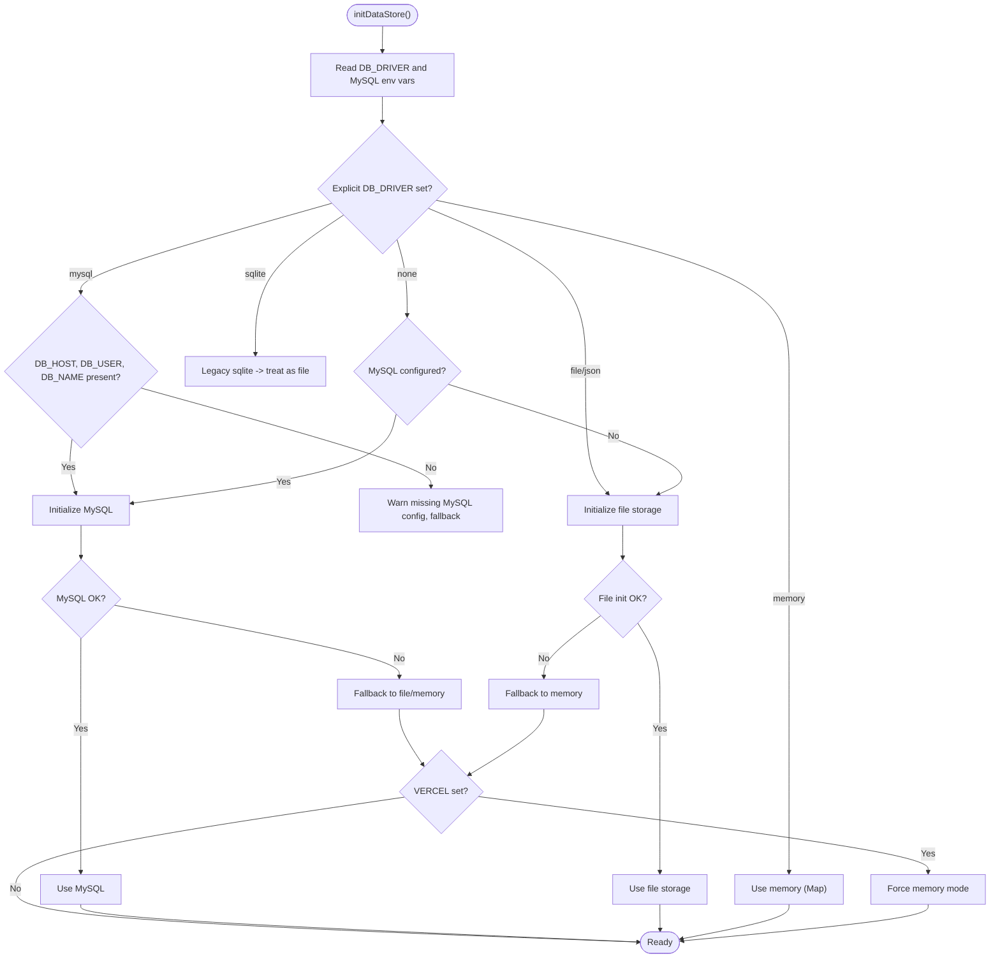
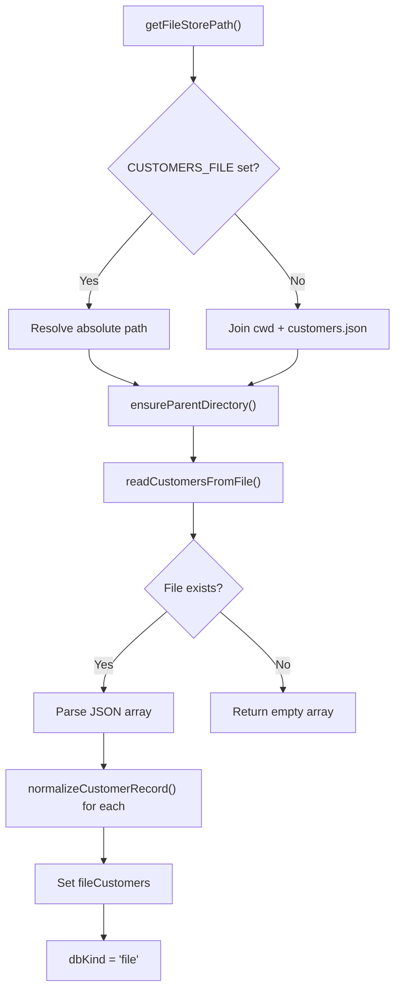
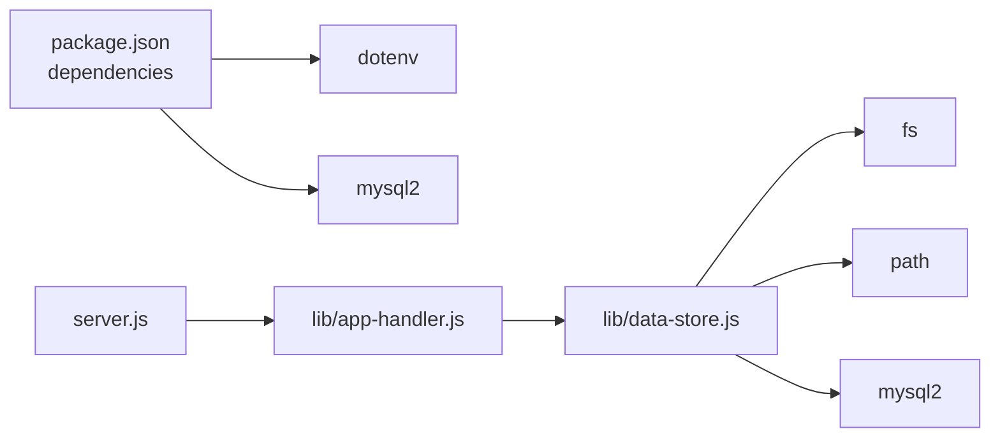

# Storage Mode Configuration

<cite>
**Referenced Files in This Document**
- [server.js](file://server.js)
- [lib/data-store.js](file://lib/data-store.js)
- [lib/app-handler.js](file://lib/app-handler.js)
- [api/auth/send-otp.js](file://api/auth/send-otp.js)
- [api/auth/verify-otp.js](file://api/auth/verify-otp.js)
- [api/auth/signup.js](file://api/auth/signup.js)
- [api/auth/login.js](file://api/auth/login.js)
- [customers.json](file://customers.json)
- [package.json](file://package.json)
</cite>

## Table of Contents
1. [Introduction](#introduction)
2. [Project Structure](#project-structure)
3. [Core Components](#core-components)
4. [Architecture Overview](#architecture-overview)
5. [Detailed Component Analysis](#detailed-component-analysis)
6. [Dependency Analysis](#dependency-analysis)
7. [Performance Considerations](#performance-considerations)
8. [Troubleshooting Guide](#troubleshooting-guide)
9. [Conclusion](#conclusion)

## Introduction
This document explains how Night Foodies configures and selects its storage backend at runtime. The system supports multiple storage modes controlled by environment variables and automatically falls back between them depending on availability and deployment context. It covers:
- The DB_DRIVER environment variable and supported values
- Automatic fallback behavior prioritizing MySQL, then file storage, then memory
- File-based storage configuration and JSON format requirements
- In-memory storage mode for development and testing
- Vercel serverless deployment considerations and why file storage is not persistent
- Configuration examples and troubleshooting steps

## Project Structure
The storage configuration logic lives primarily in the data store module and is wired into the HTTP server and serverless API routes.

**Diagram sources**
- [server.js:1-35](file://server.js#L1-L35)
- [lib/app-handler.js:1-332](file://lib/app-handler.js#L1-L332)
- [lib/data-store.js:1-291](file://lib/data-store.js#L1-L291)

**Section sources**
- [server.js:1-35](file://server.js#L1-L35)
- [lib/app-handler.js:1-332](file://lib/app-handler.js#L1-L332)
- [lib/data-store.js:1-291](file://lib/data-store.js#L1-L291)

## Core Components
- Environment-driven storage selection:
  - DB_DRIVER controls explicit mode selection
  - DB_HOST, DB_USER, DB_NAME detect MySQL configuration presence
  - CUSTOMERS_FILE sets the JSON file location for file storage
  - VERCEL indicates serverless deployment context
- Automatic fallback chain:
  - MySQL (preferred)
  - File storage (JSON)
  - Memory storage (Map)
- Serverless behavior:
  - On Vercel, file storage is disabled due to non-persistence; memory mode is forced

**Section sources**
- [lib/data-store.js:158-214](file://lib/data-store.js#L158-L214)
- [lib/data-store.js:19-25](file://lib/data-store.js#L19-L25)
- [lib/data-store.js:140-147](file://lib/data-store.js#L140-L147)
- [lib/data-store.js:187-194](file://lib/data-store.js#L187-L194)

## Architecture Overview
The storage selection algorithm evaluates environment variables and deployment context to pick a backend. The chosen backend affects how customer records are stored and retrieved.

**Diagram sources**
- [lib/data-store.js:158-214](file://lib/data-store.js#L158-L214)
- [lib/data-store.js:140-147](file://lib/data-store.js#L140-L147)
- [lib/data-store.js:187-194](file://lib/data-store.js#L187-L194)

## Detailed Component Analysis

### Storage Modes and Selection Logic
- MySQL mode:
  - Enabled when DB_DRIVER is "mysql" and DB_HOST/DB_USER/DB_NAME are provided, or when DB_DRIVER is not set but MySQL credentials are present
  - Creates the database and customer table if missing
- File mode (JSON):
  - Enabled when DB_DRIVER is "file", "json", or unspecified and MySQL is not configured
  - Uses CUSTOMERS_FILE if set; otherwise defaults to customers.json in the working directory
  - Reads and writes a JSON array of customer records
- Memory mode:
  - Used when DB_DRIVER is "memory" or when Vercel is detected and file storage would be non-persistent
  - Data is held in memory maps and resets between cold starts
- SQLite legacy:
  - DB_DRIVER="sqlite" is treated as local JSON file storage for backward compatibility

**Section sources**
- [lib/data-store.js:68-101](file://lib/data-store.js#L68-L101)
- [lib/data-store.js:112-123](file://lib/data-store.js#L112-L123)
- [lib/data-store.js:125-129](file://lib/data-store.js#L125-L129)
- [lib/data-store.js:196-199](file://lib/data-store.js#L196-L199)
- [lib/data-store.js:187-194](file://lib/data-store.js#L187-L194)

### File-Based Storage Configuration
- Location:
  - CUSTOMERS_FILE environment variable sets the absolute or relative path to the JSON file
  - Defaults to customers.json in the current working directory if not set
- Initialization:
  - Ensures parent directories exist before reading/writing
  - Reads existing JSON array; creates empty array if file does not exist
  - Validates that the file contains a JSON array; throws on invalid format
- Persistence:
  - Writes customer records back to the JSON file after creation
  - Normalizes customer records to a canonical shape before saving

**Diagram sources**
- [lib/data-store.js:19-25](file://lib/data-store.js#L19-L25)
- [lib/data-store.js:27-32](file://lib/data-store.js#L27-L32)
- [lib/data-store.js:46-66](file://lib/data-store.js#L46-L66)
- [lib/data-store.js:112-123](file://lib/data-store.js#L112-L123)

**Section sources**
- [lib/data-store.js:19-25](file://lib/data-store.js#L19-L25)
- [lib/data-store.js:27-32](file://lib/data-store.js#L27-L32)
- [lib/data-store.js:46-66](file://lib/data-store.js#L46-L66)
- [lib/data-store.js:103-110](file://lib/data-store.js#L103-L110)
- [lib/data-store.js:34-44](file://lib/data-store.js#L34-L44)

### In-Memory Storage Mode
- Purpose:
  - Development and testing convenience
  - No external persistence
- Behavior:
  - Uses in-memory maps for OTP and customer data
  - Logs a warning that data resets between cold starts
- Selection:
  - Explicitly requested via DB_DRIVER="memory"
  - Automatically selected on Vercel deployments when file storage is not persistent

**Section sources**
- [lib/data-store.js:125-129](file://lib/data-store.js#L125-L129)
- [lib/data-store.js:182-184](file://lib/data-store.js#L182-L184)
- [lib/data-store.js:140-147](file://lib/data-store.js#L140-L147)

### Vercel Deployment Considerations
- Non-persistent file storage:
  - On Vercel, local file writes are not guaranteed to persist across requests or cold starts
  - The system forces memory mode when file storage would be non-persistent
- Serverless API routes:
  - API endpoints are exposed as serverless functions under /api/auth/*
  - The serverless handler delegates to the shared app handler and data store

**Section sources**
- [lib/data-store.js:187-194](file://lib/data-store.js#L187-L194)
- [server.js:28-30](file://server.js#L28-L30)
- [api/auth/send-otp.js:1-7](file://api/auth/send-otp.js#L1-L7)
- [api/auth/verify-otp.js:1-7](file://api/auth/verify-otp.js#L1-L7)
- [api/auth/signup.js:1-7](file://api/auth/signup.js#L1-L7)
- [api/auth/login.js:1-7](file://api/auth/login.js#L1-L7)

### API Integration and Usage
- Handlers:
  - Serverless handlers wrap the shared app handler for each endpoint
  - The app handler calls the data store to find/create customers and manage OTP
- Storage mode awareness:
  - The signup response includes a note about temporary data in memory mode
  - The data store exposes the current mode for informational purposes

**Section sources**
- [lib/app-handler.js:311-331](file://lib/app-handler.js#L311-L331)
- [lib/app-handler.js:172-225](file://lib/app-handler.js#L172-L225)
- [lib/data-store.js:278-280](file://lib/data-store.js#L278-L280)

## Dependency Analysis
- Runtime dependencies:
  - dotenv loads environment variables
  - mysql2 provides MySQL connectivity
  - fs and path support file-based storage
- Module relationships:
  - server.js initializes the data store and starts the HTTP server
  - app-handler.js depends on data-store.js for persistence operations
  - API route modules depend on app-handler.js for serverless execution

**Diagram sources**
- [package.json:13-16](file://package.json#L13-L16)
- [server.js:1-3](file://server.js#L1-L3)
- [lib/app-handler.js:3-11](file://lib/app-handler.js#L3-L11)
- [lib/data-store.js:1-4](file://lib/data-store.js#L1-L4)

**Section sources**
- [package.json:13-16](file://package.json#L13-L16)
- [server.js:1-3](file://server.js#L1-L3)
- [lib/app-handler.js:3-11](file://lib/app-handler.js#L3-L11)
- [lib/data-store.js:1-4](file://lib/data-store.js#L1-L4)

## Performance Considerations
- MySQL:
  - Best for production with persistent data and concurrent access
  - Requires proper database provisioning and credentials
- File storage:
  - Suitable for small-scale local development
  - File I/O overhead and JSON parsing cost increase with dataset size
- Memory storage:
  - Lowest latency for read/write operations
  - Not suitable for production due to non-persistence and data loss on restarts

## Troubleshooting Guide
- Storage mode not selected as expected:
  - Verify DB_DRIVER and MySQL environment variables:
    - DB_DRIVER must be one of mysql, memory, file, json, sqlite
    - For MySQL, ensure DB_HOST, DB_USER, and DB_NAME are set
  - Check CUSTOMERS_FILE for correct path resolution
  - Confirm whether VERCEL is set in the environment
- File storage errors:
  - Ensure the JSON file contains a top-level array
  - Verify write permissions to the target directory
- Vercel-specific issues:
  - File storage is not persistent; expect memory mode
  - Configure MySQL environment variables for persistent data
- Duplicate phone errors:
  - Occurs when attempting to create a customer with an existing phone number
  - Use a different phone number or log in instead

**Section sources**
- [lib/data-store.js:163-214](file://lib/data-store.js#L163-L214)
- [lib/data-store.js:46-66](file://lib/data-store.js#L46-L66)
- [lib/data-store.js:187-194](file://lib/data-store.js#L187-L194)
- [lib/app-handler.js:216-224](file://lib/app-handler.js#L216-L224)

## Conclusion
Night Foodies provides a flexible, environment-driven storage configuration with clear fallback behavior. Production deployments should configure MySQL for persistence; development and serverless environments can use file or memory modes, with the latter being non-persistent. Understanding the selection logic and environment variables ensures predictable behavior across deployment scenarios.