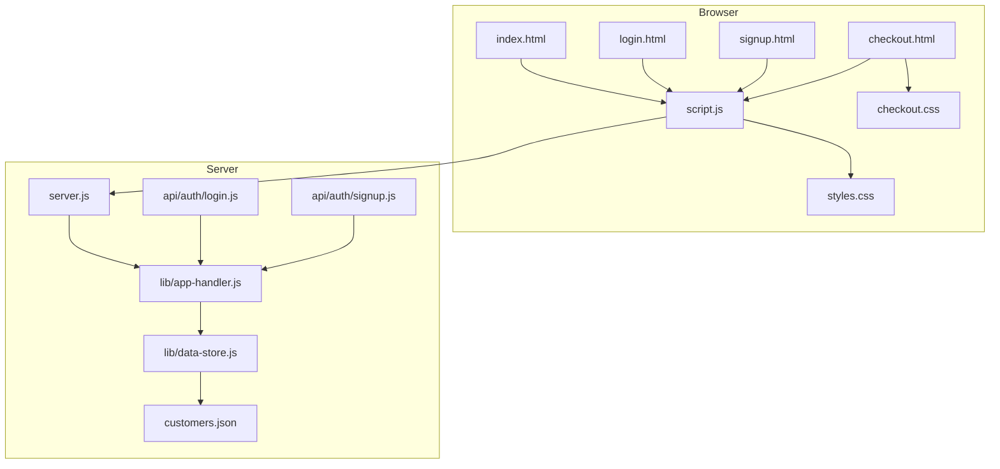
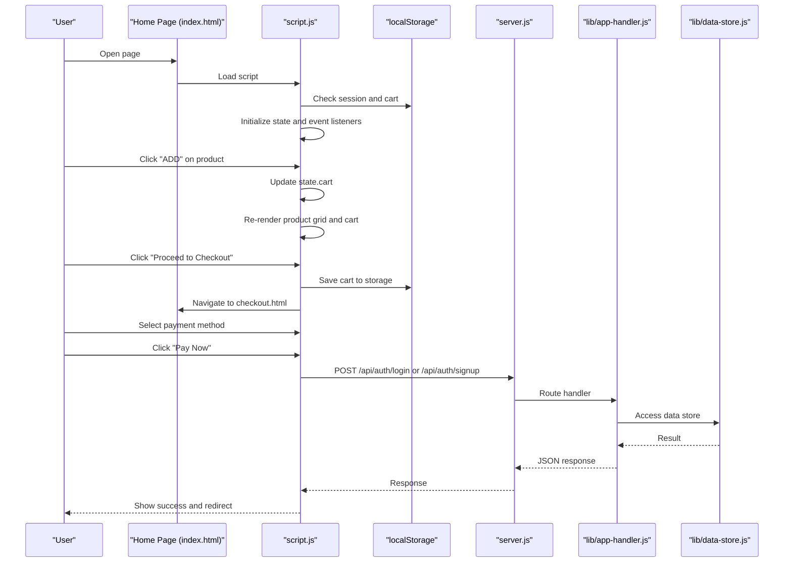
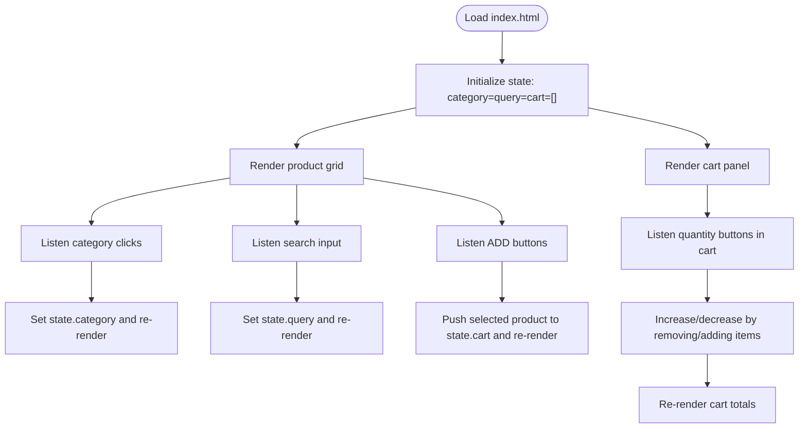
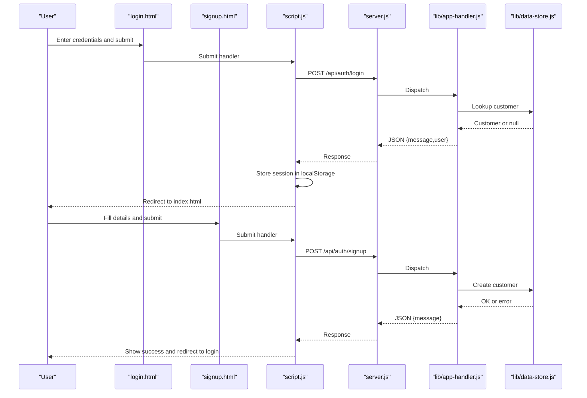
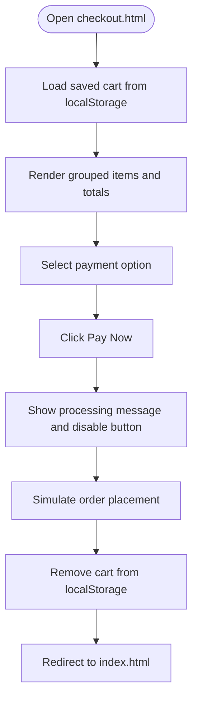
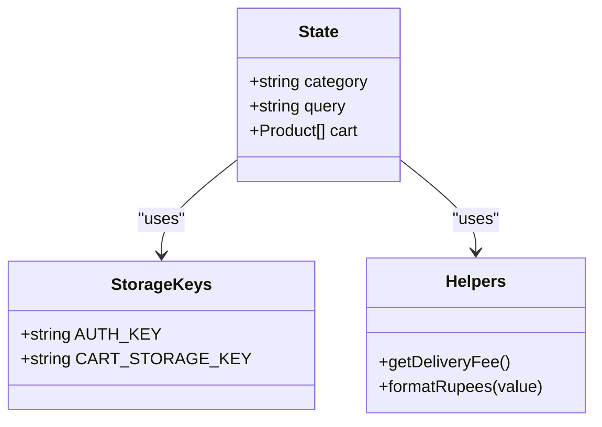
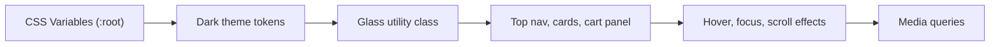
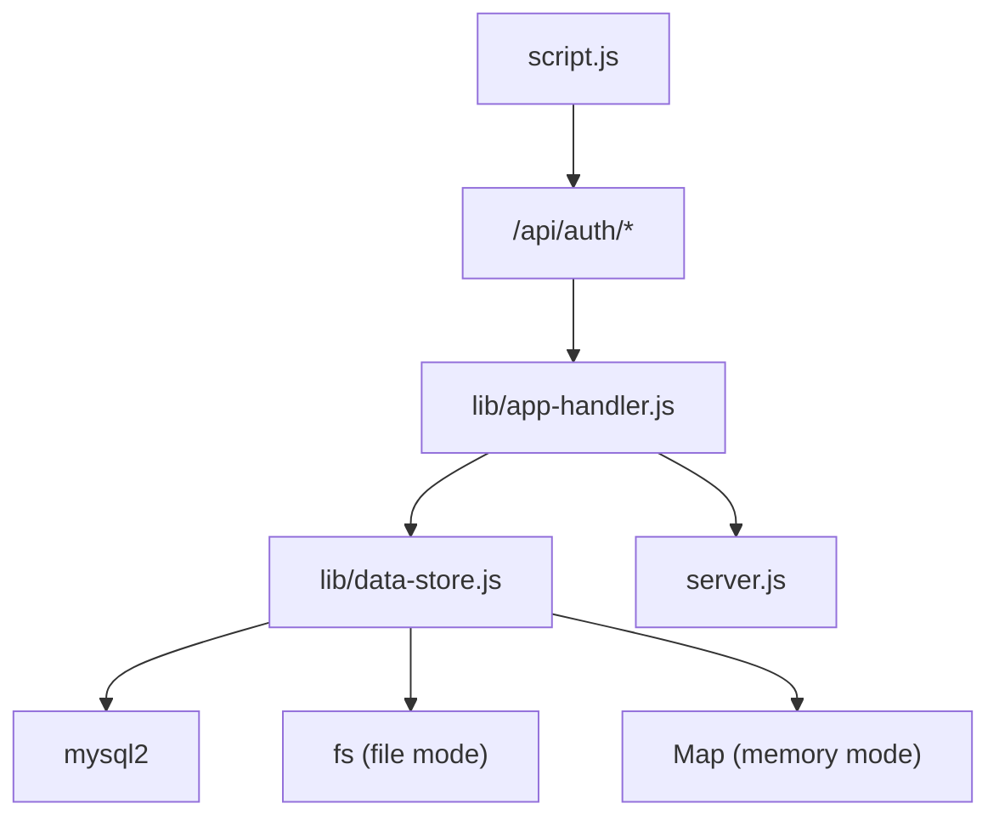

# Frontend Application

<cite>
**Referenced Files in This Document**
- [index.html](file://index.html)
- [login.html](file://login.html)
- [signup.html](file://signup.html)
- [checkout.html](file://checkout.html)
- [script.js](file://script.js)
- [styles.css](file://styles.css)
- [checkout.css](file://checkout.css)
- [server.js](file://server.js)
- [lib/app-handler.js](file://lib/app-handler.js)
- [lib/data-store.js](file://lib/data-store.js)
- [api/auth/login.js](file://api/auth/login.js)
- [api/auth/signup.js](file://api/auth/signup.js)
- [customers.json](file://customers.json)
- [package.json](file://package.json)
</cite>

## Table of Contents
1. [Introduction](#introduction)
2. [Project Structure](#project-structure)
3. [Core Components](#core-components)
4. [Architecture Overview](#architecture-overview)
5. [Detailed Component Analysis](#detailed-component-analysis)
6. [Dependency Analysis](#dependency-analysis)
7. [Performance Considerations](#performance-considerations)
8. [Troubleshooting Guide](#troubleshooting-guide)
9. [Conclusion](#conclusion)
10. [Appendices](#appendices)

## Introduction
This document describes the frontend application for Night Foodies, a single-page application built with vanilla JavaScript, HTML5, and CSS3. It covers the main shopping interface, authentication pages, and checkout process. It explains the state management model using local storage for cart persistence and session data, the product browsing system with category filtering and real-time search, the cart management system with add/remove and quantity adjustments, and the checkout process including order summary display, payment method selection, and order placement. It also documents the responsive glassmorphism UI design system, dark theme implementation, interactive elements, event handling patterns, form validation, user feedback mechanisms, and accessibility considerations. Finally, it outlines frontend-to-backend integration and state synchronization patterns.

## Project Structure
The application consists of:
- Static HTML pages for home, login, signup, and checkout
- A single JavaScript module orchestrating UI, state, routing, and API interactions
- Global CSS for layout, theming, and glassmorphism effects
- A separate checkout stylesheet for payment UI
- A minimal Node.js server that serves static assets and exposes API routes
- A library module implementing serverless API handlers and a flexible data store (MySQL, file, or memory)
- A customer data file for local development

**Diagram sources**
- [index.html](file://index.html)
- [login.html](file://login.html)
- [signup.html](file://signup.html)
- [checkout.html](file://checkout.html)
- [script.js](file://script.js)
- [styles.css](file://styles.css)
- [checkout.css](file://checkout.css)
- [server.js](file://server.js)
- [lib/app-handler.js](file://lib/app-handler.js)
- [lib/data-store.js](file://lib/data-store.js)
- [api/auth/login.js](file://api/auth/login.js)
- [api/auth/signup.js](file://api/auth/signup.js)
- [customers.json](file://customers.json)

**Section sources**
- [index.html](file://index.html)
- [login.html](file://login.html)
- [signup.html](file://signup.html)
- [checkout.html](file://checkout.html)
- [script.js](file://script.js)
- [styles.css](file://styles.css)
- [checkout.css](file://checkout.css)
- [server.js](file://server.js)
- [lib/app-handler.js](file://lib/app-handler.js)
- [lib/data-store.js](file://lib/data-store.js)
- [api/auth/login.js](file://api/auth/login.js)
- [api/auth/signup.js](file://api/auth/signup.js)
- [customers.json](file://customers.json)
- [package.json](file://package.json)

## Core Components
- Single-page navigation and routing logic with authentication guards
- Product browsing with category filtering and live search
- Cart panel with add/remove and quantity adjustment
- Order summary and payment selection in checkout
- Local storage-backed state for session and cart persistence
- Glassmorphism UI with dark theme and responsive design
- Form validation and user feedback messaging
- Frontend-to-backend integration via HTTP POST to API endpoints

**Section sources**
- [script.js](file://script.js)
- [index.html](file://index.html)
- [checkout.html](file://checkout.html)
- [styles.css](file://styles.css)

## Architecture Overview
The frontend is a vanilla SPA with:
- A central state object controlling category, search query, and cart
- Event listeners for UI interactions
- A reusable fetch wrapper for API calls
- Authentication guards redirecting unauthenticated users
- Local storage for session and cart persistence
- A server that serves static pages and handles API requests

**Diagram sources**
- [script.js](file://script.js)
- [index.html](file://index.html)
- [checkout.html](file://checkout.html)
- [server.js](file://server.js)
- [lib/app-handler.js](file://lib/app-handler.js)
- [lib/data-store.js](file://lib/data-store.js)

## Detailed Component Analysis

### Home Page and Shopping Interface
- Top navigation with brand, search bar, location, and logout
- Hero section with promotional cards
- Category chips for filtering ("All", "Food", "Drinks", "Cigarettes")
- Product grid with emoji icons, names, quantities, prices, and "ADD" buttons
- Sticky cart panel with subtotal, delivery charge, total, and "Proceed to Checkout"
- Scroll-aware top nav that collapses for mobile
- Help floating action button

**Diagram sources**
- [index.html](file://index.html)
- [script.js](file://script.js)

**Section sources**
- [index.html](file://index.html)
- [script.js](file://script.js)
- [styles.css](file://styles.css)

### Authentication Pages
- Login page with phone and password fields, show/hide toggle, and validation
- Signup page with full name, phone, optional email/address, password, and validation
- Shared form validation logic and error messaging
- Navigation between login and signup

**Diagram sources**
- [login.html](file://login.html)
- [signup.html](file://signup.html)
- [script.js](file://script.js)
- [server.js](file://server.js)
- [lib/app-handler.js](file://lib/app-handler.js)
- [lib/data-store.js](file://lib/data-store.js)

**Section sources**
- [login.html](file://login.html)
- [signup.html](file://signup.html)
- [script.js](file://script.js)
- [lib/app-handler.js](file://lib/app-handler.js)
- [lib/data-store.js](file://lib/data-store.js)

### Checkout Process
- Loads previously saved cart from local storage
- Displays order summary with grouped items and totals
- Payment method selection (UPI/GPay or Cash on Delivery)
- Pay Now button triggers a simulated payment flow with user feedback
- Clears cart on success and redirects to home

**Diagram sources**
- [checkout.html](file://checkout.html)
- [script.js](file://script.js)
- [styles.css](file://styles.css)
- [checkout.css](file://checkout.css)

**Section sources**
- [checkout.html](file://checkout.html)
- [script.js](file://script.js)
- [styles.css](file://styles.css)
- [checkout.css](file://checkout.css)

### State Management and Persistence
- Central state object with category, query, and cart
- Local storage keys:
  - Session: "nightFoodiesLoggedInUser"
  - Cart: "nightFoodiesSavedCart"
- Delivery fee computed based on current hour (day vs night rates)
- Currency formatting helper for rupee display

**Diagram sources**
- [script.js](file://script.js)

**Section sources**
- [script.js](file://script.js)

### UI Design System: Glassmorphism and Dark Theme
- CSS custom properties define theme tokens (background, surface, primary, muted, glow)
- Glass utility class applies backdrop blur, borders, and shadows
- Dark theme with animated background and subtle animations
- Responsive breakpoints for mobile and tablet layouts
- Interactive elements with hover and focus states

**Diagram sources**
- [styles.css](file://styles.css)
- [checkout.css](file://checkout.css)

**Section sources**
- [styles.css](file://styles.css)
- [checkout.css](file://checkout.css)

### Event Handling Patterns and Accessibility
- Event delegation for dynamic lists (product grid and cart)
- Form validation with inline messages
- Keyboard-accessible focus management and ARIA-friendly markup
- Disabled states during async operations
- Scroll-aware navigation collapsing

**Section sources**
- [script.js](file://script.js)
- [index.html](file://index.html)
- [checkout.html](file://checkout.html)
- [login.html](file://login.html)
- [signup.html](file://signup.html)

## Dependency Analysis
- Frontend depends on:
  - Vanilla JavaScript runtime
  - DOM APIs for rendering and events
  - Local storage for persistence
  - Fetch API for HTTP communication
- Backend depends on:
  - Node.js HTTP server
  - A serverless-like handler routing API endpoints
  - A flexible data store supporting MySQL, file, or memory modes
  - Environment variables for configuration

**Diagram sources**
- [script.js](file://script.js)
- [lib/app-handler.js](file://lib/app-handler.js)
- [lib/data-store.js](file://lib/data-store.js)
- [server.js](file://server.js)

**Section sources**
- [script.js](file://script.js)
- [lib/app-handler.js](file://lib/app-handler.js)
- [lib/data-store.js](file://lib/data-store.js)
- [server.js](file://server.js)
- [package.json](file://package.json)

## Performance Considerations
- Efficient DOM updates via batched re-renders (renderProducts/renderCart)
- Minimal reflows by grouping DOM writes and using innerHTML where appropriate
- Debounce or throttle heavy operations if needed (e.g., search input)
- Lazy initialization of expensive components (e.g., server startup)
- Use CSS transforms and opacity for animations to avoid layout thrashing
- Prefer event delegation for dynamic lists to reduce listener overhead

## Troubleshooting Guide
Common issues and resolutions:
- Cannot reach server: Ensure the server is running locally and accessible at the expected port. The fetch wrapper throws a specific network error message guiding users to start the server and open the correct URL.
- Authentication failures: Verify phone number format (10 digits) and password length (minimum 4). Check backend logs for detailed error messages.
- Cart not persisting: Confirm local storage is enabled and not blocked by browser settings.
- Checkout empty cart: Ensure the cart was saved to local storage before navigating to checkout.
- Styling not applied: Verify CSS files are linked and loaded correctly.

**Section sources**
- [script.js](file://script.js)
- [server.js](file://server.js)
- [lib/app-handler.js](file://lib/app-handler.js)

## Conclusion
Night Foodies delivers a modern, responsive, and accessible single-page application with a cohesive glassmorphism UI and robust state management. The frontend integrates seamlessly with a flexible backend that supports multiple data stores, enabling easy deployment and scaling. The shopping, authentication, and checkout flows are intuitive, with clear user feedback and validation.

## Appendices

### API Definitions
- POST /api/auth/login
  - Request body: { phone, password }
  - Success: { message, user: { id, phone } }
  - Errors: 400 (invalid input), 404 (account not found), 401 (incorrect password), 500 (server error)

- POST /api/auth/signup
  - Request body: { fullName, phone, email, address, password }
  - Success: { message }
  - Errors: 400 (invalid input), 409 (duplicate phone), 500 (server error)

- POST /api/auth/send-otp and /api/auth/verify-otp
  - Implemented in the handler for OTP-based flows (not used in current frontend)

**Section sources**
- [lib/app-handler.js](file://lib/app-handler.js)
- [api/auth/login.js](file://api/auth/login.js)
- [api/auth/signup.js](file://api/auth/signup.js)

### Data Store Modes
- MySQL: Requires DB_HOST, DB_USER, DB_NAME environment variables
- File: Uses a JSON file for customer records
- Memory: In-memory Map (temporary, resets on restart)

**Section sources**
- [lib/data-store.js](file://lib/data-store.js)
- [customers.json](file://customers.json)
- [package.json](file://package.json)