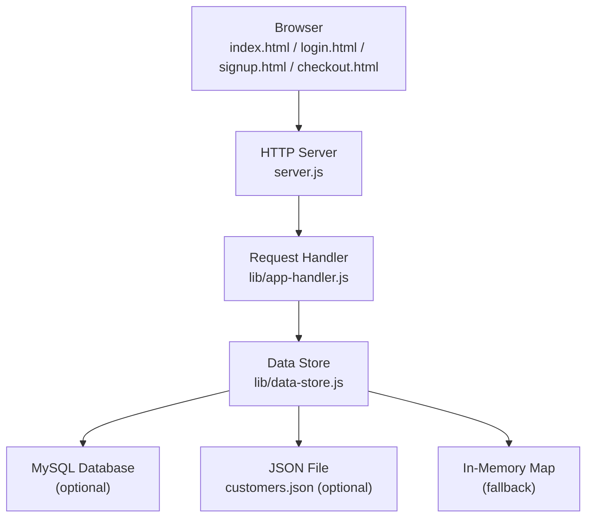

# Getting Started

<cite>
**Referenced Files in This Document**
- [package.json](file://package.json)
- [server.js](file://server.js)
- [lib/data-store.js](file://lib/data-store.js)
- [lib/app-handler.js](file://lib/app-handler.js)
- [index.html](file://index.html)
- [login.html](file://login.html)
- [signup.html](file://signup.html)
- [checkout.html](file://checkout.html)
- [script.js](file://script.js)
- [styles.css](file://styles.css)
- [checkout.css](file://checkout.css)
- [customers.json](file://customers.json)
</cite>

## Table of Contents
1. [Introduction](#introduction)
2. [Prerequisites](#prerequisites)
3. [Installation](#installation)
4. [Environment Setup](#environment-setup)
5. [Run Locally](#run-locally)
6. [Initial Setup Verification](#initial-setup-verification)
7. [Architecture Overview](#architecture-overview)
8. [Troubleshooting Guide](#troubleshooting-guide)
9. [Conclusion](#conclusion)

## Introduction
Night Foodies is a late-night delivery web application with authentication. It serves a static web UI and exposes a small set of HTTP endpoints for sign-up, login, and OTP-based flows. Data can be persisted to MySQL or stored locally as JSON, with graceful fallbacks when databases are unavailable.

## Prerequisites
- Node.js version 24.x
- npm (comes with Node.js)
- A modern web browser
- Optional: MySQL server for persistent data

**Section sources**
- [package.json:9-11](file://package.json#L9-L11)

## Installation
Follow these steps to install and run Night Foodies locally:

1. Clone the repository to your machine.
2. Open a terminal in the project root.
3. Install dependencies:
   - Run: npm install
4. Start the server:
   - Run: npm start
5. Access the application:
   - Open your browser to http://localhost:3000

Notes:
- The server listens on the port defined by the PORT environment variable, defaulting to 3000.
- Static HTML/CSS/JS files are served from the project root.

**Section sources**
- [package.json:6-8](file://package.json#L6-L8)
- [server.js:5](file://server.js#L5)
- [server.js:21-23](file://server.js#L21-L23)

## Environment Setup
Configure the runtime environment for data persistence and optional features.

### Environment Variables
Set the following environment variables as needed:

- PORT
  - Purpose: TCP port for the HTTP server
  - Default: 3000
  - Example: PORT=3000

- DB_DRIVER
  - Purpose: Select storage backend
  - Values:
    - mysql: Use MySQL
    - memory: Force in-memory storage
    - file or json: Local JSON file storage
    - sqlite: Legacy alias mapped to file storage
  - Default: If DB_HOST/DB_USER/DB_NAME are present, MySQL is preferred automatically

- DB_HOST
  - Purpose: MySQL host
  - Default: localhost

- DB_PORT
  - Purpose: MySQL port
  - Default: 3306

- DB_USER
  - Purpose: MySQL user

- DB_PASSWORD
  - Purpose: MySQL password

- DB_NAME
  - Purpose: MySQL database name
  - Default: night_foodies

- CUSTOMERS_FILE
  - Purpose: Absolute or relative path to the JSON customer file
  - Default: ./customers.json

- VERCEL
  - Purpose: Special handling for Vercel deployments
  - Behavior: In-memory fallback enforced when set

Notes:
- If DB_DRIVER is set to mysql but required DB_* variables are missing, the system falls back to available storage.
- On Vercel, file-based storage is not persistent; the system uses in-memory storage.

**Section sources**
- [lib/data-store.js:68-101](file://lib/data-store.js#L68-L101)
- [lib/data-store.js:149-156](file://lib/data-store.js#L149-L156)
- [lib/data-store.js:158-214](file://lib/data-store.js#L158-L214)
- [lib/data-store.js:196-207](file://lib/data-store.js#L196-L207)
- [lib/data-store.js:187-194](file://lib/data-store.js#L187-L194)
- [lib/data-store.js:19-25](file://lib/data-store.js#L19-L25)

### Database Setup (MySQL)
If you choose MySQL:

1. Ensure a MySQL server is running and accessible.
2. Set DB_HOST, DB_PORT, DB_USER, DB_PASSWORD, and DB_NAME.
3. Start the server; the system creates the database and customer table automatically if they do not exist.

Verification:
- After startup, confirm logs indicate “Database mode: MySQL” and that the customers table exists.

**Section sources**
- [lib/data-store.js:68-101](file://lib/data-store.js#L68-L101)

### Optional: Local JSON Storage
If you prefer local JSON storage:
- Set DB_DRIVER=file or DB_DRIVER=json (or leave unset).
- Optionally set CUSTOMERS_FILE to a custom path.
- The system reads and writes customer records from/to the JSON file.

**Section sources**
- [lib/data-store.js:112-123](file://lib/data-store.js#L112-L123)
- [lib/data-store.js:19-25](file://lib/data-store.js#L19-L25)

### Optional: In-Memory Storage
To force in-memory storage:
- Set DB_DRIVER=memory.
- Data resets after restarts.

**Section sources**
- [lib/data-store.js:182-184](file://lib/data-store.js#L182-L184)

## Run Locally
1. Ensure dependencies are installed (npm install).
2. Start the server:
   - npm start
3. Open your browser to http://localhost:3000.
4. Use the navigation to:
   - Log in (login.html)
   - Sign up (signup.html)
   - Browse products (index.html)
   - Proceed to checkout (checkout.html)

Notes:
- Do not open HTML files directly in the browser (file://). Use the local server.
- The client-side JavaScript communicates with the server via /api endpoints.

**Section sources**
- [package.json:6-8](file://package.json#L6-L8)
- [server.js:21-23](file://server.js#L21-L23)
- [script.js:100-105](file://script.js#L100-L105)

## Initial Setup Verification
Perform these checks to confirm a successful deployment:

1. Server startup
   - Confirm the server prints a “Server running on http://localhost:PORT” message.
   - On failure, review the error messages printed to the console.

2. Web interface
   - Navigate to http://localhost:3000.
   - Verify the home page loads and displays products.

3. Authentication flow
   - Go to login.html.
   - Try logging in with an existing phone and password.
   - Alternatively, sign up via signup.html and then log in.

4. Data persistence
   - With MySQL configured, verify that accounts persist across restarts.
   - With JSON storage, verify that the customers.json file updates after sign-ups.

5. API endpoints
   - Use a tool like curl or Postman to test:
     - POST /api/auth/signup
     - POST /api/auth/login
     - POST /api/auth/send-otp
     - POST /api/auth/verify-otp

**Section sources**
- [server.js:21-23](file://server.js#L21-L23)
- [index.html](file://index.html)
- [login.html](file://login.html)
- [signup.html](file://signup.html)
- [script.js](file://script.js)
- [lib/app-handler.js:271-295](file://lib/app-handler.js#L271-L295)

## Architecture Overview
High-level flow of requests and data persistence:

**Diagram sources**
- [server.js:1-35](file://server.js#L1-L35)
- [lib/app-handler.js:1-332](file://lib/app-handler.js#L1-L332)
- [lib/data-store.js:1-291](file://lib/data-store.js#L1-L291)

## Troubleshooting Guide
Common issues and resolutions:

- Node.js version mismatch
  - Symptom: npm install or node start fails with engine errors.
  - Resolution: Install Node.js 24.x and retry.

- Cannot connect to MySQL
  - Symptom: Startup logs show MySQL init failed; fallback to file/memory.
  - Resolution: Verify DB_HOST, DB_PORT, DB_USER, DB_PASSWORD, DB_NAME. Ensure MySQL is reachable.

- Port already in use
  - Symptom: Server fails to listen on PORT.
  - Resolution: Change PORT or stop the conflicting service.

- Opening HTML directly
  - Symptom: Network errors in the browser console.
  - Resolution: Start the server and open http://localhost:PORT, not file:// URLs.

- Authentication failures
  - Symptom: Login/signup returns errors.
  - Resolution: Ensure phone numbers are 10 digits, passwords are at least 4 characters, and OTP is requested before verification.

- Vercel deployment considerations
  - Symptom: Data resets after restarts.
  - Resolution: Configure MySQL environment variables for persistent data in production.

**Section sources**
- [package.json:9-11](file://package.json#L9-L11)
- [server.js:24-31](file://server.js#L24-L31)
- [lib/data-store.js:149-156](file://lib/data-store.js#L149-L156)
- [lib/data-store.js:187-194](file://lib/data-store.js#L187-L194)
- [script.js:100-105](file://script.js#L100-L105)
- [lib/app-handler.js:188-196](file://lib/app-handler.js#L188-L196)

## Conclusion
You are ready to run Night Foodies locally with minimal setup. Choose your storage backend (MySQL, JSON file, or in-memory), start the server, and explore the UI. For production, configure MySQL environment variables to persist data reliably.