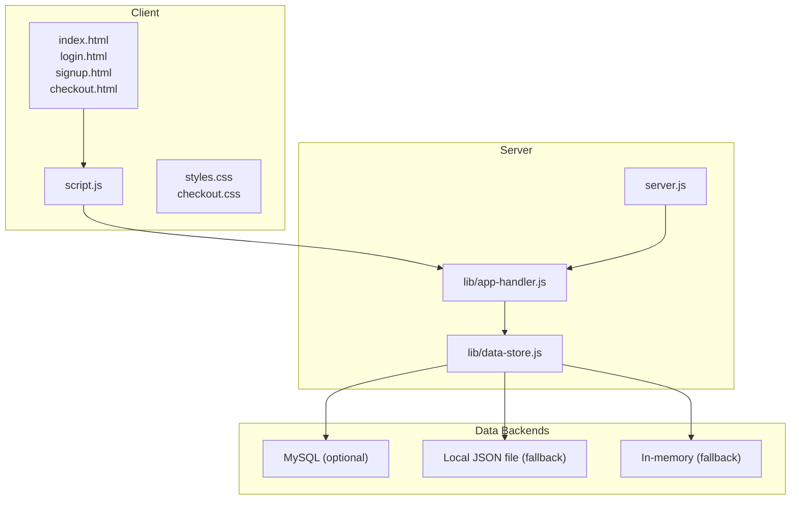
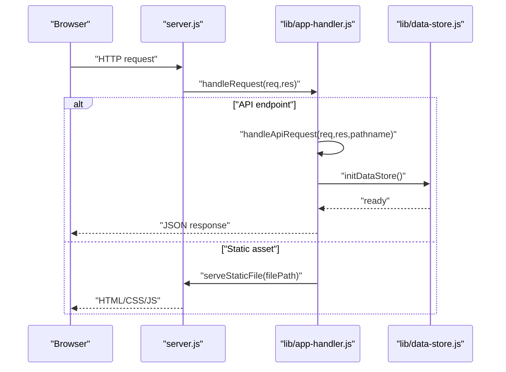
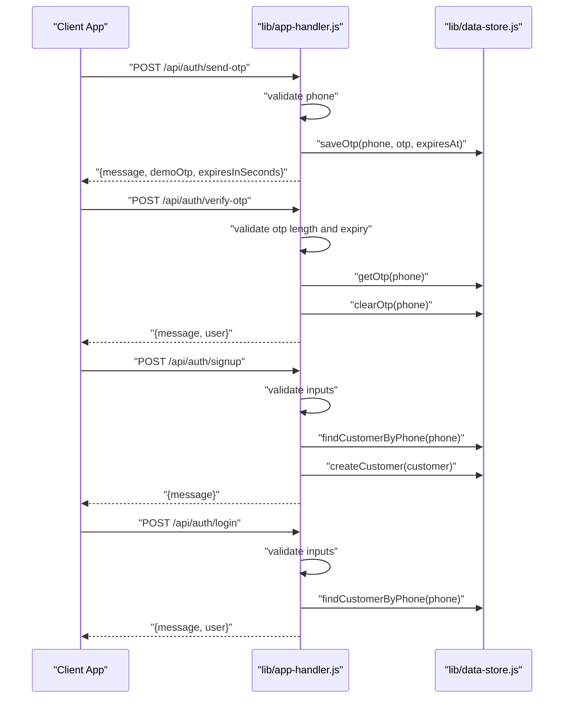
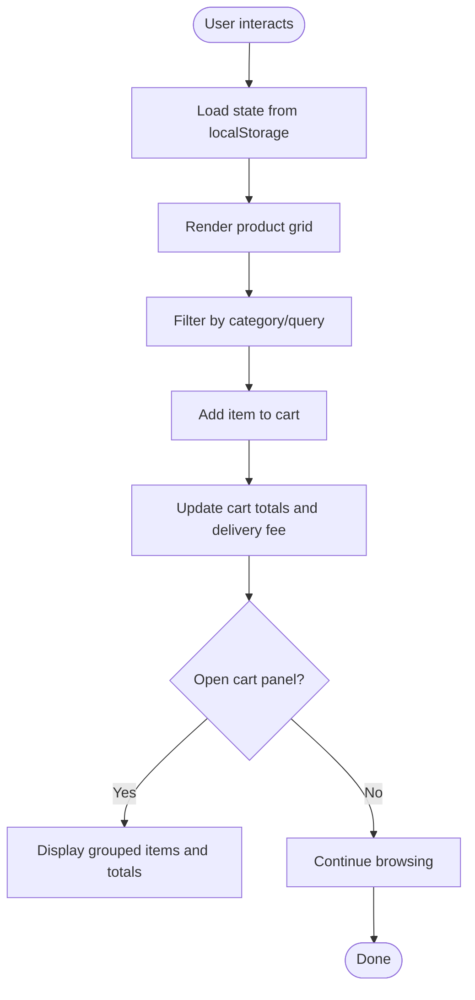
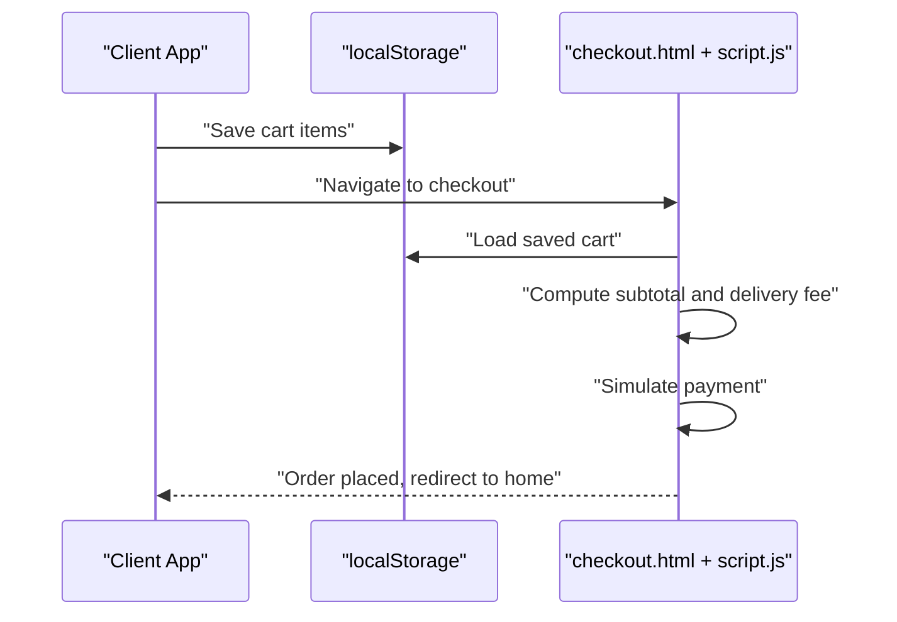
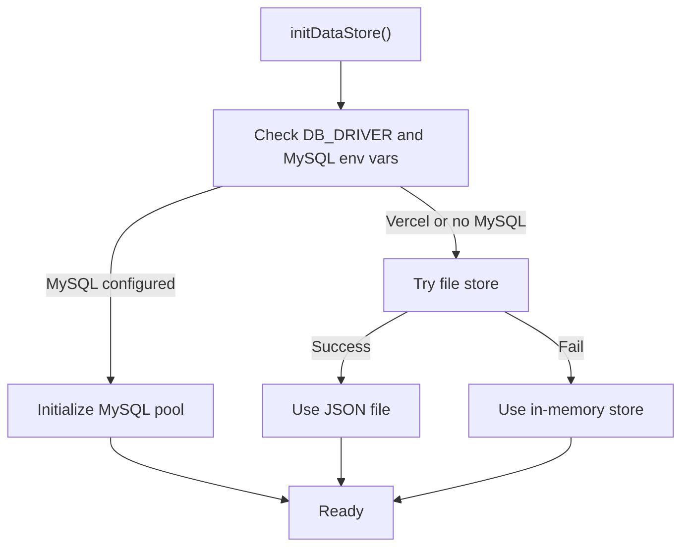
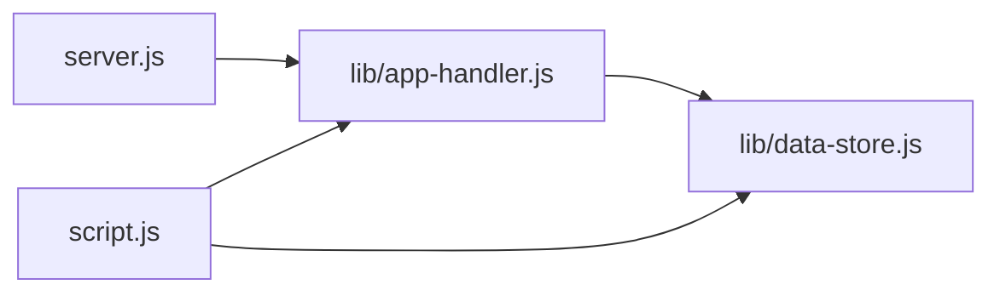

# Project Overview

<cite>
**Referenced Files in This Document**
- [package.json](file://package.json)
- [server.js](file://server.js)
- [lib/app-handler.js](file://lib/app-handler.js)
- [lib/data-store.js](file://lib/data-store.js)
- [api/auth/login.js](file://api/auth/login.js)
- [api/auth/signup.js](file://api/auth/signup.js)
- [api/auth/send-otp.js](file://api/auth/send-otp.js)
- [api/auth/verify-otp.js](file://api/auth/verify-otp.js)
- [index.html](file://index.html)
- [script.js](file://script.js)
- [styles.css](file://styles.css)
- [checkout.html](file://checkout.html)
- [checkout.css](file://checkout.css)
- [login.html](file://login.html)
- [signup.html](file://signup.html)
- [customers.json](file://customers.json)
</cite>

## Table of Contents
1. [Introduction](#introduction)
2. [Project Structure](#project-structure)
3. [Core Components](#core-components)
4. [Architecture Overview](#architecture-overview)
5. [Detailed Component Analysis](#detailed-component-analysis)
6. [Dependency Analysis](#dependency-analysis)
7. [Performance Considerations](#performance-considerations)
8. [Troubleshooting Guide](#troubleshooting-guide)
9. [Conclusion](#conclusion)

## Introduction
Night Foodies is a late-night food delivery web platform designed to operate during extended evening and early morning hours. Its core value proposition centers on delivering essential everyday items quickly—typically within minutes—to users who need sustenance during off-hours. The platform targets individuals who work late shifts, stay out late, or simply crave convenient, immediate access to food and essentials between 11 PM and 6 AM.

Key characteristics:
- Purpose: Late-night delivery service with a focus on convenience and speed.
- Value: Instant delivery of essential items with minimal friction.
- Audience: Shift workers, night owls, students, and anyone requiring quick access to food and essentials during extended hours.

## Project Structure
The project follows a compact, single-server architecture with a Node.js HTTP server serving static HTML/CSS/JS assets and handling API requests. Authentication flows are routed through serverless-compatible handlers, while data persistence adapts dynamically to environment constraints.

**Diagram sources**
- [server.js:1-35](file://server.js#L1-L35)
- [lib/app-handler.js:297-309](file://lib/app-handler.js#L297-L309)
- [lib/data-store.js:158-214](file://lib/data-store.js#L158-L214)

**Section sources**
- [package.json:1-17](file://package.json#L1-L17)
- [server.js:1-35](file://server.js#L1-L35)
- [lib/app-handler.js:297-309](file://lib/app-handler.js#L297-L309)
- [lib/data-store.js:158-214](file://lib/data-store.js#L158-L214)

## Core Components
- Authentication API: Phone-based login and sign-up with OTP verification, exposed via serverless-compatible handlers.
- Product Catalog and Cart: Real-time browsing, filtering, and cart management with dynamic delivery fees based on time-of-day.
- Checkout Flow: One-page checkout with payment selection and order confirmation.
- Data Store: Multi-backend persistence (MySQL, local JSON file, in-memory) with automatic fallbacks.
- Frontend: Vanilla JavaScript-driven UI with responsive glassmorphism design and dark theme.

**Section sources**
- [lib/app-handler.js:98-269](file://lib/app-handler.js#L98-L269)
- [script.js:59-350](file://script.js#L59-L350)
- [script.js:383-449](file://script.js#L383-L449)
- [lib/data-store.js:158-264](file://lib/data-store.js#L158-L264)
- [styles.css:1-735](file://styles.css#L1-L735)

## Architecture Overview
Night Foodies employs a serverless-compatible HTTP server that:
- Serves static assets and handles API requests through a unified request router.
- Routes authentication endpoints to dedicated handlers.
- Dynamically initializes a data store backend based on environment configuration and availability.

**Diagram sources**
- [server.js:11-30](file://server.js#L11-L30)
- [lib/app-handler.js:297-309](file://lib/app-handler.js#L297-L309)
- [lib/data-store.js:158-214](file://lib/data-store.js#L158-L214)

## Detailed Component Analysis

### Authentication System
The authentication system uses phone-number-based login with OTP verification. It supports two flows:
- OTP-based sign-up/login: Send OTP, verify OTP, then receive a success response.
- Traditional login: Submit phone and password to authenticate against stored records.

**Diagram sources**
- [lib/app-handler.js:98-269](file://lib/app-handler.js#L98-L269)
- [lib/data-store.js:216-264](file://lib/data-store.js#L216-L264)

**Section sources**
- [api/auth/send-otp.js:1-4](file://api/auth/send-otp.js#L1-L4)
- [api/auth/verify-otp.js:1-4](file://api/auth/verify-otp.js#L1-L4)
- [api/auth/signup.js:1-4](file://api/auth/signup.js#L1-L4)
- [api/auth/login.js:1-4](file://api/auth/login.js#L1-L4)
- [lib/app-handler.js:98-269](file://lib/app-handler.js#L98-L269)
- [lib/data-store.js:216-264](file://lib/data-store.js#L216-L264)

### Product Catalog and Cart Management
The client-side product catalog and cart are implemented in vanilla JavaScript:
- Products are defined statically and filtered by category and search query.
- Cart items are aggregated and quantities adjusted per item.
- Delivery fee varies depending on the current hour, with day and night rates.

**Diagram sources**
- [script.js:59-350](file://script.js#L59-L350)
- [script.js:207-214](file://script.js#L207-L214)

**Section sources**
- [script.js:59-350](file://script.js#L59-L350)
- [script.js:207-214](file://script.js#L207-L214)

### Checkout Process
The checkout page displays the saved cart, calculates totals, and simulates payment processing. Upon success, it clears the saved cart and redirects to the home page.

**Diagram sources**
- [script.js:383-449](file://script.js#L383-L449)
- [checkout.html:1-100](file://checkout.html#L1-L100)

**Section sources**
- [script.js:383-449](file://script.js#L383-L449)
- [checkout.html:1-100](file://checkout.html#L1-L100)

### Data Store and Persistence
The data store supports multiple backends with automatic fallbacks:
- MySQL: Primary backend when configured with environment variables.
- Local JSON file: Fallback for development and environments without MySQL.
- In-memory: Fallback for serverless or ephemeral deployments.

**Diagram sources**
- [lib/data-store.js:158-214](file://lib/data-store.js#L158-L214)
- [lib/data-store.js:68-101](file://lib/data-store.js#L68-L101)
- [lib/data-store.js:112-138](file://lib/data-store.js#L112-L138)
- [lib/data-store.js:140-156](file://lib/data-store.js#L140-L156)

**Section sources**
- [lib/data-store.js:158-214](file://lib/data-store.js#L158-L214)
- [lib/data-store.js:68-101](file://lib/data-store.js#L68-L101)
- [lib/data-store.js:112-138](file://lib/data-store.js#L112-L138)
- [lib/data-store.js:140-156](file://lib/data-store.js#L140-L156)

### Technology Stack
- Backend: Node.js HTTP server with a single-file request router and serverless-compatible handlers.
- Frontend: Vanilla JavaScript with HTML/CSS; no framework dependencies.
- Data: Multi-backend persistence (MySQL, JSON file, in-memory) with environment-driven initialization.
- Deployment: Designed to run locally and adapt to serverless environments (e.g., Vercel) with appropriate environment configuration.

**Section sources**
- [package.json:12-15](file://package.json#L12-L15)
- [server.js:1-35](file://server.js#L1-L35)
- [lib/app-handler.js:311-325](file://lib/app-handler.js#L311-L325)
- [lib/data-store.js:158-214](file://lib/data-store.js#L158-L214)

### Business Model and Operational Hours
- Business Model: Subscription-free, pay-per-order model with delivery fees that vary by time-of-day.
- Operational Hours: Designed for extended operation between 11 PM and 6 AM, with delivery fee adjustments to reflect demand and logistics costs.
- Competitive Advantages:
  - Fast, essential-item delivery during off-hours.
  - Minimal friction authentication via phone and OTP.
  - Serverless-compatible architecture enabling cost-effective deployment and scalability.

**Section sources**
- [script.js:207-214](file://script.js#L207-L214)
- [server.js:28-30](file://server.js#L28-L30)

### Design Philosophy
- Visual Theme: Dark theme with vibrant accents, emphasizing readability and contrast.
- UI Pattern: Glassmorphism surfaces with backdrop blur and subtle borders for depth.
- Responsiveness: Adaptive layouts for desktop, tablet, and mobile screens.
- Accessibility: Focus states, readable typography, and clear affordances for interactive elements.

**Section sources**
- [styles.css:1-12](file://styles.css#L1-L12)
- [styles.css:50-58](file://styles.css#L50-L58)
- [styles.css:242-318](file://styles.css#L242-L318)
- [styles.css:662-735](file://styles.css#L662-L735)

## Dependency Analysis
The application maintains low coupling between modules:
- server.js depends on lib/app-handler.js for routing and error handling.
- lib/app-handler.js depends on lib/data-store.js for authentication and customer data operations.
- Frontend (script.js) communicates with API endpoints via fetch and manages UI state locally.

**Diagram sources**
- [server.js:1-35](file://server.js#L1-L35)
- [lib/app-handler.js:1-11](file://lib/app-handler.js#L1-L11)
- [lib/data-store.js:1-17](file://lib/data-store.js#L1-L17)

**Section sources**
- [server.js:1-35](file://server.js#L1-L35)
- [lib/app-handler.js:1-11](file://lib/app-handler.js#L1-L11)
- [lib/data-store.js:1-17](file://lib/data-store.js#L1-L17)

## Performance Considerations
- Static Asset Serving: Serve HTML/CSS/JS directly from the server to minimize overhead.
- Data Store Initialization: Initialize the data store once per server lifecycle to avoid repeated setup costs.
- Client-Side Rendering: Keep product lists and cart computations lightweight to ensure smooth interactions on low-power devices.
- Network Resilience: The client includes network error handling to guide users when the server is unreachable.

[No sources needed since this section provides general guidance]

## Troubleshooting Guide
Common issues and resolutions:
- Server startup failures: Ensure environment variables for MySQL are set correctly when using the MySQL backend. For serverless environments without persistent storage, rely on in-memory mode and configure MySQL for production data.
- Authentication errors: Verify phone number format and OTP validity. Confirm that OTP was requested before attempting verification.
- Data persistence: If MySQL is unavailable, the system falls back to file or in-memory storage. On serverless platforms, file storage is not persistent; configure MySQL for durable data.

**Section sources**
- [server.js:24-30](file://server.js#L24-L30)
- [lib/app-handler.js:98-170](file://lib/app-handler.js#L98-L170)
- [lib/data-store.js:140-156](file://lib/data-store.js#L140-L156)
- [lib/data-store.js:187-194](file://lib/data-store.js#L187-L194)

## Conclusion
Night Foodies delivers a focused, late-night delivery experience with a streamlined authentication flow, intuitive product browsing, and a glassmorphism UI. Its serverless-compatible architecture and multi-backend data store enable flexible deployment and reliable operation across environments. By emphasizing speed, simplicity, and a cohesive dark theme, the platform meets the needs of users who require essential items during off-hours.