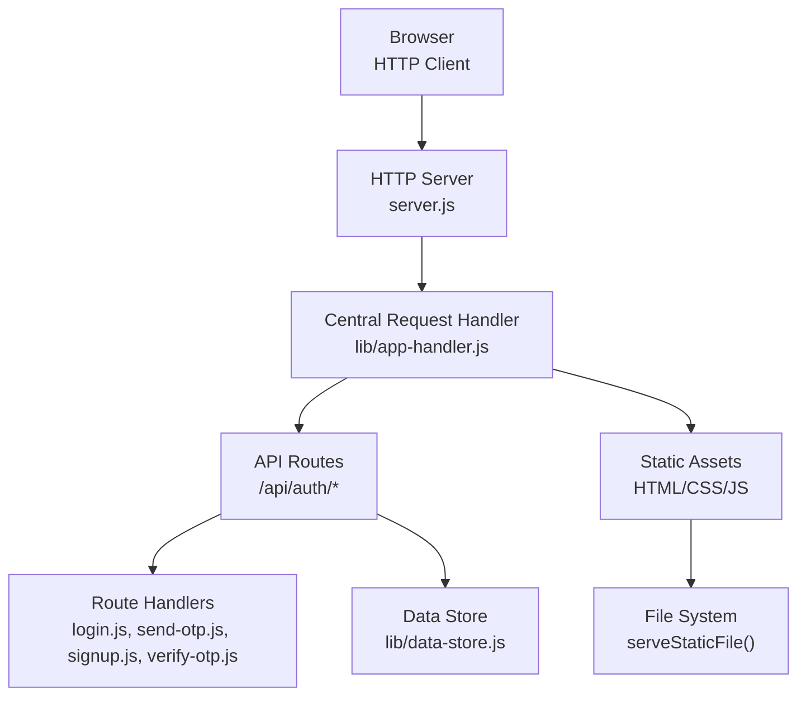
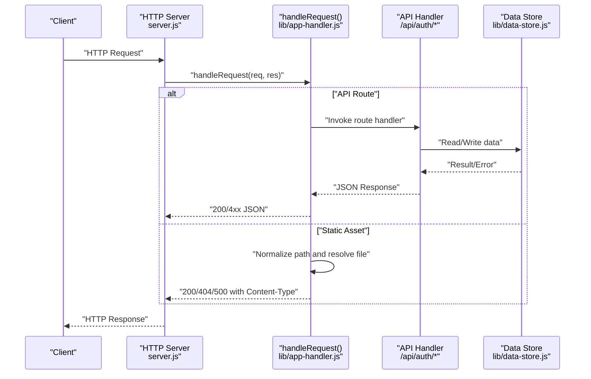
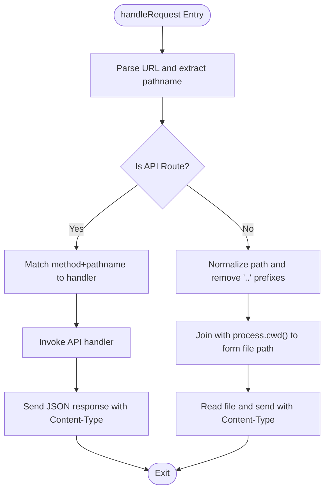
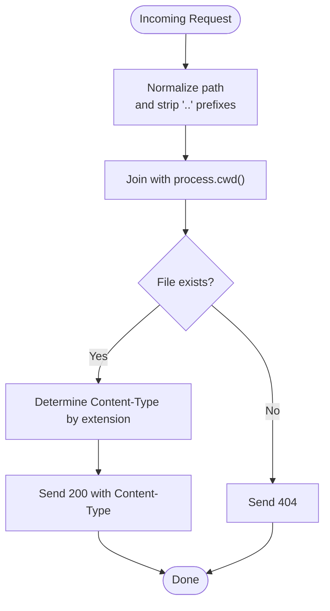
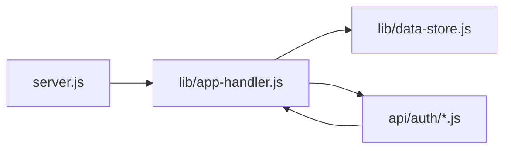

# API Security and Middleware

<cite>
**Referenced Files in This Document**
- [server.js](file://server.js)
- [lib/app-handler.js](file://lib/app-handler.js)
- [lib/data-store.js](file://lib/data-store.js)
- [api/auth/login.js](file://api/auth/login.js)
- [api/auth/send-otp.js](file://api/auth/send-otp.js)
- [api/auth/signup.js](file://api/auth/signup.js)
- [api/auth/verify-otp.js](file://api/auth/verify-otp.js)
- [package.json](file://package.json)
- [index.html](file://index.html)
- [login.html](file://login.html)
- [signup.html](file://signup.html)
- [checkout.html](file://checkout.html)
- [styles.css](file://styles.css)
- [checkout.css](file://checkout.css)
- [script.js](file://script.js)
</cite>

## Table of Contents
1. [Introduction](#introduction)
2. [Project Structure](#project-structure)
3. [Core Components](#core-components)
4. [Architecture Overview](#architecture-overview)
5. [Detailed Component Analysis](#detailed-component-analysis)
6. [Dependency Analysis](#dependency-analysis)
7. [Performance Considerations](#performance-considerations)
8. [Troubleshooting Guide](#troubleshooting-guide)
9. [Conclusion](#conclusion)
10. [Appendices](#appendices)

## Introduction
This document provides comprehensive API security and middleware documentation for the Night Foodies application. It explains the request processing pipeline, body parsing, content type validation, and static file serving with path normalization. It documents the centralized request handler’s security measures, including path traversal protection, content type enforcement, and error handling. It also covers serverless handler creation for AWS Lambda compatibility, response formatting, and the security implications of static file serving. Finally, it outlines best practices for extending the security middleware and adding additional security layers.

## Project Structure
The Night Foodies application is a Node.js HTTP server with a small set of API routes and static assets. The server delegates request handling to a central handler module, which routes API requests and serves static files after path normalization. Serverless handlers are generated per route for AWS Lambda compatibility.

**Diagram sources**
- [server.js:1-35](file://server.js#L1-L35)
- [lib/app-handler.js:297-309](file://lib/app-handler.js#L297-L309)
- [lib/data-store.js:158-214](file://lib/data-store.js#L158-L214)
- [api/auth/login.js:1-7](file://api/auth/login.js#L1-L7)
- [api/auth/send-otp.js:1-7](file://api/auth/send-otp.js#L1-L7)
- [api/auth/signup.js:1-7](file://api/auth/signup.js#L1-L7)
- [api/auth/verify-otp.js:1-7](file://api/auth/verify-otp.js#L1-L7)

**Section sources**
- [server.js:1-35](file://server.js#L1-L35)
- [lib/app-handler.js:297-309](file://lib/app-handler.js#L297-L309)
- [lib/data-store.js:158-214](file://lib/data-store.js#L158-L214)
- [api/auth/login.js:1-7](file://api/auth/login.js#L1-L7)
- [api/auth/send-otp.js:1-7](file://api/auth/send-otp.js#L1-L7)
- [api/auth/signup.js:1-7](file://api/auth/signup.js#L1-L7)
- [api/auth/verify-otp.js:1-7](file://api/auth/verify-otp.js#L1-L7)

## Core Components
- Centralized request handler: Parses URLs, routes API requests, and serves static files with path normalization.
- Body parsing: Reads and parses JSON request bodies with strict error handling.
- Content type enforcement: Sets appropriate Content-Type headers for responses and static file serving.
- Static file serving: Validates file existence and sets content-type based on extension.
- Serverless handlers: Route-specific wrappers for AWS Lambda compatibility.
- Data store initialization: Selects storage backend (MySQL, file, or memory) with fallbacks and environment-driven configuration.

Key responsibilities:
- Path traversal protection via path normalization and safe-path validation.
- Strict JSON body parsing with error propagation.
- Consistent JSON response formatting with appropriate status codes.
- Safe static asset serving with controlled content-type mapping.

**Section sources**
- [lib/app-handler.js:23-28](file://lib/app-handler.js#L23-L28)
- [lib/app-handler.js:30-54](file://lib/app-handler.js#L30-L54)
- [lib/app-handler.js:56-96](file://lib/app-handler.js#L56-L96)
- [lib/app-handler.js:297-309](file://lib/app-handler.js#L297-L309)
- [lib/app-handler.js:311-325](file://lib/app-handler.js#L311-L325)
- [lib/data-store.js:158-214](file://lib/data-store.js#L158-L214)

## Architecture Overview
The server listens on a configurable port and delegates all requests to a single handler. The handler:
- Detects API routes and invokes dedicated handlers.
- Otherwise normalizes the requested path, resolves a file path, and serves static assets.
- Wraps API handlers in serverless-compatible wrappers for AWS Lambda.

**Diagram sources**
- [server.js:11-19](file://server.js#L11-L19)
- [lib/app-handler.js:297-309](file://lib/app-handler.js#L297-L309)
- [lib/app-handler.js:271-295](file://lib/app-handler.js#L271-L295)
- [lib/data-store.js:158-214](file://lib/data-store.js#L158-L214)

## Detailed Component Analysis

### Centralized Request Handler
Responsibilities:
- Parse URL and route API requests to dedicated handlers.
- Serve static files with path normalization and safe-path validation.
- Enforce content type for responses and static assets.
- Provide serverless-compatible wrappers for each route.

Security measures:
- Path traversal protection: Normalizes the path and strips leading parent directory segments.
- Safe path selection: Ensures root path maps to the homepage file.
- Content type enforcement: Uses a whitelist of extensions to set Content-Type headers.
- Error handling: Returns structured JSON errors with appropriate status codes.

**Diagram sources**
- [lib/app-handler.js:297-309](file://lib/app-handler.js#L297-L309)
- [lib/app-handler.js:56-96](file://lib/app-handler.js#L56-L96)

**Section sources**
- [lib/app-handler.js:297-309](file://lib/app-handler.js#L297-L309)
- [lib/app-handler.js:56-96](file://lib/app-handler.js#L56-L96)

### Body Parsing and Validation
- Reads request body chunks and aggregates them.
- Parses JSON with strict error handling and returns structured errors.
- Used by all API handlers to validate and extract request payloads.

Security considerations:
- Rejects malformed JSON early with a 400 error.
- Prevents injection via unvalidated payloads by enforcing JSON parsing.

**Section sources**
- [lib/app-handler.js:30-54](file://lib/app-handler.js#L30-L54)

### Content Type Enforcement
- Response formatting: All API responses use application/json with UTF-8 charset.
- Static file serving: Content-Type determined by file extension with a whitelist.
- Prevents MIME sniffing issues by setting explicit headers.

Security considerations:
- Whitelisted extensions reduce risk of serving malicious scripts.
- Explicit charset ensures predictable decoding.

**Section sources**
- [lib/app-handler.js:23-28](file://lib/app-handler.js#L23-L28)
- [lib/app-handler.js:56-76](file://lib/app-handler.js#L56-L76)
- [lib/app-handler.js:78-96](file://lib/app-handler.js#L78-L96)

### Static File Serving and Path Traversal Protection
- Normalizes the requested path and removes parent directory traversal segments.
- Joins the normalized path with the current working directory to form a file path.
- Serves files with appropriate Content-Type or returns 404/500 as needed.

Security measures:
- path.normalize removes internal parent directory segments.
- Leading parent directory sequences are stripped to prevent escaping the root.
- Root path is redirected to the homepage file to avoid exposing directory listings.

**Diagram sources**
- [lib/app-handler.js:305-308](file://lib/app-handler.js#L305-L308)
- [lib/app-handler.js:78-96](file://lib/app-handler.js#L78-L96)

**Section sources**
- [lib/app-handler.js:305-308](file://lib/app-handler.js#L305-L308)
- [lib/app-handler.js:78-96](file://lib/app-handler.js#L78-L96)

### Serverless Handler Creation (AWS Lambda Compatibility)
- Route-specific wrapper maps action names to API endpoints.
- Wraps API invocation in try/catch and returns JSON responses with appropriate status codes.
- Useful for platforms that expect a handler per route.

Security considerations:
- Same validation and error handling as the centralized handler.
- Prevents accidental exposure of internal errors by returning generic messages.

**Section sources**
- [lib/app-handler.js:311-325](file://lib/app-handler.js#L311-L325)
- [api/auth/login.js:1-7](file://api/auth/login.js#L1-L7)
- [api/auth/send-otp.js:1-7](file://api/auth/send-otp.js#L1-L7)
- [api/auth/signup.js:1-7](file://api/auth/signup.js#L1-L7)
- [api/auth/verify-otp.js:1-7](file://api/auth/verify-otp.js#L1-L7)

### API Route Handlers
- Authentication endpoints: send-otp, verify-otp, signup, login.
- Each handler validates inputs, interacts with the data store, and returns JSON responses.
- Uses consistent status codes and error messages.

Security considerations:
- Input validation prevents weak credentials and malformed payloads.
- OTP expiration and verification protect against replay attacks.
- Duplicate phone checks prevent account creation abuse.

**Section sources**
- [lib/app-handler.js:98-123](file://lib/app-handler.js#L98-L123)
- [lib/app-handler.js:125-170](file://lib/app-handler.js#L125-L170)
- [lib/app-handler.js:172-225](file://lib/app-handler.js#L172-L225)
- [lib/app-handler.js:227-269](file://lib/app-handler.js#L227-L269)

### Data Store Initialization and Backends
- Initializes storage backend based on environment variables and platform detection.
- Supports MySQL, local file JSON, and in-memory stores with fallbacks.
- Ensures persistence behavior is predictable in serverless environments.

Security considerations:
- Environment-driven configuration reduces hardcoded secrets.
- In-memory fallback on serverless avoids non-persistent file access.

**Section sources**
- [lib/data-store.js:158-214](file://lib/data-store.js#L158-L214)
- [lib/data-store.js:140-156](file://lib/data-store.js#L140-L156)
- [lib/data-store.js:187-194](file://lib/data-store.js#L187-L194)

### Frontend Security Considerations
- HTML pages include meta tags for viewport and application name.
- CSS references assets via relative paths; ensure assets remain under the public root.
- JavaScript performs client-side validation and uses HTTPS-like fetch semantics; ensure the backend enforces HTTPS in production.

Security considerations:
- Client-side validation should never replace server-side validation.
- Ensure HTTPS termination occurs at the edge/proxy to prevent plaintext transmission.

**Section sources**
- [index.html:1-105](file://index.html#L1-L105)
- [login.html:1-54](file://login.html#L1-L54)
- [signup.html:1-67](file://signup.html#L1-L67)
- [checkout.html:1-88](file://checkout.html#L1-L88)
- [styles.css:36](file://styles.css#L36)
- [checkout.css:14](file://checkout.css#L14)
- [script.js:87-120](file://script.js#L87-L120)

## Dependency Analysis
The server depends on the centralized handler, which in turn depends on the data store. API route handlers depend on the centralized handler and the data store. Serverless wrappers depend on the centralized handler.

**Diagram sources**
- [server.js:3](file://server.js#L3)
- [lib/app-handler.js:327-331](file://lib/app-handler.js#L327-L331)
- [lib/data-store.js:282-290](file://lib/data-store.js#L282-L290)
- [api/auth/login.js:1](file://api/auth/login.js#L1)
- [api/auth/send-otp.js:1](file://api/auth/send-otp.js#L1)
- [api/auth/signup.js:1](file://api/auth/signup.js#L1)
- [api/auth/verify-otp.js:1](file://api/auth/verify-otp.js#L1)

**Section sources**
- [server.js:3](file://server.js#L3)
- [lib/app-handler.js:327-331](file://lib/app-handler.js#L327-L331)
- [lib/data-store.js:282-290](file://lib/data-store.js#L282-L290)
- [api/auth/login.js:1](file://api/auth/login.js#L1)
- [api/auth/send-otp.js:1](file://api/auth/send-otp.js#L1)
- [api/auth/signup.js:1](file://api/auth/signup.js#L1)
- [api/auth/verify-otp.js:1](file://api/auth/verify-otp.js#L1)

## Performance Considerations
- Body parsing is synchronous per-request; keep payloads small to minimize latency.
- Static file serving reads entire files into memory; consider caching or CDN for large assets.
- Path normalization and filesystem checks are O(n) with path length; avoid deeply nested paths.
- Data store initialization is memoized; avoid repeated initialization overhead.

## Troubleshooting Guide
Common issues and resolutions:
- JSON parse errors: Ensure clients send application/json with valid JSON payloads.
- 404 Not Found for static assets: Verify normalized path and file existence under the working directory.
- 500 Internal Server Error: Check server logs for unhandled exceptions; ensure environment variables for MySQL are configured when required.
- Serverless errors: Confirm route-specific handler is exported and wraps API invocations with try/catch.

**Section sources**
- [lib/app-handler.js:30-54](file://lib/app-handler.js#L30-L54)
- [lib/app-handler.js:78-96](file://lib/app-handler.js#L78-L96)
- [lib/app-handler.js:311-325](file://lib/app-handler.js#L311-L325)
- [server.js:14-18](file://server.js#L14-L18)

## Conclusion
The Night Foodies application implements a centralized, secure request handling pipeline with robust path normalization, strict JSON body parsing, and consistent content type enforcement. API routes are protected by input validation and error handling, while static file serving mitigates directory traversal risks. Serverless handlers enable AWS Lambda compatibility with consistent error responses. Extending the middleware with additional security layers—such as rate limiting, CORS, and input sanitization—will further strengthen the system.

## Appendices

### Response Formatting Reference
- API responses: application/json with UTF-8 charset.
- Status codes: 200 for success, 4xx for client errors, 500 for server errors.
- Static assets: 200 with appropriate Content-Type; 404 for missing files; 500 for server errors.

**Section sources**
- [lib/app-handler.js:23-28](file://lib/app-handler.js#L23-L28)
- [lib/app-handler.js:78-96](file://lib/app-handler.js#L78-L96)

### Best Practices for Extending Security Middleware
- Add rate limiting per IP and endpoint.
- Implement CORS headers for cross-origin requests.
- Sanitize and validate all inputs, including headers.
- Enforce HTTPS in production and set secure cookies.
- Add request size limits to prevent abuse.
- Log security-relevant events and monitor anomalies.