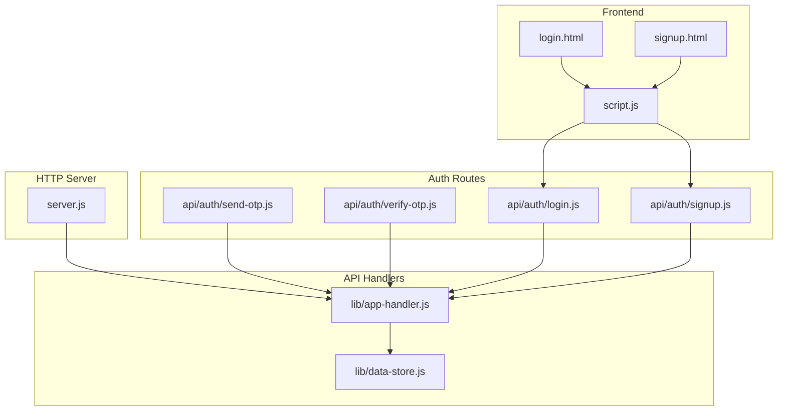
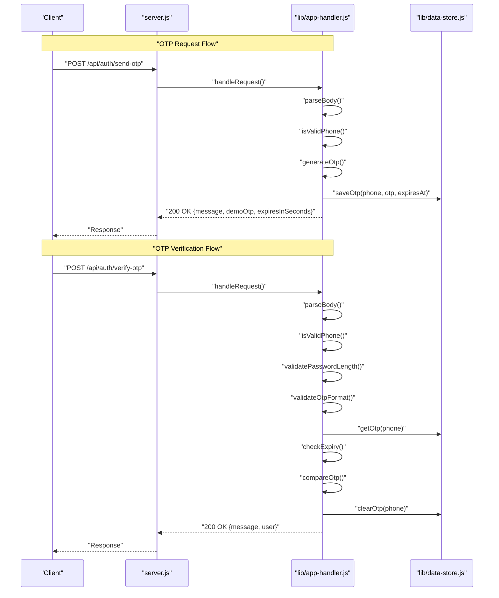
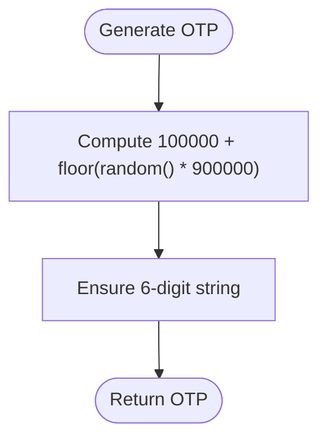
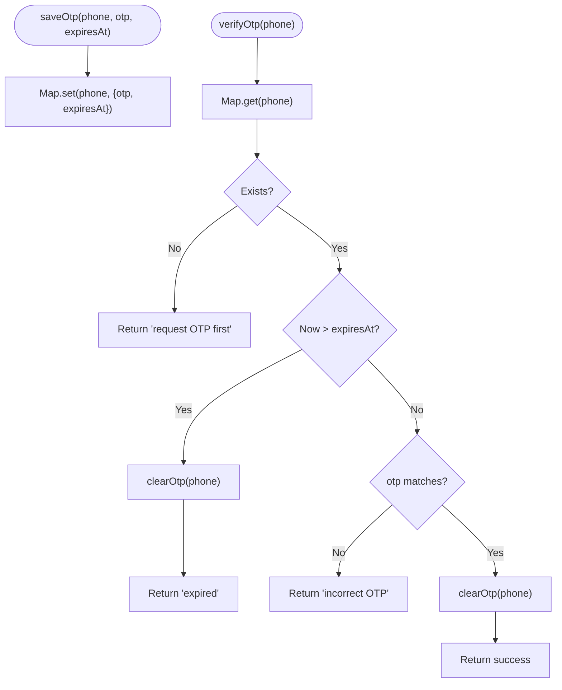
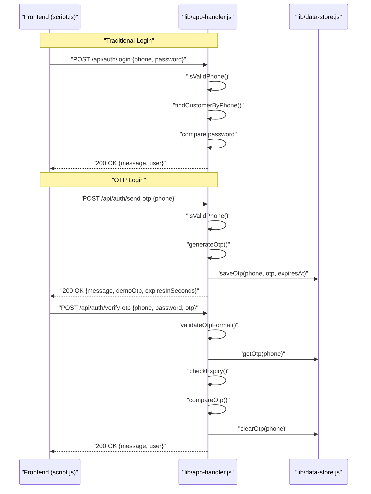
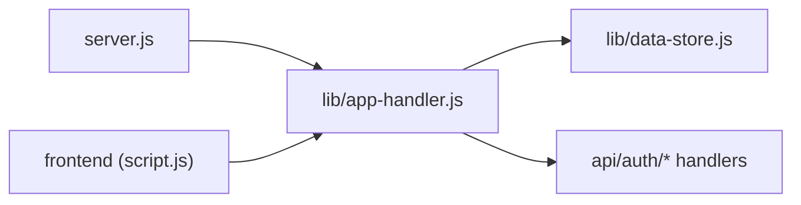

# Authentication Security

<cite>
**Referenced Files in This Document**
- [server.js](file://server.js)
- [lib/app-handler.js](file://lib/app-handler.js)
- [lib/data-store.js](file://lib/data-store.js)
- [api/auth/send-otp.js](file://api/auth/send-otp.js)
- [api/auth/verify-otp.js](file://api/auth/verify-otp.js)
- [api/auth/login.js](file://api/auth/login.js)
- [api/auth/signup.js](file://api/auth/signup.js)
- [login.html](file://login.html)
- [signup.html](file://signup.html)
- [script.js](file://script.js)
- [customers.json](file://customers.json)
- [package.json](file://package.json)
</cite>

## Table of Contents
1. [Introduction](#introduction)
2. [Project Structure](#project-structure)
3. [Core Components](#core-components)
4. [Architecture Overview](#architecture-overview)
5. [Detailed Component Analysis](#detailed-component-analysis)
6. [Dependency Analysis](#dependency-analysis)
7. [Performance Considerations](#performance-considerations)
8. [Troubleshooting Guide](#troubleshooting-guide)
9. [Conclusion](#conclusion)
10. [Appendices](#appendices)

## Introduction
This document provides a comprehensive security analysis of the Night Foodies authentication system. It focuses on the OTP generation algorithm, OTP storage and expiration handling, authentication flows (including phone validation, password verification, and session establishment), rate limiting considerations, brute-force protections, error handling strategies, and production deployment best practices. The goal is to help operators harden the system while maintaining usability.

## Project Structure
The authentication system is organized around a small HTTP server and a set of API endpoints under /api/auth. Handlers are thin wrappers that delegate to a shared handler module, which encapsulates OTP generation, validation, and persistence logic.

**Diagram sources**
- [server.js:1-35](file://server.js#L1-L35)
- [lib/app-handler.js:1-332](file://lib/app-handler.js#L1-L332)
- [lib/data-store.js:1-291](file://lib/data-store.js#L1-L291)
- [api/auth/send-otp.js:1-7](file://api/auth/send-otp.js#L1-L7)
- [api/auth/verify-otp.js:1-7](file://api/auth/verify-otp.js#L1-L7)
- [api/auth/login.js:1-7](file://api/auth/login.js#L1-L7)
- [api/auth/signup.js:1-7](file://api/auth/signup.js#L1-L7)
- [login.html:1-54](file://login.html#L1-L54)
- [signup.html:1-67](file://signup.html#L1-L67)
- [script.js:1-450](file://script.js#L1-L450)

**Section sources**
- [server.js:1-35](file://server.js#L1-L35)
- [lib/app-handler.js:1-332](file://lib/app-handler.js#L1-L332)
- [lib/data-store.js:1-291](file://lib/data-store.js#L1-L291)
- [api/auth/send-otp.js:1-7](file://api/auth/send-otp.js#L1-L7)
- [api/auth/verify-otp.js:1-7](file://api/auth/verify-otp.js#L1-L7)
- [api/auth/login.js:1-7](file://api/auth/login.js#L1-L7)
- [api/auth/signup.js:1-7](file://api/auth/signup.js#L1-L7)
- [login.html:1-54](file://login.html#L1-L54)
- [signup.html:1-67](file://signup.html#L1-L67)
- [script.js:1-450](file://script.js#L1-L450)

## Core Components
- OTP Generation and Validation
  - OTP generation uses a 6-digit deterministic random generator with a fixed range.
  - OTP validity is enforced via an in-memory expiry timestamp.
- Data Persistence Layer
  - Supports MySQL, file-based JSON, and in-memory modes with automatic fallback.
  - OTPs are stored in an in-memory Map keyed by phone number.
- Authentication Flows
  - Traditional login with phone/password.
  - OTP-based login flow with send/verify steps.
  - Signup flow with phone uniqueness checks.
- Frontend Integration
  - Minimal client-side validation and session persistence via localStorage.

Security-relevant constants and helpers:
- OTP validity duration is defined as two minutes.
- Phone number validation enforces exactly 10 digits.
- Password validation requires at least four characters for OTP-based flows.

**Section sources**
- [lib/app-handler.js:13-21](file://lib/app-handler.js#L13-L21)
- [lib/app-handler.js:15-17](file://lib/app-handler.js#L15-L17)
- [lib/app-handler.js:141-144](file://lib/app-handler.js#L141-L144)
- [lib/data-store.js:6-8](file://lib/data-store.js#L6-L8)
- [lib/data-store.js:266-276](file://lib/data-store.js#L266-L276)

## Architecture Overview
The authentication architecture separates concerns across server initialization, request routing, handler logic, and data persistence. The OTP flow is implemented as a two-step process: request OTP and verify OTP, with strict validation and expiration enforcement.

**Diagram sources**
- [server.js:7-31](file://server.js#L7-L31)
- [lib/app-handler.js:98-170](file://lib/app-handler.js#L98-L170)
- [lib/data-store.js:266-276](file://lib/data-store.js#L266-L276)

## Detailed Component Analysis

### OTP Generation Algorithm
- Algorithm: A 6-digit OTP is generated using a fixed mathematical range to produce deterministic randomness within the 100000–999999 range.
- Determinism: The algorithm uses a pseudo-random generator seeded by the runtime; it is not cryptographically secure.
- Implications:
  - Predictability risk if the PRNG seed or environment is compromised.
  - Not suitable for high-security scenarios without cryptographic RNG.

**Diagram sources**
- [lib/app-handler.js:19-21](file://lib/app-handler.js#L19-L21)

**Section sources**
- [lib/app-handler.js:19-21](file://lib/app-handler.js#L19-L21)

### OTP Storage and Expiration Handling
- Storage: OTPs are stored in an in-memory Map keyed by phone number with an associated expiry timestamp.
- Expiration: On verification, the system checks if the current time exceeds the stored expiry. If expired, the OTP is cleared and the request fails.
- Cleanup: Successful verification clears the OTP immediately to prevent reuse.

**Diagram sources**
- [lib/data-store.js:266-276](file://lib/data-store.js#L266-L276)
- [lib/app-handler.js:151-169](file://lib/app-handler.js#L151-L169)

**Section sources**
- [lib/data-store.js:6-8](file://lib/data-store.js#L6-L8)
- [lib/data-store.js:266-276](file://lib/data-store.js#L266-L276)
- [lib/app-handler.js:13-13](file://lib/app-handler.js#L13-L13)
- [lib/app-handler.js:151-169](file://lib/app-handler.js#L151-L169)

### Authentication Flow Security
- Phone Number Validation
  - Enforced to exactly 10 digits on both OTP request and verification endpoints.
- Password Verification
  - OTP-based verification requires a minimum length for the password field.
  - Traditional login compares stored password with the provided password.
- Session Establishment
  - The frontend sets a localStorage key upon successful login to indicate logged-in state.
  - No server-side session tokens are used; state is client-side.

**Diagram sources**
- [lib/app-handler.js:227-269](file://lib/app-handler.js#L227-L269)
- [lib/app-handler.js:98-170](file://lib/app-handler.js#L98-L170)
- [lib/data-store.js:216-229](file://lib/data-store.js#L216-L229)

**Section sources**
- [lib/app-handler.js:15-17](file://lib/app-handler.js#L15-L17)
- [lib/app-handler.js:141-144](file://lib/app-handler.js#L141-L144)
- [lib/app-handler.js:227-269](file://lib/app-handler.js#L227-L269)
- [lib/app-handler.js:98-170](file://lib/app-handler.js#L98-L170)
- [script.js:122-148](file://script.js#L122-L148)
- [script.js:156-186](file://script.js#L156-L186)

### Rate Limiting and Brute Force Protection
- Current Implementation: No built-in rate limiting or brute-force mitigation is present in the codebase.
- Risks:
  - OTP brute-force attempts can succeed if attackers repeatedly guess OTPs within the validity window.
  - Repeated login attempts can reveal whether an account exists.
- Recommended Mitigations (see Production Deployment Best Practices):
  - Implement per-phone rate limits for OTP requests and verification attempts.
  - Add exponential backoff or temporary IP-based blocks after repeated failures.
  - Consider CAPTCHA or secondary challenges for suspicious activity.
  - Enforce stricter password policies and consider multi-factor authentication.

[No sources needed since this section analyzes absence of features and proposes mitigations conceptually]

### Error Handling Strategies
- Validation Errors
  - Phone format errors return 400 with a descriptive message.
  - Password length errors return 400 with a descriptive message.
  - OTP format errors return 400 with a descriptive message.
- OTP-Specific Errors
  - Missing OTP returns 400 with a prompt to request OTP first.
  - Expired OTP clears the entry and returns 400 with an expiration message.
  - Incorrect OTP returns 401 with a retry message.
- Account Operations
  - Duplicate phone during signup returns 409 with a redirect-to-login message.
  - Unknown accounts during login return 404 with a sign-up prompt.
- Logging
  - Server logs internal errors and unhandled exceptions for diagnostics.

**Section sources**
- [lib/app-handler.js:108-111](file://lib/app-handler.js#L108-L111)
- [lib/app-handler.js:136-149](file://lib/app-handler.js#L136-L149)
- [lib/app-handler.js:151-169](file://lib/app-handler.js#L151-L169)
- [lib/app-handler.js:188-196](file://lib/app-handler.js#L188-L196)
- [lib/app-handler.js:217-219](file://lib/app-handler.js#L217-L219)
- [lib/app-handler.js:251-259](file://lib/app-handler.js#L251-L259)
- [server.js:14-18](file://server.js#L14-L18)
- [lib/app-handler.js:222-223](file://lib/app-handler.js#L222-L223)
- [lib/app-handler.js:266-267](file://lib/app-handler.js#L266-L267)

### Secure Storage Practices
- OTP Storage
  - In-memory Map ensures ephemeral OTPs and avoids persistent exposure.
  - No encryption is applied; treat OTPs as sensitive but short-lived.
- Customer Data
  - Supports MySQL, file JSON, and in-memory modes with fallback.
  - Passwords are stored as plaintext in the current implementation.
- Recommendations
  - Hash passwords using a strong KDF (bcrypt, scrypt, Argon2) before storing.
  - Encrypt sensitive fields at rest when using file or in-memory modes.
  - Rotate secrets regularly and restrict access to environment variables and storage files.

**Section sources**
- [lib/data-store.js:6-8](file://lib/data-store.js#L6-L8)
- [lib/data-store.js:216-229](file://lib/data-store.js#L216-L229)
- [customers.json:1-11](file://customers.json#L1-L11)

### Authentication Flow Security Details
- OTP Request
  - Validates phone number format.
  - Generates OTP and stores with expiry.
  - Returns a demo OTP for development convenience.
- OTP Verification
  - Validates phone, password length, and OTP format.
  - Enforces expiry and OTP correctness.
  - Clears OTP after successful verification.
- Traditional Login
  - Validates phone and presence of password.
  - Compares stored password with provided password.
  - Returns user identity on success.

**Section sources**
- [lib/app-handler.js:98-170](file://lib/app-handler.js#L98-L170)
- [lib/app-handler.js:227-269](file://lib/app-handler.js#L227-L269)

## Dependency Analysis
The authentication system exhibits low coupling between modules, with clear separation of concerns:
- server.js initializes the HTTP server and delegates to the shared handler.
- lib/app-handler.js centralizes request parsing, validation, and routing to specific handlers.
- lib/data-store.js encapsulates persistence and OTP storage.

**Diagram sources**
- [server.js:1-35](file://server.js#L1-L35)
- [lib/app-handler.js:1-332](file://lib/app-handler.js#L1-L332)
- [lib/data-store.js:1-291](file://lib/data-store.js#L1-L291)
- [script.js:1-450](file://script.js#L1-L450)

**Section sources**
- [server.js:1-35](file://server.js#L1-L35)
- [lib/app-handler.js:1-332](file://lib/app-handler.js#L1-L332)
- [lib/data-store.js:1-291](file://lib/data-store.js#L1-L291)
- [script.js:1-450](file://script.js#L1-L450)

## Performance Considerations
- OTP Generation
  - Uses a lightweight deterministic algorithm; negligible CPU overhead.
- OTP Storage
  - In-memory Map provides O(1) average-time operations for save/get/clear.
- Database Modes
  - MySQL mode scales better for production; file/in-memory modes are suitable for development or serverless environments without persistent storage.
- Frontend
  - Client-side localStorage usage is fast but not secure; avoid storing sensitive session tokens here.

[No sources needed since this section provides general guidance]

## Troubleshooting Guide
Common issues and their security implications:
- OTP Not Received
  - Validate phone format and network connectivity.
  - Check server logs for unhandled errors.
- OTP Expired Too Soon
  - Confirm OTP validity constant and client clock synchronization.
- Incorrect OTP or Password
  - Ensure OTP was requested and not reused; verify password length requirements.
- Account Not Found
  - Prompt user to sign up; avoid leaking account existence via error messages.
- Internal Server Errors
  - Review server logs and ensure initDataStore completes successfully.

**Section sources**
- [lib/app-handler.js:108-111](file://lib/app-handler.js#L108-L111)
- [lib/app-handler.js:151-169](file://lib/app-handler.js#L151-L169)
- [lib/app-handler.js:251-259](file://lib/app-handler.js#L251-L259)
- [server.js:14-18](file://server.js#L14-L18)

## Conclusion
The Night Foodies authentication system provides a functional OTP-based login flow with clear validations and in-memory OTP storage. However, several security gaps exist, including lack of rate limiting, weak OTP generation, plaintext password storage, and client-side session management. Immediate improvements should focus on cryptographic OTP generation, robust rate limiting, password hashing, and server-side session tokens. Long-term enhancements could include multi-factor authentication, stronger audit logging, and environment-specific configurations for production deployments.

[No sources needed since this section summarizes without analyzing specific files]

## Appendices

### Environment Variables and Configuration
- Database Selection
  - DB_DRIVER: Selects storage mode (mysql, file/json, memory).
  - DB_HOST, DB_USER, DB_NAME, DB_PORT: MySQL connection parameters.
  - CUSTOMERS_FILE: Path to the local JSON customer store.
  - VERCEL: Controls fallback behavior on serverless platforms.
- Server
  - PORT: HTTP server port (default 3000).
- Runtime
  - NODE_VERSION: Enforced to 24.x.

**Section sources**
- [lib/data-store.js:19-25](file://lib/data-store.js#L19-L25)
- [lib/data-store.js:68-101](file://lib/data-store.js#L68-L101)
- [lib/data-store.js:140-214](file://lib/data-store.js#L140-L214)
- [server.js:5-5](file://server.js#L5-L5)
- [package.json:10-12](file://package.json#L10-L12)

### Production Deployment Best Practices
- Secrets Management
  - Store DB credentials and any future secrets in environment variables or a secret manager.
  - Restrict filesystem permissions for CUSTOMERS_FILE if using file mode.
- Data Protection
  - Hash passwords using bcrypt with a high cost factor.
  - Consider encrypting sensitive fields at rest.
- Rate Limiting
  - Implement per-phone rate limits for OTP requests and verification attempts.
  - Block repeated failures from the same IP or phone number temporarily.
- Transport Security
  - Serve over HTTPS in production.
  - Use secure, HTTP-only cookies for server-side sessions if adopted.
- Monitoring and Auditing
  - Log authentication events (successes, failures, OTP requests).
  - Alert on unusual spikes in failure rates or OTP reuse attempts.
- Resilience
  - Prefer MySQL for production; ensure high availability and backups.
  - Use container orchestration with health checks and auto-recovery.

[No sources needed since this section provides general guidance]