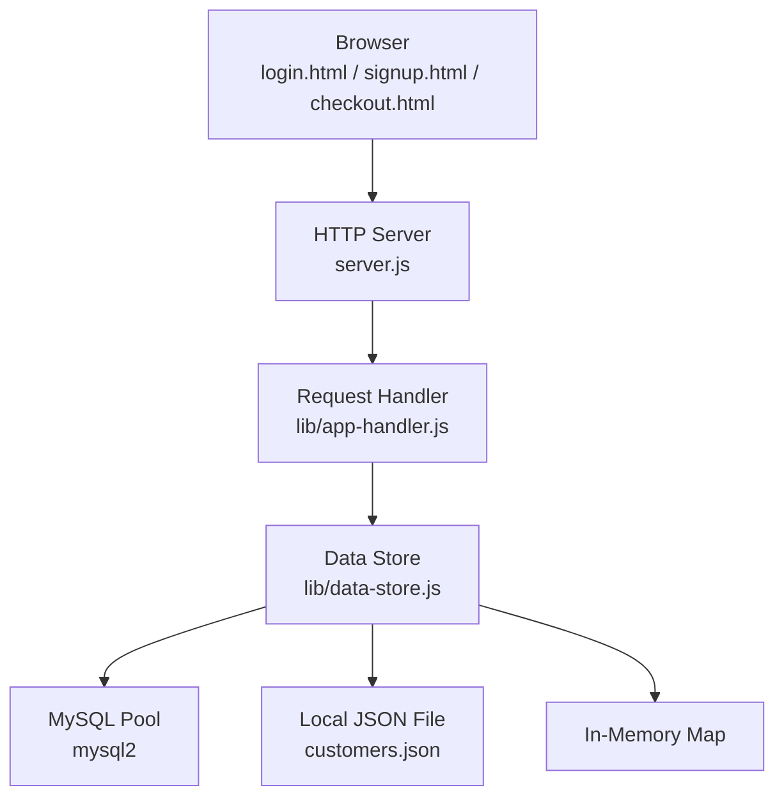
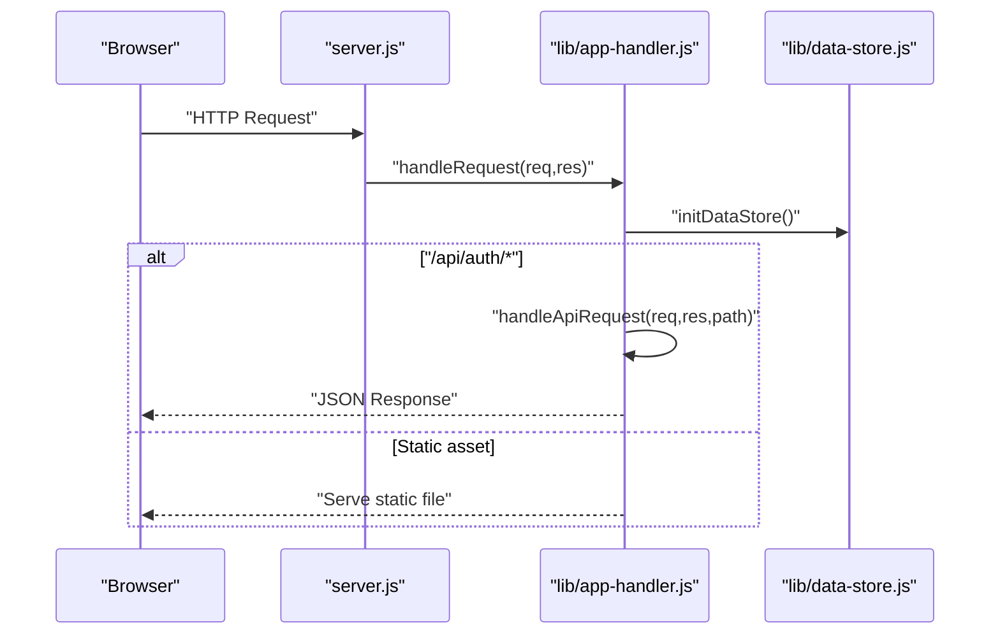
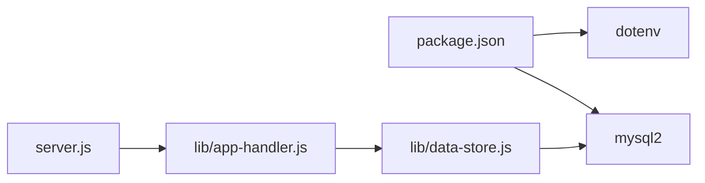
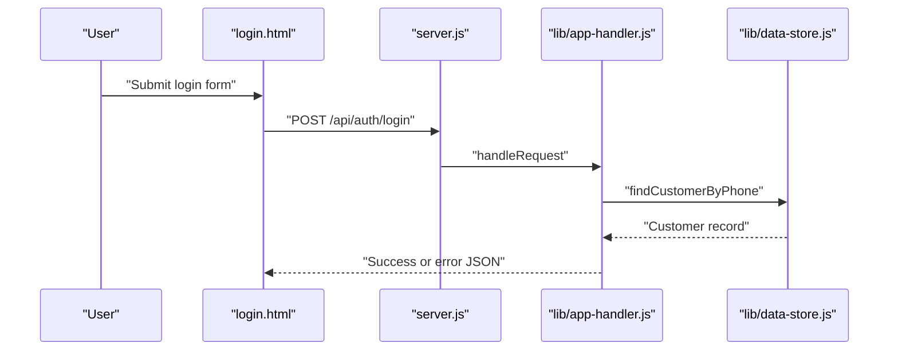

# Compliance and Security Best Practices

<cite>
**Referenced Files in This Document**
- [server.js](file://server.js)
- [package.json](file://package.json)
- [lib/app-handler.js](file://lib/app-handler.js)
- [lib/data-store.js](file://lib/data-store.js)
- [api/auth/login.js](file://api/auth/login.js)
- [api/auth/send-otp.js](file://api/auth/send-otp.js)
- [api/auth/verify-otp.js](file://api/auth/verify-otp.js)
- [api/auth/signup.js](file://api/auth/signup.js)
- [login.html](file://login.html)
- [signup.html](file://signup.html)
- [checkout.html](file://checkout.html)
- [script.js](file://script.js)
- [styles.css](file://styles.css)
- [customers.json](file://customers.json)
</cite>

## Table of Contents
1. [Introduction](#introduction)
2. [Project Structure](#project-structure)
3. [Core Components](#core-components)
4. [Architecture Overview](#architecture-overview)
5. [Detailed Component Analysis](#detailed-component-analysis)
6. [Dependency Analysis](#dependency-analysis)
7. [Performance Considerations](#performance-considerations)
8. [Troubleshooting Guide](#troubleshooting-guide)
9. [Conclusion](#conclusion)
10. [Appendices](#appendices)

## Introduction
This document provides comprehensive compliance and security best practices tailored for the Night Foodies application. It focuses on secure configuration, data privacy, audit and vulnerability assessment, incident response, monitoring and logging, production hardening, and regulatory compliance (notably GDPR). The guidance is grounded in the repository’s current implementation and highlights areas requiring immediate attention to meet modern security and privacy standards.

## Project Structure
The application follows a minimal Node.js server architecture with a frontend built using static HTML/CSS/JS. Authentication endpoints are exposed via serverless-style handlers under the /api/auth namespace. Data persistence supports multiple modes: in-memory, local JSON file, and MySQL with automatic fallback logic.

**Diagram sources**
- [server.js:1-35](file://server.js#L1-L35)
- [lib/app-handler.js:297-309](file://lib/app-handler.js#L297-L309)
- [lib/data-store.js:68-101](file://lib/data-store.js#L68-L101)
- [lib/data-store.js:112-123](file://lib/data-store.js#L112-L123)
- [lib/data-store.js:125-129](file://lib/data-store.js#L125-L129)

**Section sources**
- [server.js:1-35](file://server.js#L1-L35)
- [lib/app-handler.js:297-309](file://lib/app-handler.js#L297-L309)
- [lib/data-store.js:140-214](file://lib/data-store.js#L140-L214)

## Core Components
- HTTP server bootstrapping and error handling
- Request routing and API endpoint handlers
- Data store initialization with multiple backends
- Static asset serving
- Client-side authentication flows and cart persistence

Key security-relevant responsibilities:
- Environment variable loading and usage
- Input validation and sanitization
- Error handling and logging
- Data persistence modes and secrets exposure risk
- Frontend storage of authentication tokens

**Section sources**
- [server.js:1-35](file://server.js#L1-L35)
- [lib/app-handler.js:15-54](file://lib/app-handler.js#L15-L54)
- [lib/data-store.js:19-25](file://lib/data-store.js#L19-L25)

## Architecture Overview
The runtime architecture integrates a Node.js HTTP server with a modular request handler and a pluggable data store. Authentication endpoints are routed through serverless-style handlers that delegate to the shared handler module. The data store selects backend at startup based on environment variables and availability.

**Diagram sources**
- [server.js:11-23](file://server.js#L11-L23)
- [lib/app-handler.js:297-309](file://lib/app-handler.js#L297-L309)
- [lib/data-store.js:158-214](file://lib/data-store.js#L158-L214)

## Detailed Component Analysis

### Environment Variable Management
Current state:
- dotenv is loaded at process start.
- Port is read from environment.
- Data store selection depends on DB_DRIVER and DB_* variables.
- MySQL credentials are read from environment variables.
- Vercel-specific behavior is considered for runtime fallbacks.

Security gaps:
- No secret scanning or validation of required variables.
- No encryption-at-rest for secrets.
- No separation of secrets per environment (dev/stage/prod).
- No rotation or expiry policies for secrets.

Recommended controls:
- Enforce presence of critical variables at startup with explicit errors.
- Use a secrets manager (e.g., OS keychain, cloud KMS) for production.
- Restrict file permissions for .env and related config files.
- Implement secret rotation schedules and audit logs for access.

**Section sources**
- [server.js:1](file://server.js#L1)
- [server.js:5](file://server.js#L5)
- [lib/data-store.js:68-101](file://lib/data-store.js#L68-L101)
- [lib/data-store.js:164-180](file://lib/data-store.js#L164-L180)

### Database Connection Security
Current state:
- MySQL pool is created with configurable host/port/user/password.
- Database creation and table initialization occur at startup.
- Fallbacks to file and memory modes if MySQL is unavailable.
- Local JSON file is used when file mode is selected.

Security gaps:
- Plain text passwords in environment variables.
- No TLS configuration for MySQL connections.
- No connection pooling limits enforced via configuration.
- File-based persistence is not encrypted and not suitable for production.

Recommended controls:
- Enable SSL/TLS for MySQL connections.
- Use IAM or service accounts instead of long-lived passwords.
- Encrypt sensitive files at rest (customer data).
- Apply least privilege for database users and restrict network access.

**Section sources**
- [lib/data-store.js:68-101](file://lib/data-store.js#L68-L101)
- [lib/data-store.js:140-214](file://lib/data-store.js#L140-L214)
- [customers.json:1-11](file://customers.json#L1-L11)

### Authentication and Authorization
Current state:
- Login and signup endpoints accept JSON payloads.
- Validation includes phone length, password length, and OTP verification.
- OTP is stored in memory with expiration.
- Frontend stores a lightweight token in localStorage.

Security gaps:
- No rate limiting on authentication endpoints.
- No CSRF protection for form submissions.
- No secure, HttpOnly cookies for session tokens.
- No two-factor authentication or MFA.
- No password hashing or salting.
- No input sanitization beyond basic regex checks.

Recommended controls:
- Implement rate limiting and account lockout policies.
- Add CSRF tokens and SameSite cookies.
- Replace localStorage token with secure HttpOnly cookies.
- Enforce strong password policies and hashing.
- Add MFA and audit logs for suspicious activity.

**Section sources**
- [lib/app-handler.js:227-269](file://lib/app-handler.js#L227-L269)
- [lib/app-handler.js:172-225](file://lib/app-handler.js#L172-L225)
- [lib/app-handler.js:98-170](file://lib/app-handler.js#L98-L170)
- [script.js:43-57](file://script.js#L43-L57)
- [script.js:142](file://script.js#L142)

### Data Privacy and Personal Data Handling
Current state:
- Customer records include phone, email, address, and password.
- Passwords are stored in plaintext.
- Data can be persisted to JSON file or MySQL depending on configuration.

Security gaps:
- No consent banners or privacy notices.
- No data minimization or retention policies.
- No right-to-erasure or data portability mechanisms.
- No pseudonymization or encryption of sensitive data.

Recommended controls:
- Implement GDPR-compliant consent and privacy notice.
- Define data retention periods and automated deletion.
- Provide data access and erasure requests via UI/API.
- Encrypt at rest and in transit; apply pseudonymization where feasible.

**Section sources**
- [lib/data-store.js:231-264](file://lib/data-store.js#L231-L264)
- [customers.json:1-11](file://customers.json#L1-L11)

### Production Deployment Considerations
Current state:
- Application runs on HTTP with no HTTPS enforcement.
- No CORS policy configuration.
- No security headers (e.g., CSP, HSTS, X-Frame-Options).
- No health checks or graceful shutdown hooks.

Security gaps:
- Transport security missing.
- Vulnerable to clickjacking and XSS without proper headers.
- No observability or alerting in place.

Recommended controls:
- Enforce HTTPS and redirect HTTP to HTTPS.
- Configure strict CORS and Content Security Policy.
- Add security headers (HSTS, X-Frame-Options, X-Content-Type-Options).
- Implement readiness/liveness probes and structured logging.

**Section sources**
- [server.js:21-23](file://server.js#L21-L23)
- [lib/app-handler.js:23-28](file://lib/app-handler.js#L23-L28)

### Security Audit Procedures and Vulnerability Assessment
Recommended activities:
- Perform monthly dependency audits using SCA tools.
- Conduct quarterly penetration testing on staging.
- Run automated scans (SAST/DAST) on CI/CD pipeline.
- Maintain a vulnerability triage process with remediation timelines.

[No sources needed since this section provides general guidance]

### Incident Response Protocols
Recommended framework:
- Define roles and escalation paths.
- Establish communication channels and stakeholder notifications.
- Document forensic collection procedures and evidence preservation.
- Post-mortem process with corrective actions and timeline.

[No sources needed since this section provides general guidance]

### Security Monitoring, Logging, and Alerting
Recommended capabilities:
- Centralized structured logging with log levels and correlation IDs.
- Metrics for authentication failures, latency, and error rates.
- Real-time alerts for anomalies (failed logins, unusual traffic).
- SIEM integration for correlation and reporting.

[No sources needed since this section provides general guidance]

### Production Hardening Checklist
- HTTPS termination at load balancer or reverse proxy.
- Strict transport security and security headers.
- CORS restricted to trusted origins.
- Rate limiting and WAF enabled.
- Secrets managed via a secure vault.
- Network segmentation and firewall rules.
- Backup and disaster recovery procedures.

[No sources needed since this section provides general guidance]

### Regular Security Updates, Dependency Management, and Patching
Recommended practices:
- Pin dependency versions and automate update PRs.
- Monitor advisory feeds (npm audit, GitHub Security Alerts).
- Maintain a patching schedule with rollback capability.
- Test patches in staging before production rollout.

**Section sources**
- [package.json:13-16](file://package.json#L13-L16)

### GDPR Compliance Considerations and Data Protection Measures
- Lawfulness, fairness, transparency in data processing.
- Data minimization and purpose limitation.
- Storage limitation aligned with business needs.
- Integrity and confidentiality with encryption and access controls.
- Data subject rights (access, rectification, erasure, portability).
- Data Protection Impact Assessment for high-risk processing.
- Data breach notification procedures and remediation.

[No sources needed since this section provides general guidance]

## Dependency Analysis
The application relies on dotenv for environment loading and mysql2 for database connectivity. The request handler module orchestrates routing and delegates to the data store, which dynamically selects backend.

**Diagram sources**
- [package.json:13-16](file://package.json#L13-L16)
- [server.js:1-3](file://server.js#L1-L3)
- [lib/app-handler.js:3-11](file://lib/app-handler.js#L3-L11)
- [lib/data-store.js:4](file://lib/data-store.js#L4)

**Section sources**
- [package.json:13-16](file://package.json#L13-L16)
- [server.js:1-3](file://server.js#L1-L3)
- [lib/app-handler.js:3-11](file://lib/app-handler.js#L3-L11)

## Performance Considerations
- Use connection pooling and limit concurrent requests.
- Cache frequently accessed static assets with appropriate headers.
- Optimize database queries and add indexes for high-traffic endpoints.
- Implement CDN for static resources and enforce caching policies.

[No sources needed since this section provides general guidance]

## Troubleshooting Guide
Common issues and mitigations:
- Startup failures due to missing MySQL: Verify DB_HOST, DB_USER, DB_NAME; fallback to file/memory logs warnings.
- Authentication errors: Validate input formats and ensure rate limiting is applied.
- Static asset 404s: Confirm file paths and normalization logic.
- Unhandled exceptions: Review centralized error handling and logging.

**Section sources**
- [server.js:24-31](file://server.js#L24-L31)
- [lib/data-store.js:149-156](file://lib/data-store.js#L149-L156)
- [lib/app-handler.js:305-309](file://lib/app-handler.js#L305-L309)

## Conclusion
Night Foodies currently operates in a development-friendly mode with multiple data store backends and basic authentication. To achieve production-grade security and compliance, prioritize HTTPS enforcement, strict CORS and security headers, robust secrets management, encryption at rest and in transit, comprehensive logging/alerting, and adherence to GDPR principles. Implement a continuous security program including audits, vulnerability assessments, and incident response to maintain trust and resilience.

[No sources needed since this section summarizes without analyzing specific files]

## Appendices

### Appendix A: Environment Variables Reference
- PORT: Server port (default 3000)
- DB_DRIVER: mysql | file | memory | json
- DB_HOST, DB_PORT, DB_USER, DB_NAME: MySQL connection parameters
- CUSTOMERS_FILE: Path to local JSON customer store
- VERCEL: Indicates serverless deployment context

**Section sources**
- [server.js:5](file://server.js#L5)
- [lib/data-store.js:19-25](file://lib/data-store.js#L19-L25)
- [lib/data-store.js:164-180](file://lib/data-store.js#L164-L180)

### Appendix B: Authentication Flow Diagram

**Diagram sources**
- [login.html:30-47](file://login.html#L30-L47)
- [server.js:11-19](file://server.js#L11-L19)
- [lib/app-handler.js:227-269](file://lib/app-handler.js#L227-L269)
- [lib/data-store.js:216-229](file://lib/data-store.js#L216-L229)