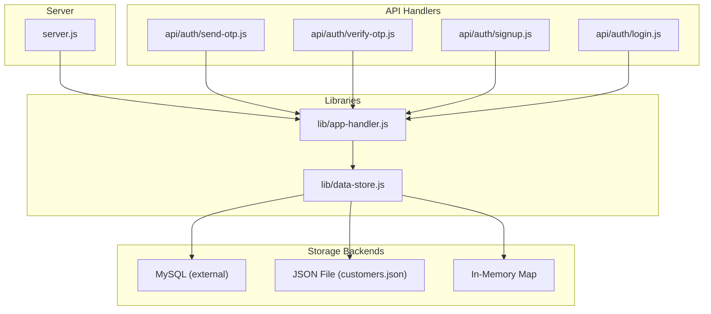
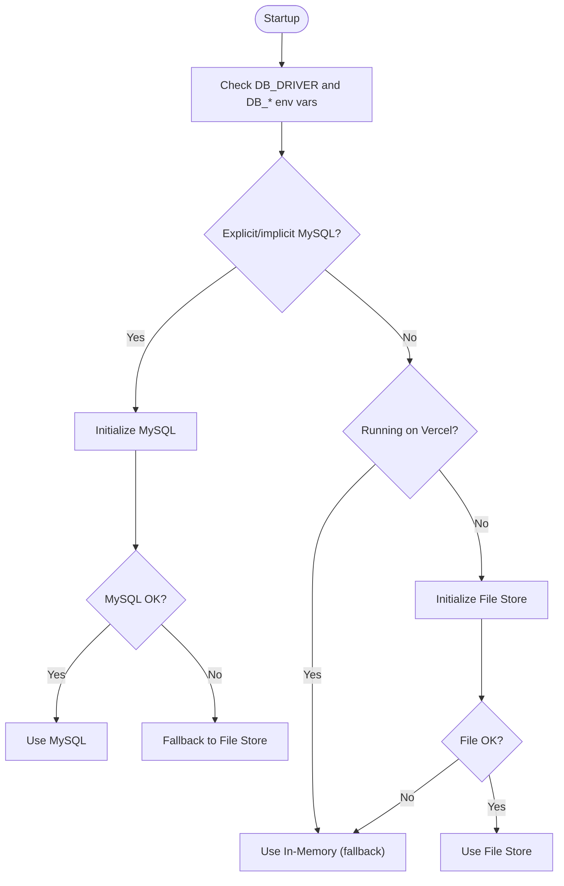
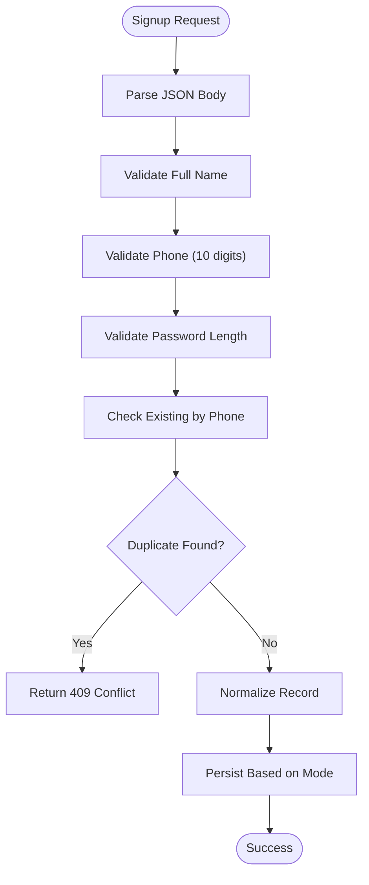
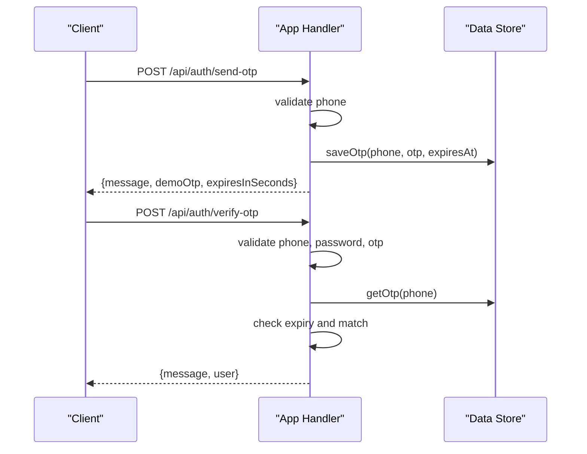
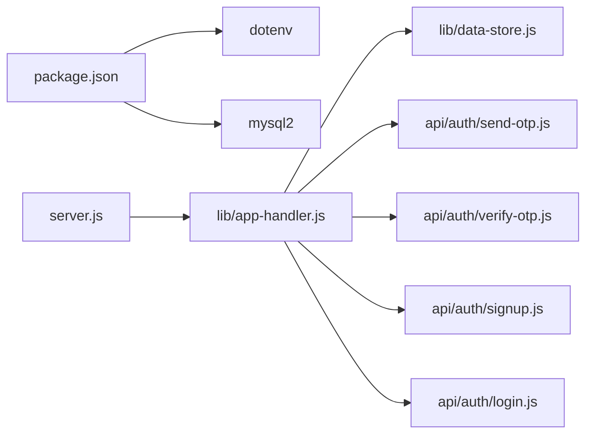

# Data Protection and Storage Security

<cite>
**Referenced Files in This Document**
- [server.js](file://server.js)
- [lib/data-store.js](file://lib/data-store.js)
- [lib/app-handler.js](file://lib/app-handler.js)
- [api/auth/send-otp.js](file://api/auth/send-otp.js)
- [api/auth/verify-otp.js](file://api/auth/verify-otp.js)
- [api/auth/signup.js](file://api/auth/signup.js)
- [api/auth/login.js](file://api/auth/login.js)
- [customers.json](file://customers.json)
- [package.json](file://package.json)
</cite>

## Table of Contents
1. [Introduction](#introduction)
2. [Project Structure](#project-structure)
3. [Core Components](#core-components)
4. [Architecture Overview](#architecture-overview)
5. [Detailed Component Analysis](#detailed-component-analysis)
6. [Dependency Analysis](#dependency-analysis)
7. [Performance Considerations](#performance-considerations)
8. [Troubleshooting Guide](#troubleshooting-guide)
9. [Conclusion](#conclusion)
10. [Appendices](#appendices)

## Introduction
This document provides comprehensive data protection and storage security documentation for the Night Foodies application. It explains the multi-backend storage system supporting MySQL, JSON file, and in-memory storage modes, detailing their security characteristics and operational behavior. It documents the customer data schema, validation processes, duplicate phone detection, error handling, storage mode selection logic, and fallback mechanisms. Special emphasis is placed on the temporary nature of in-memory storage in development and serverless environments, along with recommendations for production-grade data security, backup strategies, and data retention policies.

## Project Structure
The Night Foodies application is a Node.js HTTP server with a small client-side interface. Authentication flows are exposed via serverless-style API handlers under the api/auth directory, while the core storage and request handling logic resides in lib/.

**Diagram sources**
- [server.js:1-35](file://server.js#L1-L35)
- [lib/app-handler.js:1-332](file://lib/app-handler.js#L1-L332)
- [lib/data-store.js:1-291](file://lib/data-store.js#L1-L291)
- [api/auth/send-otp.js:1-7](file://api/auth/send-otp.js#L1-L7)
- [api/auth/verify-otp.js:1-7](file://api/auth/verify-otp.js#L1-L7)
- [api/auth/signup.js:1-7](file://api/auth/signup.js#L1-L7)
- [api/auth/login.js:1-7](file://api/auth/login.js#L1-L7)

**Section sources**
- [server.js:1-35](file://server.js#L1-L35)
- [lib/app-handler.js:1-332](file://lib/app-handler.js#L1-L332)
- [lib/data-store.js:1-291](file://lib/data-store.js#L1-L291)
- [api/auth/send-otp.js:1-7](file://api/auth/send-otp.js#L1-L7)
- [api/auth/verify-otp.js:1-7](file://api/auth/verify-otp.js#L1-L7)
- [api/auth/signup.js:1-7](file://api/auth/signup.js#L1-L7)
- [api/auth/login.js:1-7](file://api/auth/login.js#L1-L7)

## Core Components
- Data Store (lib/data-store.js): Implements initialization and selection logic for MySQL, JSON file, and in-memory storage. Provides customer CRUD operations, duplicate phone detection, OTP storage, and runtime mode reporting.
- Application Handler (lib/app-handler.js): Implements request parsing, validation, and API endpoints for OTP generation/verification and user signup/login. Delegates persistence to the data store and handles errors consistently.
- Server Entrypoint (server.js): Initializes the data store and creates the HTTP server, with graceful error handling and environment-specific guidance.
- API Handlers (api/auth/*.js): Thin serverless wrappers around the application handler for each endpoint.

Key security-relevant responsibilities:
- Storage mode selection and fallback behavior
- Customer record normalization and validation
- Duplicate phone enforcement
- OTP lifecycle management
- Error propagation and logging

**Section sources**
- [lib/data-store.js:158-214](file://lib/data-store.js#L158-L214)
- [lib/data-store.js:216-264](file://lib/data-store.js#L216-L264)
- [lib/app-handler.js:15-54](file://lib/app-handler.js#L15-L54)
- [lib/app-handler.js:172-225](file://lib/app-handler.js#L172-L225)
- [server.js:7-32](file://server.js#L7-L32)

## Architecture Overview
The storage subsystem supports three modes with clear fallback semantics. The selection logic prioritizes MySQL when properly configured, falls back to file storage with robust error handling, and finally to in-memory storage for development and serverless contexts.

**Diagram sources**
- [lib/data-store.js:158-214](file://lib/data-store.js#L158-L214)
- [lib/data-store.js:140-147](file://lib/data-store.js#L140-L147)
- [lib/data-store.js:131-138](file://lib/data-store.js#L131-L138)

## Detailed Component Analysis

### Storage Mode Selection and Fallback Logic
- Explicit driver selection via DB_DRIVER:
  - mysql: Forces MySQL initialization; requires DB_HOST, DB_USER, DB_NAME.
  - memory: Forces in-memory mode.
  - sqlite, file, json: Treats as file-backed storage with legacy sqlite note.
  - Unset or unknown: Defaults to file storage with fallback to in-memory.
- Environment awareness:
  - On Vercel, local file storage is not persistent; automatically selects in-memory mode.
- Initialization guarantees:
  - Single initialization via a promise guard to prevent race conditions.
  - Robust error handling with warnings and cascading fallbacks.

Security implications:
- In-memory mode is ephemeral and unsuitable for production data persistence.
- File storage is local and requires filesystem permissions and backup strategies.
- MySQL provides durable persistence and centralized security controls.

**Section sources**
- [lib/data-store.js:158-214](file://lib/data-store.js#L158-L214)
- [lib/data-store.js:140-147](file://lib/data-store.js#L140-L147)
- [lib/data-store.js:131-138](file://lib/data-store.js#L131-L138)
- [server.js:24-30](file://server.js#L24-L30)

### Customer Data Schema and Normalization
- Fields stored per customer:
  - id: Unique identifier (auto-generated)
  - fullName: Trimmed string
  - phone: Trimmed string (unique constraint enforced)
  - email: Trimmed string
  - address: Trimmed string
  - password: Plain text string
  - createdAt: ISO timestamp
- Normalization ensures consistent types and trimming across all backends.

Security considerations:
- Passwords are stored as plain text, which is a critical vulnerability.
- Phone numbers are unique across the customer base, preventing account takeover via duplicate registration.

**Section sources**
- [lib/data-store.js:34-44](file://lib/data-store.js#L34-L44)
- [lib/data-store.js:86-97](file://lib/data-store.js#L86-L97)
- [customers.json:1-11](file://customers.json#L1-L11)

### Data Validation and Duplicate Detection
- Validation rules applied during signup and login:
  - Phone: 10-digit numeric format.
  - Password: Minimum length checks.
  - Full name: Presence and minimum length.
- Duplicate phone detection:
  - Implemented via a uniqueness check prior to insertion.
  - Throws a specific error code for conflict resolution.

**Diagram sources**
- [lib/app-handler.js:172-225](file://lib/app-handler.js#L172-L225)
- [lib/data-store.js:231-239](file://lib/data-store.js#L231-L239)

**Section sources**
- [lib/app-handler.js:15-54](file://lib/app-handler.js#L15-L54)
- [lib/app-handler.js:172-225](file://lib/app-handler.js#L172-L225)
- [lib/data-store.js:231-239](file://lib/data-store.js#L231-L239)

### OTP Management and Authentication Flow
- OTP lifecycle:
  - Generation: Random 6-digit code.
  - Storage: In-memory Map with expiration timestamps.
  - Verification: Checks presence, expiry, and value match.
- Authentication endpoints:
  - Send OTP: Validates phone and returns OTP (with demo OTP for dev).
  - Verify OTP: Validates OTP and credentials, then responds with success.
  - Signup/Login: Use normalized customer records and password comparison.

**Diagram sources**
- [lib/app-handler.js:98-170](file://lib/app-handler.js#L98-L170)
- [lib/data-store.js:266-276](file://lib/data-store.js#L266-L276)

**Section sources**
- [lib/app-handler.js:98-170](file://lib/app-handler.js#L98-L170)
- [lib/data-store.js:266-276](file://lib/data-store.js#L266-L276)

### Error Handling for Storage Operations
- Initialization failures:
  - MySQL init failure triggers fallback to file storage; file init failure triggers in-memory mode.
- Runtime operations:
  - Duplicate phone throws a specific error code for conflict resolution.
  - JSON file read/write errors are surfaced to callers.
  - General server startup and request errors are logged and responded with standardized messages.

**Section sources**
- [lib/data-store.js:149-156](file://lib/data-store.js#L149-L156)
- [lib/data-store.js:131-138](file://lib/data-store.js#L131-L138)
- [lib/data-store.js:235-239](file://lib/data-store.js#L235-L239)
- [server.js:14-18](file://server.js#L14-L18)
- [lib/app-handler.js:216-224](file://lib/app-handler.js#L216-L224)

### Storage Backends: Security Characteristics
- MySQL
  - Pros: Persistent, ACID-compliant, supports constraints and encryption at rest.
  - Cons: Requires secure network configuration, strong credentials, and regular maintenance.
  - Recommendations: Enable TLS, restrict network access, rotate credentials, monitor logs.
- JSON File
  - Pros: Simple, portable.
  - Cons: No atomic transactions; requires filesystem permissions and backups.
  - Recommendations: Restrict file permissions, backup regularly, monitor integrity.
- In-Memory
  - Pros: Fast, no disk I/O.
  - Cons: Ephemeral; data lost on restarts; not suitable for production.
  - Recommendations: Use only for development or serverless with external persistence.

**Section sources**
- [lib/data-store.js:68-101](file://lib/data-store.js#L68-L101)
- [lib/data-store.js:112-123](file://lib/data-store.js#L112-L123)
- [lib/data-store.js:125-129](file://lib/data-store.js#L125-L129)
- [server.js:24-30](file://server.js#L24-L30)

## Dependency Analysis
The application depends on dotenv for environment configuration and mysql2 for MySQL connectivity. The server initializes the data store and delegates routing to the application handler, which coordinates with the data store for persistence.

**Diagram sources**
- [package.json:13-16](file://package.json#L13-L16)
- [server.js:1-3](file://server.js#L1-L3)
- [lib/app-handler.js:1-11](file://lib/app-handler.js#L1-L11)
- [lib/data-store.js:1-4](file://lib/data-store.js#L1-L4)

**Section sources**
- [package.json:13-16](file://package.json#L13-L16)
- [server.js:1-3](file://server.js#L1-L3)
- [lib/app-handler.js:1-11](file://lib/app-handler.js#L1-L11)
- [lib/data-store.js:1-4](file://lib/data-store.js#L1-L4)

## Performance Considerations
- In-memory mode offers fastest reads/writes but loses data on restarts.
- File mode is slower than in-memory but persists across restarts; ensure adequate disk I/O and backup cadence.
- MySQL provides scalable persistence and indexing; optimize queries and consider connection pooling.

[No sources needed since this section provides general guidance]

## Troubleshooting Guide
Common issues and resolutions:
- MySQL initialization fails:
  - Ensure DB_HOST, DB_USER, DB_NAME are set and reachable.
  - Check network access and credentials; review fallback to file/in-memory.
- File storage errors:
  - Verify CUSTOMERS_FILE path and filesystem permissions.
  - Confirm JSON file integrity and array format.
- Vercel deployments:
  - Local file storage is not persistent; rely on in-memory mode unless MySQL is configured externally.
- Duplicate phone errors:
  - Occur when attempting to register with an existing phone number; instruct users to log in instead.

**Section sources**
- [lib/data-store.js:164-176](file://lib/data-store.js#L164-L176)
- [lib/data-store.js:187-194](file://lib/data-store.js#L187-L194)
- [lib/data-store.js:235-239](file://lib/data-store.js#L235-L239)
- [lib/app-handler.js:216-224](file://lib/app-handler.js#L216-L224)

## Conclusion
Night Foodies employs a flexible multi-backend storage model with clear fallback behavior. Production deployments must prioritize MySQL for durability and security, while in-memory mode is acceptable only for development or serverless scenarios requiring external persistence. Immediate remediation is required for password storage (plain text), and operational procedures should include secure environment configuration, regular backups, and strict access controls.

[No sources needed since this section summarizes without analyzing specific files]

## Appendices

### A. Customer Data Schema Definition
- id: string (primary key)
- fullName: string
- phone: string (unique)
- email: string
- address: string
- password: string
- createdAt: ISO timestamp

**Section sources**
- [lib/data-store.js:34-44](file://lib/data-store.js#L34-L44)
- [lib/data-store.js:86-97](file://lib/data-store.js#L86-L97)
- [customers.json:1-11](file://customers.json#L1-L11)

### B. Storage Mode Selection Reference
- Explicit DB_DRIVER values:
  - mysql: Force MySQL
  - memory: Force in-memory
  - sqlite/file/json: Treat as file storage
  - Other/unset: Default to file with fallback
- Environment-specific behavior:
  - Vercel: Prefer in-memory due to non-persistent file storage

**Section sources**
- [lib/data-store.js:158-214](file://lib/data-store.js#L158-L214)
- [lib/data-store.js:187-194](file://lib/data-store.js#L187-L194)

### C. Recommendations for Production Data Security
- Enforce encrypted transport (TLS) for MySQL connections.
- Store secrets in environment variables or a secret manager; avoid committing credentials.
- Implement password hashing (bcrypt) and consider multi-factor authentication.
- Regularly back up MySQL databases and test restoration procedures.
- Apply least privilege to database users and restrict network exposure.
- Monitor and audit authentication events and storage errors.

[No sources needed since this section provides general guidance]