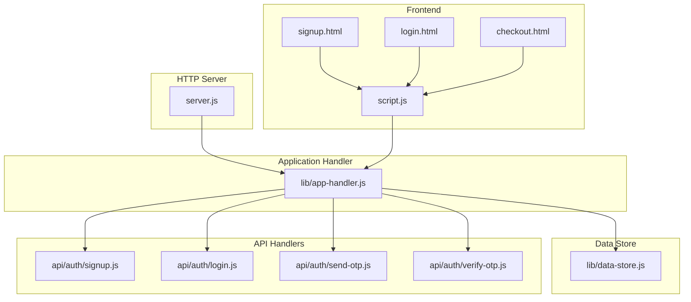
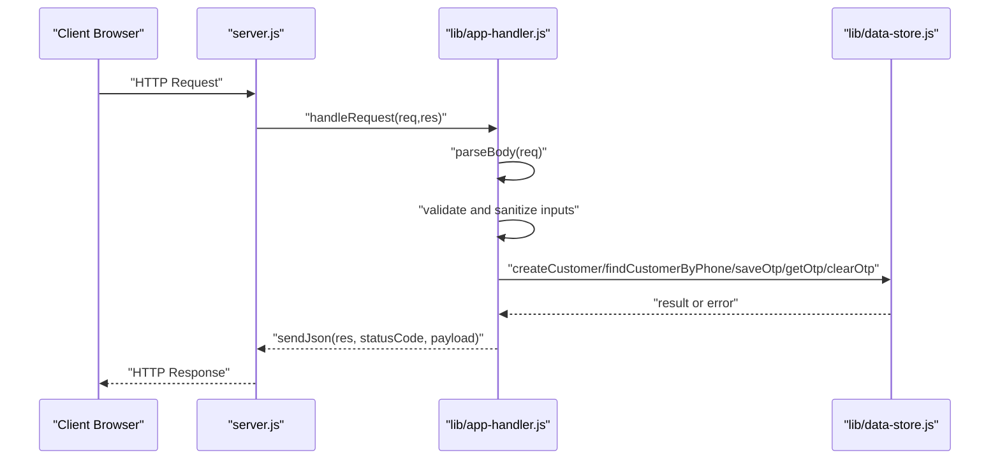
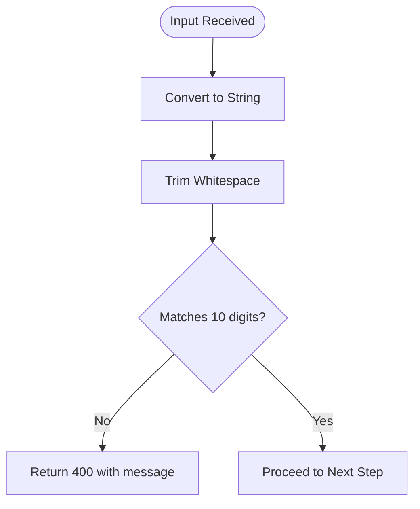
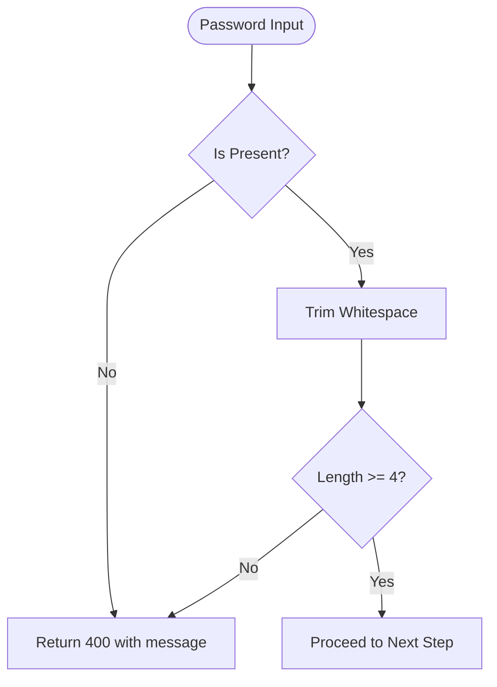
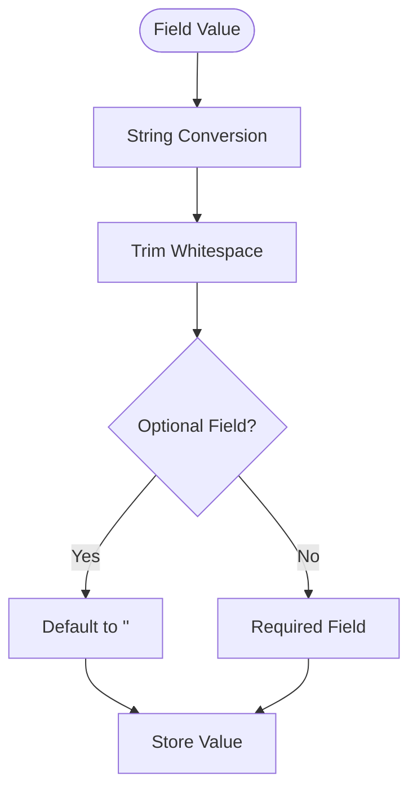
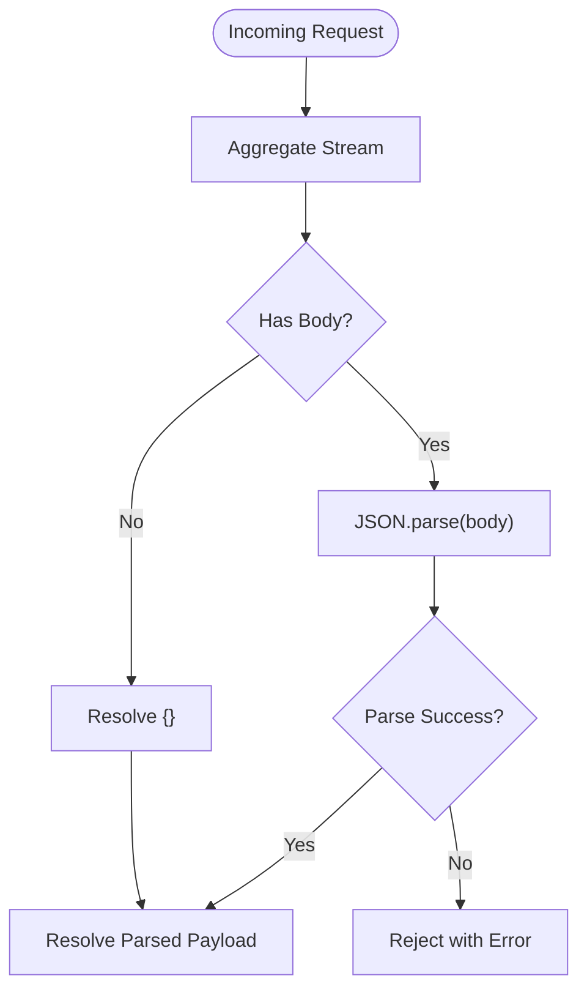
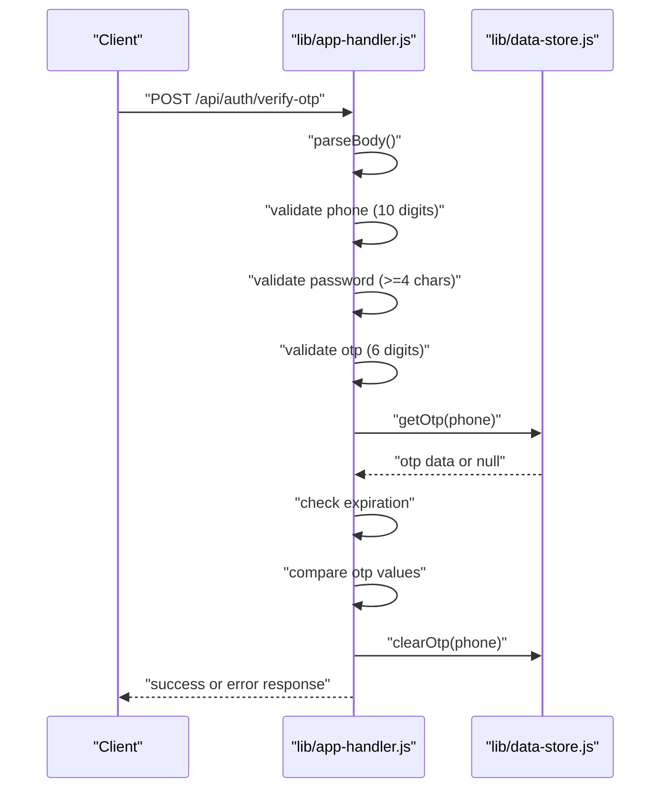
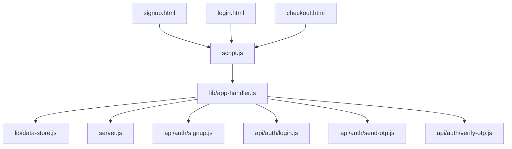

# Input Validation and Sanitization

<cite>
**Referenced Files in This Document**
- [server.js](file://server.js)
- [lib/app-handler.js](file://lib/app-handler.js)
- [lib/data-store.js](file://lib/data-store.js)
- [api/auth/signup.js](file://api/auth/signup.js)
- [api/auth/login.js](file://api/auth/login.js)
- [api/auth/send-otp.js](file://api/auth/send-otp.js)
- [api/auth/verify-otp.js](file://api/auth/verify-otp.js)
- [script.js](file://script.js)
- [signup.html](file://signup.html)
- [login.html](file://login.html)
- [checkout.html](file://checkout.html)
- [package.json](file://package.json)
</cite>

## Table of Contents
1. [Introduction](#introduction)
2. [Project Structure](#project-structure)
3. [Core Components](#core-components)
4. [Architecture Overview](#architecture-overview)
5. [Detailed Component Analysis](#detailed-component-analysis)
6. [Dependency Analysis](#dependency-analysis)
7. [Performance Considerations](#performance-considerations)
8. [Troubleshooting Guide](#troubleshooting-guide)
9. [Conclusion](#conclusion)

## Introduction
This document provides comprehensive input validation and sanitization guidance for the Night Foodies application. It focuses on the validation strategies implemented for phone numbers, passwords, and personal information fields, along with sanitization processes such as trimming whitespace and type conversion. It also documents JSON body parsing with error handling for malformed requests, and explains the security implications of each validation rule to prevent common injection attacks and data corruption.

## Project Structure
The Night Foodies application is a Node.js HTTP server with a small set of API endpoints under the /api/auth namespace. Validation and sanitization logic is centralized in the application handler and data store modules, while the frontend provides complementary client-side validation and sanitization.

**Diagram sources**
- [server.js:1-35](file://server.js#L1-L35)
- [lib/app-handler.js:1-332](file://lib/app-handler.js#L1-L332)
- [lib/data-store.js:1-291](file://lib/data-store.js#L1-L291)
- [api/auth/signup.js:1-7](file://api/auth/signup.js#L1-L7)
- [api/auth/login.js:1-7](file://api/auth/login.js#L1-L7)
- [api/auth/send-otp.js:1-7](file://api/auth/send-otp.js#L1-L7)
- [api/auth/verify-otp.js:1-7](file://api/auth/verify-otp.js#L1-L7)
- [script.js:1-450](file://script.js#L1-L450)
- [signup.html:1-67](file://signup.html#L1-L67)
- [login.html:1-54](file://login.html#L1-L54)
- [checkout.html:1-88](file://checkout.html#L1-L88)

**Section sources**
- [server.js:1-35](file://server.js#L1-L35)
- [lib/app-handler.js:1-332](file://lib/app-handler.js#L1-L332)
- [lib/data-store.js:1-291](file://lib/data-store.js#L1-L291)
- [api/auth/signup.js:1-7](file://api/auth/signup.js#L1-L7)
- [api/auth/login.js:1-7](file://api/auth/login.js#L1-L7)
- [api/auth/send-otp.js:1-7](file://api/auth/send-otp.js#L1-L7)
- [api/auth/verify-otp.js:1-7](file://api/auth/verify-otp.js#L1-L7)
- [script.js:1-450](file://script.js#L1-L450)
- [signup.html:1-67](file://signup.html#L1-L67)
- [login.html:1-54](file://login.html#L1-L54)
- [checkout.html:1-88](file://checkout.html#L1-L88)

## Core Components
This section outlines the primary validation and sanitization mechanisms implemented across the backend and frontend.

- Phone number validation
  - Pattern: ten decimal digits only
  - Implemented in both backend and frontend
  - Used for sign-up, login, OTP send, and OTP verify flows

- Password validation
  - Minimum length: four characters
  - No additional complexity requirements
  - Applied during sign-up and login flows

- Personal information sanitization
  - Trimming of leading/trailing whitespace for all string fields
  - Type conversion to string for all inputs prior to validation
  - Optional fields sanitized to empty string when missing

- JSON body parsing and error handling
  - Streaming body aggregation
  - JSON.parse with robust error handling
  - Clear error messages for malformed JSON bodies

- OTP validation
  - Six-digit numeric pattern
  - Expiration enforcement
  - Single-use verification with cleanup

**Section sources**
- [lib/app-handler.js:15-17](file://lib/app-handler.js#L15-L17)
- [lib/app-handler.js:30-54](file://lib/app-handler.js#L30-L54)
- [lib/app-handler.js:98-123](file://lib/app-handler.js#L98-L123)
- [lib/app-handler.js:125-170](file://lib/app-handler.js#L125-L170)
- [lib/app-handler.js:172-225](file://lib/app-handler.js#L172-L225)
- [lib/app-handler.js:227-269](file://lib/app-handler.js#L227-L269)
- [lib/data-store.js:34-44](file://lib/data-store.js#L34-L44)
- [script.js:122-148](file://script.js#L122-L148)
- [script.js:156-186](file://script.js#L156-L186)

## Architecture Overview
The validation and sanitization pipeline spans the HTTP server, application handler, and data store modules. Frontend scripts complement backend validation with client-side checks and sanitization.

**Diagram sources**
- [server.js:7-32](file://server.js#L7-L32)
- [lib/app-handler.js:297-309](file://lib/app-handler.js#L297-L309)
- [lib/app-handler.js:30-54](file://lib/app-handler.js#L30-L54)
- [lib/app-handler.js:172-225](file://lib/app-handler.js#L172-L225)
- [lib/app-handler.js:227-269](file://lib/app-handler.js#L227-L269)
- [lib/data-store.js:231-264](file://lib/data-store.js#L231-L264)

## Detailed Component Analysis

### Phone Number Validation
Phone number validation ensures that only ten-digit numeric strings are accepted. This is enforced both on the frontend and backend.

- Backend validation
  - Uses a strict ten-digit regex pattern
  - Converts input to string and trims before validation
  - Returns a 400 error with a descriptive message on failure

- Frontend validation
  - HTML pattern attribute enforces ten digits
  - Additional JavaScript regex check for user feedback
  - Trims input before sending to backend

- Security implications
  - Prevents numeric injection and truncation attacks
  - Reduces risk of SQL injection via malformed identifiers
  - Ensures consistent storage format across databases

**Diagram sources**
- [lib/app-handler.js:15-17](file://lib/app-handler.js#L15-L17)
- [lib/app-handler.js:108](file://lib/app-handler.js#L108)
- [lib/app-handler.js:136](file://lib/app-handler.js#L136)
- [lib/app-handler.js:188](file://lib/app-handler.js#L188)
- [lib/app-handler.js:238](file://lib/app-handler.js#L238)
- [script.js:127](file://script.js#L127)
- [script.js:134](file://script.js#L134)
- [script.js:164](file://script.js#L164)
- [script.js:171](file://script.js#L171)

**Section sources**
- [lib/app-handler.js:15-17](file://lib/app-handler.js#L15-L17)
- [lib/app-handler.js:108](file://lib/app-handler.js#L108)
- [lib/app-handler.js:136](file://lib/app-handler.js#L136)
- [lib/app-handler.js:188](file://lib/app-handler.js#L188)
- [lib/app-handler.js:238](file://lib/app-handler.js#L238)
- [script.js:127-137](file://script.js#L127-L137)
- [script.js:164-174](file://script.js#L164-L174)
- [signup.html:37](file://signup.html#L37)
- [login.html:33](file://login.html#L33)

### Password Validation
Password validation enforces a minimum length requirement. While simple, it prevents trivial weak credentials.

- Backend validation
  - Checks for presence and minimum length
  - Trims input before length check
  - Returns a 400 error with a descriptive message on failure

- Security implications
  - Prevents weak credential attacks
  - Reduces susceptibility to dictionary and brute-force attempts
  - Encourages users to adopt stronger passwords

**Diagram sources**
- [lib/app-handler.js:141](file://lib/app-handler.js#L141)
- [lib/app-handler.js:193](file://lib/app-handler.js#L193)
- [lib/app-handler.js:243](file://lib/app-handler.js#L243)
- [script.js:50](file://script.js#L50)
- [script.js:38](file://script.js#L38)

**Section sources**
- [lib/app-handler.js:141](file://lib/app-handler.js#L141)
- [lib/app-handler.js:193](file://lib/app-handler.js#L193)
- [lib/app-handler.js:243](file://lib/app-handler.js#L243)
- [script.js:50](file://script.js#L50)
- [script.js:38](file://script.js#L38)

### Personal Information Fields
Personal information fields (full name, email, address) undergo sanitization to ensure consistent and safe storage.

- Sanitization process
  - Convert to string and trim whitespace
  - Optional fields default to empty string when absent
  - Stored consistently across memory, file, and MySQL modes

- Security implications
  - Prevents trailing-space injection
  - Ensures predictable comparisons and indexing
  - Reduces risk of accidental data leakage via extra spaces

**Diagram sources**
- [lib/data-store.js:34-44](file://lib/data-store.js#L34-L44)
- [lib/app-handler.js:199-207](file://lib/app-handler.js#L199-L207)
- [lib/app-handler.js:249](file://lib/app-handler.js#L249)

**Section sources**
- [lib/data-store.js:34-44](file://lib/data-store.js#L34-L44)
- [lib/app-handler.js:199-207](file://lib/app-handler.js#L199-L207)
- [lib/app-handler.js:249](file://lib/app-handler.js#L249)

### JSON Body Parsing and Error Handling
Robust JSON parsing with comprehensive error handling protects against malformed requests.

- Implementation details
  - Streaming body aggregation
  - Try-catch around JSON.parse
  - Clear error messages for invalid JSON and read failures
  - Returns 400 status with error payload on failure

- Security implications
  - Prevents prototype pollution via unsafe deserialization
  - Guards against buffer overflow and encoding issues
  - Provides deterministic error responses

**Diagram sources**
- [lib/app-handler.js:30-54](file://lib/app-handler.js#L30-L54)

**Section sources**
- [lib/app-handler.js:30-54](file://lib/app-handler.js#L30-L54)

### OTP Validation
OTP validation combines format checking, expiration enforcement, and single-use verification.

- Validation steps
  - Ten-digit phone number validation
  - Four-character password minimum
  - Six-digit numeric OTP pattern
  - OTP existence and expiration check
  - OTP value comparison
  - Cleanup after successful verification

- Security implications
  - Prevents replay attacks via expiration
  - Mitigates brute-force attempts through single-use semantics
  - Reduces risk of numeric injection in OTP field

**Diagram sources**
- [lib/app-handler.js:125-170](file://lib/app-handler.js#L125-L170)
- [lib/data-store.js:266-276](file://lib/data-store.js#L266-L276)

**Section sources**
- [lib/app-handler.js:125-170](file://lib/app-handler.js#L125-L170)
- [lib/data-store.js:266-276](file://lib/data-store.js#L266-L276)

### Frontend Validation and Sanitization
The frontend provides complementary validation and sanitization to improve user experience and reduce server load.

- Client-side validation
  - HTML pattern attributes for phone numbers
  - min-length attributes for passwords
  - JavaScript regex checks for immediate feedback
  - Trimming of inputs before submission

- User experience benefits
  - Real-time validation feedback
  - Reduced network round-trips for obvious errors
  - Consistent input formatting across browsers

**Section sources**
- [signup.html:37](file://signup.html#L37)
- [signup.html:50](file://signup.html#L50)
- [login.html:33](file://login.html#L33)
- [login.html:38](file://login.html#L38)
- [script.js:122-148](file://script.js#L122-L148)
- [script.js:156-186](file://script.js#L156-L186)

## Dependency Analysis
The validation and sanitization logic depends on several modules and follows a layered architecture.

**Diagram sources**
- [lib/app-handler.js:1-11](file://lib/app-handler.js#L1-L11)
- [server.js:2-3](file://server.js#L2-L3)
- [api/auth/signup.js:1-3](file://api/auth/signup.js#L1-L3)
- [api/auth/login.js:1-3](file://api/auth/login.js#L1-L3)
- [api/auth/send-otp.js:1-3](file://api/auth/send-otp.js#L1-L3)
- [api/auth/verify-otp.js:1-3](file://api/auth/verify-otp.js#L1-L3)
- [script.js:87-120](file://script.js#L87-L120)

**Section sources**
- [lib/app-handler.js:1-11](file://lib/app-handler.js#L1-L11)
- [server.js:2-3](file://server.js#L2-L3)
- [api/auth/signup.js:1-3](file://api/auth/signup.js#L1-L3)
- [api/auth/login.js:1-3](file://api/auth/login.js#L1-L3)
- [api/auth/send-otp.js:1-3](file://api/auth/send-otp.js#L1-L3)
- [api/auth/verify-otp.js:1-3](file://api/auth/verify-otp.js#L1-L3)
- [script.js:87-120](file://script.js#L87-L120)

## Performance Considerations
- Validation occurs synchronously in the request handling path; keep patterns simple and efficient
- String conversions and regex checks are lightweight but should be minimized for high-throughput scenarios
- Consider caching frequently accessed customer records to reduce repeated lookups
- For production deployments, prefer MySQL mode to leverage database-level constraints and indexing

## Troubleshooting Guide
Common validation failures and their corresponding error responses:

- Invalid JSON body
  - Symptom: 400 error with JSON parsing message
  - Cause: Malformed JSON payload
  - Resolution: Ensure Content-Type is application/json and payload is valid JSON

- Phone number validation failure
  - Symptom: 400 error indicating 10-digit requirement
  - Cause: Non-numeric characters, wrong length, or presence of whitespace
  - Resolution: Enter exactly 10 digits without spaces or special characters

- Password validation failure
  - Symptom: 400 error indicating minimum length requirement
  - Cause: Password shorter than 4 characters or empty
  - Resolution: Use at least 4 characters for the password

- OTP validation failures
  - Symptom: 400 error for missing OTP or expired OTP
  - Cause: OTP not requested, expired, or incorrect
  - Resolution: Request a new OTP and verify within the validity period

- Duplicate phone number during signup
  - Symptom: 409 error indicating existing account
  - Cause: Phone number already registered
  - Resolution: Use a different phone number or log in

Security implications of each validation rule:
- Phone number validation prevents numeric injection and truncation attacks
- Password minimum length reduces susceptibility to weak credential attacks
- JSON parsing error handling guards against prototype pollution and encoding issues
- OTP expiration and single-use verification mitigate replay and brute-force attempts
- String trimming prevents trailing-space injection and ensures consistent storage

**Section sources**
- [lib/app-handler.js:46-50](file://lib/app-handler.js#L46-L50)
- [lib/app-handler.js:108](file://lib/app-handler.js#L108)
- [lib/app-handler.js:136](file://lib/app-handler.js#L136)
- [lib/app-handler.js:141](file://lib/app-handler.js#L141)
- [lib/app-handler.js:152-154](file://lib/app-handler.js#L152-L154)
- [lib/app-handler.js:157-161](file://lib/app-handler.js#L157-L161)
- [lib/app-handler.js:163](file://lib/app-handler.js#L163)
- [lib/app-handler.js:217-219](file://lib/app-handler.js#L217-L219)

## Conclusion
The Night Foodies application implements a layered validation and sanitization strategy that combines frontend and backend protections. Phone number validation uses strict ten-digit patterns, password validation enforces a minimum length, and personal information fields are consistently trimmed and converted to strings. JSON body parsing includes robust error handling for malformed requests. OTP validation adds time-based expiration and single-use semantics. These measures collectively prevent common injection attacks and data corruption while maintaining a good user experience.