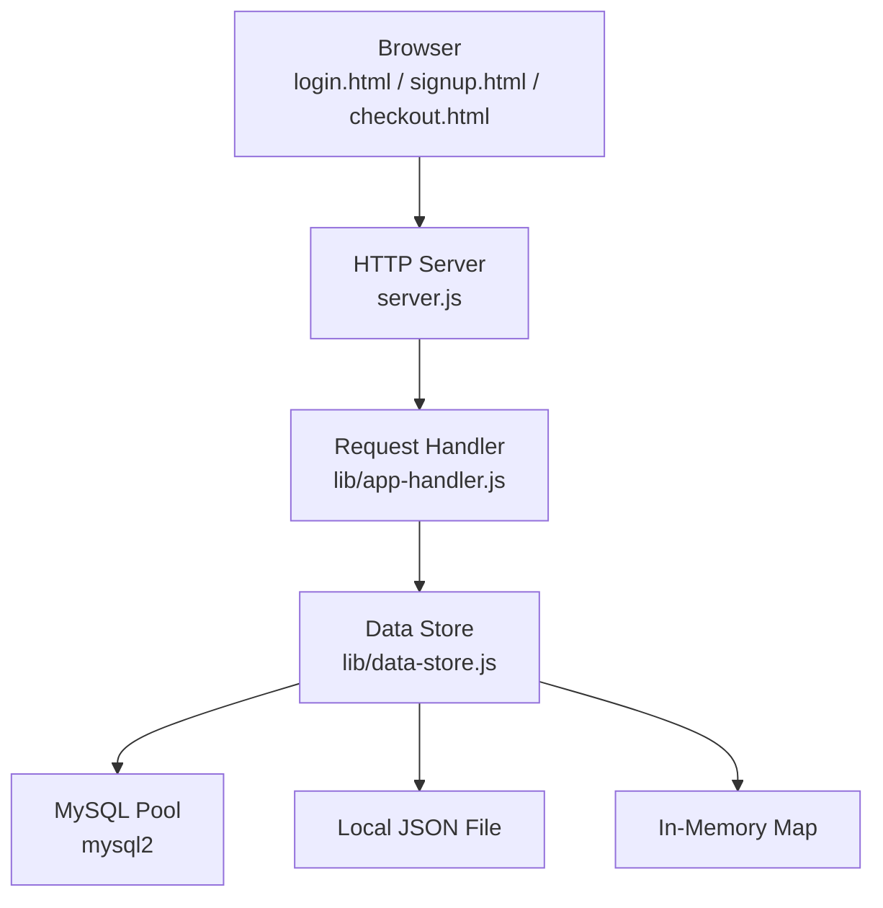
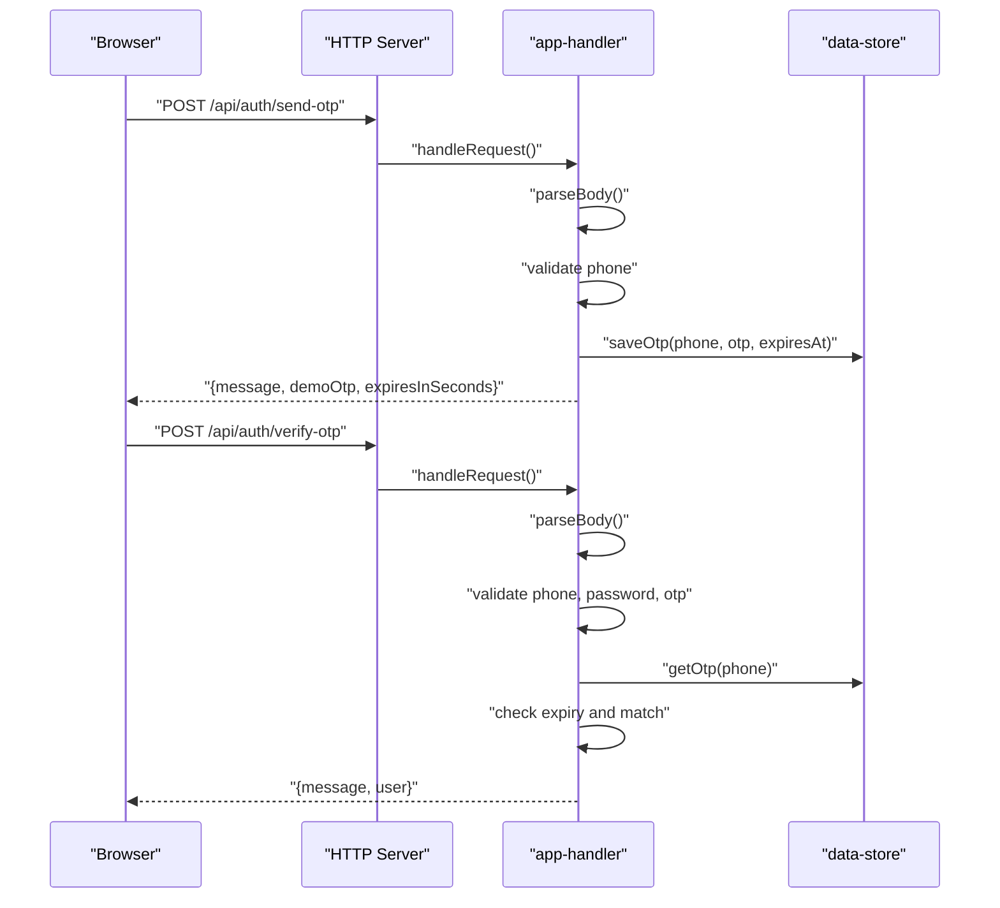
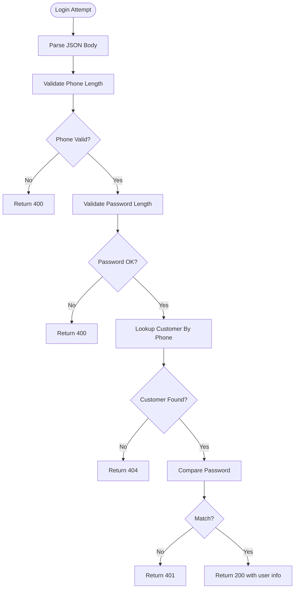
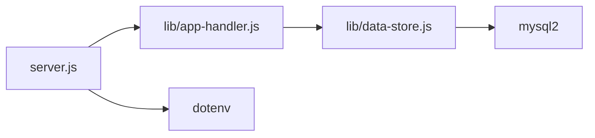

# Security Considerations

<cite>
**Referenced Files in This Document**
- [server.js](file://server.js)
- [package.json](file://package.json)
- [lib/app-handler.js](file://lib/app-handler.js)
- [lib/data-store.js](file://lib/data-store.js)
- [api/auth/login.js](file://api/auth/login.js)
- [api/auth/send-otp.js](file://api/auth/send-otp.js)
- [api/auth/signup.js](file://api/auth/signup.js)
- [api/auth/verify-otp.js](file://api/auth/verify-otp.js)
- [script.js](file://script.js)
- [login.html](file://login.html)
- [signup.html](file://signup.html)
- [checkout.html](file://checkout.html)
- [styles.css](file://styles.css)
- [checkout.css](file://checkout.css)
</cite>

## Table of Contents
1. [Introduction](#introduction)
2. [Project Structure](#project-structure)
3. [Core Components](#core-components)
4. [Architecture Overview](#architecture-overview)
5. [Detailed Component Analysis](#detailed-component-analysis)
6. [Dependency Analysis](#dependency-analysis)
7. [Performance Considerations](#performance-considerations)
8. [Troubleshooting Guide](#troubleshooting-guide)
9. [Conclusion](#conclusion)
10. [Appendices](#appendices)

## Introduction
This document provides comprehensive security documentation for the Night Foodies application. It covers input validation and sanitization, authentication security (including OTP generation, secure storage, and session management), data protection (encryption, transport, retention), API security (rate limiting, request validation, and defenses against common attacks), database security (connection security, injection prevention, access control), frontend security (XSS, CSRF, secure local storage), security audit and incident response procedures, configuration checklists, and compliance considerations.

## Project Structure
The application is a single-page Node.js HTTP server with a small client-side JavaScript runtime. Authentication flows are exposed via serverless-style API handlers under /api/auth. Data persistence supports in-memory, local JSON file, and MySQL modes with automatic fallbacks.

**Diagram sources**
- [server.js:1-35](file://server.js#L1-L35)
- [lib/app-handler.js:297-309](file://lib/app-handler.js#L297-L309)
- [lib/data-store.js:68-101](file://lib/data-store.js#L68-L101)
- [lib/data-store.js:112-123](file://lib/data-store.js#L112-L123)
- [lib/data-store.js:125-129](file://lib/data-store.js#L125-L129)

**Section sources**
- [server.js:1-35](file://server.js#L1-L35)
- [lib/app-handler.js:297-309](file://lib/app-handler.js#L297-L309)
- [lib/data-store.js:158-214](file://lib/data-store.js#L158-L214)

## Core Components
- HTTP server bootstrapping and error handling
- Request routing and API dispatch
- Authentication handlers (login, signup, OTP send/verify)
- Data store abstraction supporting multiple backends
- Frontend authentication forms and client-side flows

Key security-relevant responsibilities:
- Input validation and parsing
- OTP lifecycle and expiration
- Customer record creation and lookup
- Static asset serving with safe path normalization

**Section sources**
- [server.js:7-32](file://server.js#L7-L32)
- [lib/app-handler.js:297-309](file://lib/app-handler.js#L297-L309)
- [lib/app-handler.js:15-21](file://lib/app-handler.js#L15-L21)
- [lib/app-handler.js:98-170](file://lib/app-handler.js#L98-L170)
- [lib/app-handler.js:172-225](file://lib/app-handler.js#L172-L225)
- [lib/app-handler.js:227-269](file://lib/app-handler.js#L227-L269)
- [lib/data-store.js:216-264](file://lib/data-store.js#L216-L264)

## Architecture Overview
The system uses a minimal, synchronous HTTP server with modular request handling and pluggable data stores. Authentication relies on phone/password or OTP flows. Data is persisted either in-memory (development), to a local JSON file, or to MySQL depending on environment configuration.

**Diagram sources**
- [lib/app-handler.js:98-123](file://lib/app-handler.js#L98-L123)
- [lib/app-handler.js:125-170](file://lib/app-handler.js#L125-L170)
- [lib/data-store.js:266-276](file://lib/data-store.js#L266-L276)

## Detailed Component Analysis

### Input Validation and Sanitization
- Phone number validation enforces strict numeric length checks on both client and server.
- Password minimum length enforced during login and OTP verification flows.
- OTP validation enforces six-digit numeric format.
- Body parsing validates JSON and handles errors gracefully.
- Path normalization prevents directory traversal when serving static assets.

Recommendations:
- Enforce stricter password policies (length, character sets).
- Add rate limiting around OTP requests.
- Normalize and sanitize all user inputs before persistence.
- Apply Content-Security-Policy headers to mitigate XSS.

**Section sources**
- [lib/app-handler.js:15-17](file://lib/app-handler.js#L15-L17)
- [lib/app-handler.js:107-111](file://lib/app-handler.js#L107-L111)
- [lib/app-handler.js:141-144](file://lib/app-handler.js#L141-L144)
- [lib/app-handler.js:146-149](file://lib/app-handler.js#L146-L149)
- [lib/app-handler.js:30-54](file://lib/app-handler.js#L30-L54)
- [lib/app-handler.js:305-308](file://lib/app-handler.js#L305-L308)

### Authentication Security
- OTP generation uses a deterministic pseudo-random six-digit code.
- OTP expiration is enforced using a validity window.
- Login compares stored password directly (no hashing).
- Session management relies on client-side localStorage for authentication state.

Recommendations:
- Replace plaintext password storage with bcrypt or equivalent.
- Implement secure, HttpOnly, SameSite cookies for session tokens.
- Add rate limiting and lockout after failed attempts.
- Use HTTPS/TLS in production and enforce HSTS.
- Consider JWT with short-lived tokens and refresh token rotation.

**Diagram sources**
- [lib/app-handler.js:227-269](file://lib/app-handler.js#L227-L269)

**Section sources**
- [lib/app-handler.js:19-21](file://lib/app-handler.js#L19-L21)
- [lib/app-handler.js:13-13](file://lib/app-handler.js#L13-L13)
- [lib/app-handler.js:107-122](file://lib/app-handler.js#L107-L122)
- [lib/app-handler.js:151-169](file://lib/app-handler.js#L151-L169)
- [lib/app-handler.js:227-269](file://lib/app-handler.js#L227-L269)

### Secure Storage Practices
- OTPs are stored in-memory with expiration.
- Customer records are persisted to MySQL, local JSON file, or in-memory map depending on configuration.
- No encryption-at-rest for credentials in current implementation.

Recommendations:
- Encrypt sensitive fields (passwords, addresses) at rest.
- Rotate encryption keys periodically.
- Use OS-level protections for JSON file storage (permissions, immutable flags).
- For MySQL, enable TLS connections and restrict network exposure.

**Section sources**
- [lib/data-store.js:6](file://lib/data-store.js#L6-L6)
- [lib/data-store.js:266-276](file://lib/data-store.js#L266-L276)
- [lib/data-store.js:216-264](file://lib/data-store.js#L216-L264)
- [lib/data-store.js:68-101](file://lib/data-store.js#L68-L101)
- [lib/data-store.js:112-123](file://lib/data-store.js#L112-L123)

### Session Management
- Client-side authentication state stored in localStorage under a dedicated key.
- No server-side session store or token revocation mechanism.

Recommendations:
- Use HttpOnly, SameSite cookies for session tokens.
- Implement token refresh and logout invalidation.
- Add sliding expiration and idle timeouts.

**Section sources**
- [script.js:43-57](file://script.js#L43-L57)
- [script.js:142-142](file://script.js#L142-L142)
- [script.js:196-198](file://script.js#L196-L198)

### Data Protection Mechanisms
- Transport: Current implementation runs over HTTP; TLS is strongly recommended.
- Retention: Local JSON file mode persists between restarts; MySQL mode persists across deployments.
- Encryption: Not implemented for stored credentials.

Recommendations:
- Enforce HTTPS/TLS and HSTS.
- Implement data retention policies and anonymization/deletion controls.
- Encrypt sensitive fields at rest.

**Section sources**
- [server.js:21-23](file://server.js#L21-L23)
- [lib/data-store.js:103-110](file://lib/data-store.js#L103-L110)
- [lib/data-store.js:68-101](file://lib/data-store.js#L68-L101)

### API Security
- Request validation: JSON parsing with error handling; strict field validations for phone, password, OTP.
- Rate limiting: Not implemented.
- Protection against common attacks:
  - SQL injection: Parameterized queries used for customer operations.
  - XSS: Minimal DOM manipulation; ensure CSP headers and avoid innerHTML with untrusted data.
  - CSRF: Not implemented; consider anti-CSRF tokens for state-changing requests.

Recommendations:
- Add rate limiting and circuit breakers.
- Implement CORS policies and CSRF protection.
- Add input sanitization and output encoding.

**Section sources**
- [lib/app-handler.js:30-54](file://lib/app-handler.js#L30-L54)
- [lib/app-handler.js:219-253](file://lib/app-handler.js#L219-L253)
- [lib/app-handler.js:107-122](file://lib/app-handler.js#L107-L122)
- [lib/app-handler.js:141-149](file://lib/app-handler.js#L141-L149)

### Database Security
- MySQL initialization creates a dedicated database and table with a unique constraint on phone.
- Uses a connection pool with configurable limits.
- Queries are parameterized to prevent injection.

Recommendations:
- Enable TLS for MySQL connections.
- Restrict database user privileges to minimal required scope.
- Audit and log sensitive DML operations.

**Section sources**
- [lib/data-store.js:68-101](file://lib/data-store.js#L68-L101)
- [lib/data-store.js:219-253](file://lib/data-store.js#L219-L253)

### Frontend Security
- XSS prevention: Minimal dynamic DOM updates; ensure CSP headers and avoid innerHTML with user data.
- CSRF protection: Not implemented; add anti-CSRF tokens for POST endpoints.
- Secure local storage: Sensitive data should not be stored in localStorage; prefer HttpOnly cookies.

Recommendations:
- Add CSP headers and X-Content-Type-Options, X-Frame-Options.
- Move authentication state to HttpOnly cookies.
- Sanitize and escape all dynamic content.

**Section sources**
- [script.js:122-147](file://script.js#L122-L147)
- [script.js:156-185](file://script.js#L156-L185)
- [script.js:195-199](file://script.js#L195-L199)
- [styles.css:1-735](file://styles.css#L1-L735)
- [checkout.css:1-110](file://checkout.css#L1-L110)

## Dependency Analysis
The application depends on dotenv for environment configuration and mysql2 for database connectivity. The server initializes the data store and routes requests to handlers.

**Diagram sources**
- [server.js:1-3](file://server.js#L1-L3)
- [lib/app-handler.js:1-11](file://lib/app-handler.js#L1-L11)
- [lib/data-store.js:1-4](file://lib/data-store.js#L1-L4)
- [package.json:12-15](file://package.json#L12-L15)

**Section sources**
- [package.json:12-15](file://package.json#L12-L15)
- [server.js:1-3](file://server.js#L1-L3)

## Performance Considerations
- In-memory OTP and customer maps are efficient but not persistent across cold starts.
- Local JSON file mode avoids external dependencies but may degrade with large datasets.
- MySQL mode scales better for concurrent users and persistence.

Recommendations:
- Use MySQL in production; monitor pool utilization.
- Cache frequently accessed customer records.
- Implement pagination for large lists.

[No sources needed since this section provides general guidance]

## Troubleshooting Guide
Common issues and mitigations:
- Unhandled request errors: The server logs and returns a generic 500 response.
- Invalid JSON body: Parsing errors return 400 with a descriptive message.
- Authentication failures: Clear messaging for missing accounts, incorrect credentials, and OTP expiration.
- Static file serving: Path normalization prevents directory traversal; 404/500 responses returned appropriately.

**Section sources**
- [server.js:14-18](file://server.js#L14-L18)
- [lib/app-handler.js:46-51](file://lib/app-handler.js#L46-L51)
- [lib/app-handler.js:151-161](file://lib/app-handler.js#L151-L161)
- [lib/app-handler.js:305-308](file://lib/app-handler.js#L305-L308)

## Conclusion
Night Foodies implements basic input validation and a straightforward authentication flow. To achieve production-grade security, prioritize HTTPS/TLS, secure session management with HttpOnly cookies, robust password hashing, encryption at rest and in transit, rate limiting, CSP headers, and strict access control for databases. Adopt a defense-in-depth strategy combining server-side validation, client-side hardening, and operational monitoring.

[No sources needed since this section summarizes without analyzing specific files]

## Appendices

### Security Audit Procedures
- Penetration testing: Validate authentication flows, parameterized queries, and static asset access.
- Secret scanning: Scan for hardcoded credentials in environment variables and configuration.
- Dependency review: Audit mysql2 and dotenv for known vulnerabilities.
- Access reviews: Confirm least privilege for database users and file permissions.

[No sources needed since this section provides general guidance]

### Vulnerability Assessment Guidelines
- OWASP Top Ten mapping: Focus on injection, broken authentication, XSS, insecure deserialization, and misconfiguration.
- Automated scanning: Use SAST and SCA tools; schedule periodic DAST scans.
- Incident detection: Monitor for brute force attempts, malformed requests, and unauthorized access patterns.

[No sources needed since this section provides general guidance]

### Incident Response Protocols
- Immediate actions: Isolate affected systems, rotate secrets, and notify stakeholders per policy.
- Forensic capture: Preserve logs, environment variables, and database snapshots.
- Remediation: Patch vulnerabilities, strengthen controls, and re-validate.

[No sources needed since this section provides general guidance]

### Security Configuration Checklist (Production)
- Transport
  - Enforce HTTPS/TLS termination at the edge and HSTS.
  - Configure TLS cipher suites and certificate management.
- Secrets
  - Store DB credentials and JWT secrets in secure vaults.
  - Rotate regularly; revoke compromised keys immediately.
- Application
  - Disable debug logging in production.
  - Set Content-Security-Policy, X-Content-Type-Options, X-Frame-Options headers.
  - Implement rate limiting and circuit breakers.
- Database
  - Enable TLS for MySQL connections.
  - Limit database user privileges; audit DML operations.
- Storage
  - Encrypt sensitive fields at rest.
  - Protect local JSON file with restrictive permissions.
- Authentication
  - Hash passwords with bcrypt; implement account lockout.
  - Use HttpOnly, SameSite cookies; enforce CSRF protection.
  - Short token lifetimes with refresh token rotation.

[No sources needed since this section provides general guidance]

### Compliance Considerations
- Data minimization: Collect only necessary personal data.
- Consent and transparency: Provide privacy notices and data subject rights.
- Data retention: Define and enforce retention schedules; support deletion requests.
- Cross-border transfers: Ensure lawful mechanisms for international data transfers.
- Privacy-enhancing technologies: Prefer pseudonymization/anonymization where feasible.

[No sources needed since this section provides general guidance]