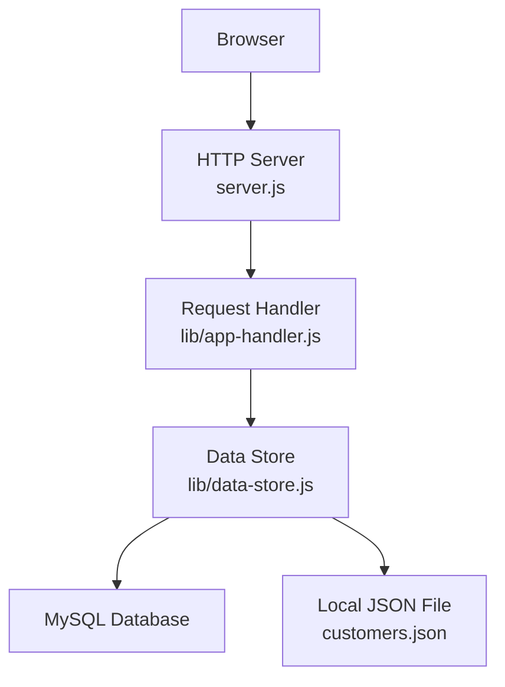
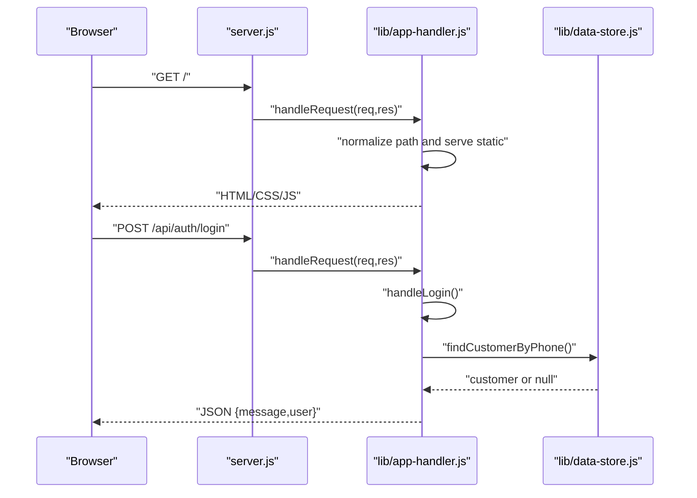
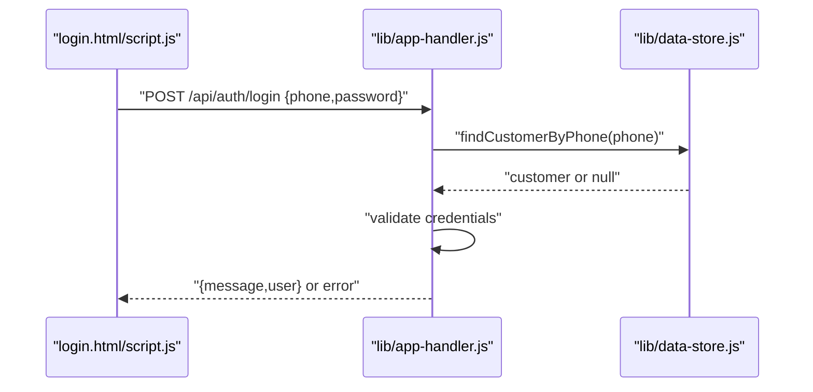
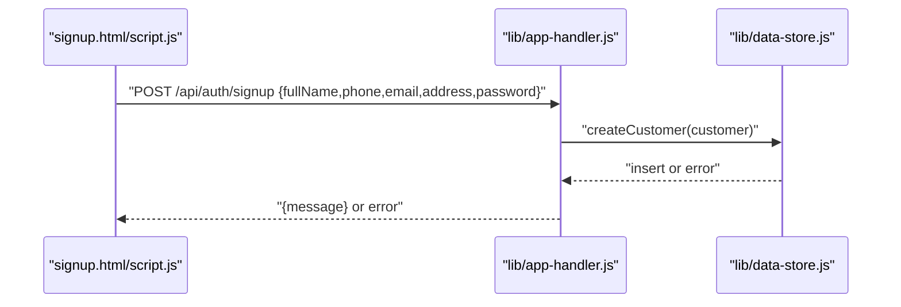
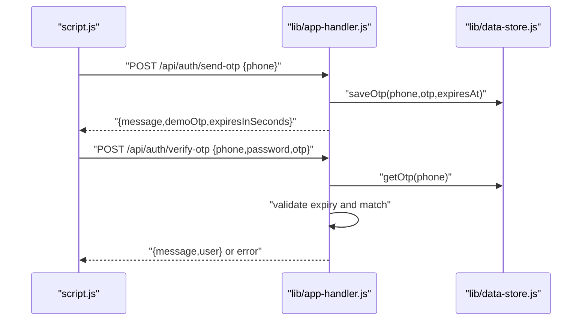
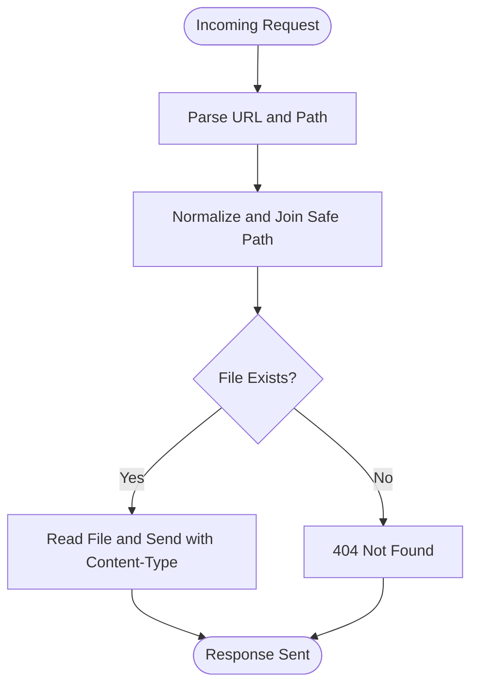
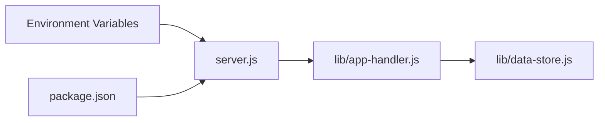

# Troubleshooting & FAQ

<cite>
**Referenced Files in This Document**
- [server.js](file://server.js)
- [package.json](file://package.json)
- [lib/app-handler.js](file://lib/app-handler.js)
- [lib/data-store.js](file://lib/data-store.js)
- [script.js](file://script.js)
- [login.html](file://login.html)
- [signup.html](file://signup.html)
- [index.html](file://index.html)
- [checkout.html](file://checkout.html)
- [styles.css](file://styles.css)
- [checkout.css](file://checkout.css)
- [customers.json](file://customers.json)
</cite>

## Table of Contents
1. [Introduction](#introduction)
2. [Project Structure](#project-structure)
3. [Core Components](#core-components)
4. [Architecture Overview](#architecture-overview)
5. [Detailed Component Analysis](#detailed-component-analysis)
6. [Dependency Analysis](#dependency-analysis)
7. [Performance Considerations](#performance-considerations)
8. [Troubleshooting Guide](#troubleshooting-guide)
9. [Conclusion](#conclusion)
10. [Appendices](#appendices)

## Introduction
This document provides comprehensive troubleshooting and FAQ guidance for Night Foodies. It covers server-side and client-side issues, error codes and messages, configuration pitfalls, diagnostics, and performance tuning. It also includes escalation procedures and preventive maintenance recommendations.

## Project Structure
Night Foodies is a single-process Node.js HTTP server serving static HTML/CSS/JS and exposing a small set of API endpoints for authentication and cart persistence. The server initializes a data store that can target in-memory, local JSON file, or MySQL depending on environment variables.

**Diagram sources**
- [server.js:1-35](file://server.js#L1-L35)
- [lib/app-handler.js:297-309](file://lib/app-handler.js#L297-L309)
- [lib/data-store.js:140-214](file://lib/data-store.js#L140-L214)

**Section sources**
- [server.js:1-35](file://server.js#L1-L35)
- [lib/app-handler.js:297-309](file://lib/app-handler.js#L297-L309)
- [lib/data-store.js:140-214](file://lib/data-store.js#L140-L214)

## Core Components
- HTTP server: Starts the server, initializes the data store, and handles uncaught errors.
- Request handler: Routes API requests to handlers, serves static files, and normalizes paths.
- Data store: Initializes storage backend (MySQL, file, or memory) with fallbacks and runtime mode detection.
- Client scripts: Handles authentication forms, cart operations, and network requests.

Key behaviors:
- API endpoints: POST /api/auth/login, POST /api/auth/signup, POST /api/auth/send-otp, POST /api/auth/verify-otp.
- Static serving: Serves HTML/CSS/JS and images from the project root with safe path normalization.
- Storage modes: Memory (default), file-backed JSON, MySQL with automatic schema creation.

**Section sources**
- [server.js:7-32](file://server.js#L7-L32)
- [lib/app-handler.js:271-295](file://lib/app-handler.js#L271-L295)
- [lib/app-handler.js:297-309](file://lib/app-handler.js#L297-L309)
- [lib/data-store.js:158-214](file://lib/data-store.js#L158-L214)

## Architecture Overview

**Diagram sources**
- [server.js:11-19](file://server.js#L11-L19)
- [lib/app-handler.js:227-269](file://lib/app-handler.js#L227-L269)
- [lib/data-store.js:216-229](file://lib/data-store.js#L216-L229)

## Detailed Component Analysis

### Authentication Flow (Login)

**Diagram sources**
- [login.html:30-47](file://login.html#L30-L47)
- [script.js:122-148](file://script.js#L122-L148)
- [lib/app-handler.js:227-269](file://lib/app-handler.js#L227-L269)
- [lib/data-store.js:216-229](file://lib/data-store.js#L216-L229)

**Section sources**
- [login.html:30-47](file://login.html#L30-L47)
- [script.js:122-148](file://script.js#L122-L148)
- [lib/app-handler.js:227-269](file://lib/app-handler.js#L227-L269)
- [lib/data-store.js:216-229](file://lib/data-store.js#L216-L229)

### Authentication Flow (Signup)

**Diagram sources**
- [signup.html:30-60](file://signup.html#L30-L60)
- [script.js:156-186](file://script.js#L156-L186)
- [lib/app-handler.js:172-225](file://lib/app-handler.js#L172-L225)
- [lib/data-store.js:231-264](file://lib/data-store.js#L231-L264)

**Section sources**
- [signup.html:30-60](file://signup.html#L30-L60)
- [script.js:156-186](file://script.js#L156-L186)
- [lib/app-handler.js:172-225](file://lib/app-handler.js#L172-L225)
- [lib/data-store.js:231-264](file://lib/data-store.js#L231-L264)

### OTP Flow (Send and Verify)

**Diagram sources**
- [script.js:87-120](file://script.js#L87-L120)
- [lib/app-handler.js:98-170](file://lib/app-handler.js#L98-L170)
- [lib/data-store.js:266-276](file://lib/data-store.js#L266-L276)

**Section sources**
- [script.js:87-120](file://script.js#L87-L120)
- [lib/app-handler.js:98-170](file://lib/app-handler.js#L98-L170)
- [lib/data-store.js:266-276](file://lib/data-store.js#L266-L276)

### Static Asset Serving

**Diagram sources**
- [lib/app-handler.js:297-309](file://lib/app-handler.js#L297-L309)
- [lib/app-handler.js:78-96](file://lib/app-handler.js#L78-L96)
- [lib/app-handler.js:56-76](file://lib/app-handler.js#L56-L76)

**Section sources**
- [lib/app-handler.js:297-309](file://lib/app-handler.js#L297-L309)
- [lib/app-handler.js:78-96](file://lib/app-handler.js#L78-L96)
- [lib/app-handler.js:56-76](file://lib/app-handler.js#L56-L76)

## Dependency Analysis
- Runtime dependencies: dotenv for environment variables, mysql2 for MySQL connectivity.
- Environment-driven behavior: DB_DRIVER, DB_HOST, DB_USER, DB_NAME, CUSTOMERS_FILE, VERCEL influence initialization.
- Port configuration: PORT environment variable controls server binding.

**Diagram sources**
- [package.json:12-15](file://package.json#L12-L15)
- [server.js:1-5](file://server.js#L1-L5)
- [lib/data-store.js:164-168](file://lib/data-store.js#L164-L168)

**Section sources**
- [package.json:12-15](file://package.json#L12-L15)
- [server.js:1-5](file://server.js#L1-L5)
- [lib/data-store.js:164-168](file://lib/data-store.js#L164-L168)

## Performance Considerations
- Database queries
  - Use connection pooling via mysql2. Ensure DB_HOST, DB_USER, DB_NAME are set for MySQL mode.
  - Keep queries minimal; the app performs simple SELECT/INSERT operations.
- Static asset delivery
  - Serve static assets directly from disk; avoid unnecessary compression in this app.
  - Ensure assets referenced in CSS (e.g., background images) exist to prevent 404s.
- Server response times
  - Minimize synchronous work in request handlers; the app is single-threaded.
  - Avoid blocking operations; keep initialization logic efficient.

[No sources needed since this section provides general guidance]

## Troubleshooting Guide

### Server-Side Issues

- Server fails to start
  - Symptoms: Startup logs show failure and exit.
  - Likely causes: Missing or invalid environment variables, MySQL unreachable, file permissions.
  - Actions:
    - Verify NODE version matches engine requirement.
    - Confirm PORT is free and accessible.
    - Check DB_HOST/DB_USER/DB_NAME for MySQL mode.
    - Ensure CUSTOMERS_FILE path is writable if using file mode.
  - Diagnostics:
    - Run the start script and review console output.
    - Temporarily force memory mode by setting DB_DRIVER to memory to isolate storage issues.

- Unhandled request errors
  - Symptoms: 500 Internal Server Error responses.
  - Causes: Exceptions thrown during request handling.
  - Actions:
    - Inspect server logs for stack traces.
    - Validate input payloads and content-type headers.
  - Diagnostics:
    - Enable verbose logging around request handling.
    - Test individual endpoints with curl or Postman.

- Data store initialization failures
  - Symptoms: Fallback to file or memory mode; warnings logged.
  - Causes: Missing MySQL config, permission denied, file I/O errors.
  - Actions:
    - Set DB_DRIVER=mysql and provide DB_HOST, DB_USER, DB_NAME.
    - For file mode, ensure CUSTOMERS_FILE path exists and is writable.
    - On Vercel, data is ephemeral; configure MySQL for persistence.

- MySQL connectivity issues
  - Symptoms: Cannot create database/table, connection refused.
  - Causes: Incorrect host/port/user/password, firewall/network restrictions.
  - Actions:
    - Validate DB credentials and network access.
    - Ensure the database server allows connections from the host.
    - Confirm the database name is whitelisted if applicable.

- Static file 404s
  - Symptoms: Assets or pages return 404 Not Found.
  - Causes: Incorrect paths, missing files, unsafe path traversal attempts blocked.
  - Actions:
    - Verify asset paths referenced in HTML/CSS.
    - Ensure files exist under the project root.
    - Avoid directory traversal; rely on normalized paths.

**Section sources**
- [server.js:24-31](file://server.js#L24-L31)
- [lib/data-store.js:149-214](file://lib/data-store.js#L149-L214)
- [lib/app-handler.js:78-96](file://lib/app-handler.js#L78-L96)

### Authentication Failures

- Login errors
  - 400 Bad Request: Invalid phone length or missing password.
  - 404 Not Found: Account does not exist.
  - 401 Unauthorized: Incorrect password.
  - 500 Internal Server Error: Unexpected server error.
  - Actions:
    - Ensure phone is 10 digits and password is at least 4 characters.
    - Confirm the account exists and password matches stored value.

- Signup errors
  - 400 Bad Request: Missing required fields or invalid phone/password.
  - 409 Conflict: Duplicate phone number.
  - 500 Internal Server Error: Unexpected server error.
  - Actions:
    - Validate form inputs.
    - Check for duplicate entries.

- OTP errors
  - 400 Bad Request: Missing/invalid phone/password/OTP; OTP expired; OTP not requested yet.
  - 401 Unauthorized: Incorrect OTP.
  - Actions:
    - Ensure OTP is requested first and not expired.
    - Match OTP exactly as generated.

- Client-side network errors
  - Symptoms: “Server se connect nahi ho paya” message.
  - Causes: Running HTML directly (file://), server not started, wrong URL.
  - Actions:
    - Start the server and open http://localhost:PORT.
    - Do not open HTML files directly in the browser.

**Section sources**
- [lib/app-handler.js:227-269](file://lib/app-handler.js#L227-L269)
- [lib/app-handler.js:172-225](file://lib/app-handler.js#L172-L225)
- [lib/app-handler.js:98-170](file://lib/app-handler.js#L98-L170)
- [script.js:87-120](file://script.js#L87-L120)

### Frontend Loading Errors

- Blank page or missing styles
  - Causes: Missing CSS/JS assets, incorrect base paths.
  - Actions:
    - Confirm stylesheet and script links in HTML.
    - Ensure assets exist and are served by the server.

- Navigation loops (login/signup/home)
  - Causes: Local storage auth state mismatch or missing.
  - Actions:
    - Clear local storage or ensure AUTH_KEY is set after login.
    - Verify requireAuth logic and redirect conditions.

- Cart not persisting
  - Causes: Local storage disabled or cleared.
  - Actions:
    - Use checkout page to load saved cart from localStorage.
    - Ensure localStorage is supported and enabled.

**Section sources**
- [index.html:12](file://index.html#L12)
- [login.html:14](file://login.html#L14)
- [signup.html:14](file://signup.html#L14)
- [checkout.html:15](file://checkout.html#L15)
- [script.js:43-57](file://script.js#L43-L57)

### Error Codes and Messages

- HTTP Status Codes
  - 200 OK: Successful login/signup/otp send.
  - 201 Created: Successful signup (with mode-specific note).
  - 400 Bad Request: Validation errors (phone, password, OTP).
  - 401 Unauthorized: Incorrect OTP or password.
  - 404 Not Found: Endpoint not found or account not found.
  - 409 Conflict: Duplicate phone during signup.
  - 500 Internal Server Error: Unexpected server errors.

- Application Messages
  - “Server se connect nahi ho paya”: Indicates client cannot reach server.
  - “Sign Up successful. Note: production data is temporary until MySQL is configured.”: Memory/file mode warning.
  - “Account already exists. Please Login.”: Duplicate phone detected.

**Section sources**
- [lib/app-handler.js:118-122](file://lib/app-handler.js#L118-L122)
- [lib/app-handler.js:210-213](file://lib/app-handler.js#L210-L213)
- [lib/app-handler.js:251-253](file://lib/app-handler.js#L251-L253)
- [lib/app-handler.js:152-154](file://lib/app-handler.js#L152-L154)
- [lib/app-handler.js:163-166](file://lib/app-handler.js#L163-L166)
- [script.js:99-102](file://script.js#L99-L102)

### Common Configuration Mistakes and Corrections

- Wrong Node version
  - Symptom: Engine mismatch warnings or runtime errors.
  - Fix: Use Node 24.x as specified in engines.

- Missing MySQL configuration
  - Symptom: Fallback to file/memory mode; data not persistent.
  - Fix: Set DB_DRIVER=mysql and provide DB_HOST, DB_USER, DB_NAME.

- Incorrect file storage path
  - Symptom: Cannot write customers.json.
  - Fix: Set CUSTOMERS_FILE to an absolute writable path.

- Running HTML directly
  - Symptom: Network errors and blank pages.
  - Fix: Start the server and open http://localhost:PORT.

**Section sources**
- [package.json:9-11](file://package.json#L9-L11)
- [lib/data-store.js:164-168](file://lib/data-store.js#L164-L168)
- [script.js:99-102](file://script.js#L99-L102)

### Diagnostic Commands and Tools

- Start the server locally
  - Command: npm start
  - Notes: Ensure PORT is free; default is 3000.

- Test API endpoints
  - Example: curl -X POST /api/auth/login with JSON payload.
  - Validate responses and status codes.

- Inspect environment variables
  - Check DB_DRIVER, DB_HOST, DB_USER, DB_NAME, CUSTOMERS_FILE, VERCEL.

- Verify assets
  - Open http://localhost:PORT and inspect Network tab for 404s.

- Check data store mode
  - Review console logs for “Database mode” messages.

**Section sources**
- [server.js:7-32](file://server.js#L7-L32)
- [lib/data-store.js:100](file://lib/data-store.js#L100)
- [lib/data-store.js:122](file://lib/data-store.js#L122)
- [lib/data-store.js:142](file://lib/data-store.js#L142)

### Frequently Asked Questions

- Why does my data disappear after restart?
  - Because the default storage mode is in-memory or file-based and not persistent in this setup. Configure MySQL for persistent data.

- Why do I see “Sign Up successful. Note: production data is temporary...”?
  - Indicates the app is using memory or file mode; configure MySQL for production.

- Why does the page say “Server se connect nahi ho paya”?
  - You opened an HTML file directly instead of starting the server. Start the server and open http://localhost:PORT.

- How do I persist customer data in production?
  - Set DB_DRIVER=mysql and provide DB_HOST, DB_USER, DB_NAME. The app will create the database and table automatically.

- Why is the checkout page empty?
  - You likely did not add items to the cart or did not proceed to checkout. Add items and click Proceed to Checkout.

**Section sources**
- [lib/data-store.js:128](file://lib/data-store.js#L128)
- [lib/app-handler.js:210-213](file://lib/app-handler.js#L210-L213)
- [script.js:99-102](file://script.js#L99-L102)
- [checkout.html:31-79](file://checkout.html#L31-L79)

### Escalation Procedures

- For unexplained 500 errors
  - Collect server logs, reproduce with curl, and capture request/response payloads.

- For MySQL issues
  - Validate credentials and network; confirm database existence and table creation.

- For client-side issues
  - Provide browser console logs, exact URLs visited, and steps to reproduce.

- For performance problems
  - Profile request durations, monitor DB query times, and reduce concurrent load.

[No sources needed since this section provides general guidance]

### Preventive Maintenance and Monitoring

- Monitor logs for:
  - Initialization warnings (fallbacks).
  - Authentication failures and rate-limit-like patterns.
- Maintain:
  - Correct environment variables.
  - Healthy MySQL connectivity.
  - Asset availability and correct paths.
- Optimize:
  - Keep DB credentials secure.
  - Avoid unnecessary static assets to reduce latency.

[No sources needed since this section provides general guidance]

## Conclusion
This guide consolidates troubleshooting, diagnostics, and operational best practices for Night Foodies. By validating environment configuration, understanding storage modes, and following the provided sequences, most issues can be resolved quickly. For complex problems, escalate with logs, reproducible steps, and environment details.

## Appendices

### API Definitions

- POST /api/auth/login
  - Request: { phone, password }
  - Responses:
    - 200: { message, user: { id, phone } }
    - 400: Validation errors
    - 401: Incorrect password
    - 404: Account not found
    - 500: Internal server error

- POST /api/auth/signup
  - Request: { fullName, phone, email, address, password }
  - Responses:
    - 201: { message } (mode-dependent note)
    - 400: Validation errors
    - 409: Duplicate phone
    - 500: Internal server error

- POST /api/auth/send-otp
  - Request: { phone }
  - Responses:
    - 200: { message, demoOtp, expiresInSeconds }
    - 400: Validation errors
    - 500: Internal server error

- POST /api/auth/verify-otp
  - Request: { phone, password, otp }
  - Responses:
    - 200: { message, user: { phone } }
    - 400: Missing/invalid OTP or not requested
    - 401: Incorrect OTP
    - 500: Internal server error

**Section sources**
- [lib/app-handler.js:227-269](file://lib/app-handler.js#L227-L269)
- [lib/app-handler.js:172-225](file://lib/app-handler.js#L172-L225)
- [lib/app-handler.js:98-170](file://lib/app-handler.js#L98-L170)

### Environment Variables Reference

- DB_DRIVER: Selects storage mode (mysql, memory, file/json). Defaults to best-available fallback.
- DB_HOST: MySQL host.
- DB_USER: MySQL user.
- DB_NAME: MySQL database name.
- CUSTOMERS_FILE: Absolute path to JSON file for customer storage.
- VERCEL: When set, forces memory mode and warns about non-persistence.
- PORT: Server port (default 3000).

**Section sources**
- [lib/data-store.js:164-168](file://lib/data-store.js#L164-L168)
- [lib/data-store.js:187-194](file://lib/data-store.js#L187-L194)
- [server.js:5](file://server.js#L5)